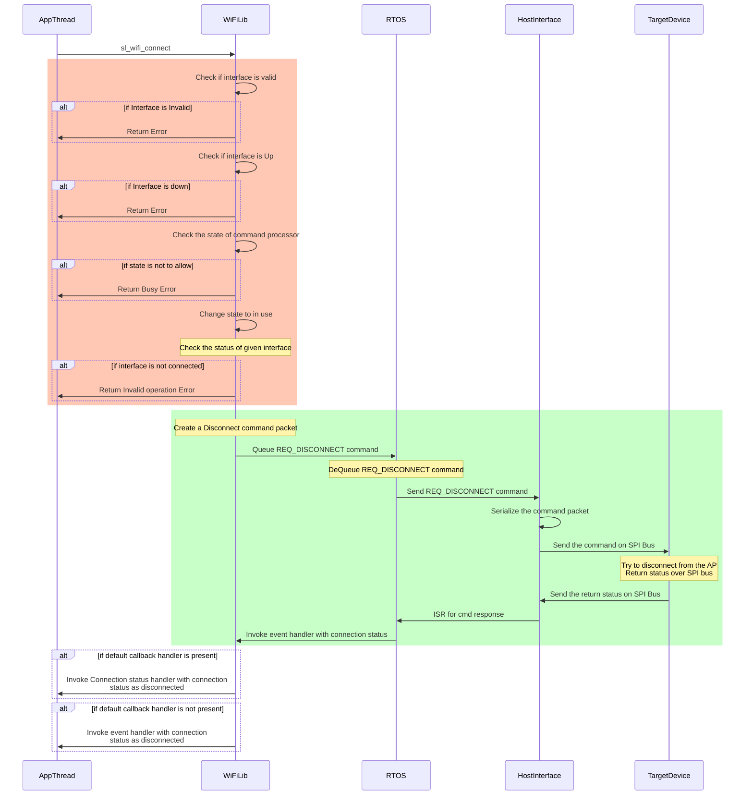
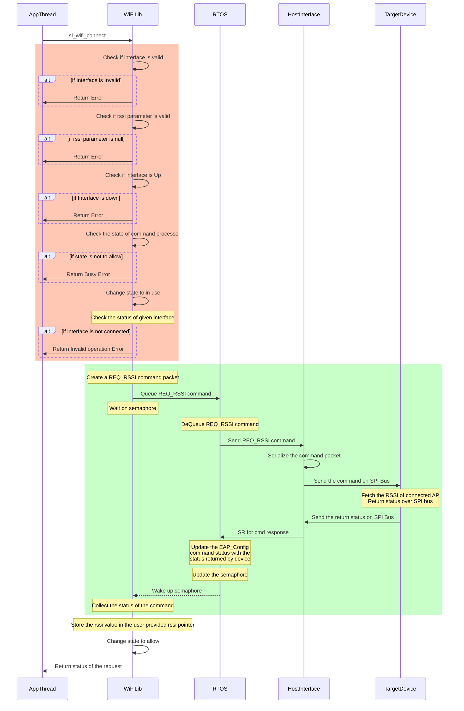
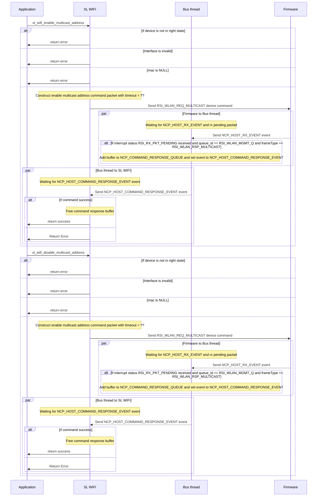
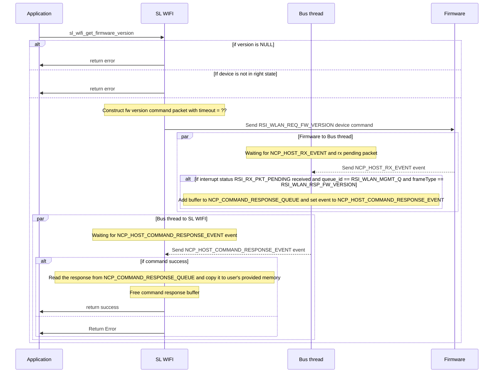
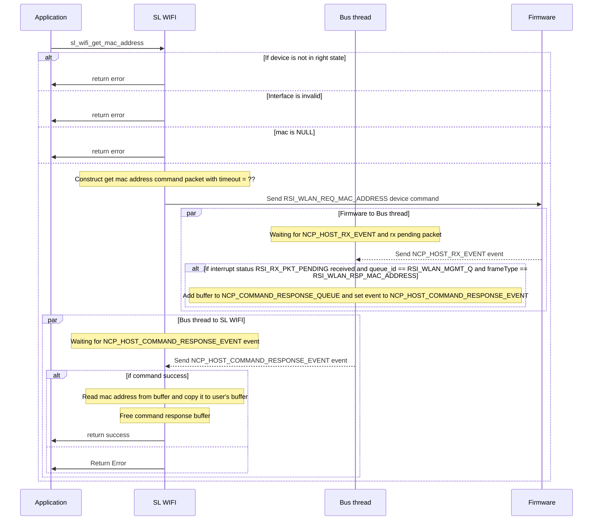
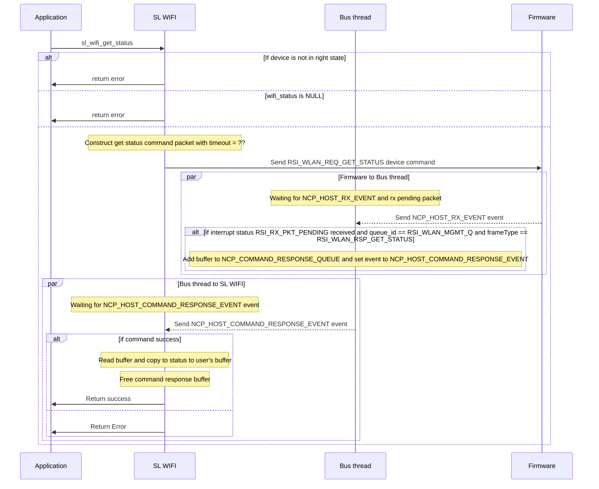
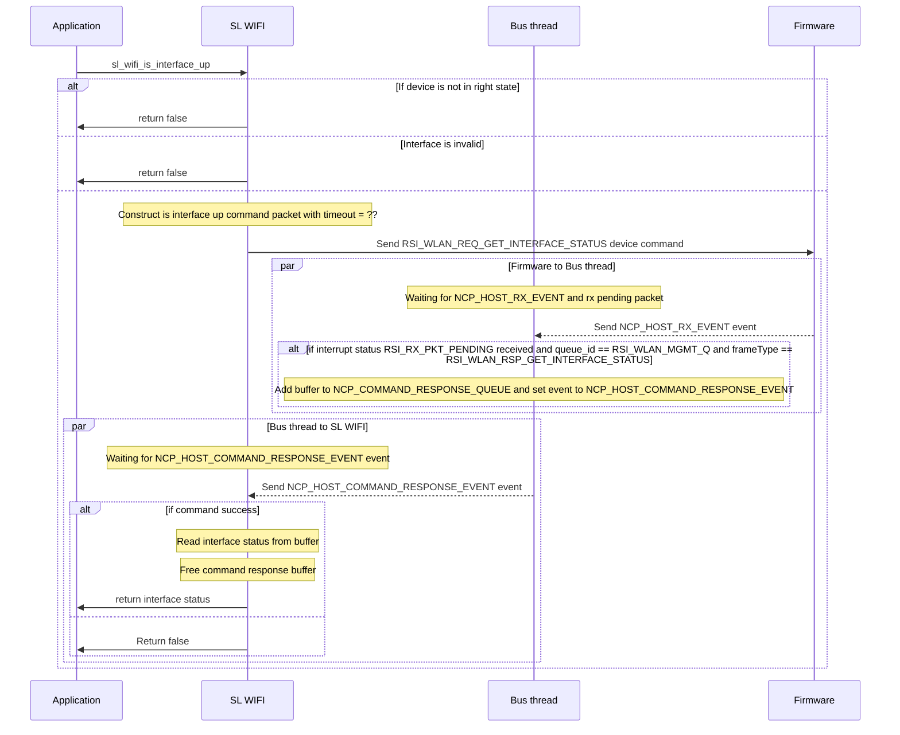
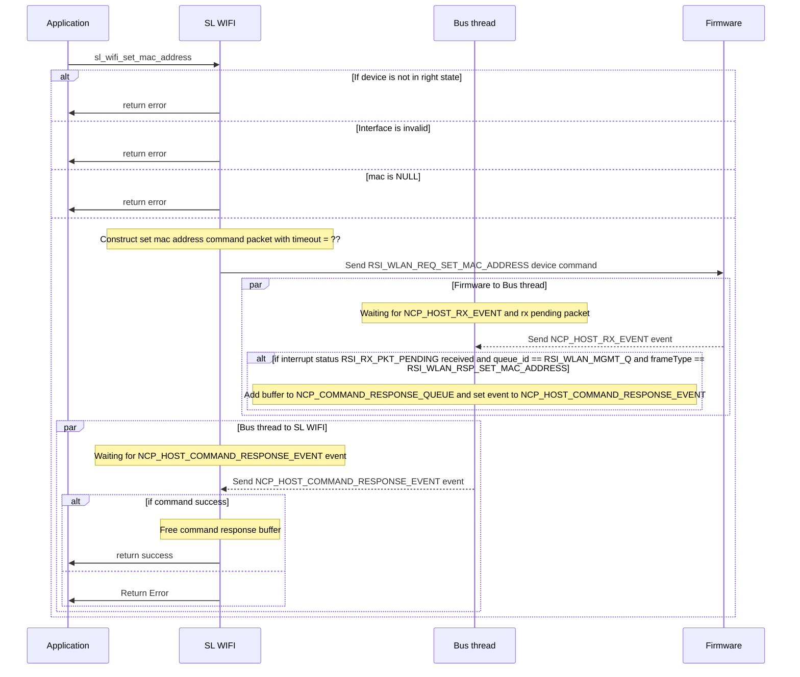
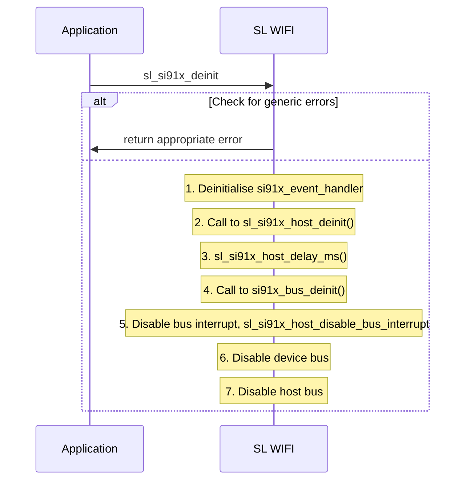

<!-- Parent: Test -->
<!-- Title: SL Wi-Fi Internal Documentation -->

# SL Wi-Fi API

API files

 inc/sl_wifi.h

# Client connect API Sequence Diagram

```mermaid
sequenceDiagram
    participant AppThread
    participant WiFiLib
    participant RTOS
    participant HostInterface
    participant TargetDevice

    AppThread->>WiFiLib: sl_wifi_connect
    rect rgb(255, 200, 180)

    WiFiLib->>WiFiLib: Check if interface is valid
    alt if Interface is Invalid
        WiFiLib->>AppThread: Return Error
    end

    WiFiLib->>WiFiLib: Check if interface is Up
    alt if Interface is down
        WiFiLib->>AppThread: Return Error
    end

    WiFiLib->>WiFiLib: Check the state of command processor
    alt if state is not to allow
        WiFiLib->>AppThread: Return Busy Error
    end

    WiFiLib->>WiFiLib: Change state to in use
    WiFiLib->>WiFiLib: Fetch the credential using given credential ID

    alt if unable to fetch credential using given credential ID
        WiFiLib->>AppThread: Return Invalid argument error 
    end

    WiFiLib->>WiFiLib: Check the status of given interface
    alt if interface is already connected
        WiFiLib->>AppThread: Return Invalid operation Error
    end
    end

    WiFiLib->>RTOS: Queue Scan_Without_Results command
    Note over WiFiLib: Wait on semaphore
    Note over RTOS: DeQueue Scan_Without_Results command
    RTOS->>HostInterface: Send Scan_Without_Results command
    HostInterface->>HostInterface: Serialize the command packet
    HostInterface->>TargetDevice: Send the command on SPI Bus
    Note over TargetDevice: Scan for existing networks <br />Return status over SPI bus
    TargetDevice->>HostInterface: Send the return status on SPI Bus
    HostInterface->>RTOS: ISR for cmd response
    Note over RTOS: Update the Scan_Without_Results<br />command status with the<br />status  returned by device
    Note over RTOS: Update the semaphore
    RTOS-->>WiFiLib: Wake up semaphore
    Note over WiFiLib: Check the status of the command
    alt if the command failed
        WiFiLib->>AppThread: Return error status
    end
    Note over WiFiLib: Check the security type

    rect rgb(200, 200, 255)
    alt if security type is Enterprise security
        Note over WiFiLib: Create enterprise security<br />config packet with given<br />credentials
        WiFiLib->>RTOS: Queue EAP_Config command
        Note over WiFiLib: Wait on semaphore
        RTOS->>HostInterface: DeQueue EAP_Config command
        HostInterface->>HostInterface: Serialize the command packet
        HostInterface->>TargetDevice: Send the command on SPI Bus
        TargetDevice->>TargetDevice: Store the EAP Configuration
        TargetDevice->>HostInterface: Send the return status on SPI Bus
        HostInterface->>RTOS: ISR for cmd response
        Note over RTOS: Update the EAP_Config<br />command status with the<br />status returned by device
        Note over RTOS: Update the semaphore
        RTOS-->>WiFiLib: Wake up semaphore
        Note over WiFiLib: Check the status of the command
        alt if the command failed
            WiFiLib->>AppThread: Return error status
        end
    end
    end

    rect rgb(200, 255, 200)
    alt else if security type is WPS PIN and not in Enterprise security operation mode
        Note over WiFiLib: Create WPS method<br />config packet with given<br />credentials
        WiFiLib->>RTOS: Queue WPS_Config command
        Note over WiFiLib: Wait on semaphore
        RTOS->>HostInterface: DeQueue WPS_Config command
        HostInterface->>HostInterface: Serialize the command packet
        HostInterface->>TargetDevice: Send the command on SPI Bus
        TargetDevice->>TargetDevice: Store the WPS Configuration
        TargetDevice->>HostInterface: Send the return status on SPI Bus
        HostInterface->>RTOS: ISR for cmd response
        Note over RTOS: Update the WPS_Config<br />command status with the<br />status returned by device
        Note over RTOS: Update the semaphore
        RTOS-->>WiFiLib: Wake up semaphore
        Note over WiFiLib: Check the status of the command
        alt if the command failed
            WiFiLib->>AppThread: Return error status
        end
    end
    end

    rect rgb(255, 200, 255)
    alt else if security type is WEP
        Note over WiFiLib: Create WEP config<br />packet with given<br />credentials
        WiFiLib->>RTOS: Queue WEP_Config command
        Note over WiFiLib: Wait on semaphore
        RTOS->>HostInterface: DeQueue WEP_Config command
        HostInterface->>HostInterface: Serialize the command packet
        HostInterface->>TargetDevice: Send the command on SPI Bus
        TargetDevice->>TargetDevice: Store the WEP Configuration
        TargetDevice->>HostInterface: Send the return status on SPI Bus
        HostInterface->>RTOS: ISR for cmd response
        Note over RTOS: Update the WEP_Config<br />command status with the<br />status returned by device
        Note over RTOS: Update the semaphore
        RTOS-->>WiFiLib: Wake up semaphore
        Note over WiFiLib: Check the status of the command
        alt if the command failed
            WiFiLib->>AppThread: Return error status
        end
    end
    end

    rect rgb(200, 255, 255)
    alt else if security type is WPA
        Note over WiFiLib: Create WPA config<br />packet with given<br />credentials
        WiFiLib->>RTOS: Queue WPA_Config command
        Note over WiFiLib: Wait on semaphore
        RTOS->>HostInterface: DeQueue WPA_Config command
        HostInterface->>HostInterface: Serialize the command packet
        HostInterface->>TargetDevice: Send the command on SPI Bus
        TargetDevice->>TargetDevice: Store the WPA Configuration
        TargetDevice->>HostInterface: Send the return status on SPI Bus
        HostInterface->>RTOS: ISR for cmd response
        Note over RTOS: Update the WPA_Config<br />command status with the<br />status returned by device
        Note over RTOS: Update the semaphore
        RTOS-->>WiFiLib: Wake up semaphore
        Note over WiFiLib: Check the status of the command
        alt if the command failed
            WiFiLib->>AppThread: Return error status
        end
    end
    end

    Note over WiFiLib: Create a join command packet
    Note over WiFiLib: Fill the security type
    Note over WiFiLib: Fill the ssid in join command packet
    WiFiLib->>RTOS: Queue join command
    Note over RTOS: DeQueue join command
    RTOS->>HostInterface: Send join command
    HostInterface->>HostInterface: Serialize the command packet
    HostInterface->>TargetDevice: Send the command on SPI Bus
    Note over TargetDevice: Try to join the specified ssid<br />Return status over SPI bus
    TargetDevice->>HostInterface: Send the return status on SPI Bus
    HostInterface->>RTOS: ISR for cmd response

    RTOS->>WiFiLib: Invoke event handler with connect status

    alt if default callback handler is present
        WiFiLib->>AppThread: Invoke Connect status handler
    end

    alt if default callback handler is not present
        WiFiLib->>AppThread: Invoke event handler with connect status
    end
```

# Client disconnect API Sequence Diagram

# Client Get Signal Strength API Sequence Diagram

# Wi-Fi Host Interface

The Wi-Fi driver can make very few assumptions about the host system it is running on and so is designed to work in both single-threaded and multi-threaded environments, and will operate on devices from multiple vendors.

## Host buffers

The Wi-Fi driver has no knowledge of the buffer management system used by the host and interacts with the host using "buffer tokens" and a small number of buffer related API.

 sl_status_t wifi_host_allocate_buffer(wifi_host_buffer_t *buffer, sl_wifi_buffer_type_t type, uint32_t buffer_size, uint32_t wait_duration_ms);
 void* wifi_host_get_buffer_data( wifi_host_buffer_t buffer, uint16_t offset, uint16_t* data_length, uint16_t* total_length );
 sl_status_t wifi_host_free_buffer(wifi_host_buffer_t buffer, sl_wifi_buffer_type_t type);
 
The driver assumes that buffers can be chained together and may need to query multiple times to retrieve all the data represented by a buffer token.

# Sequence diagrams for wifi common apis

## sl_wifi_enable_multicast_address and sl_wifi_disable_multicast_address

## sl_wifi_get_firmware_version

## sl_wifi_get_mac_address

## sl_wifi_get_statistics

## sl_wifi_get_status

## sl_wifi_is_interface_up

## sl_wifi_set_mac_address

## sl_si91x_deinit

