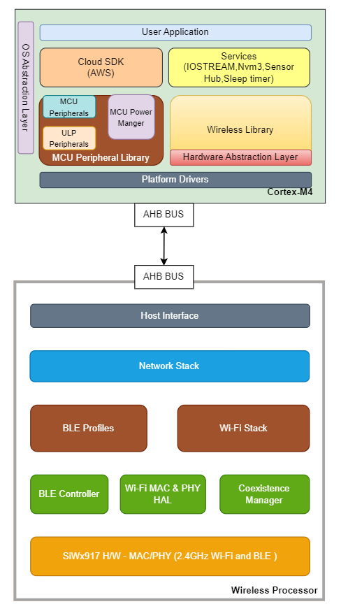
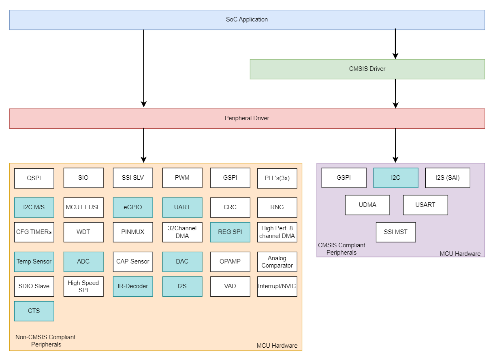
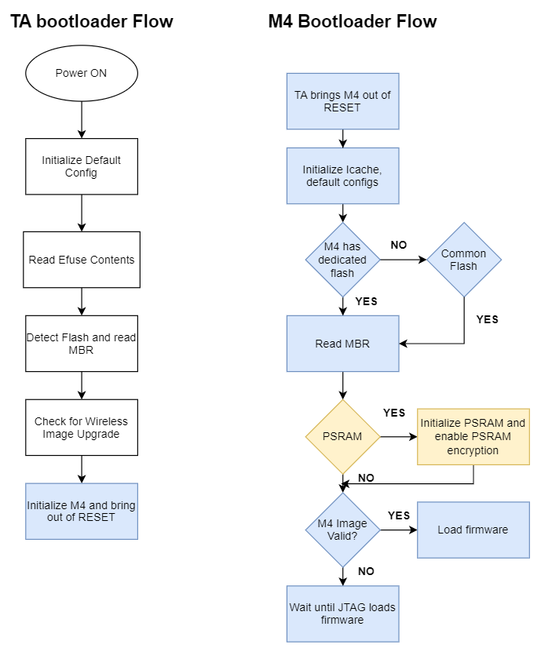
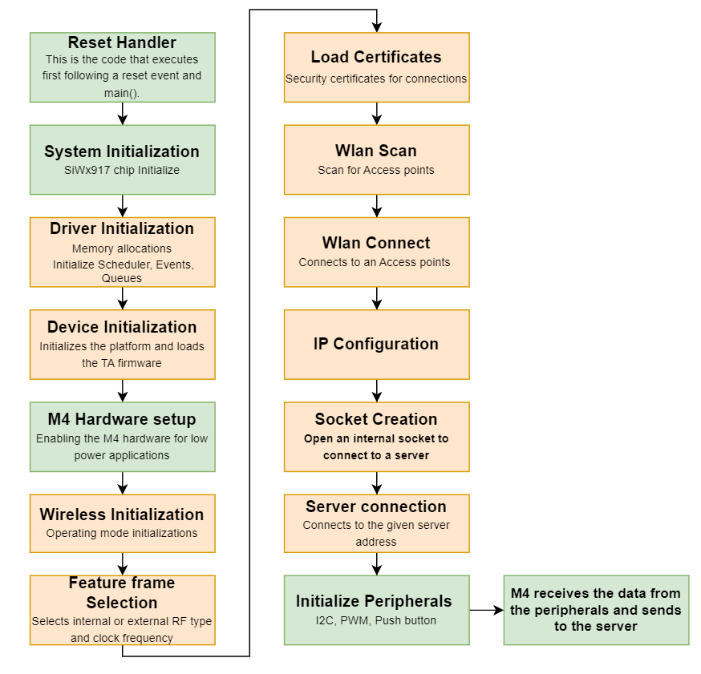
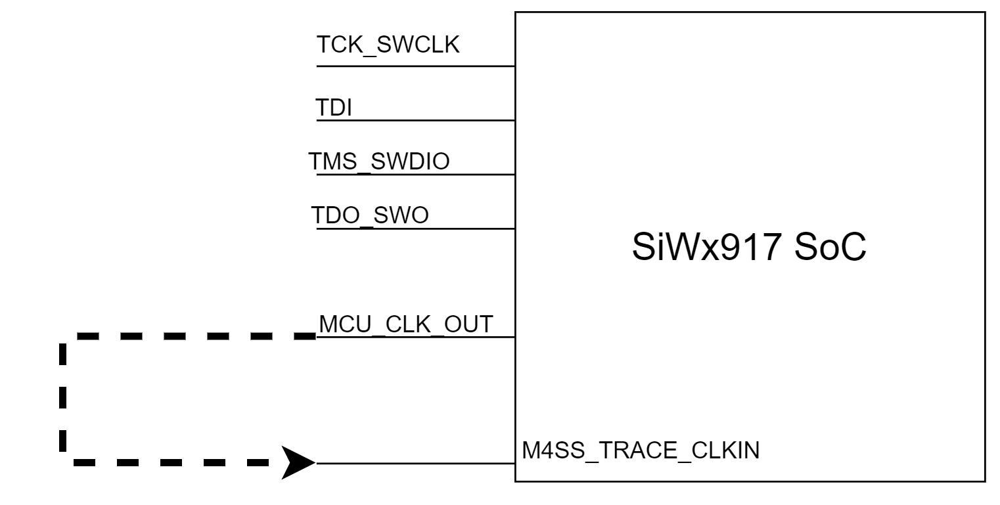
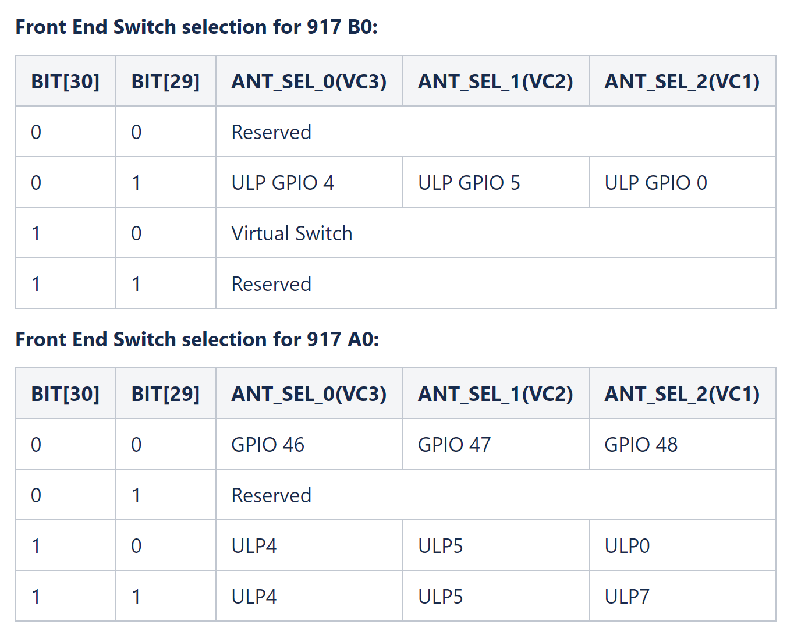

# SiWx917 SoC Programming Reference


## SoC Overview
SiWx917 SoC is the industry's first Wireless MCU family with a comprehensive multi-protocol wireless sub-system. It has an integrated ultra-low-power microcontroller, a built-in wireless subsystem, advanced security, high-performance mixed-signal peripherals, and integrated power management.

SiWx917 SoC comprises of **2** processing cores,

 * Wireless Processor - NWP (TA)
 * Application Processor - MCU (Cortex-M4)

It can operate with either two flash memories one for App Processor and other for NWP or with a shared flash. There is a shared SRAM used by both the processors. NWP provides support for inbuilt network and wireless stacks. These are accessed by an application running on App Processor via pre defined apis provided as part of wireless sdk. Both the processors are connected over AHB interface. Functioning in both M4 and TA is achieved via state machines present in application firmware and TA firmware. But TA firmware is given as a binary to users.

This document is for the developers, developing the solutions with the SiWx917SoC product line. It is intended to provide all the details required for a smooth developer experience. For information on how to get started, refer to the **'Getting Started with SiWx917 in SoC Mode'**

**Note:**
RTOS support is available at Application and Service level. Applications developers should ensure to use right RTOS primitives when accessing MCU peripherals from multiple SW threads.When using RTOS, need to configure interrupt priorities for all MCU interrupts being used in the application.


## Software Architecture
 This section gives a brief description about software components present in SiWx917 SoC SDK. This is provided in the form of source code in C along with example applications which consists of Cloud SDKs, Services like Sensor Hub, MCU Peripheral library, Wireless library and low level platform drivers. This is leveraged to customer completely for development of their application. NWP software will be provided as a binary. Both the software can be compiled and generate .rps file which can be flashed to MCU and NWP respectively.

The below diagram illustrates the architecture,




## SiWx917 MCU
The SiWx917 include ARM® Cortex®-M4 processor for user application. The Cortex-M4 processor is a high performance 32-bit processor which can operate up to 180MHz. This has got rich set of core  peripherals like Systick timer, FPU, NVIC etc.

SiWx917 SDK provides CMSIS supported driver for a few peripherals

Below diagram shows CMSIS and Non-CMSIS peripherals in different blocks. This also shows MCU ULP peripherals highlighted.

For more details on MCU Peripherals, refer to SiWx917 Hardware Reference Manual 




## Boot up Flow
This section describes the SiWx917 module boot up flow till application gets the execution control.

SiWx917 possess two Bootloaders, Security Bootloader and Application Bootloader. Security Bootloader is part of TASS ROM and Application Bootloader is part of M4SS ROM. Secure Boot is implemented in Security Bootloader.

Up on reset, the Security Bootloader configures the module hardware based on the configuration present in the EFUSE and FLASH. Flash configurations are authenticated before being consumed by the Security Bootloader. It also passes the required information from the EFUSE to the Application Bootloader. The Security Bootloader validates the integrity and authenticity of the firmware in the Flash and invokes the Application Bootloader. It detects and prevents execution of unauthorized software during the boot sequence. The Bootloader uses public & private key based digital signatures to recognize authentic software.



## SDK Programming Model
##  Application Flow

Below diagram demonstrates the SiWx917 SoC application code flow.

Code blocks in GREEN represent MCU and code blocks on ORANGE represents Wireless APIs.



## Clock Configuration
The Clock Architecture describes how to configure the on-chip clocks (ULP Clock Oscillators, High-Frequency PLL) and the clocks to Processor, High Speed Interfaces, and Peripherals (includes MCU HP, MCU ULP and UULP Vbat). The Clock subsystem enables the software to vary the clock source/frequency for different functionalities to achieve lower power consumption based on the application.

* Multiple high frequency clocks generated by PLLs
  * High Frequency Clock from 1MHz - 180MHz (SOC_PLL_CLK)
  * High Frequency Interface Clock from 1MHz - 180MHz (INTF_PLL_CLK)
  * Defined frequencies for I2S Interface (I2S_PLL_CLK)

* Multiple clocks generated by ULP Clock Oscillators. These are low-power clock oscillators
  * External Crystal clock (XTAL_CLK)
  * RC 32MHz Clock (RC_32MHZ_CLK)
  * RO High-Frequency clock (RO_HF_CLK)
  * Doubler Clock (DOUBLER_CLK)
  * RC 32kHz Clock (RC_32KHZ_CLK)
  * RO 32kHz Clock (RO_32KHZ_CLK)
  * XTAL 32kHz clock (XTAL_32KHZ_CLK)

* Configurable independent division factors for varying the frequencies of different functional blocks

* Configurable independent clock gating for different functional blocks

By deafult MCU clock is configured to 32MHZ using the **RC_32MHZ_CLK** clock source.

For more details on the Clock APIs, please refer to section 'SAPI Reference > SiWx917 SoC APIs > SoC Clock APIs' in **SAPI Reference Guide**.

**SOC-Clock Configuration Example :**
To Set SOCPLL  clock (1Mhz to 180Mhz) as MCUSOC-Clock ,configure like below 
```C
#define PLL_OUT_FREQUENCY   180000000
//!Default keep M4 in reference clock 
RSI_CLK_M4SocClkConfig(M4CLK, M4_ULPREFCLK, 0);  

//! Enable fre-fetch and register if SOC-PLL frequency is more than or equal to 120 
#if (PLL_OUT_FREQUENCY >= 120000000)
  //!Configure the prefetch and registering when SOC clock is more than 120Mhz
  ICACHE2_ADDR_TRANSLATE_1_REG = BIT(21); //Icache registering when clk freq more than 120
 
  //!When set, enables registering in M4-TA AHB2AHB. This will have performance penalty. 
  //!This has to be set above 100MHz
  MISC_CFG_SRAM_REDUNDANCY_CTRL = BIT(4);
  MISC_CONFIG_MISC_CTRL1 |= BIT(4);  
  MISC_QUASI_SYNC_MODE |= BIT(6);

  //!Enable Inter subsystem memory Registering as m4_soc_clk clock is going to tass
  MISC_QUASI_SYNC_MODE |= (BIT(6) | BIT(7));
#endif

 //! Program PLL_OUT_FREQUENCY as 180MHZ 
 //!Configure the PLL frequency
 RSI_CLK_SetSocPllFreq(M4CLK, PLL_OUT_FREQUENCY, PLL_REFERENCE_FREQUENCY);  

 //!Switch M4 Core clock to SOCPLL  
 RSI_CLK_M4SocClkConfig(M4CLK, M4_SOCPLLCLK, 0);   
```   
**SOC-Clock Output on GPIO Snippet:**

After configuring above SOC-Clock Configuration snippet add below snippet for measuring the clock frequency 

```C
#define PLL_OUT_FREQUENCY   180000000
//!pad selection
sl_si91x_gpio_enable_pad_selection(3);
 
//!Enable PAD Receive enable
sl_si91x_gpio_enable_pad_receiver(GPIO_12);

//!Configure the GPIO pin mux to MCU clock Out ,and observe clock on GPIO 12
sl_gpio_set_pin_mode(0, GPIO_12, EGPIO_PIN_MUX_MODE8, 0);  

#if (PLL_OUT_FREQUENCY >= 120000000)   
  //!Enable MCU clock OUT divide/2
  RSI_CLK_McuClkOutConfig(M4CLK, MCUCLKOUT_SOC_PLL_CLK, 1);
#else   
  //!Enable MCU clock OUT divide/1 
  RSI_CLK_McuClkOutConfig(M4CLK, MCUCLKOUT_SOC_PLL_CLK, 0);
#endif

```   

## GPIO Configuration

There are total of 53 GPIOs present in SiWx917 SoC. The number of GPIOs available varies between different packages. Please refer to GPIO available vs package table in the product datasheet for more details. Registers for GPIO pins that are not available on package are reserved. 

For configuring any GPIO on SiWx917 SoC, it is required to program the following,

* Pad Configurations
*Pin Muxing

## Pad Configurations
There are multiple processor sub-systems containing SZP (Secure Zone Processor), MCU HP (High Performance) and MCU ULP (Ultra Low Power) which share these common set of GPIO pads. These GPIO pads are controllable by either SZP, MCU HP or MCU ULP. PAD selection register has to be programmed to control the GPIOs between the subsystems. 

The list below provides the registers to be configured for accessing any of the GPIOs to MCU HP,

* PAD selection Register
* PAD configuration Register
* GPIO mode Register
Refer to section 'SiWx917 Pad Configurations' in **SiWx917 Hardware Reference Manual** for complete details.

## Pin Muxing
The Pin MUX block supports many peripherals including digital and analog like I2C, I2S, UART, SPI, Ethernet, SDIO, SDMEM, PWM, QEI, CAN etc. However number of pins that can be exposed out is limited. This pin multiplexing module solves problem of accommodating all these multiple peripherals in smallest package without compromising any features. It multiplexes different functions on same I/O pins. Each I/O pin supports multiple peripheral functions. If a I/O pin is used for a peripheral function, it cannot be used as GPIO. At a time only one function can be used. The reset value for the GPIO mode of each of the GPIOs are provided in PAD Configurations section.

Refer to section 'SiWx917 Pin MUX' in **SiWx917 Hardware Reference Manual** for complete details.

**GPIO Toggle Code Snippet :**

```C
#define PORT        0
#define GPIO_PIN    GPIO_6
#define PAD_NUM     1
   
//!Enable pad section bit for GPIO 6
sl_si91x_gpio_enable_pad_selection(PAD_NUM);
  
//!Set GPIO mode to mode 0
sl_gpio_set_pin_mode(PORT, GPIO_PIN, EGPIO_PIN_MUX_MODE0,0);

//!Set GPIO to output direction 
sl_si91x_gpio_set_pin_direction(PORT, GPIO_PIN, EGPIO_CONFIG_DIR_OUTPUT);

//!Set GPIO pin value to 0
sl_gpio_clear_pin_output(PORT, GPIO_PIN);
     
//!Set GPIO pin value to 1
sl_gpio_set_pin_output(PORT, GPIO_PIN);
```   
>NOTE: Please refer GPIO Example located in example folder **sl_si91x_gpio** for further details.

**Configuring GPIO In Peripheral Mode :**
```C
/*Example for configuring GPIO6 in UART2_RX(mode 6)*/
#define PORT        0
#define GPIO_PIN    GPIO_6
#define PAD_NUM     1
   
//!Enable pad section bit for GPIO 6
sl_si91x_gpio_enable_pad_selection(PAD_NUM);
  
//!Receiver Enable for RX pin 
sl_si91x_gpio_enable_pad_receiver(GPIO_PIN);

//!Set GPIO mode to mode 0
sl_gpio_set_pin_mode(PORT, GPIO_PIN, EGPIO_PIN_MUX_MODE6,0);

```   

## Memory Organization
This section provides an overview of the different memory regions of the SiWx917 SoC,

**SiWx917 SoC** is equipped with various memory components. 

* On-chip SRAM of 192K/256K/320 Kbytes based on the chip configuration
* 8Kbytes is present in the Ultra-low-power peripheral subsystem, primarily used by the ULP MCU peripherals
* 64Kbytes of ROM
* Quad SPI flash up to 4MBytes based on the package configuration
* Quad SPI PSRAM up to 2MBytes based on the package configuration
* eFuse of 32 bytes
For detailed information on above memory components, refer to **SiWx917 Memory Organization App note**.


## Flash and PSRAM combinations
This section briefs of various available package combinations of Flash and PSRAM.

Based on the use application and use-cases, appropriate Flash and PSRAM combination can be selected. 

* In Common flash variant, Both NWP and MCU will use the same Flash. There is an option to attach the PSRAM
* In Dual flash variant, the NWP and MCU will have their own flash regions. Staked flash is dedicated to TA in this variant and the external flash for MCU. There is an option to attach the PSRAM

The table shows the possible combinations:

| **Modes**    | **Flash type**                           | **Flash Size**            | **PSRAM (optional)**                    |
| ------------ | ---------------------------------------- | ------------------------- | --------------------------------------- |
| Common Flash | **Stacked**                              | 4MB                       | 2MB    8MB **Note:** Should be External |
|              | **External** (No Internal Stacked flash) | 8MB                  16MB | Stacked 2MB                         8MB |
| Dual Flash   | **Stacked + External**                   | 4MB + 8MB      4MB + 16MB | 2MB                                 8MB |

Refer to OPN Section in datasheet for more information.

## Chip/Module Programming

## In System Programming Mode
SiWx917 SoC can be configured to be in programming mode. This is achieved using a asserting GPIO_34. Upon this pin assertion and resetting, the module will be put into ISP mode.

In System Programming(ISP) is programming or reprogramming of the flash via Security bootloader. Security Bootloader can be requested to boot in ISP mode by pulling down the GPIO_34 pin with 4.7K ohms of resistor. This pin has to be left unconnected during reset for the bootloader to bypass ISP and execute the code that is present in flash. ISP mode can be used to reprogram the flash, if the application code uses JTAG pins for functional use. On boot up, if the application code goes into a state where JTAG interface is not functioning, ISP mode can be used to gain the control and to reprogram the flash.

ISP is supported via following interfaces,

| **Interface** |         **Pins**          |
|---------------| --------------------------|
| **UART**      | RX: GPIO_8     TX: GPIO_9 |
| **SDIO**      | GPIO_25 - GPIO_30         |
| **HSPI**      | GPIO_25 - GPIO_30         |

## Trace and Debug Interfaces
Trace and Debug functions are integrated into the ARM Cortex-M4. The Cortex-M4 TPIU supports two output modes:

* Clocked mode, using up to 4-bit parallel data output ports
* SWV mode, using single-bit SWV output

**Note:** Trace and Debug component need CLK supply on **M4SS_TRACE_CLKIN pin**



**Note:** This will be supported on Radio Board BRD4338A

## Serial Wire Viewer (SWV) Support
The SWV provides real-time data trace information from various sources within a Cortex-M4 device. It is transmitted via the **SWO** pin while your system processor continues to run at full speed. Information is available from the ITM and DWT units. SWV data trace is available via the SWO pin. 

**Setup:** Configure GPIO_12 pin in Mode 8 (MCU_CLK_OUT) and connect to back to GPIO_15 pin configured in GPIO Mode 6 (M4SS_TRACE_CLKIN). The MCU_CLK_OUT has programmable divider option from MCU clock. The MCU_CLK_OUT frequency must be less than 40Mhz to use the SWO function. By following the configurations data trace can be observed with the supporting debug probes.

MCU_CLK_OUT register details are present in 'SiWx917 MCU HP Clock Architecture > MCUHP_CLK_CONFIG_REG3 ' in **SiWx917 Hardware Reference Manual**.

## Embedded Trace Macrocell (ETM) Support
The ETM provides high bandwidth instruction trace via four dedicated trace pins accessible on the 20-pin Cortex Debug + ETM connector. The MCU_CLK_OUT frequency must be in the range of 40Mhz to 90MHz to Instruction trace using ETM component.

**Setup:** Configure Trace pins (GPIO_52 to GPIO_57) in Mode 6 and GPIO_12 pin in Mode 8 (MCU_CLK_OUT). By default on power up these GPIO pins are mapped to Cortex Debug + ETM connector (20-pin). By following the configurations Instruction trace can be observed with the supporting debug probes.

**Note:** Free running clock should be present on MCU_CLK_OUT (GPIO_12), before programming Trace pins otherwise IDE will popup **Trace HW not present** error.

**Note:** Above mentioned details are applicable for Radio Board BRD4338A onwards

## VCOM
The VCOM port available on main board (4002A) supports following features,

* Flash, Erase and Debug SiWx917 MCU over SWD
* Provides SiWx917 MCU UART RX and TX capabilities. This enables usage of any CLI based applications and debug prints
  * In this mode, ULP_GPIO_2 (RX) and ULP_GPIO_11 (TX) will be mapped to M4 UART
* Support flash programming via ISP
  * In this mode, GPIO_8 (RX) and GPIO_9 (TX) will be mapped to TA UART


**Note:** Debug logs from Wireless core can be fetched via TA UART which is available on EXP header, EXP14 (UART_RX) and EXP12(UART_TX)

**Note:** Above mentioned details are applicable for Radio Board BRD4338A


## Front End Switch selection GPIO 
 Front End Switch GPIO pin selection configured through opermode.



**Note:** VC1, VC2 and VC3 are control voltage pins of RF Switch. For more details please refer Reference Schematics.
