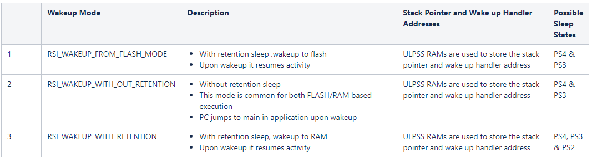

# SiWx917 Software Reference

## Overview

This reference manual provides information about the software on the SiWx917™, the first chip in the SiWx91x™ chipset family. It is intended to provide all the details required for a smooth developer experience.

The SiWx91x is the industry's first wireless microcontroller unit (MCU) family with a comprehensive multiprotocol wireless subsystem. It has an integrated ultra-low-power microcontroller, a built-in wireless subsystem, advanced security, high-performance mixed-signal peripherals, and integrated power management.

The SiWx917 system-on-chip (SoC) has two processing cores:
- Network wireless processor, also known as the **NWP**
- ARM Cortex M4 application processor, also known as the **MCU**

The SiWx917 operates either with two flash memories, one for the MCU and the other for the NWP, or with a shared flash memory. There is a shared SRAM used by both the processors. The NWP provides support for in-built network and wireless stacks. These are accessed by an application running on the MCU via pre-defined APIs provided as part of the WiSeConnect™ SDK. Both the processors are connected over an AHB interface. Functioning in both the MCU and NWP is achieved via state machines present in the firmware. 

MCU applications can be developed, compiled, and run on the SiWx917 using the WiSeConnect SDK v3.x extension (or **WiSeconnect 3** extension) on Simplicity Studio. NWP firmware is available as a pre-built binary with the WiSeConnect SDK package. See the [Getting Started](http://docs.silabs.com/wiseconnect/latest/wiseconnect-getting-started/) documentation for more details.

>**Note:** RTOS support is available at Application and Service level. Applications developers must use the correct RTOS primitives when accessing MCU peripherals from multiple SW threads. When using RTOS, developers need to configure interrupt priorities for all MCU interrupts being used in the application.

## Software Architecture

This section provides an overview of the SiWx917 software components. The SiWx917 firmware consists of the MCU application and NWP wireless firmware. The MCU application uses the [WiSeConnect SDK](http://github.com/siliconlabs/wiseconnect) which includes source code in C and example applications with cloud SDKs, sensor-hub, MCU peripherals, Wi-Fi, BLE, and low-level MCU drivers.

The following diagram illustrates the software architecture of the SiWx917:


### SiWx91x MCU

The ARM Cortex M4 application processor (MCU) on the SiWx917 is a high-performance, 32-bit processor which can operate up to 180 MHz. 

The MCU provides a rich set of core peripherals such as the systick timer, FPU, NVIC, etc.

The WiSeConnect SDK provides CMSIS supported drivers for a few peripherals while the remaining are supported by non-CMSIS drivers.

The following diagram shows CMSIS and non-CMSIS peripherals in different blocks. It also higlights the ultra-low-power (ULP) peripherals.

For more details on MCU Peripherals, see the **SiWx917 Reference Manual** (contact [sales](https://www.silabs.com/about-us/contact-sales) for access). 


>**Note:** SIO and VAD are not supported.

- When using any low-power instance in high-power mode with DMA enabled, it is recommended to allocate buffers in the ULP Memory block. For more information on buffer allocation, please refer to the following examples: ULP_I2S, ULP_UDMA, ULP_SSI, and ULP_UART.

### Bootup Flow

This section describes the SiWx917's software execution flow from bootup until the MCU application starts running.

SiWx917 has two bootloaders - the security bootloader and the application bootloader. The security bootloader is part of TASS ROM and the application bootloader is part of M4SS ROM. Secure Boot is implemented in the security bootloader.

On bootup, the security bootloader:
- Configures the module hardware based on the configuration present in the e-fuse and flash memory. 
- Authenticates the flash configuration settings.
- Passes the required information from the e-fuse to the application bootloader.
- Uses public and private key-based digital signatures to authenticate the firmware images.
- Invokes the application bootloader.


## WiSeConnect SDK Programming Model

### Application Flow

The following diagram demonstrates the flow of code in an SiWx917 MCU application code created using the WiSeConnect SDK.

Code blocks in green represent SiWx91x MCU APIs and code blocks in orange represent Wireless APIs. See the [WiSeConnect API Reference Guide](http://docs.silabs.com/wiseconnect/latest/wiseconnect-api-reference-guide-summary/) for more information.


### Clock Configuration

The SiWx917 clock subsystem facilitates changing the clock source and/or frequency for different functionalities to fine tune the power usage and performance of a given application. The subsystems supports configuring on-chip clocks such as ULP clock oscillators and high-freqeuency PLLs, or clocks to processor, high-speed interfaces, and peripherals (including MCU HP, MCU ULP and UULP Vbat).

* Multiple high-frequency clocks generated by PLLs
  * High-frequency Clock from 1 MHz - 180 MHz (SOC_PLL_CLK)
  * High-frequency Interface Clock from 1 MHz - 180 MHz (INTF_PLL_CLK)
  * Defined frequencies for I2S Interface (I2S_PLL_CLK)
* Multiple clocks generated by ULP Clock Oscillators. These are low-power clock oscillators
  * External Crystal Clock (XTAL_CLK)
  * RC MHz Clock (RC_MHZ_CLK)
  * Doubler Clock (DOUBLER_CLK)
  * RC 32 kHz Clock (RC_32KHZ_CLK)
  * XTAL 32 kHz clock (XTAL_32KHZ_CLK)
* Configurable independent division factors for varying the frequencies of different functional blocks
* Configurable independent clock gating for different functional blocks

By default, the M4 Core clock is configured to 180 MHz **SOC_PLL_CLK** and **XTAL_CLK** is the reference clock for this PLL.

If **Power Manager** component is installed in the application, the default power state is set to **PS3 Powersave** where MCU clock is set to 40 MHz using the **XTAL_CLK** clock source

The following example code snippet illustrates setting the SOCPLL clock (1 MHz to 180 MHz) as MCUSOC-Clock:

```C
#include "sl_si91x_clock_manager.h"

#define SOC_PLL_CLK  (180000000UL) // 180 MHz SoC PLL Clock as source to M4 Core

// M4 Core Clock runs at 180 MHz SOC PLL Clock
sl_si91x_clock_manager_m4_set_core_clk(M4_SOCPLLCLK, SOC_PLL_CLK);
```

### Custom Sys-Tick Handler
When using the CMSIS_OS2 wrapper for FreeRTOS, the SysTick handler is provided by default. This handler increments the OS ticks with every SysTick interrupt. However, in tickless mode, the entire RTOS relies on the Sleep timer, and OS ticks are incremented in the Sleep timer IRQ handler. Thus, simultaneously using the SysTick and Sleep timer can affect the OS ticks.

It would be best if you did not use SysTick while in tickless mode is enabled to avoid this issue. If you must use it, you need to override the default SysTick handler in the CMSIS wrapper by writing your handler that does not increment the OS ticks. This way, the OS ticks won't be affected.

EX: This is the way we have to hide the SysTick handler in the cmsis_os2.c file

```C
#if (USE_CUSTOM_SYSTICK_HANDLER_IMPLIMENTATION == 0)
  void SysTick_Handler (void) {
  /* Clear overflow flag */
  SysTick->CTRL;

  if (xTaskGetSchedulerState() != taskSCHEDULER_NOT_STARTED) {
    /* Call tick handler */
    xPortSysTickHandler();
  }
}
#endif /* SysTick */
```

### External Oscillator(32 kHz) Usage with UULP_GPIOs

This section explains the procedure for utilizing a 32 kHz external oscillator with UULP_GPIOs. To enable this, users must install the "si91x_32kHz_external_oscillator" component, which provides the necessary configurations for UULP_GPIOs. Additionally, this component includes a UC for selecting the appropriate UULP_GPIO. The component switches the LF-FSM clock to the internal 32 kHz RC oscillator.
 
> **Note** 
Switching the LF-FSM clock to the internal 32 kHz RC oscillator may result in timer drifts due to the change in the clock source.

### User callback recommendation
- In RTOS environment, Signaling mechanisms (Semaphore/Mutex/EventFlag etc.) are recommended instead of "Variables/Flags" from user callbacks to detect "*Transfer Complete*" for high-speed communication peripherals.

Refer to the below GSPI callback's sample code snippet demonstrating Mutex mechanism when RTOS is used:

```C
/*******************************************************************************
 * Callback event function
 * It is responsible for the event which are triggered by GSPI interface
 * It updates the respective member of the structure as the event is triggered.
 ******************************************************************************/
static void user_callback(uint32_t event)
{
  switch (event) {
    case SL_GSPI_TRANSFER_COMPLETE:
#if defined(SL_CATALOG_KERNEL_PRESENT)
      osMutexRelease(mutex_id);
#else
      gspi_transfer_complete = true;
#endif
      break;

    case SL_GSPI_DATA_LOST:
      break;

    case SL_GSPI_MODE_FAULT:
      break;
  }
}
```
### Power Save

The SiWx917 SoC supports sleep on both the MCU and NWP with or without RAM retention.

Sleep with RAM retention makes it possible for the configured SRAM banks to be retained across sleep and wakeup. It is possible to select sleep without RAM retention if the retention of SRAM banks is not required.

Any peripherals (HP and ULP peripherals) that are initialized on powering up must be re-initialized at wakeup.

#### Sleep Wakeup Sequence

**MCU Sleep Wakeup**


**SoC Sleep Wakeup - Peripheral Interrupt Based Wakeup**


**SoC Sleep Wakeup - Wireless Based Wakeup (Wake On Wireless)**


#### MCU Wakeup Modes

The wakeup mode defines the bootloader sequence the SiWx917 will undergo once it comes out of sleep. The table below lists the different types of wakeup modes available.



#### Sequence to Configure MCU Power Save

1. Initialize the peripheral for the wakeup source.
    - Configure the wakeup source.
    - For example, if it is a button based wakeup, then configure the GPIO button interrupt.

    ```C
    //!Configure Wakeup-Source as wireless based 
    RSI_PS_SetWkpSources(WIRELESS_BASED_WAKEUP);
     ```

2. Set the retention size of the MCU RAM.
    - Possible retentions are
      - WISEMCU_16KB_RAM_IN_USE
      - WISEMCU_64KB_RAM_IN_USE
      - WISEMCU_128KB_RAM_IN_USE
      - WISEMCU_192KB_RAM_IN_USE
      - WISEMCU_256KB_RAM_IN_USE
      - WISEMCU_320KB_RAM_IN_USE

    ```C
    //!Configure RAM Usage and Retention Size
    sl_si91x_configure_ram_retention(WISEMCU_192KB_RAM_IN_USE, WISEMCU_RETAIN_DEFAULT_RAM_DURING_SLEEP);
    ```

3. Invoke the API to put the MCU to sleep.
    - To sleep with RAM retention:

      ```C
      //!Sleep With RAM Retention 
      sl_si91x_trigger_sleep(SLEEP_WITH_RETENTION, DISABLE_LF_MODE, WKP_RAM_USAGE_LOCATION, (uint32_t) RSI_PS_RestoreCpuContext, IVT_OFFSET_ADDR, RSI_WAKEUP_FROM_FLASH_MODE);
      ```

    - To sleep without RAM retention:

      ```C
      //!Sleep Without RAM Retention 
      sl_si91x_trigger_sleep(SLEEP_WITHOUT_RETENTION, DISABLE_LF_MODE, WKP_RAM_USAGE_LOCATION, (uint32_t) RSI_PS_RestoreCpuContext, IVT_OFFSET_ADDR, RSI_WAKEUP_FROM_FLASH_MODE);
      ```

    - The following are the parameters passed to the `sl_si91x_trigger_sleep()` API:

    | **Parameters** | **Values** |
    |-----------|---------------|
    |Sleep Type |  SLEEP_WITH_RETENTION / SLEEP_WITHOUT_RETENTION |
    |lf_clk_mode | DISABLE_LF_MODE |
    |stack_address | WKP_RAM_USAGE_LOCATION (0x24061EFC) |
    |jump_cb_address | (uint32_t) RSI_PS_RestoreCpuContext |
    |vector_offset| IVT_OFFSET_ADDR (0x8202000 - common flash) |
    |        | 0x8012000 (dual flash)|
    |        | 0xA001000 (PSRAM) |
    |mode    | RSI_WAKEUP_FROM_FLASH_MODE |

4. Invoke the following API function to check the wakeup status.

    ```C
    //!Get wakeup source 
    RSI_PS_GetWkpUpStatus();
    ```

    - The following table describes the wakeup status bits:

    | **NPSS interrupt number** | **Interrupt Number in VIT** | **NPSS Interrupt**|
    |-----------|---------------|--------------|
    |0  |  20  |  uulp_wdt_intr |
    |1-5|  21  | uulp_gpio_intr     |
    |6-9|  22  | uulp_cmp_intr  |
    |10  | 22  | uulp_sysrtc_intr |
    |11  | 23  | uulp_bod_intr |
    |12  | 24  |  uulp_button_intr |
    |13  |25  | uulp_sdc_intr    |
    |14  | 26 | uulp_wakeup_intr                |
    |15| 27  | uulp_alarm_intr            |
    |16| 28 | uulp_alarm_intr                    |
    |17| 29  | uulp_sec_intr            |
    |18| 29  |uulp_msec_intr              |

>**Note:**
>* rsi_deepsleep_soc.c file should compiled to SRAM.
>
>* Refer to the [Wi-Fi - TCP Tx on Periodic Wakeup (SoC)](https://github.com/SiliconLabs/wiseconnect/tree/master/examples/si91x_soc/wlan/tcp_tx_on_periodic_wakeup) example for a detailed >example of M4 sleep wakeup.
>
>* Enable SL_SI91X_ENABLE_LOWPWR_RET_LDO macro to optimize the deepsleep >power number. By default, it is disabled.
>
>* This flow will be deprecated. It is strongly recommended to use power manager with freeRTOS tickless.

### Front-End Switch Selection GPIOs

 It is possible to configure the front-end switch GPIO pin selection through opermode.

The following table describes the front-end switch selection for the SiWx917.

|**BIT[30]** |**BIT[29]** | **ANT_SEL_0(VC3)** | **ANT_SEL_1(VC2)** | **ANT_SEL_2(VC1)**|
|---------|---------|--------|-------|------|
|0|0|Reserved|Reserved|Reserved|
|0|1|ULP GPIO 4|ULP GPIO 5|ULP GPIO 0|
|1|0|Internal Switch|Internal Switch|Internal Switch|
|1|1|Reserved|Reserved|Reserved|

> **Note:**
>* SiWx917 has an integrated on-chip transmit/receive (T/R) switch. This Internal RF Switch configuration uses internal logic present in the IC, and GPIOs are not needed. RF_BLE_TX (8dbm) mode is not supported in this configuration.
>* VC1, VC2, and VC3 are control voltage pins of the radio frequency (RF) switch. See the Reference Schematics for details.
>* ULP_GPIO_0, ULP_GPIO_4, and ULP_GPIO_5 are reserved for TA when an external RF switch is used. Configuring these pins in the application may negatively impact RF performance. These GPIOs will be reserved only if the IC/Module has an onboard antenna.

### Preprocessor Macros

#### SLI_SI91X_MCU_ENABLE_RAM_BASED_EXECUTION

Enable this macro to execute selected WiSeConnect SDK files from RAM. This is required to achieve atomicity during the simulataneous access of the flash by both the MCU and NWP.

This is necessary in the following scenarios:
* Wireless de-initialization,
* Firmware update,
* Throughput, and
* Power save

The `SLI_SI91X_MCU_ENABLE_RAM_BASED_EXECUTION` macro will be enabled if the **device_needs_ram_execution** component is present in the example's slcp file. The slcp file can be edited in the example project in Simplicity Studio.

> **Note:** We recommend you install this component when your application implements one or more of the above scenarios.


### SLI_SI91X_MCU_4MB_LITE_IMAGE

The current wireless flash image is 1.6 MB. A lite image has been implemented to free up the space for MCU applications.
Lite config is used for 4 MB SoC OPN where 1.3 MB is allocated for the TA image and ~1MB reserved for the M4 image.

The `SLI_SI91X_MCU_4MB_LITE_IMAGE` macro will be enabled if the **lite_image_for_4mb** component is installed.

For low-power M4 sleep states such as PS2, PS3, and PS4, certain files must be run from RAM memory. Refer to [Power manager integration guide](
https://github.com/SiliconLabs/wiseconnect/blob/master/examples/si91x_soc/service/sl_si91x_power_manager_m4_wireless/resources/power_manager_integration_guide/power_manager_integration.pdf
) for more details.

## Memory Organization

This section provides an overview of the different memory regions of the SiWx917.

The SiWx917 SoC contains the following memory components:
* On-chip SRAM of 192 KB, 256 KB, or 320 KB depending on chip configuration
* 8 KB memory in the ultra-low-power (ULP) peripheral subsystem, primarily used by the ULP MCU peripherals
* 64 KB of ROM
* Quad SPI flash memory up to 8 MB depending on package configuration
* Quad SPI PSRAM up to 8 MB depending on package configuration
* e-Fuse of 32 bytes

Detailed information on the memory components above coming soon in the **SiWx917 SoC Memory Map Application Note**.

### PSRAM

The PSRAM on the SiWx917 provides additional RAM space to the MCU application beyond the SRAM. It is available in either the stacked or external form depending on package configuration. The stacked version offers better secure execution of the application and secure data storage. The MCU application can use the PSRAM for additional RAM space beyond the SRAM. 

The SiWx917 provides the PSRAM in a ready-to-use state upon boot up. During boot up, the bootloader:
- Initializes the PSRAM die according to the chip and PSRAM configurations in the master boot record (MBR).
- Makes the PSRAM available as in-system memory. 

The application may use the PSRAM for different memory segments like .data, .bss, .stack, .heap, .text, or user defined segments. Different PSRAM components are available in the Simplicity Studio application project depending on the memory segments required. See the components starting from **BSS Segment in PSRAM** in the [Peripherals](https://docs.silabs.com/wiseconnect/latest/wiseconnect-developers-guide-migr-sdk-changes/application-components#peripherals) section of the **Application Components** documentation page.

The PSRAM may be used for runtime data storage in addition to MCU application execution.

The PSRAM address space is mapped to 0x0A00_0000 - 0x0AFF_FFFF and 0x0B00_0000 - 0x0BFF_FFFF which is cached via D-cache and I-cache to improve the memory access performance for both data and instructions respectively. The address 0x0A00_0000 - 0x0AFF_FFFF drives the chip select CSN0 and 0x0B00_0000 - 0x0BFF_FFFF drives the chip select CSN1 of the PSRAM controller.

There is a provision to modify the PSRAM configuration settings in addition to boot up and default settings with the help of driver APIs which are part of the WiSeConnect SDK. These additional configurations include interface mode, read/write type, clock, pinset, and others. The WiSeConnect SDK offers various [examples](https://docs.silabs.com/wiseconnect/latest/wiseconnect-examples/) to demonstrate the use of PSRAM memory and driver APIs.

The PSRAM interface comes with security features which allow the user to protect the data stored in the PSRAM. It is possbile to configure up to 4 secure segments (start address and length) in the MBR. The inline AES engine in the Quad SPI controller encrypts and decrypts the data on the fly. It supports the CTR mode of encryption and decryption with a key size of 128 or 256 bits. The security configurations can only be written once during system boot up and cannot be modified later, which provides write protection to the security configuration.

The WiSeConnect SDK provides a power save mechanism for the PSRAM which effectively utilizes the hardware power handles and sleep features of the PSRAM die across sleep and wakeup to minimize power consumption.

For more information on the memory architecture and hardware interfaces of PSRAM, see the **SiWx917 Memory Architecture** and **SiWx917 SPI Flash/PSRAM Controller** sections of the **SiWx917 Reference Manual** for details (contact [sales](https://www.silabs.com/about-us/contact-sales) for access).

> **Note:** Currently, the radio boards map the CSN0 to drive the PSRAM die and thus enable CSN0 address space 0x0A00_0000-0x0AFF_FFFF.

### Flash and PSRAM Combinations

This section describes the package combinations of flash and PSRAM provided by the SiWx917. The combination may be selected by the user depending on the application being developed.

The available PSRAM options depend on the flash configuration of the SiWx917 package:
* In the common flash configuration, both the NWP and MCU will use the same flash memory which is either stacked or external.
* In the dual flash configuration, the NWP uses stacked flash and MCU uses external flash.

The following table shows the possible combinations and the available options to add on PSRAM:

| **Modes**    | **Common flash**    | **External**     |   **PSRAM (Stacked)** |  **PSRAM (External)** |
| -------------|----------------|------------------|--------------------- |-------------------------|
| Common Flash | Yes [0:5]      |      Yes[46-51]/[52-57]   |   No            |       Yes[46-51]/[52-57]     |
|              | Yes [46:51]    |      Yes[52-57]           |  Yes[0-5]       |       Yes[52-57]    |
| Dual Flash   | Yes [0:5]      |      Yes [46-51]/[52-57]  |         No      |       No             |
|              | Yes [46:51]    |      Yes [52:57]          |         No      |       Yes [52:57]    |

**Note:** The above flash configurations may vary based on the IC/OPN. Users should select the appropriate configuration according to their specific IC/OPN.
See the **OPN** section in the datasheet for more information.

### NVM3

This section provides an overview of the NVM3 in SiWx917 SoC.

**NVM3:**

The NVM3 provides a means to write and read data objects (key/value pairs) stored in flash. Wear-leveling is applied to reduce erase and write cycles and maximize flash lifetime. The driver is resilient to power loss and reset events, ensuring that objects retrieved from the driver are always in a valid state. A single NVM3 instance can be shared among several wireless stacks and application code, making it well-suited for multiprotocol applications.

For more detailed information about NVM3, refer to [Third Generation NonVolatile Memory (NVM3) Data Storage](https://www.silabs.com/documents/public/application-notes/an1135-using-third-generation-nonvolatile-memory.pdf).

**Working of NVM3 in Si91x Common Flash:**


**NVM3 installation for Si91x:**

NVM3 in Si91x can be installed with two methods:

Procedure 1:

Installing from Simplicity Studio.

1. After launching the application, double click on application slcp in Project Explorer.


2. Select SOFTWARE COMPONENTS in slcp.


3. Type "nvm3 for si91x" in search and select NVM3 for Si91x.


4. Click install.


Procedure 2:

Add the below lines in the application slcp and launch the project in Simplicity Studio.

requires:

  -name: nvm3_lib

**NVM3 region in flash:**

NVM3 region is allocated at the end of the M4 flash. A separate nvm3 section is used in the linker script with configurable size to allocate nvm3 memory.


For example, refer to the below section of the .map file for nvm3 memory allocation in Si91x common flash (brd4338a), by default nvm3 size is 36 kB.


**Configuring NVM3 Size:**

1. Open nvm3_default_config.h from wiseconnect3\components\device\silabs\si91x\mcu\drivers\service\nvm3\inc\
2. Update NVM3_DEFAULT_NVM_SIZE

For example, after updating NVM3_DEFAULT_NVM_SIZE to 51200, the nvm3 region in .map is updated as:


**NVM3 usage in Si91x:**

Wireless initialization needs to be done before using NVM3 APIs in common flash as TA M4 communication is required to perform flash writes/erases.

1. After successful wireless initialization, nvm3_initDefault() API will open nvm3 instance with default parameters.
2. Any of the above default nvm3 parameters can be overridden by updating corresponding macros in nvm3_default_config.h.
3. In NVM3 data is stored in the form of objects. An object is a combination of (key + data).
4. A key can be an identifier of the data stored in NVM3.
5. After successfully initializing NVM3, objects can be written in nvm3 using nvm3_writeData().
6. Data can be read with nvm3_readData() using corresponding object key.
7. Objects can also be deleted using nvm3_deleteObject().

**Note:**

1. Wireless initialization is only required for Si91x common flash. For Si91x dual flash, nvm3_initDefault() can be directly called without wireless init.
2. NVM3 APIs should not be called from an ISR.
3. For more information about NVM3 usage, refer to [NVM3 - NVM Data Manager](https://docs.silabs.com/gecko-platform/3.1/driver/api/group-nvm3).

## Chip/Module Programming

### ISP Mode

The SiWx917 SoC provides a configuration option to enter the in-system programming (ISP) mode by asserting and resetting GPIO_34.

ISP mode enables the programming or re-programming of the flash memory using the security bootloader. The security bootloader can be directed to boot up in ISP mode by pulling down the GPIO_34 pin with a 100 ohms resistor. When ISP mode is enabled, the security bootloader does not initiate the execution of the code. Additionally, if the application code uses JTAG pins for functionality, entering ISP mode disables the JTAG, allowing the flash to be re-programmed.

JTAG or SWD interface can also be used to flash the binaries if ISP mode is enabled. This is particularly useful when programming fails due to the M4 being in sleep or similar scenarios. In such cases, the SiWx917 can be set to ISP mode, and the binary can be flashed via the Simplicity Commander using the SWD interface.

ISP mode is supported via the following interfaces:

| **Interface** |         **Pins**          |
|---------------| --------------------------|
| **UART**      | RX: GPIO_8, TX: GPIO_9    |
| **SDIO**      | GPIO_25 - GPIO_30         |
| **HSPI**      | GPIO_25 - GPIO_30         |
| **JTAG/SWD**  | JTAG_TCK_SWCLK: GPIO_31   | 
|               | JTAG_TDI: GPIO_32         |
|               | JTAG_TMS_SWDIO: GPIO_33   |
|               | JTAG_TDO_SWO: GPIO_34     |

## Trace and Debug Interfaces

Trace and Debug functions are integrated into the MCU's ARM Cortex M4 processor, whose TPIU supports two output modes:
* Clocked mode, using up to 4-bit parallel data output ports
* SWV mode, using single-bit SWV output

> **Note:** Trace and Debug components require a CLK supply on the **M4SS_TRACE_CLKIN pin**.


### Serial Wire Viewer (SWV) Support

The SWV provides real-time data trace information from various sources within a Cortex-M4 device. It is transmitted via the **SWO** pin while your system processor continues to run at full speed. Information is available from the ITM and DWT units. SWV data trace is available via the SWO pin. 

To setup the SWV, configure GPIO_12 pin in mode 8 (MCU_CLK_OUT) and connect to back to GPIO_15 pin configured in GPIO mode 6 (M4SS_TRACE_CLKIN). The MCU_CLK_OUT has a programmable divider option from the MCU clock. The MCU_CLK_OUT frequency must be less than 40 MHz to use the SWO function. After configuration, data traces can be observed with the supporting debug probes.

MCU_CLK_OUT register details are present in the **SiWx917 MCU HP Clock Architecture > MCUHP_CLK_CONFIG_REG3** section of the  **SiWx917 Reference Manual** (contact [sales](https://www.silabs.com/about-us/contact-sales) for access).

### Embedded Trace Macrocell (ETM) Support

The ETM provides high bandwidth instruction traces via four dedicated trace pins accessible on the 20-pin Cortex debug + ETM connector. The MCU_CLK_OUT frequency must be in the range of 40 MHz to 90 MHz to trace instructions using ETM.

To setup ETM, configure the trace pins (GPIO_52 to GPIO_57) in mode 6 and GPIO_12 pin in mode 8 (MCU_CLK_OUT). By default, on power up these GPIO pins are mapped to the Cortex debug + ETM connector (20-pin). After configuration, instruction traces can be observed with the supporting debug probes.

> **Note:** A free-running clock must be present on MCU_CLK_OUT (GPIO_12) before programming the trace pins, otherwise the IDE will display the **Trace HW not present** error.

### VCOM

The virtual COM (VCOM) port is available on the wireless pro kit mainboard (BRD4002A) and supports the following features:
* Flash, erase, and debug over SWD
  * If the ULP UART peripheral is configured, VCOM cannot be used for debug prints because the ULP UART is mapped to the VCOM.
  * To enable both the ULP UART and VCOM, configure UART1/UART2 instance for debug prints. In this case, a USB-to-TTL converter is required. See the [Console Input](https://docs.silabs.com/wiseconnect/3.1.0/wiseconnect-getting-started/getting-started-with-soc-mode#enter-the-console-input-for-other-boards) section for the BRD4325 series boards for instructions.
  * If the ULP UART is functioning in the PS2 state, the UART1/UART2 cannot be used for debug prints.
* UART RX and TX, for use in command line applications and debug prints
  * In this mode, ULP_GPIO_9 (RX) and ULP_GPIO_11 (TX) will be mapped to the MCU UART.
* Flash programming in ISP mode
  * In this mode, GPIO_8 (RX) and GPIO_9 (TX) will be mapped to TA UART.
* VCOM disable procedure-
  * VCOM can be disabled by the following steps (this will reset (VCOM enabled) upon power cycle of BRD4002A):
    * Step 1: Open "Tools" from Simplicity Studio. Search for "Device Console" and click on OK.
    * Step 2: Switch to "Admin" tab and press Enter. Issue the command "serial vcom ctrl sense deassert". VCOM LED on the BRD4002A will be turned OFF.
> **Note:** Debug logs from the NWP can be fetched via the NWP UART which is available on the EXP header's EXP14 (UART_RX) and EXP12 (UART_TX) pins.

## Firmware Upgrade
Firmware  is  the  software  that  is  embedded  into  a  hardware  device.  It  contains  a  set  of  commands  that  control  the behavior  of  a  network  device. Whenever  a  new  firmware  version  is  available,  it  is  recommended  that  users  update their  devices  to  the  latest  version.  Complete  details  about  the  latest  firmware  will  be  available  in  the  Release  Notes (shared  as  part  of  the  release  package),  which  will  help  the  users  decide  whether  to  update  to  the  new  firmware  or not.

### Firmware File Format

The TA Bootloader uses a proprietary format for its upgrade images, called RPS. These files have extension “.rps”. 

The RPS Format is a binary executable format understood by the Bootloader to conduct integrity and authenticity verification, as well as to load and execute the application. The Firmware Image in RPS format includes an RPS header, Boot descriptors, Application's binary image and an optional trailer (digital signature).

### SiWx917 Firmware Load and Update Process

The firmware load process  loads  firmware  onto  SiWx917  device  for  the  first  time  in  the  case  of  new  devices. The firmware update process updates SiWx917 devices with the latest firmware by replacing the firmware already existing in the device. 

The steps are as follows: 
1. To  update  existing  firmware  or  a  device  without  firmware,  download  the  new  firmware  file  to  the  device’s  flash memory from host (MCU/PC) through any host interface or through OTA process.
2. After reboot, the current firmware is replaced by the new firmware in flash memory, and the device is updated with the new firmware.

### SiWx917 Firmware Update Mechanisms

Firmware in the SiWx917 device can be updated using the following mechanisms:

1. Firmware update via Over-The-Air (OTA): In this mechanism, firmware in the device can be updated by the following methods.
   * HTTP/S: Firmware is updated by downloading the firmware file from a remote HTTP/S or cloud server via Wi-Fi. The firmware file is directly downloaded to TA flash location.
   * M4  as  Host:  Using  host  interfaces  –  SPI/UART/SDIO  or  a  remote  TCP  server  via  Wi-Fi  or  BLE,  the firmware  is  reaching  in  chunks  to  M4.  The  user  can  choose  to  send  the  firmware  to  TA  Bootloader  for upgrade or save in the external flash as per their requirements.

2. Firmware update via Bootloader: In this mechanism firmware in the device can be updated by the following methods.
   ### Kermit:
     * Firmware  is  updated  using  Kermit  protocol  in  a  serial  terminal  like  Tera  Term  running  in  a Windows/Linux PC connected to the device through UART interface in ISP mode.
   
   ### External Host Interfaces - SPI/ SDIO	 
	 
	 >  The following two methods of firmware update - SPI and SDIO uses two different modes of operation called Master Mode and Slave Mode.
	 These modes are selected by the Bootloader depending on the secure zone's status. When secure zone is disabled, the device can receive the data in Master mode. If the secure zone is enabled, the device can receive the data only in slave mode.			                                      	       	  
	 **Master Mode:**      	  
	  In Master Mode, the Host has direct access to the entire memory and hardware registers of Si917. Host can directly address the hardware register or RAM in Si917 and send a SPI or SDIO read/ write packet to access the register or memory.   
	 **Slave Mode:**  	  
	  In slave mode, the host does not have direct access to Si917 registers or memory. So, the FW chunks will have to be sent to Si917 as a proper SPI or SDIO slave packet with commands. The Si917 will parse the packet and use it. This is done using DMA with Linked list transfers. 
      There is a hardware requirement with DMA which is that the DMA expects extra 256 bytes along with the actual FW chunk. So, the transfer should be 256 bytes of dummy data plus 4096 bytes of actual data.
      The actual size of data should go to device as part of the address argument to CMD53 of SDIO and the total length for CMD53 to transfer should be 256+4096 bytes.
	  
    #### SPI 
     * The device should be kept in ISP mode. 
     * Using SPI interface on the Host and read the register 0x4105003C which should read out 0xAB11. This means the TA Bootloader is ready to receive the commands from Host.
     * Send "Burn" command to device. For TA FW, the command is 'B' and for M4 FW, the command is '4'. This command should be written   on register address 0x41050034. 
     Incase of M4, the burn command should be OR'ed with value 0x1 to indicate the image number. 
     * Once the TA BL receives this command, the device will respond with acknowledgement which will be (0xAB | '2') written on register 0x4105003C.
     * The above response means the device has requested the host to send the RPS file. 
     * The host now sends the RPS file in chunks of 4096 bytes. 
     ###### Master Mode:
	  * The host should first write the 4096 bytes on the PING Address and write 'I' | 0xAB on 0x41050034.
	  * The device will respond with  0xAB | 'O' on 0x4105003C. The 'I' means the Host indicating the device that valid data is present in the device's PING memory address and the 'O' response from device indicates that the device is now expecting next chunk on PONG address. 
	  * The next 4096 bytes are written on the PONG address and value 'O' | 0xAB is written on 0x41050034. The response after the device receives the data on 0x4105003C will be 0xAB | 'I'. 
	  * The PING and PONG addresses is 0x51400 and 0x52400 respectively. 
	  * When sending the last 4096 bytes of data, the Host should indicate End Of File to the device by writing 'E' | 0xAB on 0x41050034 with the FW chunk. 
	  * When the device identifies the End Of File command on the Host register, it will save the chunk in the appropriate location in flash and then start the verification of the new received firmware. 
	  * If the Firmware is verified correctly, the device Bootloader will move the Firmware from download area to execution area and then update the FMC.
     ###### Slave Mode:  
	  * In slave mode, the Host would not know the PING and PONG addresses. So the Host would send the FW chunk of 4096 bytes to SPI FIFO register. In slave mode also the Host will have to send FW chunks and indicate PING and PONG valid using the HOST interact registers. For every chunk of data sent, 12 dummy bytes has to be sent in the beginning as the Bootloader expects it. The sending of EOF command is also same in slave mode as in Master mode.
	 * The response to EOF command will be 0xABAA in case of successful update or 0xABCC incase of verification or update failure.
   #### SDIO
      * The device should be kept in ISP mode.
      * Enable SDIO interface on the Host and read the register 0x4105003C which should read out 0xAB11. 
      * The TA Bootloader is now ready to receive the commands from Host.
      * Send "Burn" command to device. For TA FW, the command is 'B' and for M4 FW, the command is '4'. This command should be written  on register address 0x41050034. 
      * Incase of M4, the burn command should be OR'ed with value 0x1 to indicate the image number.
      * Once the TA BL receives this command, the device will respond with acknowledgement which will be (0xAB | '2') written on register 0x4105003C. This means the device has requested to send the RPS file.
      * The host now sends the RPS file in chunks of 4096 bytes. 
      ###### Master Mode:
   * The host should first write the 4096 bytes on the PING Address and write 'I' | 0xAB on 0x41050034. 
   * The device will respond with 0xAB | 'O' on 0x4105003C. The 'I' means the Host indicating the device that valid data is present in the device's PING memory address and the 'O' response from device indicates that the device is now expecting next chunk on PONG address. 
   * The next 4096 bytes are written on the PONG address and value 'O' | 0xAB is written on 0x41050034. The response after the device receives the data on 0x4105003C will be 0xAB | 'I'.
   * The PING and PONG addresses is 0x51400 and 0x52400 respectively.
   * When sending the last 4096 bytes of data, the Host should indicate End Of File to the device by writing 'E' | 0xAB on 0x41050034 with the FW chunk. 
   * When the device identifies the End Of File command on the Host register, it will save the chunk in the appropriate location in flash and then start the verification of the new received firmware. 
   * If the Firmware is verified correctly, the device Bootloader will move the Firmware from download area to execution area and then update the FMC.
    ###### Slave Mode:
   * In slave mode, the Host would not know the PING and PONG addresses. So the Host would send the FW chunk of 4096 bytes to SDIO FIFO register. In slave mode also the Host will have to send FW chunks and indicate PING and PONG valid using the HOST interact registers. For every chunk of data sent, 256 dummy bytes has to be sent in the beginning as the Bootloader expects it. 
   * The sending of EOF command is also same in slave mode as in Master mode.
   * The response to EOF command will be 0xABAA incase of successful update or 0xABCC incase the verification fails.

	  
   #### Simplicity Commander Tool/ Command Line Interface (CLI)
   Using the Simplicity Commander tool or by using the CLI commands, the firmware is updated.

> **Note:** SiWx917  also  has  Secure  and  Non-Secure  Firmware  updates.  The  above  mechanisms  are  same  for  both secure and non-secure updates, except that the firmware does security-related integrity checks before loading the device with the new firmware.


### Secure Firmware Update

In  case  of  bootloader  and  OTA,  a secure  firmware  update  can be carried out by enabling the security  in  the  firmware  image using  the  SiWx917  Manufacturing  Utility  (refer  to  the  SiWx917  Manufacturing  Utility  User  Guide).  The  process  of firmware  update  remains the same  for  Non-Secure  and  Secure  Firmware  updates  except  that  in  the  case  of  secure firmware image, the integrity checks are done.

> **Note:** For more information on the Firmware upgradation, see the Firmware Update App Note.
