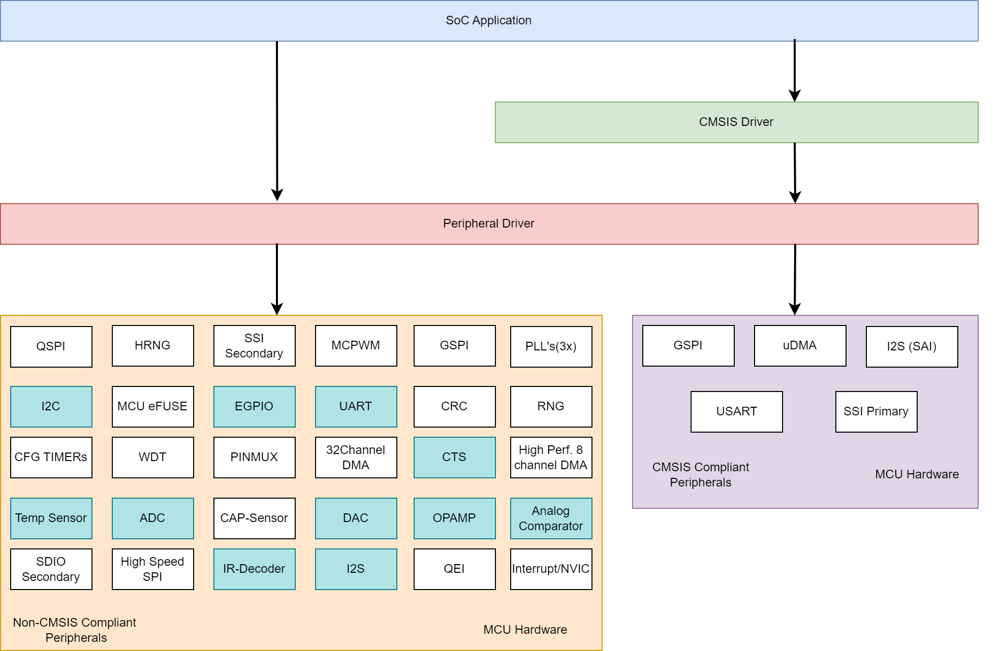
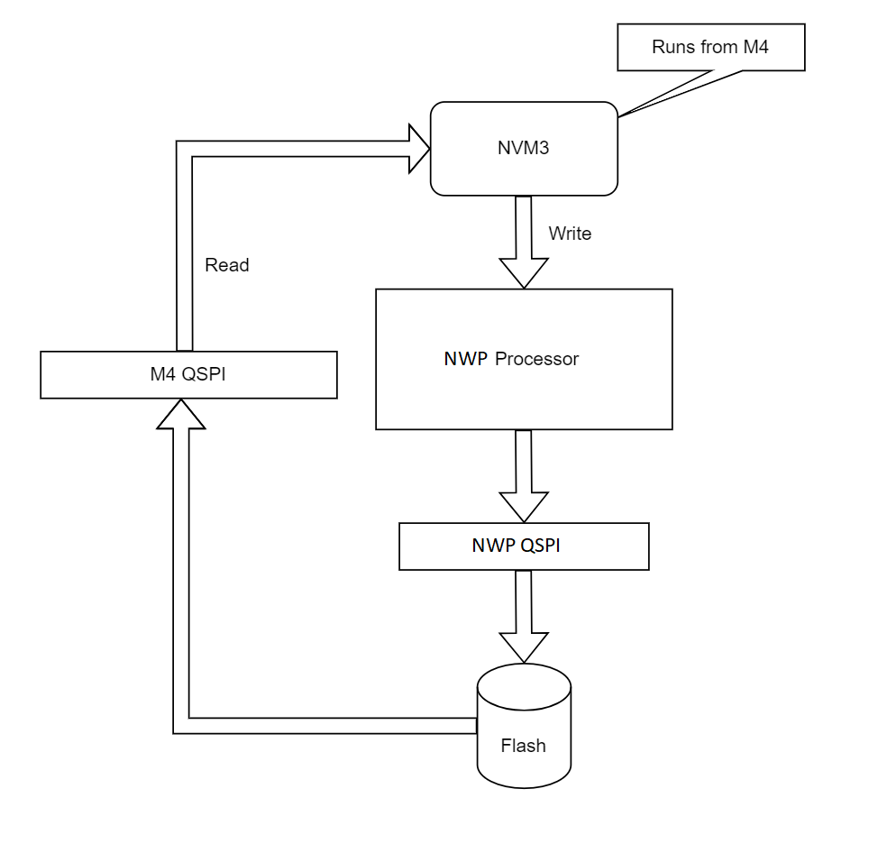
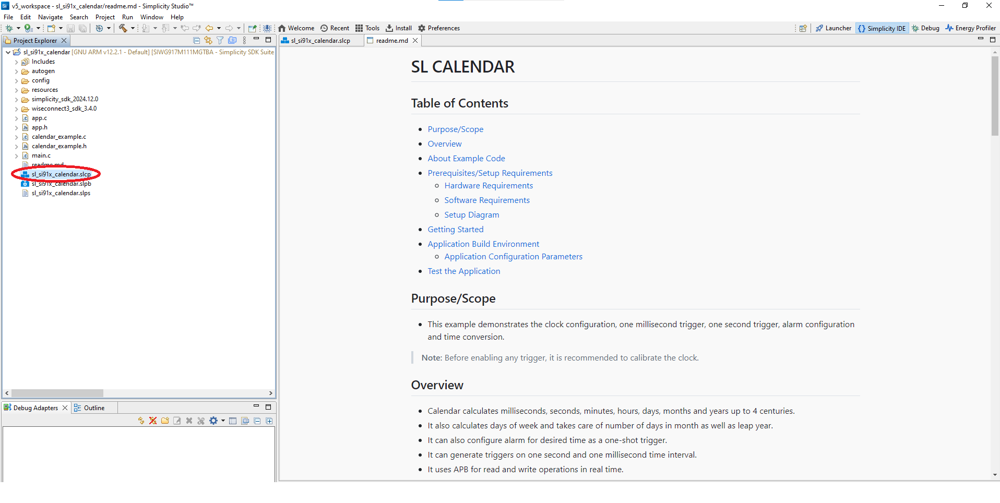
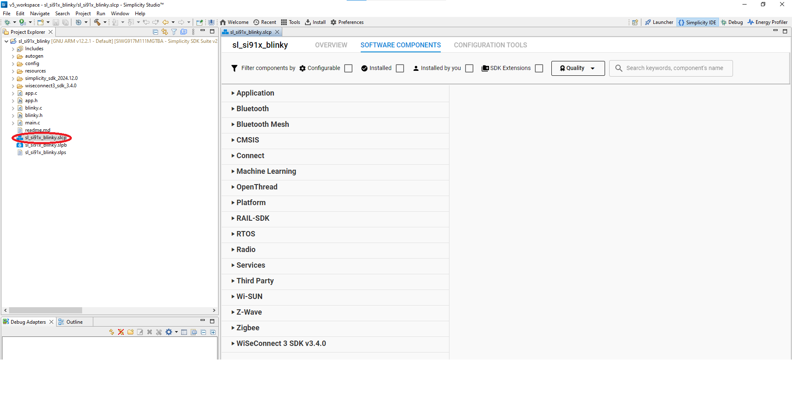
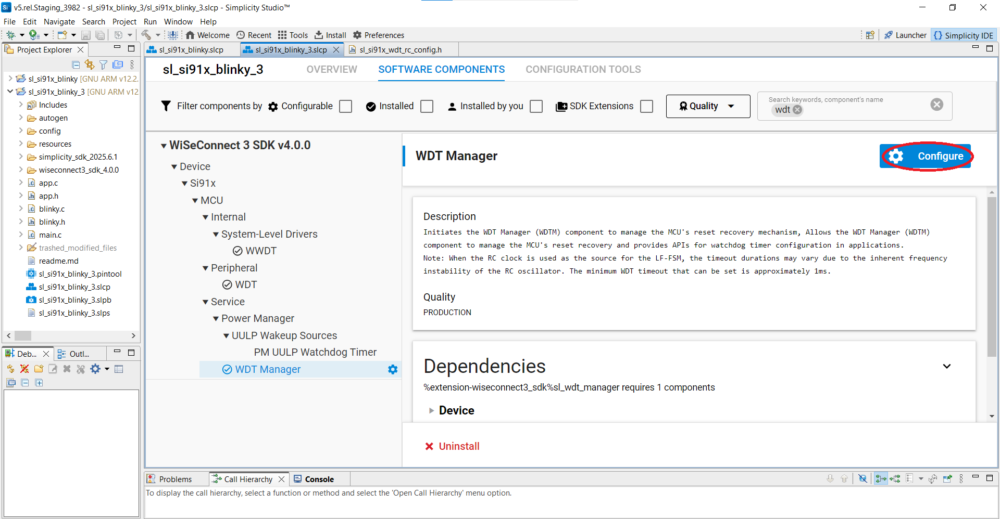

# SiWx917 Software Reference

## Introduction
This reference manual provides detailed information about the software architecture, features, and functionalities of the SiWx917™, the first chip in the SiWx91x™ chipset family. This manual is designed to assist developers in leveraging the full potential of the SiWx917 for their applications.

The SiWx917 system-on-chip (SoC) has two processing cores:
- **Network Wireless Processor (NWP)**: Handles network and wireless communication tasks.
- **ARM Cortex M4 Application Processor (MCU)**: Manages user applications and provides high-performance computing capabilities.

The SiWx917 operates with two flash memory options: common flash or dual flash. In the common flash configuration, both the MCU and the NWP share the same flash memory, while in the dual flash configuration, each processor has its own dedicated flash memory. Additionally, a shared SRAM is accessible by both processors, allowing for efficient data exchange.

The NWP includes support for in-built network and wireless protocol stacks, which applications running on the MCU can access via pre-defined APIs provided by the WiSeConnect™ SDK. Both the processors are connected over an AHB interface. The MCU and NWP rely on firmware-based state machines to manage and coordinate their individual and joint functionalities. These state machines control the operational flow within each processor, ensuring that each one transitions through specific states required for seamless processing and reliable performance

MCU applications can be developed, compiled, and run on the SiWx917 using the WiSeConnect SDK v3.x extension (or **WiSeconnect 3** extension) on Simplicity Studio. The NWP firmware is available as a pre-built binary with the WiSeConnect SDK package. See the [Getting Started](http://docs.silabs.com/wiseconnect/latest/wiseconnect-getting-started/) documentation for more details.

>**Note:** RTOS support is available at Application and Service level. Applications developers must use the correct RTOS primitives when accessing MCU peripherals from multiple SW threads. When using RTOS, developers need to configure interrupt priorities for all MCU interrupts being used in the application.

### Key Features

The SiWx91x is the industry's first wireless microcontroller unit (MCU) family with a comprehensive multiprotocol wireless subsystem. It has an integrated ultra-low-power microcontroller, a built-in wireless subsystem, advanced security, high-performance mixed-signal peripherals, and integrated power management.

Key features of the SiWx917 include:

 * Dual processing cores: Network wireless processor (NWP) and ARM Cortex M4 application processor (MCU)
 * Support for multiple flash memory configurations: separate flash for MCU and NWP or shared flash memory
 * Shared SRAM for both processors
 * In-built network and wireless stacks accessible via pre-defined APIs in the WiSeConnect™ SDK
 * Advanced security features
 * High-performance mixed-signal peripherals
 * Integrated power management
These features make the SiWx917 a versatile and powerful solution for a wide range of applications, providing developers with the tools they need for efficient and effective development.

## System Processor

The SiWx917 family include ARM® Cortex®-M4 processor for user application. The Cortex-M4 processor is a high performance 32-bit processor designed for the micro-controller market. It offers significant benefits to developers, including:
-  Outstanding processing performance combined with fast interrupt handling
-  Enhanced system debug with extensive break-point and trace capabilities
-  Efficient processor core, system and memories
-  Ultra-low power consumption with integrated sleep modes

## Software Architecture

This section provides an overview of the software components of the SiWx917. The firmware architecture is divided into two main parts: the MCU application and the NWP (Network wireless Processor) wireless firmware. The MCU application uses the [WiSeConnect SDK](http://github.com/SiliconLabs/wiseconnect) which includes source code in C and example applications with cloud SDKs, sensor-hub, MCU peripherals, Wi-Fi, BLE, and low-level MCU drivers.

The following diagram illustrates the software architecture of the SiWx917:


### SiWx91x MCU

The SiWx917 features an ARM Cortex M4 application processor (MCU) that operates at high performance, reaching speeds up to 180 MHz.

This processor is equipped with a variety of core peripherals, including systick timer, FPU, NVIC, etc.

The WiSeConnect SDK offers CMSIS-supported drivers for several peripherals, while others are managed by non-CMSIS drivers. The following diagram highlights the different peripheral blocks, indicating both CMSIS and non-CMSIS peripherals, as well as the ultra-low-power (ULP) peripherals.

For more details on MCU Peripherals, see the [SiWx917 Reference Manual](https://www.silabs.com/documents/public/reference-manuals/siw917x-family-rm.pdf)



- When using low-power features in high-power mode with DMA enabled, it is recommended to use the ULP Memory block for buffer storage. For more details on buffer allocation, refer to the example applications: ULP_I2S, ULP_UDMA, ULP_SSI, and ULP_UART.
### Application Flow

The following diagram demonstrates the flow of code in an SiWx917 MCU application code created using the WiSeConnect SDK.

Code blocks in green represent SiWx91x MCU APIs and code blocks in orange represent Wireless APIs. For further details, see the [WiSeConnect API Reference Guide](http://docs.silabs.com/wiseconnect/latest/wiseconnect-api-reference-guide-summary/).


## Memory Architecture
The SiWx917 SoC contains the following memory components:
  
  **On-chip SRAM**
  The SoC features on-chip Static Random Access Memory (SRAM) available in configurations of 192 KB, 256 KB, or 320 KB. This SRAM is crucial for storing critical data and variables during program execution, including stack and heap areas.

  **Ultra-Low Power (ULP) Memory**
  ULP memory is of size 8 KB. This can be accessed in PS4/PS3/PS2/PS1 states. This is mainly used for sensor data collection from ULP peripherals. In PS2 state, processor will be accessing this memory directly without going through ICM and AHB2AHB bridge. This will reduce the cycles required to access this memory
  
  **Read-Only Memory (ROM)**
  The SoC includes 64 KB of non-volatile M4 ROM, which stores essential firmware and system-level software that do not change during normal operations. This memory holds bootloaders and critical code required for the SoC’s startup processes.
  
  **Quad SPI Flash Memory**
  The Quad SPI flash memory, with a capacity of up to 8 MB depending on the package configuration, improves data transfer rates using the Quad Serial Peripheral Interface (Quad SPI). This non-volatile memory is suitable for storing large applications, firmware images, and data logs, and can be rewritten as needed
  
  **Quad SPI PSRAM**
  PSRAM (Pseudo Static RAM) in the SiWx917 supports capacities of up to 8 MB, depending on the package configuration. By utilizing Quad SPI, it enables high-speed access, making it ideal for temporary storage of data or buffers in applications that require rapid data handling.

  **e-Fuse**
  The SiWx917 features 32 bytes of M4 eFuse and it is available for cusmoer applications. These e-fuses enable secure and permanent storage of important configuration settings, such as unique device identifiers and security keys. Once programmed, e-fuses remain unchanged, ensuring that critical settings are preserved.

For detailed information on the memory components, please refer [SiWx917 SoC Memory Map Application Note](https://www.silabs.com/documents/public/application-notes/an1416-siwx917-soc-memory-map.pdf)

#### PSRAM

The PSRAM on the SiWx917 provides additional RAM space to the MCU application beyond the SRAM. It is available in either stacked or external configurations, depending on the package. The stacked version offers enhanced security for application execution and data storage. The MCU application can use the PSRAM for additional RAM space beyond the SRAM.

The SiWx917 provides the PSRAM in a ready-to-use state upon boot up. During boot up, the bootloader:
- Initializes the PSRAM die according to the chip and PSRAM configurations in the master boot record (MBR).
- Makes the PSRAM available as in-system memory. 

The application may use the PSRAM for different memory segments like .data, .bss, .stack, .heap, .text, or user defined segments. Different PSRAM components are available in the Simplicity Studio application project depending on the memory segments required. See the components starting from Segments in PSRAM in the [Peripherals](https://docs.silabs.com/wiseconnect/latest/wiseconnect-developers-guide-migr-sdk-changes/application-components#peripherals) section of the **Application Components** documentation page.

PSRAM can be used for runtime data storage as well as for executing MCU applications. It utilizes D-cache and I-cache to enhance memory access performance for both data and instructions.

There is a provision to modify the PSRAM configuration settings in addition to boot up and default settings with the help of driver APIs which are part of the WiSeConnect SDK. These additional configurations include interface mode, read/write type, clock, pinset, and others. The WiSeConnect SDK offers various [examples](https://docs.silabs.com/wiseconnect/latest/wiseconnect-examples/) to demonstrate the use of PSRAM memory and driver APIs.

The PSRAM interface comes with security features which allow the user to protect the data stored in the PSRAM.  It is possible to configure up to four secure segments within the PSRAM by specifying each segment's start address and length in the MBR. Each secure segment represents a designated memory area where data protection is applied, allowing users to choose specific areas of memory that require enhanced security. This segmentation flexibility lets users secure only the data that needs protection. 
An inline AES engine within the Quad SPI controller encrypts and decrypts data on the fly for these secure segments, supporting CTR mode with a key size of either 128 or 256 bits. The security configurations for these secure segments are locked in place at system boot-up; they can only be written once and cannot be modified afterward, providing write protection for the security settings.

The WiSeConnect SDK provides a power save mechanism for the PSRAM which effectively utilizes the hardware power handles and sleep features of the PSRAM die across sleep and wakeup to minimize power consumption.

For more information on the memory architecture and hardware interfaces of PSRAM, see the **SiWx917 Memory Architecture** and **SiWx917 SPI Flash/PSRAM Controller** sections of the [SiWx917 Reference Manual](https://www.silabs.com/documents/public/reference-manuals/siw917x-family-rm.pdf)

> **Note:** Currently, the radio boards map the CSN0 to drive the PSRAM die and thus enable CSN0 address space 0x0A00_0000-0x0AFF_FFFF.

#### Recommendations

- **Cache Coherency:** This is especially crucial when a buffer placed in PSRAM is accessed by both the NWP and M4 cores for bidirectional transactions. While the M4 core accesses PSRAM through cache, the Master (NWP core and DMA) interacts with PSRAM directly. Therefore, if PSRAM is used as a shared buffer, it's essential to move such buffers to SRAM.
- Only the Text and Data segments are recommended for installation in Wireless Applications from PSRAM.
- **BSS & Heap region:** In PSRAM enabled demos, moving of text, data and stack segments to PSRAM is allowed. BSS and Heap should still be in SRAM. For Wi-Fi and BLE applications, the BSS and heap regions are not configured to PSRAM.

#### Flash and PSRAM Combinations

This section describes the package combinations of flash and PSRAM provided by the SiWx917. Users can select the appropriate combination based on their application requirements.

The available PSRAM options depend on the flash configuration of the SiWx917 package:
* In the common flash configuration, both the NWP and MCU will use the same flash memory which is either stacked or external.
* In the dual flash configuration, the NWP uses stacked flash and MCU uses external flash.

The following table shows the possible combinations and the available options to add on PSRAM:

| **Modes**    | **Common flash**    | **External**     |   **PSRAM (Stacked)** |  **PSRAM (External)** |
| -------------|----------------|------------------|--------------------- |-------------------------|
| Common Flash | Yes [0:5]      |      Yes[46-51]/[52-57]   |   No            |       Yes[46-51]/[52-57]     |
|              | Yes [46:51]    |      Yes[52-57]           |  Yes[0-5]       |       Yes[52-57]    |
| Dual Flash   | Yes [0:5]      |      Yes [46-51]/[52-57]  |         No      |       No             |
|              | Yes [46:51]    |      Yes [52:57]          |         No      |       Yes [52:57]    |

**Note:** The above flash configurations may vary based on the IC/OPN. Users should select the appropriate configuration according to their specific IC/OPN. Please refer to the [SiWx917 SoC Memory Map Application Note](https://www.silabs.com/documents/public/application-notes/an1416-siwx917-soc-memory-map.pdf) for memory configuration details. See the **OPN** section in the datasheet for more information.

## Clock Architecture

The SiWx917 clock subsystem is designed to facilitate dynamic adjustments of the clock source and frequency for various functionalities, enabling fine-tuning of power usage and performance for specific applications. This subsystem supports the configuration of on-chip clocks, including ULP clock oscillators, high-frequency PLLs, and clocks for the processor and peripherals (including MCU HP, MCU ULP, and UULP Vbat).

**High-Frequency Clocks:**
  * 40MHZ_XTAL_CLK
  * RC_32MHZ_CLK 
  * SOC_PLL_CLK 
  * INTF_PLL_CLK
  * I2S_PLL_CLK

**Low-Power Clocks Generated by ULP Clock Oscillators:**
  * XTAL_32KHZ_CLK: External Crystal Clock
  * RC_32KHZ_CLK: 32 kHz clock generated by the RC oscillator
  * XTAL_32KHZ_CLK: 32 kHz clock from the external oscillator
  
When **Power Manager** component is installed, the default power state is set to **PS3 Powersave** where MCU core clock is set to 40 MHz and QSPI clock will be configured to 10 MHz.

**PS4 Performance Mode:**
To configure the core to maximum clock speed,set power state to **PS4 Performance** where the M4 Core clock is configured to 180 MHz.
In this mode, enabling the SL_SI91X_REQUIRES_INTF_PLL define will configure the QSPI clock speed to 45 MHz.

### External Oscillator(32 kHz) Usage with UULP_GPIOs

This section outlines how to utilize a 32 kHz external oscillator with UULP_GPIOs. To enable this functionality, users must install the "si91x_32kHz_external_oscillator" component, which provides the necessary configurations for the UULP_GPIOs. Additionally, this component includes a UC for selecting the appropriate UULP_GPIO. The component switches the LF-FSM clock to the internal 32 kHz RC oscillator.
 
> **Note**: 
> - For module boards, this component will be installed by default, and for ICs, the default configuration is an external 32.768kHz XTAL available on pins XTAL_32KHz_P and XTAL_32KHz_N.
> - Switching the LF-FSM clock to the internal 32 kHz RC oscillator may result in timer drifts due to the change in the clock source.

### Recommendations
- It is strongly recommended not to use RO clock in MCU
- Configure the clock source and frequency based on the application's power and performance requirements.
- Use low-power clock oscillators for energy-efficient applications.
- In an RTOS environment, it is recommended to use signaling mechanisms (such as Semaphore, Mutex, or EventFlag) rather than using simple "Variables/Flags" within user callbacks to detect "*Transfer Complete*" for high-speed communication peripherals. This approach helps to ensure thread safety and reliable communication

Refer to the User callback recommendation code snippet in the [Appendices](#user-callback-recommendation) for details on how to override the default SysTick handler in the CMSIS wrapper.

## Power Architecture

### Power Save

The SiWx917 SoC supports sleep on both the MCU and NWP with or without RAM retention.

Sleep with RAM retention makes it possible for the configured SRAM banks to be retained across sleep and wakeup. It is possible to select sleep without RAM retention if the retention of SRAM banks is not required.

Any peripherals (HP and ULP peripherals) that are initialized on powering up must be re-initialized at wakeup.
#### Power States
The power states available in different power modes (PS0, PS1, PS2, PS3, PS4) are listed below
- Reset State
- Active States
  - Power State1 (PS1)
  - Power State2 (PS2)
  - Power State3 (PS3)
  - Power State4 (PS4)
- Standby States
  - PS2-STANDBY
  - PS3-STANDBY
  - PS4-STANDBY
- Sleep States
  - PS2-SLEEP
  - PS3-SLEEP
  - PS4-SLEEP
- Shutdown States (Deep Sleep state)
  - Power State0 (PS0)

After reset, the processor starts in PS4 state which is the highest activity state where the full functionality is available. The other Active
states (PS2/PS3) will have limited functionality or Processing power.
>**Note:** PS1 is not supported
#### Sleep Wakeup Sequence

**MCU Sleep Wakeup**


**SoC Sleep Wakeup - Peripheral Interrupt Based Wakeup**


**SoC Sleep Wakeup - Wireless Based Wakeup (Wake On Wireless)**


#### MCU Wakeup Modes

The wakeup mode defines the bootloader sequence the SiWx917 will undergo once it comes out of sleep. The table below lists the different types of wakeup modes available.


#### Sequence to Configure MCU Power Save

1. Initialize the peripheral for the wakeup source.
    - Configure the wakeup source.
    - For example, if it is a button based wakeup, then configure the GPIO button interrupt.

    ```C
    //!Configure Wakeup-Source as wireless based 
    RSI_PS_SetWkpSources(WIRELESS_BASED_WAKEUP);
     ```

2. Set the retention size of the MCU RAM.
    - Possible retentions are
      - WISEMCU_16KB_RAM_IN_USE
      - WISEMCU_64KB_RAM_IN_USE
      - WISEMCU_128KB_RAM_IN_USE
      - WISEMCU_192KB_RAM_IN_USE
      - WISEMCU_256KB_RAM_IN_USE
      - WISEMCU_320KB_RAM_IN_USE

    ```C
    //!Configure RAM Usage and Retention Size
    sl_si91x_configure_ram_retention(WISEMCU_192KB_RAM_IN_USE, WISEMCU_RETAIN_DEFAULT_RAM_DURING_SLEEP);
    ```

3. Invoke the API to put the MCU to sleep.
    - To sleep with RAM retention:

      ```C
      //!Sleep With RAM Retention 
      sl_si91x_trigger_sleep(SLEEP_WITH_RETENTION, DISABLE_LF_MODE, WKP_RAM_USAGE_LOCATION, (uint32_t) RSI_PS_RestoreCpuContext, IVT_OFFSET_ADDR, RSI_WAKEUP_FROM_FLASH_MODE);
      ```

    - To sleep without RAM retention:

      ```C
      //!Sleep Without RAM Retention 
      sl_si91x_trigger_sleep(SLEEP_WITHOUT_RETENTION, DISABLE_LF_MODE, WKP_RAM_USAGE_LOCATION, (uint32_t) RSI_PS_RestoreCpuContext, IVT_OFFSET_ADDR, RSI_WAKEUP_FROM_FLASH_MODE);
      ```

    - The following are the parameters passed to the `sl_si91x_trigger_sleep()` API:

    | **Parameters** | **Values** |
    |-----------|---------------|
    |Sleep Type |  SLEEP_WITH_RETENTION / SLEEP_WITHOUT_RETENTION |
    |lf_clk_mode | DISABLE_LF_MODE |
    |stack_address | WKP_RAM_USAGE_LOCATION (0x24061EFC) |
    |jump_cb_address | (uint32_t) RSI_PS_RestoreCpuContext |
    |vector_offset| IVT_OFFSET_ADDR (0x8202000 - common flash) |
    |        | 0x8012000 (dual flash)|
    |        | 0xA001000 (PSRAM) |
    |mode    | RSI_WAKEUP_FROM_FLASH_MODE |

4. Invoke the following API function to check the wakeup status.

    ```C
    //!Get wakeup source 
    RSI_PS_GetWkpUpStatus();
    ```

    - The following table describes the wakeup status bits:

    | **NPSS interrupt number** | **Interrupt Number in VIT** | **NPSS Interrupt**|
    |-----------|---------------|--------------|
    |0  |  20  |  uulp_wdt_intr |
    |1-5|  21  | uulp_gpio_intr     |
    |6-9|  22  | uulp_cmp_intr  |
    |10  | 22  | uulp_sysrtc_intr |
    |11  | 23  | uulp_bod_intr |
    |12  | 24  |  uulp_button_intr |
    |13  |25  | uulp_sdc_intr    |
    |14  | 26 | uulp_wakeup_intr                |
    |15| 27  | uulp_alarm_intr            |
    |16| 28 | uulp_alarm_intr                    |
    |17| 29  | uulp_sec_intr            |
    |18| 29  |uulp_msec_intr              |

>**Note:**
>* rsi_deepsleep_soc.c file should compiled to SRAM.
>
>* Refer to the [Wi-Fi - TCP Tx on Periodic Wakeup (SoC)](https://github.com/SiliconLabs/wiseconnect/tree/master/examples/snippets/wlan/tcp_tx_on_periodic_wakeup) example for a detailed >example of M4 sleep wakeup.
>
>* Enable SL_SI91X_ENABLE_LOWPWR_RET_LDO macro to optimize the deepsleep >power number. By default, it is disabled.
>
>* This flow will be deprecated. It is strongly recommended to use power manager with freeRTOS tickless.

### Front-End Switch Selection GPIOs

 It is possible to configure the front-end switch GPIO pin selection through opermode.

The following table describes the front-end switch selection for the SiWx917.

|**BIT[30]** |**BIT[29]** | **ANT_SEL_0(VC3)** | **ANT_SEL_1(VC2)** | **ANT_SEL_2(VC1)**|
|---------|---------|--------|-------|------|
|0|0|Reserved|Reserved|Reserved|
|0|1|ULP GPIO 4|ULP GPIO 5|ULP GPIO 0|
|1|0|Internal Switch|Internal Switch|Internal Switch|
|1|1|Reserved|Reserved|Reserved|

> **Note:**
>* SiWx917 has an integrated on-chip transmit/receive (T/R) switch. This Internal RF Switch configuration uses internal logic present in the IC, and GPIOs are not needed. RF_BLE_TX (8dbm) mode is not supported in this configuration.
>* VC1, VC2, and VC3 are control voltage pins of the radio frequency (RF) switch. See the Reference Schematics for details.
>* ULP_GPIO_0, ULP_GPIO_4, and ULP_GPIO_5 are reserved for NWP when an external RF switch is used. Configuring these pins in the application may negatively impact RF performance.

### Recommendations
- Select the appropriate power state based on the application's power consumption and performance requirements.
- Use sleep states to conserve energy when the system is idle.
- For any wakeup source, ensure the corresponding peripheral component is installed in powersave applications
- SYSRTC and wake on wireless wakeup resources are enabled by default when tickeless idle mode is enabled. Avoid installing sleeptimer component in power save applications (where FreeRTOS tickless is enabled by default)

### Notes
- After reset, the processor starts in PS4 state which is the highest activity state where the full functionality is available. The other Active states (PS2/PS3) will have limited functionality or processing power.

## Chip/Module Programming

### ISP Mode

The SiWx917 SoC provides a configuration option to enter In-System Programming (ISP) mode by setting GPIO_34 to a low state and then issuing a reset

ISP mode enables the programming or re-programming of the flash memory using the security bootloader. The security bootloader can be directed to boot up in ISP mode by pulling down the GPIO_34 pin with a 100 ohms resistor. When ISP mode is enabled, the security bootloader does not initiate the execution of the code. Additionally, entering ISP mode disables the JTAG interface, allowing the flash to be re-programmed, regardless of whether the application code uses JTAG pins for functionality or not.

JTAG or SWD interface can also be used to flash the binaries if ISP mode is enabled. This is particularly useful when programming fails due to the M4 being in sleep or similar scenarios. In such cases, the SiWx917 can be set to ISP mode, and the binary can be flashed via the Simplicity Commander using the SWD interface.

ISP mode is supported via the following interfaces:

| **Interface** |         **Pins**          |
|---------------| --------------------------|
| **UART**      | RX: GPIO_8, TX: GPIO_9    |
| **SDIO**      | GPIO_25 - GPIO_30         |
| **HSPI**      | GPIO_25 - GPIO_28         |
| **JTAG/SWD**  | JTAG_TCK_SWCLK: GPIO_31   | 
|               | JTAG_TDI: GPIO_32         |
|               | JTAG_TMS_SWDIO: GPIO_33   |
|               | JTAG_TDO_SWO: GPIO_34     |

## Firmware Upgrade
Firmware  is  the  software  that  is  embedded  into  a  hardware  device.  It  contains  a  set  of  commands  that  control  the behavior  of  a  network  device. Whenever  a  new  firmware  version  is  available,  it  is  recommended  that  users  update their  devices  to  the  latest  version.  Complete  details  about  the  latest  firmware  will  be  available  in  the  Release  Notes (shared  as  part  of  the  release  package),  which  will  help  the  users  decide  whether  to  update  to  the  new  firmware  or not.

### Firmware File Format

The NWP Bootloader uses a proprietary format for its upgrade images, called RPS. These files have extension “.rps”. 

The RPS Format is a binary executable format understood by the Bootloader to conduct integrity and authenticity verification, as well as to load and execute the application. The Firmware Image in RPS format includes an RPS header, Boot descriptors, Application's binary image and an optional trailer (digital signature).

### SiWx917 Firmware Load and Update Process

The firmware load process  loads  firmware  onto  SiWx917  device  for  the  first  time  in  the  case  of  new  devices. The firmware update process updates SiWx917 devices with the latest firmware by replacing the firmware already existing in the device. 

The steps are as follows: 
1. To  update  existing  firmware  or  a  device  without  firmware,  download  the  new  firmware  file  to  the  device’s  flash memory from host (MCU/PC) through any host interface or through OTA process.
2. After reboot, the current firmware is replaced by the new firmware in flash memory, and the device is updated with the new firmware.

> **Note:** The device should be kept in ISP mode.

### SiWx917 Firmware Update Mechanisms

Firmware in the SiWx917 device can be updated using the following mechanisms:

1. **Firmware update via Over-The-Air (OTA)**: In this mechanism, firmware in the device can be updated by the following methods:
   * **HTTP/S**: Firmware is updated by downloading the firmware file from a remote HTTP/S or cloud server via Wi-Fi. The firmware file is directly downloaded to the NWP flash location.
   * **M4 as Host**: Using host interfaces – SPI/UART/SDIO or a remote TCP server via Wi-Fi or BLE, the firmware is received in chunks by the M4. The user can choose to send the firmware to the NWP Bootloader for upgrade or save it in the external flash as per their requirements.

2. **Firmware update via Bootloader**: In this mechanism, firmware in the device can be updated by the following methods:
   * **Kermit**: Firmware is updated using the Kermit protocol in a serial terminal like Tera Term running on a Windows/Linux PC connected to the device through the UART interface in ISP mode.
   * **External Host Interfaces - SPI/SDIO**: The following two methods of firmware update - SPI and SDIO use two different modes of operation called Master Mode and Slave Mode. These modes are selected by the Bootloader depending on the secure zone's status. When the secure zone is disabled, the device can receive the data in Master mode. If the secure zone is enabled, the device can receive the data only in Slave mode.

#### SPI/SDIO

* Enable the SPI/SDIO interface on the Host and read the register 0x4105003C, which should read out 0xAB11. This indicates that the NWP Bootloader is ready to receive commands from the Host.
* Send the "Burn" command to the device. For NWP firmware, the command is 'B', and for M4 firmware, the command is '4'. This command should be written on register address 0x41050034. In the case of M4, the burn command should be OR'ed with value 0x1 to indicate the image number.
* Once the NWP Bootloader receives this command, the device will respond with an acknowledgment, which will be (0xAB | '2') written on register 0x4105003C. This means the device has requested the Host to send the RPS file.
* The Host now sends the RPS file in chunks of 4096 bytes.

##### Master Mode:
* The Host should first write the 4096 bytes to the PING address and write 'I' | 0xAB on 0x41050034.
* The device will respond with 0xAB | 'O' on 0x4105003C. The 'I' indicates that the Host has valid data in the device's PING memory address, and the 'O' response from the device indicates that it is now expecting the next chunk on the PONG address.
* The next 4096 bytes are written to the PONG address, and 'O' | 0xAB is written on 0x41050034. The response after the device receives the data on 0x4105003C will be 0xAB | 'I'.
* The PING and PONG addresses are 0x51400 and 0x52400, respectively.
* When sending the last 4096 bytes of data, the Host should indicate End Of File to the device by writing 'E' | 0xAB on 0x41050034 along with the firmware chunk.
* When the device identifies the End Of File command on the Host register, it will save the chunk in the appropriate location in flash and then start the verification of the newly received firmware.
* If the firmware is verified correctly, the device Bootloader will move the firmware from the download area to the execution area and then update the FMC.

##### Slave Mode:
* In Slave mode, the Host would not know the PING and PONG addresses. So the Host would send the firmware chunk of 4096 bytes to the SPI/SDIO FIFO register. In Slave mode, the Host will also have to send firmware chunks and indicate PING and PONG validity using the HOST interact registers. For every chunk of data sent, dummy bytes have to be sent at the beginning as the Bootloader expects it (12 dummy bytes for SPI and 256 dummy bytes for SDIO).
* The sending of the End Of File (EOF) command is the same in Slave mode as in Master mode.
* The response to the EOF command will be 0xABAA in case of a successful update or 0xABCC in case of verification or update failure.

#### Simplicity Commander Tool/Command Line Interface (CLI)
Using the Simplicity Commander tool or by using the CLI commands, the firmware is updated.

> **Note:** SiWx917 also supports Secure and Non-Secure Firmware updates. The above mechanisms are the same for both secure and non-secure updates, except that the firmware performs security-related integrity checks before loading the device with the new firmware.

### Secure Firmware Update

In the case of bootloader and OTA, a secure firmware update can be carried out by enabling security in the firmware image using the SiWx917 Manufacturing Utility (refer to the SiWx917 Manufacturing Utility User Guide). The process of firmware update remains the same for Non-Secure and Secure Firmware updates except that in the case of a secure firmware image, integrity checks are performed.

> **Note:** For more information on firmware upgrades, see the Firmware Update App Note.

## Bootup Flow
This section outlines the bootup sequence of the SiWx917, detailing the software execution flow from the initial bootup until the MCU application starts running. The SiWx917 employs two distinct bootloaders: the Security Bootloader and the Application Bootloader.

### Bootloaders Overview:
#### Security Bootloader: 
This bootloader is embedded within the NWP ROM. It is responsible for implementing secure boot processes to ensure the integrity of the firmware.
#### Application Bootloader: 
This bootloader resides in the M4 ROM and manages the loading and execution of the application firmware.

### Bootup Sequence: 
Upon bootup, the Security Bootloader performs the following steps:
1. **Hardware Configuration**: Configures the module hardware based on the settings stored in the e-fuse and flash memory.
2. **Configuration Authentication**: Authenticates the flash configuration settings to ensure they are valid and secure.
3. **Information Transfer**: Passes essential information from the e-fuse to the Application Bootloader for proper execution.
4. **Firmware Authentication**: Utilizes public and private key-based digital signatures to authenticate firmware images, ensuring that only verified code is executed.
5. **Invoke Application Bootloader**: Finally, it calls the Application Bootloader to initiate the application firmware loading process.

**NWP and M4 Bootloader Flow**


## Services

### NVM3

This section provides an overview of the NVM3 in SiWx917 SoC.

**NVM3:**

The NVM3 provides a means to write and read data objects (key/value pairs) stored in flash. Wear-leveling is applied to reduce erase and write cycles and maximize flash lifetime. The driver is resilient to power loss and reset events, ensuring that objects retrieved from the driver are always in a valid state. A single NVM3 instance can be shared among several wireless stacks and application code, making it well-suited for multiprotocol applications.

For more detailed information about NVM3, refer to [Third Generation NonVolatile Memory (NVM3) Data Storage](https://www.silabs.com/documents/public/application-notes/an1135-using-third-generation-nonvolatile-memory.pdf).

**Working of NVM3 in Si91x Common Flash:**



**Procedure 1: Installing from Simplicity Studio**

1. **Launch the Application:**
   - Open Simplicity Studio and navigate to your project.
   - Double-click on the application `.slcp` file in the Project Explorer.

   

2. **Select Software Components:**
   - In the `.slcp` file, go to the "SOFTWARE COMPONENTS" tab.
   - Enter "nvm3 for si91x" in the search bar.
   - Select "NVM3 for Si91x" from the search results and click "Install".

   

**Procedure 2: Adding to the Application slcp File**

1. Add the following lines to the application `.slcp` file and launch the project in Simplicity Studio:

   ```yaml
   requires:
     -name: nvm3_lib

**NVM3 region in flash:**

NVM3 region is allocated at the end of the M4 flash. A separate nvm3 section is used in the linker script with configurable size to allocate nvm3 memory.


For example, refer to the section of the .map file for NVM3 memory allocation in Si91x common flash (brd4338a). By default, the NVM3 size is 36 kB.


**Configuring NVM3 Size:**

1. Open nvm3_default_config.h from `wiseconnect3/components/device/silabs/si91x/mcu/drivers/service/nvm3/inc/`
2. Update NVM3_DEFAULT_NVM_SIZE

For example, after updating NVM3_DEFAULT_NVM_SIZE to 51200, the NVM3 region in the .map file is updated as follows:


**NVM3 usage in Si91x:**

Wireless initialization needs to be done before using NVM3 APIs in common flash as NWP M4 communication is required to perform flash writes/erases. sl_net_init() function initializes the specified network interface with the provided configuration, network context, and event handler.

1. After successful wireless initialization, the nvm3_initDefault() API will open the NVM3 instance with default parameters.
2. Any of the default NVM3 parameters can be overridden by updating the corresponding macros in nvm3_default_config.h.
3. In NVM3, data is stored in the form of objects. An object is a combination of a key and data.
4. A key can be an identifier for the data stored in NVM3.
5. After successfully initializing NVM3, objects can be written using nvm3_writeData().
6. Data can be read using nvm3_readData() with the corresponding object key.
7. Objects can also be deleted using nvm3_deleteObject().

**Note:**

1. Wireless initialization is only required for Si91x common flash. For Si91x dual flash, nvm3_initDefault() can be directly called without wireless init.
2. NVM3 APIs should not be called from an ISR.
3. For more information about NVM3 usage, refer to [NVM3 - NVM Data Manager](https://docs.silabs.com/gecko-platform/3.1/driver/api/group-nvm3).


### SLEEP-Timer
#### Understanding the Use of OS-Timer instead of Sleep-Timer in Tick-less Mode 
- When FreeRTOS operates in TICKLESS-MODE (low-power mode), the core enters a sleep state, and the OS runs using the sleep timer service instead of the usual SYSTICK timer. This is because the SYSTICK timer stops functioning when the core is a sleep, while the SYSRTC driver continues to run. The SYSRTC is configured as the wake-up source for the core, meaning it will trigger the core to wake up after the specified time has elapsed.

- Issue with Using Sleep Timer for Software Timers
  - In tickless mode, if software timers are created using the sleep timer (SYSRTC), the OS is unaware of the precise expiration times of these timers. This can cause unexpected wake-ups from sleep, as the SYSRTC, acting as the wake-up source, is not synchronized with the software timer expiration time.
- Solution: Use OS-Timer
  - To avoid conflicts and ensure proper operation, it is recommended to use the OS-TIMER for creating software timers. The OS is aware of the OS-TIMER timeouts, and the OS-TIMER operates based on the sleep timer (SYSRTC). By using the OS-TIMER, the system will be able to manage timer expirations correctly without causing unnecessary wake-ups.

### Watchdog Timer (WDT)

The Watchdog Timer (WDT) is a crucial component for ensuring the reliability and stability of the system. It helps to recover from unexpected software failures by resetting the system if the software becomes unresponsive. The WDT manager is specifically meant for system reset recovery and should not be utilized for any other purpose. When interrupts are disabled, make sure to stop the WDT to avoid unintended resets. Once interrupts are re-enabled, restart the WDT to ensure system reliability

#### Key Features
- Programmable timeout intervals
- Ability to generate system resets
- Interrupt generation before reset for graceful shutdown

#### WDT Manager installation and usage for Si91x:

To configure and use the Watchdog Timer, follow these steps:

1. **Launch the Application**:
   - Open Simplicity Studio and navigate to your project.
   - Double-click on the application `.slcp` file in the Project Explorer.

   

2. **Select Software Components**:
   - In the `.slcp` file, go to the "SOFTWARE COMPONENTS" tab.
   - Enter "WDT Manager" in the search bar.
   - Select "WDT Manager" from the search results and click "Install".

   

3. **Configure the WDT**:
   - After installation, click on the "Configure" option for the WDT Manager.
   - Set the WDT interrupt time according to your requirements. By default, it is configured for 32 seconds.

   

4. **Set the Interrupt Time**:
   - Adjust the interrupt time as needed. If the WDT interrupt is not serviced and the WDT is not restarted, the system will reset after the configured system reset time (default is 4 seconds).

   

#### Recommendations
- The WDT manager is specifically meant for system reset recovery and should not be utilized for any other purpose. When interrupts are disabled, make sure to stop the WDT to avoid unintended resets. Once interrupts are re-enabled, restart the WDT to ensure system reliability
- It is strongly recommended to use `sl_si91x_soc_nvic_reset()` API for system soft reset rather than the `sl_si91x_soc_soft_reset()` function, since this uses the WDT for soft reset, which is specifically intended for system reset recovery
## Trace and Debug

The SiWx917 integrates trace and debug functions within the ARM Cortex-M4 processor, featuring two output modes supported by the TPIU:
* Clocked mode, using up to 4-bit parallel data output ports
* SWV mode, using single-bit SWV output

> **Note:** A CLK supply is required on the **M4SS_TRACE_CLKIN pin** pin for trace and debug functionalities.


### Serial Wire Viewer (SWV) Support

The SWV provides real-time data trace information from various sources within a Cortex-M4 device. It is transmitted via the **SWO** pin while your system processor continues to run at full speed. Information is available from the ITM and DWT units. SWV data trace is available via the SWO pin. 

**Setup Instructions:**

 - Configure GPIO_12 in mode 8 (MCU_CLK_OUT) and connect it back to GPIO_15 (mode 6, M4SS_TRACE_CLKIN).
 - Ensure that the MCU_CLK_OUT frequency is below 40 MHz for SWO functionality.
 - After configuration, data traces can be viewed using compatible debug probes.

For detailed information, refer to the **SiWx917 MCU HP Clock Architecture > MCUHP_CLK_CONFIG_REG3** in the **SiWx917 Reference Manual**.

### Embedded Trace Macrocell (ETM) Support

The Embedded Trace Macrocell (ETM) enables high-bandwidth instruction tracing through four dedicated trace pins accessible on the 20-pin Cortex debug + ETM connector.
**Setup Instructions:**

 - Configure GPIO_52 to GPIO_57 in mode 6 and GPIO_12 in mode 8 (MCU_CLK_OUT).
 - The MCU_CLK_OUT frequency must be between 40 MHz and 90 MHz for effective instruction tracing.

> **Note:** Ensure that a free-running clock is present on MCU_CLK_OUT (GPIO_12) prior to configuring the trace pins; otherwise, you may encounter **Trace HW not present** error in the IDE.

### VCOM

The virtual COM (VCOM) port is available on the wireless pro kit mainboard (BRD4002A) and supports several functionalities:

**Flash, Erase, and Debug over SWD:**
  * If the ULP UART peripheral is configured, VCOM cannot be used for debug prints because the ULP UART is mapped to the VCOM.
  * To enable both the ULP UART and VCOM, configure the UART1/UART2 instance for debug prints. In this case, a USB-to-TTL converter is required. See the [Console Input](https://docs.silabs.com/wiseconnect/3.1.0/wiseconnect-getting-started/getting-started-with-soc-mode#enter-the-console-input-for-other-boards) section for the BRD4325 series boards for instructions.
  * If the ULP UART is functioning in the PS2 state, UART1/UART2 cannot be used for debug prints.

**UART RX and TX:**
  * Use for command line applications and debug prints.
  * In this mode, ULP_GPIO_9 (RX) and ULP_GPIO_11 (TX) will be mapped to the MCU UART.

**Flash Programming in ISP Mode:**
  * In this mode, GPIO_8 (RX) and GPIO_9 (TX) will be mapped to the NWP UART.

**VCOM Disable Procedure:**
  * VCOM can be disabled by following these steps (note that VCOM will reset to enabled upon power cycle of BRD4002A):
    * Step 1: Open "Tools" in Simplicity Studio. Search for "Device Console" and click OK.
    * Step 2: Switch to the "Admin" tab and press Enter. Issue the command `serial vcom ctrl sense deassert`. The VCOM LED on the BRD4002A will turn OFF.

> **Note:** Debug logs from the NWP can be fetched via the NWP UART, which is available on the EXP header's EXP14 (UART_RX) and EXP12 (UART_TX) pins.

## Appendices

### Appendix A: Preprocessor Macros

#### SLI_SI91X_MCU_ENABLE_RAM_BASED_EXECUTION

Enable this macro to execute selected WiSeConnect SDK files from RAM. This is required to achieve atomicity during the simulataneous access of the flash by both the MCU and NWP.

This is necessary in the following scenarios:
* Wireless de-initialization,
* Firmware update,
* Throughput, and
* Power save

The `SLI_SI91X_MCU_ENABLE_RAM_BASED_EXECUTION` macro will be enabled if the **device_needs_ram_execution** component is present in the example's slcp file. The slcp file can be edited in the example project in Simplicity Studio.

> **Note:** It is recommended you install this component when your application implements one or more of the above scenarios.


#### SLI_SI91X_MCU_4MB_LITE_IMAGE

The current wireless flash image is 1.6 MB. A lite image has been implemented to free up the space for MCU applications.
The Lite configuration is used for 4 MB SoC OPN where 1.3 MB is allocated for the NWP image and approximately 1MB reserved for the M4 image.

The `SLI_SI91X_MCU_4MB_LITE_IMAGE` macro will be enabled if the **lite_image_for_4mb** component is installed.

For low-power M4 sleep states such as PS2, PS3, and PS4, certain files must be run from RAM memory. Refer to [Power manager integration guide](
https://github.com/SiliconLabs/wiseconnect/blob/master/examples/si91x_soc/service/sl_si91x_power_manager_m4_wireless/resources/power_manager_integration_guide/power_manager_integration.pdf
) for more details.

### Appendix B: Code Snippets

#### User callback recommendation

Below is an example demonstrating the use of a Mutex mechanism in a GSPI callback when using an RTOS:

```C
// Example GSPI callback using Mutex
void GSPI_TransferComplete_Callback(void) {
    // Lock the mutex before accessing shared resources
    xSemaphoreTake(xMutex, portMAX_DELAY);

    // Perform operations on shared resources

    // Release the mutex after operations are complete
    xSemaphoreGive(xMutex);
}

```

### Appendix C: Custom Sys-Tick Handler

When using the CMSIS_OS2 wrapper for FreeRTOS, the SysTick handler is provided by default. This handler increments the OS ticks with every SysTick interrupt. However, when tickless mode is enabled, the RTOS relies on the Sleep timer, and OS ticks are incremented in the Sleep timer IRQ handler. Thus, simultaneously using the SysTick and Sleep timer can affect the OS ticks.

Recommendation: It is advisable not to use the SysTick while tickless mode is enabled. If it is necessary to use the SysTick, override the default SysTick handler in the CMSIS wrapper. The custom handler should not increment the OS ticks to avoid impacting the tick count.

EX: To hide the SysTick handler in the cmsis_os2.c file, you can implement the following code snippet:

```C
#if (USE_CUSTOM_SYSTICK_HANDLER_IMPLIMENTATION == 0)
  void SysTick_Handler (void) {
  /* Clear overflow flag */
  SysTick->CTRL;

  if (xTaskGetSchedulerState() != taskSCHEDULER_NOT_STARTED) {
    /* Call tick handler */
    xPortSysTickHandler();
  }
}
#endif /* SysTick */
```

### Appendix D: Exception Handlers
Exception handlers are critical for managing unexpected events and ensuring system stability. Implementing custom exception handlers allows developers to handle specific exceptions and perform necessary actions to maintain system reliability. 

### Appendix E: Acronyms and Abbreviations

| **Term** | **Description** |
|----------|-----------------|
| AHB (Advanced High-performance Bus) | A bus protocol used in ARM microcontrollers for high-speed data transfer. |
| API (Application Programming Interface) | A set of functions and protocols that allow different software components to communicate. |
| DWT (Data Watchpoint and Trace) | A component in ARM Cortex-M microcontrollers that provides data watchpoint and trace capabilities. |
| ETM (Embedded Trace Macrocell) | A technology that provides instruction trace capabilities for ARM processors. |
| FMC (Flash Memory Controller) | A controller that manages the reading, writing, and erasing of flash memory. |
| FPU (Floating Point Unit) | A part of a computer system specially designed to carry out operations on floating-point numbers. |
| GPIO (General-Purpose Input/Output) | A generic pin on an integrated circuit that can be controlled by software. |
| ISP (In-System Programming) | A method of programming or reprogramming a device's flash memory while it is installed in the end system. |
| ITM (Instrumentation Trace Macrocell) | A component in ARM Cortex-M microcontrollers that provides trace capabilities for debugging. |
| MCU (Microcontroller Unit) | A small computer on a single integrated circuit containing a processor core, memory, and programmable input/output peripherals. |
| NWP (Network Wireless Processor) | A processor dedicated to handling network and wireless communication tasks. |
| OTA (Over-The-Air) | A method of distributing new software updates or configuration settings to devices wirelessly. |
| PLL (Phase-Locked Loop) | A control system that generates a signal with a fixed relation to the phase of a reference signal. |
| PSRAM (Pseudo Static Random Access Memory) | A type of RAM that combines the high density of DRAM with the ease-of-use of SRAM. |
| RC (Resistor-Capacitor) | A type of electronic circuit used for filtering or timing applications. |
| ROM (Read-Only Memory) | Non-volatile memory used to store firmware or software that is rarely changed. |
| RPS (Remote Procedure Call) | A protocol that allows a program to request a service from a program located on another computer in a network. |
| RTOS (Real-Time Operating System) | An operating system designed to serve real-time applications that process data as it comes in. |
| SDK (Software Development Kit) | A collection of software development tools and libraries for creating applications. |
| SDIO (Secure Digital Input Output) | An interface for connecting peripheral devices to a host controller. |
| SPI (Serial Peripheral Interface) | A synchronous serial communication interface used for short-distance communication. |
| SRAM (Static Random Access Memory) | A type of memory that uses bistable latching circuitry to store each bit. |
| SWD (Serial Wire Debug) | A two-pin interface for debugging ARM Cortex-M microcontrollers. |
| SWV (Serial Wire Viewer) | A real-time data trace technology for ARM Cortex-M microcontrollers. |
| TPIU (Trace Port Interface Unit) | A unit that provides real-time trace data from a microcontroller. |
| UART (Universal Asynchronous Receiver-Transmitter) | A hardware communication protocol that uses asynchronous serial communication with configurable speed. |
| VCOM (Virtual COM Port) | A software interface that emulates a physical COM port. |
| XTAL (Crystal Oscillator) | An electronic oscillator circuit that uses the mechanical resonance of a vibrating crystal to create an electrical signal with a precise frequency. |

### Appendix F: Contact Information
For further assistance and support, please contact:

* Silicon Labs Support: [Silicon Labs Support] (https://www.silabs.com/support)
* Sales Inquiries: [Contact Sales] (https://www.silabs.com/about-us/contact-sales)


## References

| **Reference** | **Link** |
|---------------|----------|
| SiWx917 Datasheet | [SiWx917 Datasheet](https://www.silabs.com/documents/public/data-sheets/SiWx917-datasheet.pdf) |
| WiSeConnect SDK Documentation | [WiSeConnect SDK Documentation](http://docs.silabs.com/wiseconnect/latest/) |
| Getting Started with WiSeConnect | [Getting Started](http://docs.silabs.com/wiseconnect/latest/wiseconnect-getting-started/) |
| NVM3 - NVM Data Manager | [NVM3 Documentation](https://docs.silabs.com/gecko-platform/3.1/driver/api/group-nvm3) |
| Third Generation NonVolatile Memory (NVM3) Data Storage | [NVM3 Application Note](https://www.silabs.com/documents/public/application-notes/an1135-using-third-generation-nonvolatile-memory.pdf) |
| Power Manager Integration Guide | [Power Manager Integration Guide](https://github.com/SiliconLabs/wiseconnect/blob/master/examples/si91x_soc/service/sl_si91x_power_manager_m4_wireless/resources/power_manager_integration_guide/power_manager_integration.pdf) |
| SiWx917 Reference Manual | Contact [Silicon Labs Sales](https://www.silabs.com/about-us/contact-sales) for access. |