# BLE Chat

## 1. Purpose / Scope

This application demonstrates how to configure demonstrates how to configure GATT server in BLE peripheral mode and explains how to do read and write operations with GATT server from connected remote device using GATT client.

## 2. Prerequisites / Setup Requirements

Before running the application, the user will need the following things to setup.

### 2.1 Hardware Requirements

- Windows PC with Host interface(UART/ SPI/ SDIO).
   - SiWx91x Wi-Fi Evaluation Kit. The SiWx91x supports multiple operating modes. See [Operating Modes]() for details.
  - **SoC Mode**: 
      - Silicon Labs [BRD4325A, BRD4325B](https://www.silabs.com/)
  - **NCP Mode**:
      - Silicon Labs [(BRD4180A, BRD4280B)](https://www.silabs.com/);
      - Host MCU Eval Kit. This example has been tested with:
        - Silicon Labs [WSTK + EFR32MG21](https://www.silabs.com/development-tools/wireless/efr32xg21-bluetooth-starter-kit)
        - Silicon Labs [WSTK + EFM32GG11](https://www.silabs.com/development-tools/mcu/32-bit/efm32gg11-starter-kit)
        - [STM32F411 Nucleo](https://st.com/)  
- BLE peripheral device

#### SoC Mode : 

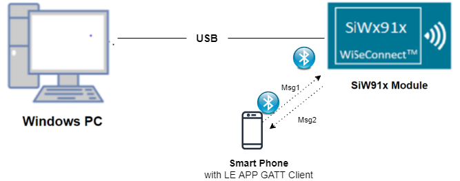
  
#### NCP Mode :  

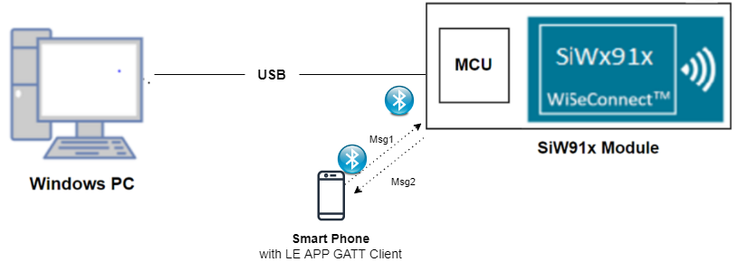	

   			
### 2.2 Software Requirements

- [WiSeConnect SDK](https://github.com/SiliconLabs/wiseconnect-wifi-bt-sdk/)
    
- Embedded Development Environment

   - For Silicon Labs EFx32, use the latest version of [Simplicity Studio](https://www.silabs.com/developers/simplicity-studio)
   
- Download and install the Silicon Labs [EFR Connect App](https://www.silabs.com/developers/efr-connect-mobile-app) in the android smart phones for testing BLE applications. Users can also use their choice of BLE apps available in Android/iOS smart phones.

## 3. Project Environment

1. Ensure the SiWx91x loaded with the latest firmware following the [Getting started with a PC](https://docs.silabs.com/rs9116/latest/wiseconnect-getting-started)

### 3.1 Creating the Project

#### 3.1.1 SoC Mode

1. Ensure the SiWx91x setup is connected to your PC.

- In the Simplicity Studio IDE, the SiWx91x SoC board will be detected under **Debug Adapters** pane as shown below.

   
   
- Studio should detect your board. Your board will be shown here. Click on the board detected and go to **EXAMPLE PROJECTS & DEMOS** section.  

- Filter for Bluetooth examples from the Gecko SDK added. For this, check the *Bluetooth* checkbox under **Wireless Technology** and select *BLE - Simple Chat * application.

   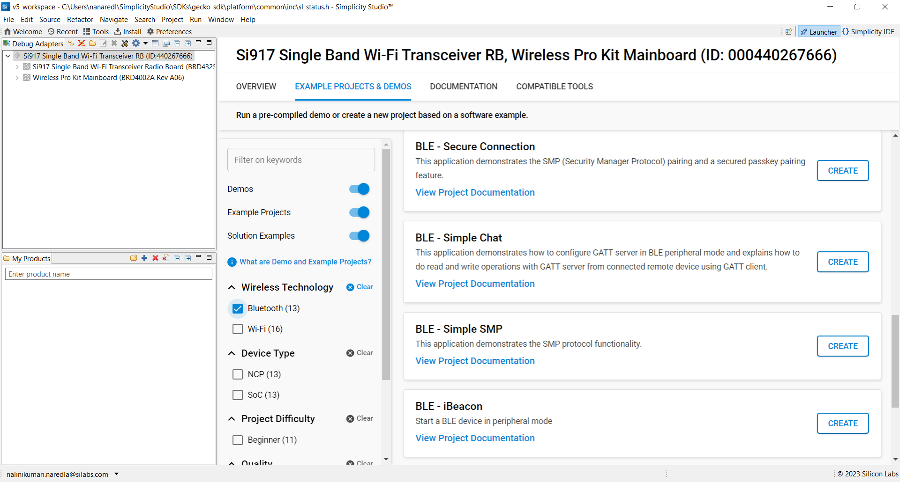

- Click 'Create'. The "New Project Wizard" window appears. Click 'Finish'

  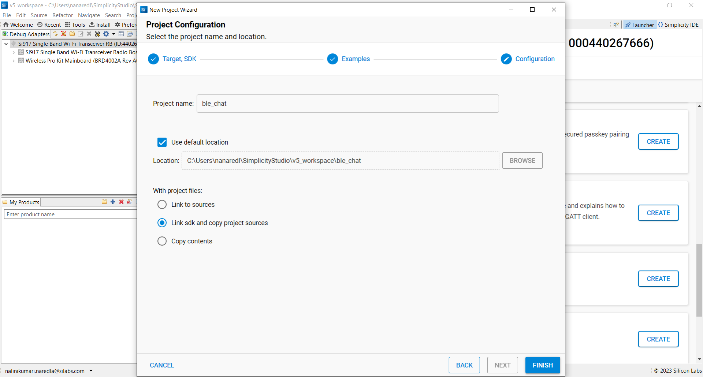

#### 3.1.2 NCP Mode

1. Ensure the EFx32 and SiWx91x setup is connected to your PC.

- In the Simplicity Studio IDE, the EFR32 board will be detected under **Debug Adapters** pane as shown below.
   
   

- Ensure the latest Gecko SDK along with the WiSeConnect 3 extension is added to Simplicity Studio.

- Go to the 'EXAMPLE PROJECT & DEMOS' tab and select *BLE - Simple Chat* application.

- Click 'Create'. The "New Project Wizard" window appears. Click 'Finish'.

  

### 3.2 Setup for Application Prints

#### 3.2.1 SoC Mode

  You can use either of the below USB to UART converters for application prints.

1. Setup using USB to UART converter board.

   - Connect Tx (Pin-6) to P27 on WSTK
   - Connect GND (Pin 8 or 10) to GND on WSTK

****

2. Setup using USB to UART converter cable

   - Connect RX (Pin 5) of TTL convertor to P27 on WSTK
   - Connect GND (Pin1) of TTL convertor to GND on WSTK

****

**Tera Term set up - for NCP and SoC modes**

1. Open the Tera Term tool.

	- For SoC mode, choose the serial port to which USB to UART converter is connected and click on **OK**. 

   ****

	- For NCP mode, choose the J-Link port and click on **OK**.
    
   ****

2. Navigate to the Setup → Serial port and update the baud rate to **115200** and click on **OK**.

  ****
 
  ****

## 4. Application Build Environment

### 4.1 Application Configuration Parameters

The application can be configured to suit your requirements and development environment. Read through the following sections and make any changes needed.

**4.1.1** Open `app.c` file

User must update the below parameters 

`RSI_BLE_NEW_SERVICE_UUID` refers to the attribute value of the newly created service.

         #define RSI_BLE_NEW_SERVICE_UUID                         0xAABB
`RSI_BLE_ATTRIBUTE_1_UUID` refers to the attribute type of the first attribute under this service .

         #define RSI_BLE_ATTRIBUTE_1_UUID                         0x1AA1

`RSI_BLE_MAX_DATA_LEN` refers to the Maximum length of the attribute data.

         #define RSI_BLE_MAX_DATA_LEN                             20

`RSI_BLE_APP_SIMPLE_CHAT` refers name of the Silicon Labs device to appear during scanning by remote devices.

         #define RSI_BLE_APP_SIMPLE_CHAT                          "BLE_SIMPLE_CHAT"

Following are the non-configurable macros in the application.

`RSI_BLE_CHAR_SERV_UUID` refers to the attribute type of the characteristics to be added in a service.

         #define RSI_BLE_CHAR_SERV_UUID                           0x2803

`RSI_BLE_CLIENT_CHAR_UUID` refers to the attribute type of the client characteristics descriptor to be added in a service.

         #define RSI_BLE_CLIENT_CHAR_UUID                         0x2902

Following are the properties

`RSI_BLE_ATT_PROPERTY_READ` is used to set the READ property to an attribute value.

         #define RSI_BLE_ATT_PROPERTY_READ                        0x02

`RSI_BLE_ATT_PROPERTY_WRITE` is used to set the WRITE property to an attribute value.

         #define RSI_BLE_ATT_PROPERTY_WRITE                       0x08

`RSI_BLE_ATT_PROPERTY_NOTIFY` is used to set the NOTIFY property to an attribute value.

         #define RSI_BLE_ATT_PROPERTY_NOTIFY                      0x10

**4.1.2** Open ble_config.h file and update/modify following macros,

         #define RSI_FEATURE_BIT_MAP                               (FEAT_ULP_GPIO_BASED_HANDSHAKE |FEATT_DEV_TO_HOST_ULP_GPIO_1)
         #define RSI_TCP_IP_BYPASS                                 RSI_DISABLE 
         #define RSI_TCP_IP_FEATURE_BIT_MAP                        TCP_IP_FEAT_DHCPV4_CLIENT 
         #define RSI_CUSTOM_FEATURE_BIT_MAP                        FEAT_CUSTOM_FEAT_EXTENTION_VALID
         #define RSI_EXT_CUSTOM_FEATURE_BIT_MAP                    (EXT_FEAT_LOW_POWER_MODE | EXT_FEAT_XTAL_CLK_ENABLE | EXT_FEAT_384K_MODE)

         #define RSI_BLE_PWR_INX                                   30 
         #define RSI_BLE_PWR_SAVE_OPTIONS                          BLE_DISABLE_DUTY_CYCLING 

**Note:** `ble_config.h` files are already set with desired configuration in respective example folders user need not change for each example. 

### 4.2 Build the Application

- Follow the below steps for the successful execution of the application.

#### Build Project - SoC Mode

- Once the project is created, click on the build icon (hammer) to build the project (or) right click on project and click on Build Project.

   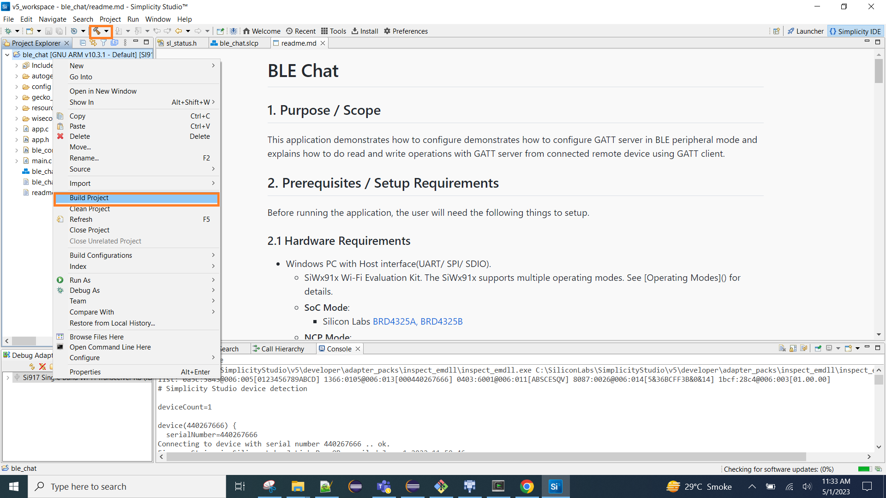
   
- Successful build output will show as below.

#### Build Project - NCP Mode :

   

## 5. Test the Application

Follow the steps below for the successful execution of the application.

### 5.1 Loading the SiWx91x Firmware

Refer [Getting started with PC ](https://docs.silabs.com/rs9116/latest/wiseconnect-getting-started) to load the firmware into SiWx91x EVK. The firmware binary is located in `<SDK>/firmware/`

#### 5.2 Load the Application Image

1. Click on Tools and Simplicity Commander as shown below.

   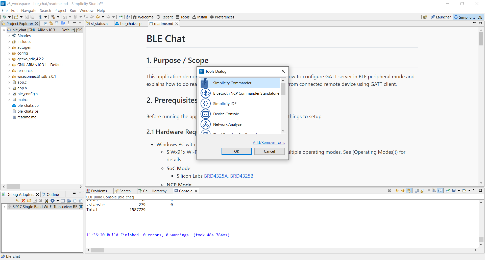
   
2. Load the application image
	- Select the board. 
	- Browse the application image (.hex) and click on Flash button.

   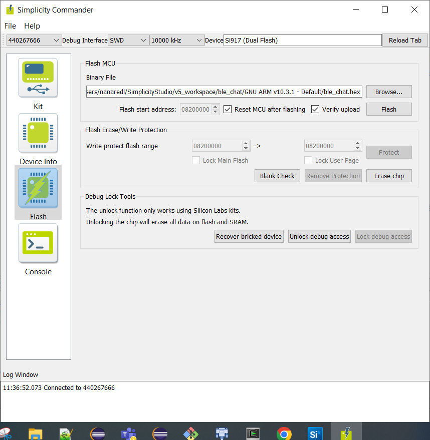

### 5.3 Common Steps

1. After the program gets executed, Silicon Labs module will be in Advertising state.
2. Open a LE App in the Smartphone and do the scan.
3. In the App, Silicon Labs module device will appear with the name configured in the macro RSI_BLE_APP_SIMPLE_CHAT (Ex: "BLE_SIMPLE_CHAT")or sometimes observed as Silicon Labs device as internal name  "SimpleBLEPeripheral".
4. Initiate connection from the App.
5. After successful connection, LE scanner displays the supported services of Silicon Labs module

   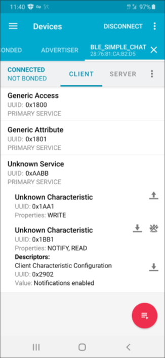
   
6. Select the attribute service which is added RSI_BLE_NEW_SERVICE_UUID
(Ex: 0xAABB)
7. After selecting the service do Write and Read operations with GATT server.
8. Enable notifications for the read attribute RSI_BLE_ATTRIBUTE_2_UUID
(Example: 0x1BB1) So that GATT server notifies when value updated in that particular attribute.
9. Write data (Ex: "Hello World") to attribute RSI_BLE_ATTRIBUTE_1_UUID(Ex: 0x1AA1). So that GATT server notifies when value updated in that particular attribute.

   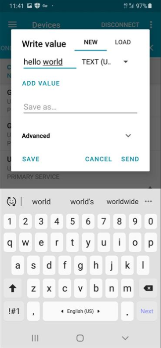

10. Silicon Labs module receives the data sent by remote device and same data writes into the attribute RSI_BLE_ATTRIBUTE_2_UUID (Ex: 0x1BB1) and will notifies the GATT client (remote device).

   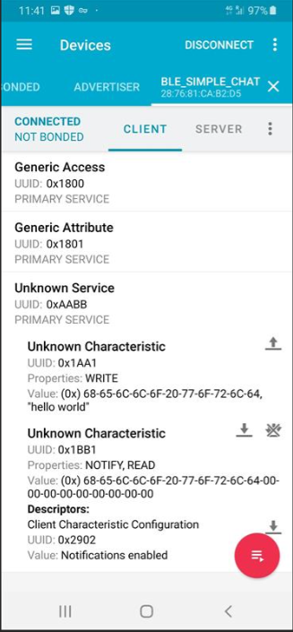

11. Please refer the given below images for write and read operations from remote device GATT client.

   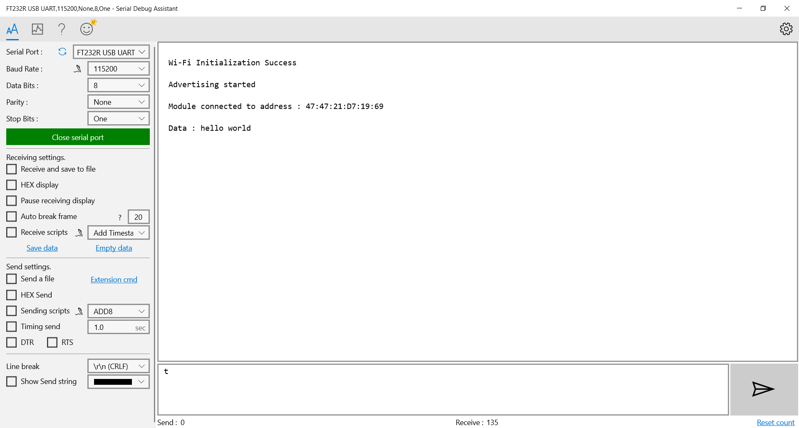

