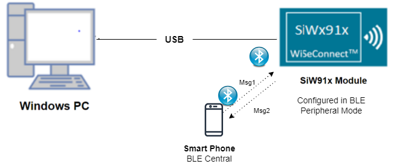
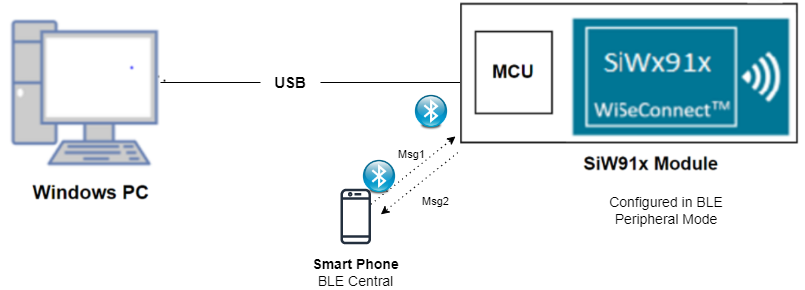
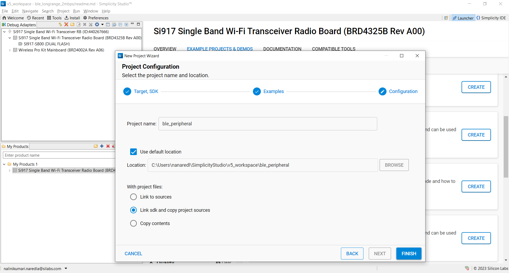
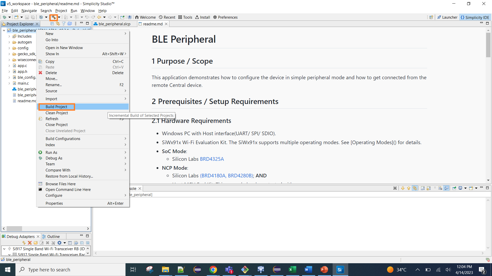
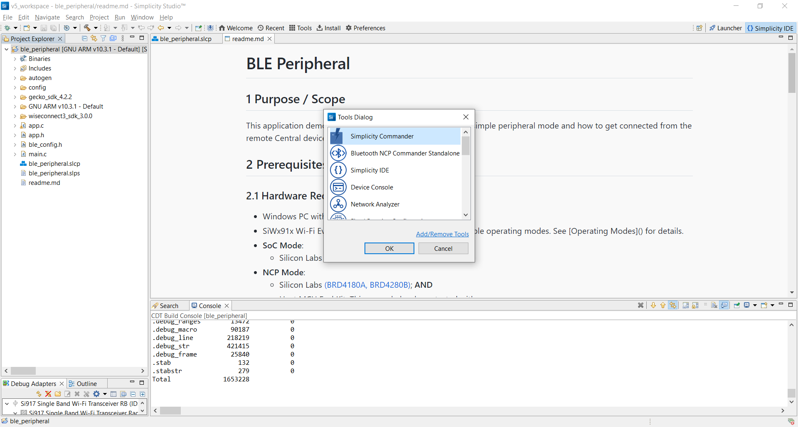
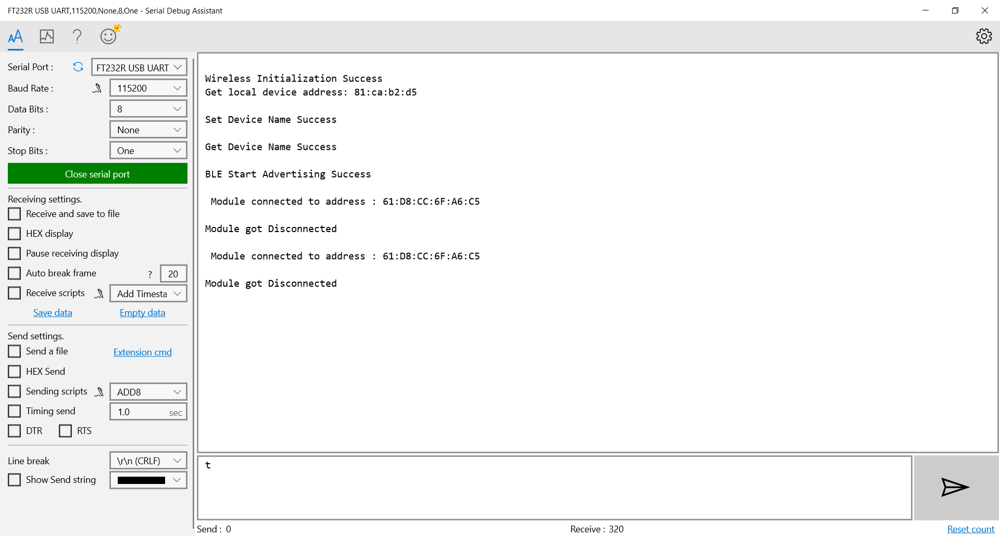

# BLE Peripheral

## 1 Purpose / Scope

This application demonstrates how to configure the device in simple peripheral mode and how to get connected from the remote Central device.

## 2 Prerequisites / Setup Requirements

### 2.1 Hardware Requirements

- Windows PC with Host interface(UART/ SPI/ SDIO).
- SiWx91x Wi-Fi Evaluation Kit. The SiWx91x supports multiple operating modes. See [Operating Modes]() for details.
- **SoC Mode**: 
  - Silicon Labs [BRD4325A, BRD4325B, BRD4325G](https://www.silabs.com/)
- **NCP Mode**:
  - Silicon Labs [(BRD4180A, BRD4280B)](https://www.silabs.com/); **AND**
  - Host MCU Eval Kit. This example has been tested with:
  - Silicon Labs [WSTK + EFR32MG21](https://www.silabs.com/development-tools/wireless/efr32xg21-bluetooth-starter-kit)
- BLE peripheral device

### 2.2 Software Requirements
    
- Embedded Development Environment
- Simplicity Studio IDE 
  - Download the [Simplicity Studio IDE](https://www.silabs.com/developers/simplicity-studio).
  - Follow the [Simplicity Studio user guide](https://docs.silabs.com/simplicity-studio-5-users-guide/1.1.0/ss-5-users-guide-getting-started/install-ss-5-and-software#install-ssv5) to install Simplicity Studio IDE.
- Download and install the Silicon Labs [EFR Connect App](https://www.silabs.com/developers/efr-connect-mobile-app) in the android smart phones for testing BLE applications. Users can also use their choice of BLE apps available in Android/iOS smart phones.

### 2.3 Setup Diagram
   
**SoC Mode :**



Follow the [Getting Started with SiWx91x SoC](https://docs.silabs.com/) guide to set up the hardware connections and Simplicity Studio IDE.
  
**NCP Mode :**  

 

Follow the [Getting Started with EFx32](https://docs.silabs.com/rs9116-wiseconnect/latest/wifibt-wc-getting-started-with-efx32/) guide to setup the hardware connections and Simplicity Studio IDE.

## 3. Project Environment

1. Ensure the SiWx91x loaded with the latest firmware following the [Getting started with a PC](https://docs.silabs.com/rs9116/latest/wiseconnect-getting-started)

### 3.1 Creating the Project

#### 3.1.1 SoC Mode

1. Ensure the SiWx91x setup is connected to your PC.

- In the Simplicity Studio IDE, the SiWx91x SoC board will be detected under **Debug Adapters** pane as shown below.

   
   
- Studio should detect your board. Your board will be shown here. Click on the board detected and go to **EXAMPLE PROJECTS & DEMOS** section.  

- Filter for Bluetooth examples from the Gecko SDK added. For this, check the *Bluetooth* checkbox under **Wireless Technology** and select *BLE - Peripheral Mode* application.

   

- Click 'Create'. The "New Project Wizard" window appears. Click 'Finish'

  

#### 3.1.2 NCP Mode

1. Ensure the EFx32 and SiWx91x set up is connected to your PC.

- In the Simplicity Studio IDE, the EFR32 board will be detected under **Debug Adapters** pane as shown below.
   
   

- Ensure the latest Gecko SDK along with the WiSeConnect 3 extension is added to Simplicity Studio.

- Go to the 'EXAMPLE PROJECT & DEMOS' tab and select *BLE - Peripheral Mode* application.

- Click 'Create'. The "New Project Wizard" window appears. Click 'Finish'.

  
  
### 3.2 Setup for Application Prints

#### 3.2.1 SoC Mode

  You can use either of the below USB to UART converters for application prints.

1. Set up using USB to UART converter board.

 - Connect Tx (Pin-6) to P27 on WSTK
   - Connect GND (Pin 8 or 10) to GND on WSTK

   ****

2. Set up using USB to UART converter cable.

 - Connect RX (Pin 5) of TTL convertor to P27 on WSTK
   - Connect GND (Pin1) of TTL convertor to GND on WSTK
    
   ****

**Tera Term set up - for NCP and SoC modes**

1. Open the Tera Term tool.

 - For SoC mode, choose the serial port to which USB to UART converter is connected and click on **OK**. 

   ****

 - For NCP mode, choose the J-Link port and click on **OK**.
    
   ****

2. Navigate to the Setup → Serial port and update the baud rate to **115200** and click on **OK**.

  ****
 
  ****

## 4 Application Build Environment

### 4.1 Configure the Application

The application can be configured to suit your requirements and development environment. Read through the following sections and make any changes needed.

**4.1.1** Open `app.c` file

- User must update the below parameters 

`RSI_BLE_LOCAL_NAME` refers the name of the Silicon Labs device to appear during scanning by remote devices.

  ```       
  #define RSI_BLE_LOCAL_NAME                              "BLE_PERIPHERAL"  
  ```

`RSI_SEL_ANTENNA` refers to the antenna which is to be used by Silicon Labs module.  

If the user using internal antenna then set,

  ```c
  #define RSI_SEL_ANTENNA                                 RSI_SEL_INTERNAL_ANTENNA
  ```  

If the user using an external antenna (U.FL connector) then set, RSI_SEL_EXTERNAL_ANTENNA

- Following are the non-configurable macros in the application.
Following are the event numbers for connection and Disconnection events.

  ```  
  #define RSI_APP_EVENT_CONNECTED                         1 
  #define RSI_APP_EVENT_DISCONNECTED                      2
  ```  

**4.1.2** Open ble_config.h file and update/modify following macros

  ```
  #define RSI_FEATURE_BIT_MAP                             (FEAT_ULP_GPIO_BASED_HANDSHAKE |FEATT_DEV_TO_HOST_ULP_GPIO_1)  
  #define RSI_TCP_IP_BYPASS                               RSI_DISABLE  
  #define RSI_TCP_IP_FEATURE_BIT_MAP                      TCP_IP_FEAT_DHCPV4_CLIENT  
  #define RSI_CUSTOM_FEATURE_BIT_MAP                      FEAT_CUSTOM_FEAT_EXTENTION_VALID  
  #define RSI_EXT_CUSTOM_FEATURE_BIT_MAP                  (EXT_FEAT_LOW_POWER_MODE | EXT_FEAT_XTAL_CLK_ENABLE | EXT_FEAT_384K_MODE)  
  #define RSI_BLE_PWR_INX                                 30  
  #define RSI_BLE_PWR_SAVE_OPTIONS                        BLE_DISABLE_DUTY_CYCLING  
  ```  

**Note:** `ble_config.h` files are already set with desired configuration in respective example folders user need not change for each example. 

### 4.2 Build the Application

- Follow the below steps for the successful execution of the application.

#### Build Project - SoC Mode

- Once the project is created, click on the build icon (hammer) to build the project (or) right click on project and click on Build Project.

   
   
- Successful build output will show as below.
   
#### Build Project - NCP Mode

   
   
- Successful build output will show as below.

### 4.3 Run and Test the Application

- Once the build was successfull, load the application image.

#### 4.3.1 Load the Application Image

1. Click on Tools and Simplicity Commander as shown below.

   
   
2. Load the firmware image
 - Select the board. 
 - Browse the application image (.hex) and click on Flash button.

   
   
#### 4.3.2 Common Steps

1. After the program gets executed, Silicon Labs module will be in Advertising state.
2. Open an LE App in the Smartphone and do the scan.
3. In the App, Silicon Labs module device will appear with the name configured in the macro RSI_BLE_LOCAL_NAME (Ex: "BLE_PERIPHERAL") or sometimes observed as the Silicon Labs device as the internal name "SimpleBLEPeripheral".
4. Initiate connection from the mobile App.
5. Observe that the connection is established between Smartphone and Silicon Labs module.

### 4.4 Application Output

   
