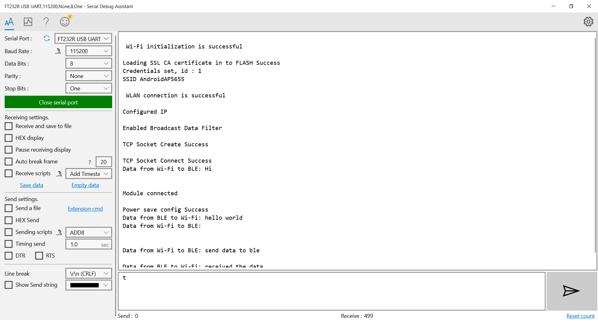

# Wi-Fi BLE Power Save

## 1. Purpose / Scope

The coex application demonstrates the procedure about how to configure the device in WisConnect coex mode with wlan standby and ble connected power save.
In this coex application, Silicon Labs BLE device connects with remote BLE device (ex:Smart phone with spp pro application) and issue connected power save command to module.In parallel Silicon Labs WiFi interface connects with an Access Point in station mode and issue connected power save command.

## 2. Prerequisites / Setup Requirements

Before running the application, the user will need the following things to setup.

### 2.1 Hardware Requirements

- Windows PC.
- SiWx91x Wi-Fi Evaluation Kit. The SiWx91x supports multiple operating modes. See [Operating Modes]() for details.
  - **SoC Mode**: 
    - Silicon Labs [(BRD4180A, BRD4325B, BRD4325G)](https://www.silabs.com/)
  - **NCP Mode**:
    - Silicon Labs [(BRD4180A, BRD4280B)](https://www.silabs.com/); **AND**
    - Host MCU Eval Kit. This example has been tested with:
      - Silicon Labs [WSTK + EFR32MG21](https://www.silabs.com/development-tools/wireless/efr32xg21-bluetooth-starter-kit)
        
- Wireless Access point
- Android Phone or iPhone with **EFR Connect** App, which is available in Play Store and App Store.
- Windows PC2 with SSL server application (openssl)

### 2.2 Software Requirements
    
- Embedded Development Environment

  - For Silicon Labs EFx32, use the latest version of [Simplicity Studio](https://www.silabs.com/developers/simplicity-studio)
  - Download and install the Silicon Labs [EFR Connect App](https://www.silabs.com/developers/efr-connect-mobile-app) in the android smart phones for testing BLE applications. Users can also use their choice of BLE apps available in Android/iOS smart phones.
  - Download Open SSL for windows from below link,  
     [http://ufpr.dl.sourceforge.net/project/gnuwin32/openssl/0.9.8h-1/openssl-0.9.8h-1-bin.zip](http://ufpr.dl.sourceforge.net/project/gnuwin32/openssl/0.9.8h-1/openssl-0.9.8h-1-bin.zip)
     
### 2.3 Setup Diagram
   
- **SoC Mode :**

   

Follow the [Getting Started with SiWx91x SoC](https://docs.silabs.com/) guide to setup the hardware connections and Simplicity Studio IDE.

- **NCP Mode :**

   

Follow the [Getting Started with EFx32](https://docs.silabs.com/rs9116-wiseconnect/latest/wifibt-wc-getting-started-with-efx32/) guide to setup the hardware connections and Simplicity Studio IDE.

### 3. Application Build Environment

### 3.1 Project Creation

#### 3.1.1 SoC Mode

1. Ensure the SiWx91x setup is connected to your PC.

- In the Simplicity Studio IDE, the SiWx91x SoC board will be detected under **Debug Adapters** pane as shown below.

   
   
- Studio should detect your board. Your board will be shown here. Click on the board detected and go to **EXAMPLE PROJECTS & DEMOS** section.  

- Filter for Bluetooth examples from the Gecko SDK added. For this, check the *Bluetooth* checkbox under **Wireless Technology** and select *Wi-Fi Coex - Wi-Fi Client BLE Power Save* application. 

   

- Click 'Create'. The "New Project Wizard" window appears. Click 'Finish'

  

#### 3.1.2 NCP Mode

1. Ensure the EFx32 and SiWx91x setup is connected to your PC.

- In the Simplicity Studio IDE, the EFR32 board will be detected under **Debug Adapters** pane as shown below.
   
   

- Ensure the latest Gecko SDK along with the WiSeConnect 3 extension is added to Simplicity Studio.

- Go to the 'EXAMPLE PROJECT & DEMOS' tab and select *Wi-Fi Coex - Wi-Fi Client BLE Power Save* application.

- Click 'Create'. The "New Project Wizard" window appears. Click 'Finish'.

  

### 3.2 Setup for application prints

#### 3.2.1 SoC Mode

  You can use either of the below USB to UART converters for application prints.

1. Set up using USB to UART converter board.

 - Connect Tx (Pin-6) to P27 on WSTK
 - Connect GND (Pin 8 or 10) to GND on WSTK
   

2. Set up using USB to UART converter cable.

 - Connect RX (Pin 5) of TTL convertor to P27 on WSTK
 - Connect GND (Pin1) of TTL convertor to GND on WSTK    
   

**Tera Term setup - for NCP and SoC modes**

1. Open the Tera Term tool.

 - For SoC mode, choose the serial port to which USB to UART converter is connected and click on **OK**. 

   
      
 - For NCP mode, choose the J-Link port and click on **OK**.
    
   
      
2. Navigate to the Setup → Serial port and update the baud rate to **115200** and click on **OK**.

   
 
   

## 4. Application Configuration Parameters

The application can be configured to suit your requirements and development environment. Read through the following sections and make any changes needed.

**Configuring the WLAN task**

1. Open `wifi_app.c` file and update/modify the following macros:

SSID refers to the name of the Access point.

```c
#define SSID          "ACCESSPOINT SSID"
 ```

PSK refers to the secret key if the Access point configured in WPA-PSK/WPA2-PSK security modes.

```
#define PSK           "<psk>"
```

To run as SSL client :

```
#define SSL_CLIENT     1
```

If SSL_CLIENT set to 1, application will load the necessary SSL certificates from default global resources/ folder.
By default, application loading "cacert.pem" certificate if it is enabled.

if SSL_CLIENT set to 0, will use the normal TCP sockets for communication.

SERVER_PORT port refers remote SSL server port number

```
#define SERVER_PORT         5001
```

SERVER_IP_ADDRESS refers remote peer IP address to connect with SSL server socket.

```
#define SERVER_IP_ADDRESS      "192.168.43.99"
```

 **Configuring the BLE task**
 
> ble_config.h files are already set with the above desired configuration for this example.

Configuring the BLE Application

Open `ble_app.c` file and update/modify following macros

default power save mode configuration is set to low power mode 2 (ASSOCIATED_POWER_SAVE) with maximum power save (RSI_MAX_PSP) with message based hand shake.

```
#define   PSP_TYPE                RSI_MAX_PSP
```

RSI_BLE_NEW_SERVICE_UUID refers to the attribute value of the newly created service.

```
#define RSI_BLE_NEW_SERVICE_UUID                     0xAABB
```

RSI_BLE_ATTRIBUTE_1_UUID refers to the attribute type of the first attribute under this service (RSI_BLE_NEW_SERVICE_UUID).

```
#define RSI_BLE_ATTRIBUTE_1_UUID                      0x1AA1
```

RSI_BLE_ATTRIBUTE_2_UUID refers to the attribute type of the second attribute under this service (RSI_BLE_NEW_SERVICE_UUID).

```
#define RSI_BLE_ATTRIBUTE_2_UUID                      0x1BB1
```

RSI_BLE_MAX_DATA_LEN refers to the Maximum length of the attribute data.

```
#define RSI_BLE_MAX_ DATA_LEN                         20
```

RSI_BLE_APP_DEVICE_NAME refers name of the Silicon Labs device to appear during scanning by remote devices.

```
#define RSI_BLE_APP_DEVICE_NAME                       "WLAN_BLE_SIMPLE_CHAT"
```

Following are the non-configurable macros in the application.
RSI_BLE_CHAR_SERV_UUID refers to the attribute type of the characteristics to be added in a service.

```
#define RSI_BLE_CHAR_SERV_UUID                         0x2803
```

RSI_BLE_CLIENT_CHAR_UUID refers to the attribute type of the client characteristics descriptor to be added in a service.

```
#define RSI_BLE_CLIENT_CHAR _UUID                     0x2902
```

RSI_BLE_ATT_PROPERTY_READ is used to set the READ property to an attribute value.

```
#define RSI_BLE_ATT_PROPERTY_READ                     0x02
```

RSI_BLE_ATT_PROPERTY_WRITE is used to set the WRITE property to an attribute value.

```
#define RSI_BLE_ATT_PROPERTY_WRITE                    0x08
```

RSI_BLE_ATT_PROPERTY_NOTIFY is used to set the NOTIFY property to an attribute value.

```
#define RSI_BLE_ATT_PROPERTY_NOTIFY                   0x10
```

2.Open ble_config.h file and update/modify following macros,

```
#define RSI_BLE_PWR_INX                               30
```

```
#define RSI_BLE_PWR_SAVE_OPTIONS                      0
```

## 5. Build and Test the Application

- Follow the below steps for the successful execution of the application.

- Follow the below steps for the successful execution of the application.

### 5.1 Build the Application

- Follow the below steps for the successful execution of the application.

#### SoC Mode

- Once the project is created, click on the build icon (hammer) to build the project (or) right click on project and click on Build Project.

   
   
- Successful build output will show as below.
   
#### NCP Mode

   
   
- Successful build output will show as below.

### 5.2 Loading the Application Image

1. Click on Tools and Simplicity Commander as shown below.

   
   
2. Load the firmware image
 - Select the board. 
 - Browse the application image (.hex) and click on Flash button.

   
   
### 5.3 Steps to verify the WLAN Station BLE Power Save Example

#### 5.2.1 Steps to be followed to verify WLAN Station BLE Provisioning with Android **EFR Connect** App

1. Configure the Access point in OPEN/WPA-PSK/WPA2-PSK mode to connect the SiWx91x in STA mode.
2. In Windows PC2 which is connected to AP through LAN, Download the Openssl package from above mentioned link and run SSL server by giving following command:  
Openssl.exe s_server -accept<SERVER_PORT> –cert <server_certificate_file_path> -key <server_key_file_path> -tls<tls_version>
Example: **openssl.exe s_server –accept 5001 –cert server-cert.pem -key server-key.pem –tls1**

   

3. After the program gets executed, Silicon Labs BLE is in Advertising state and WLAN connects to Access Point and establishes SSL connectivity with SSL server opened on Windows PC1. Please refer the given below image for connection establishment at windows PC1,

   

4. Open a BLE scanner App in the Smartphone and do the Scan.

5. In the App, Silicon Labs module device will appear with the name configured in the macro RSI_BLE_APP_SIMPLE_CHAT (Ex: "WLAN_BLE_SIMPLE_CHAT") or sometimes observed as Silicon Labs device as internal name "SimpleBLEPeripheral".
6. Initiate BLE connection from the App.
   
7. After successful connection, LE scanner displays the supported services of Silicon Labs module. 

8. Select the attribute service which is added RSI_BLE_NEW_SERVICE_UUID

(Ex: 0xAABB) and enable Notification for attribute UUID RSI_BLE_ATTRIBUTE_2_UUID (Ex: 0x1BB1) to receive data sent by Wi-Fi STA. 
9. Now from SSL server (windows PC1), send a message (Ex: "Hello from WiFi STA") to Silicon Labs device. Silicon Labs device forwards the received message from SSL server to remote BTLE device which is connected to Silicon Labs BTLE device over BTLE protocol. User can observe the message notification on attribute UUID RSI_BLE_ATTRIBUTE_2_UUID (Ex: 0x1BB1) in BTLE scanner app.

   

10. Now send a message (Ex: "Hello from bt slave") from GATT client (from smart phone BLE scanner app) using attribute RSI_BLE_ATTRIBUTE_1_UUID (Ex: 0x1AA1) to Silicon Labs device. Silicon Labs device forwards the received message from BTLE remote device to SSL server over WiFi protocol. User can observe the message on UDP socket application.

   
   
   
   
11. After proper coex power save mode selection then power save command go to the module.

12. Note down power measurement by connecting Module to Agilent Power meter setup.
