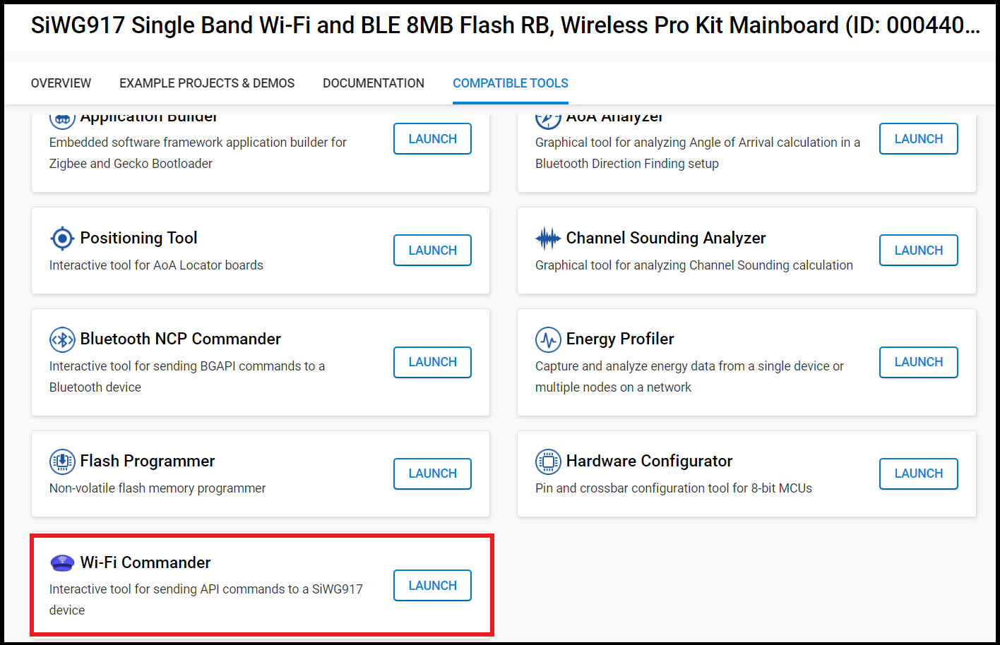
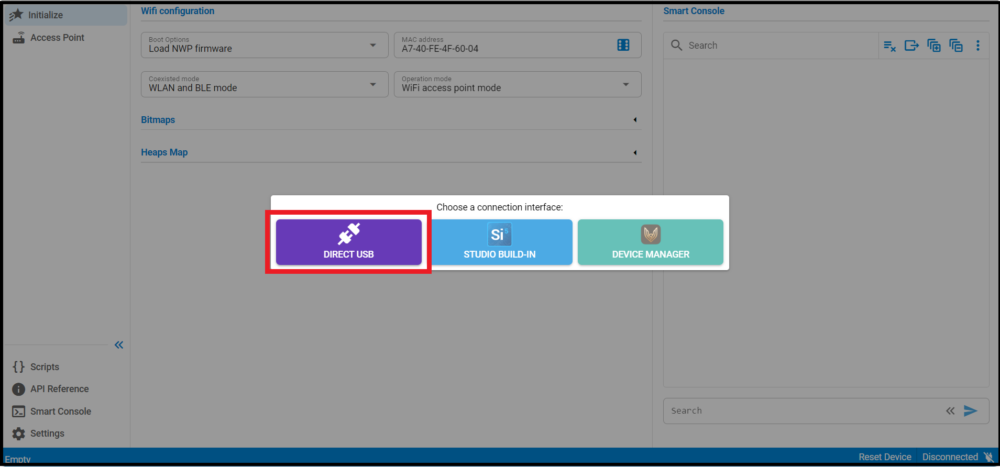
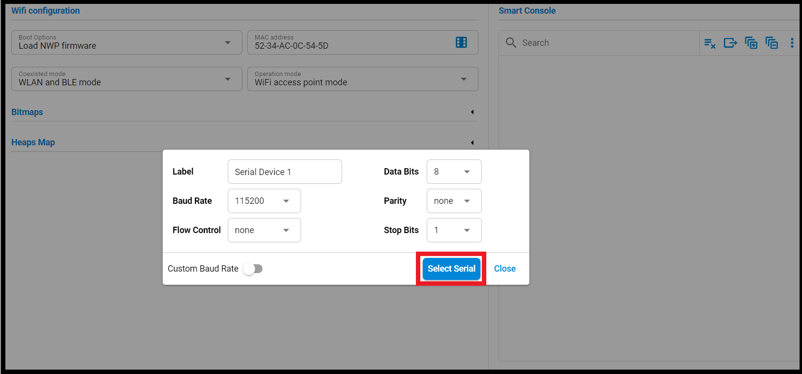
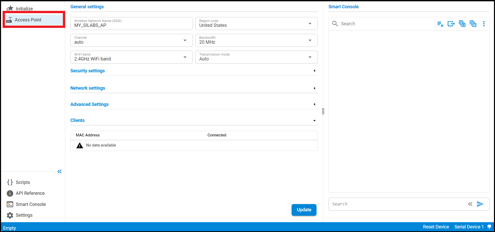
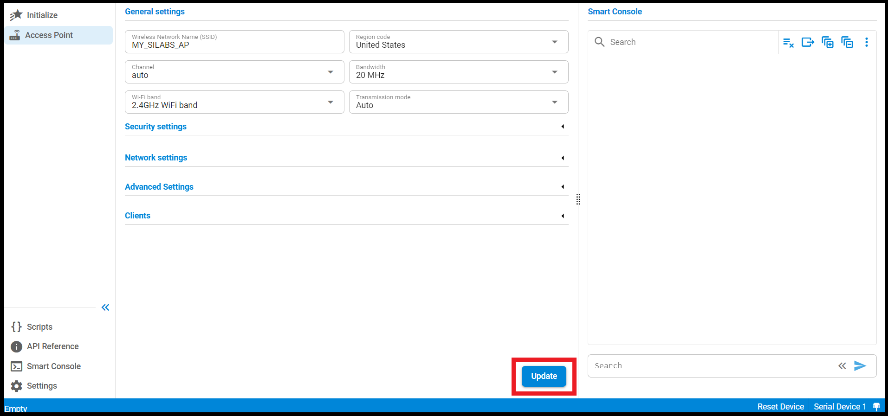
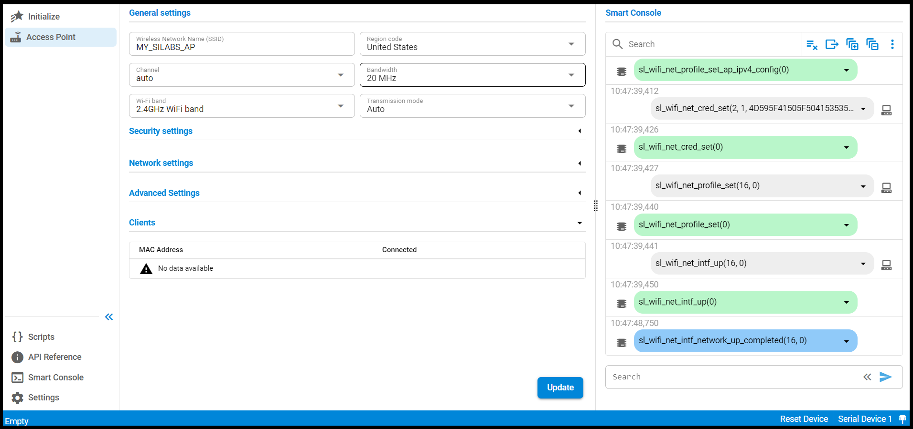
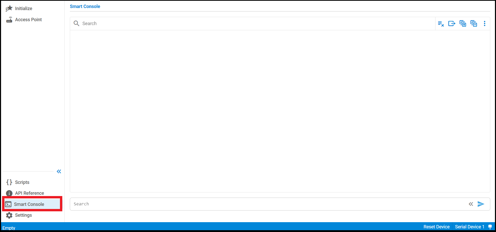
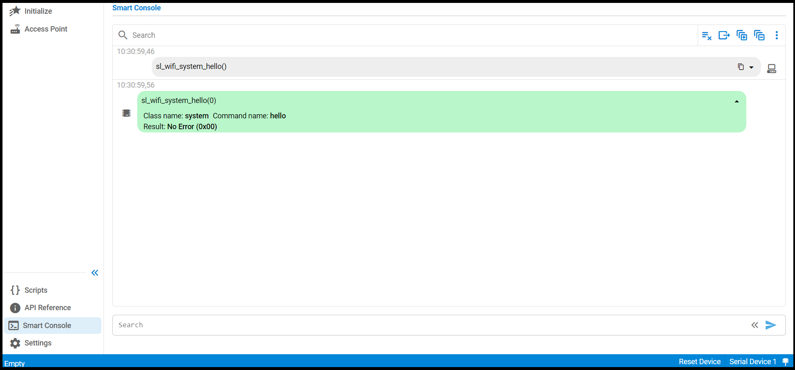

# Wi-Fi Commander

## Table of Contents

- [Purpose/Scope](#purposescope) 
- [Prerequisites/Setup Requirements](#prerequisitessetup-requirements)
  - [Hardware Requirements](#hardware-requirements)
  - [Software Requirements](#software-requirements)
  - [Setup Diagram](#setup-diagram)
- [Getting Started](#getting-started)
- [Application Build Environment](#application-build-environment)
- [Test the Application](#test-the-application)

## Purpose/Scope

The Wi-Fi Commander application is a command-line interface application designed to showcase various functionalities and capabilities of SiWx91x in different scenarios and configuration modes. It serves as a quick reference guide and a hands-on demonstration of SiWx91x core features for developers and users.

## Prerequisites/Setup Requirements

- Before running the application, the user will need the following things to setup.

### Hardware Requirements

- A Windows PC.

- **SoC Mode**:
  - Standalone
    - BRD4002A Wireless pro kit mainboard [SI-MB4002A]
    - Radio Boards 
  	  - BRD4338A [SiWx917-RB4338A]
  - Kits
  	- SiWx917 Pro Kit [Si917-PK6031A](https://www.silabs.com/development-tools/wireless/wi-fi/siwx917-pro-kit?tab=overview)  	

### Software Requirements

- Simplicity Studio
- Wi-Fi commander tool

**Note:** The user can use the Wi-Fi Commander tool to send commands and receive the corresponding responses and events.

### Setup Diagram

## Getting Started

In the NCP (Network Co-Processor) context, the application operates on a PC, referred to as the NCP Host, while the Wi-Fi stack runs on SiWx91x chipset in SoC Mode, known as the NCP Target.

The communication between the NCP Host and Target occurs via a serial interface (UART), which can be tunneled through USB if you're using a development kit. This communication is defined by Silicon Labs' proprietary protocol called xAPI.

Refer to the instructions here:

- Install Studio and WiSeConnect 3 extension
- Connect your device to the computer
- Upgrade your connectivity firmware
- Create a Studio project
- Open the Wi-Fi commander tool

## Application Build Environment

- The application uses the default Access Point (AP) configurations provided as below:

  - Default SSID of the WiSeConnect soft AP that will be "MY_AP_SSID".

  - Default secret key of the WiSeConnect soft AP that will be "MY_AP_PASSPHRASE".

> Note
> If you want to modify the above settings, you can also do by updating the configuration using the Wi-Fi Commander tool.

## Test the application

Refer to the instructions here

- Run the application in Studio.
- After the application has been successfully flashed, Wi-Fi commander tool would recieve `sl_wifi_evt_system_boot` event inditicating module is ready and tool can now send commands and receive the corresponding responses and events.

## Evaluating with Wi-Fi Commander

1. Connect the board to a PC via USB and start NCP Commander from Simplicity Studio.

   

2. Select the interface that you will use to establish a connection.

   

3. Select the serial port from the list and click on **Connect**.

   

4. Click on the Access Point tab to set the default configuration, test the functionality, and view the corresponding responses and events.

   

   

5. The expected outcome for the access point functionality by using default configuration.

   

6. Click on the Smart Console tab, where you can enter commands and receive the corresponding responses and events.

   

### Below are the examples of the commands on how to enter those commands in the Wi-Fi Commander and get the responses

- **hello Command:-** 

 ****
