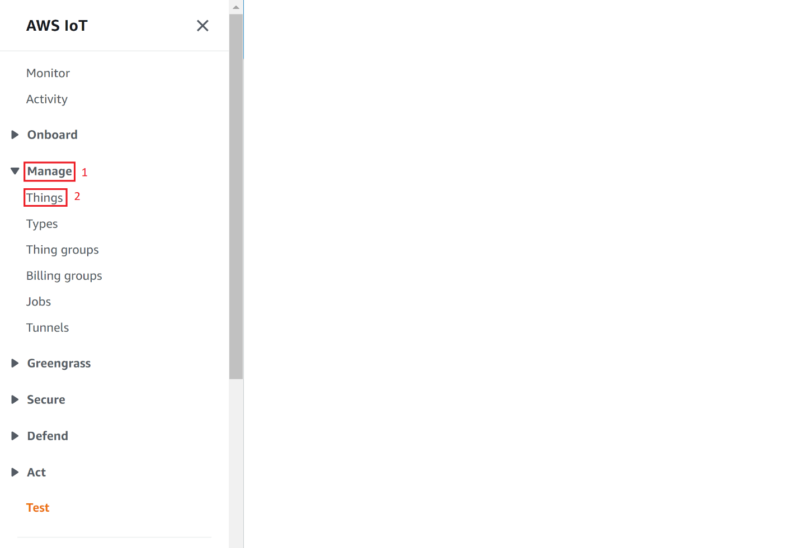

# AWS Device Shadow

## 1 Purpose/Scope

This application demonstrates how to securely connect a Silicon Labs Si91x Wi-Fi device to AWS IoT Core to send and receive data.

To successfully use this application, developer should be familiar with the operation of [AWS IoT Core](https://docs.aws.amazon.com/iot/latest/developerguide/what-is-aws-iot.html) and the [AWS IoT Device Shadow Service](https://docs.aws.amazon.com/iot/latest/developerguide/iot-device-shadows.html). If you are new to AWS IoT Core, we recommend running through the [AWS IoT Core Tutorial](https://docs.aws.amazon.com/iot/latest/developerguide/iot-tutorials.html) before proceeding.
In the following text, 'AWS IoT Core' is referred to as 'AWS' for brevity.

AWS refer 'Device Shadow' as a persistent, virtual representation of a device that can be accessed even if the physical device is offline. The device state is captured in its 'shadow' and is represented as a JSON document. The physical device can send commands using the MQTT protocol to get, update and delete the state of the shadow as well as receive notifications via MQTT about changes in the state of the shadow.

The AWS IoT Device Shadow application publishes temperature and window open/close status on the topic `$aws/things/thingname/shadow/update`.
The room temperature and the window open/close status is available on the AWS cloud.

Additionally, the application subscribes to the shadow update topics:

```sh
  $aws/things/thingName/shadow/name/shadowName/update/accepted
  $aws/things/thingName/shadow/name/shadowName/update/rejected
  $aws/things/thingName/shadow/name/shadowName/update/delta
```

## Overview of AWS SDK

AWS IoT Core is a cloud platform which connects devices across AWS cloud services. AWS IoT provides a interface which allows the devices to communicate securely and reliably in bi-directional ways to the AWS touch-points, even when the devices are offline.

The AWS IoT Device SDK allow applications to securely connect to the AWS IoT platform.


## 2 Prerequisites/Setup Requirements

### 2.1 Hardware Requirements

- Windows PC
- Wi-Fi Access point with a connection to the internet
- **SoC Mode**:
  - Silicon Labs [BRD4325A, BRD4325B, BRD4325C, BRD4325G, BRD4338A](https://www.silabs.com/)
- **NCP Mode**:
  - Silicon Labs [BRD4180B](https://www.silabs.com/)
  - Host MCU Eval Kit. This example has been tested with:
    - Silicon Labs [WSTK + EFR32MG21](https://www.silabs.com/development-tools/wireless/efr32xg21-bluetooth-starter-kit)

### 2.2 Software Requirements

- Simplicity Studio IDE

  - Download the latest [Simplicity Studio IDE](https://www.silabs.com/developers/simplicity-studio)
  - Follow the [Simplicity Studio user guide](https://docs.silabs.com/simplicity-studio-5-users-guide/1.1.0/ss-5-users-guide-getting-started/install-ss-5-and-software#install-ssv5) to install Simplicity Studio IDE

### 2.3 Setup Diagram

#### SoC Mode


#### NCP Mode


Follow the [Getting Started with Wiseconnect3 SDK](https://docs.silabs.com/wiseconnect/latest/wiseconnect-getting-started/) guide to set up the hardware connections and Simplicity Studio IDE.

**NOTE**:

- The Host MCU platform (EFR32MG21) and the SiWx91x interact with each other through the SPI interface.

## 3 Project Environment

- Ensure the SiWx91x loaded with the latest firmware following the [Upgrade Si91x firmware](https://docs.silabs.com/wiseconnect/latest/wiseconnect-getting-started/getting-started-with-soc-mode#upgrade-si-wx91x-connectivity-firmware)

- Ensure the latest Gecko SDK along with the extension WiSeConnect3 is added to Simplicity Studio.

### 3.1 Creating the project

#### 3.1.1 SoC mode

- Ensure the SiWx91x set up is connected to your PC.

- In the Simplicity Studio IDE, the SiWx91x SoC board will be detected under **Debug Adapters** pane as shown below.

  ****
  
#### 3.1.2 NCP mode

- Ensure the EFx32 and SiWx91x set up is connected to your PC.

- In the Simplicity Studio IDE, the EFR32 board will be detected under **Debug Adapters** pane as shown below.

  ****
  
### 3.2 Importing the project

- Studio should detect your board. Your board will be shown here. Click on the board detected and go to **EXAMPLE PROJECTS & DEMOS** section 

#### SOC Mode

- Select **Wi-Fi - AWS Device Shadow (SOC)** test application

  ****

- Click 'Create'. The "New Project Wizard" window appears. Click 'Finish'

  ****

#### NCP Mode

- Select **Wi-Fi - AWS Device Shadow (NCP)** test application

  ****

- Click 'Create'. The "New Project Wizard" window appears. Click 'Finish'

  ****

### 3.3 Set up for application prints

#### 3.3.1 Teraterm set up - for BRD4325A, BRD4325B, BRD4325C, BRD4325G

You can use either of the below USB to UART converters for application prints.

1. Set up using USB to UART converter board.

- Connect Tx (Pin-6) to P27 on WSTK
- Connect GND (Pin 8 or 10) to GND on WSTK

****

2. Set up using USB to UART converter cable

- Connect RX (Pin 5) of TTL convertor to P27 on WSTK
- Connect GND (Pin1) of TTL convertor to GND on WSTK

****

3. Open the Teraterm tool.

   - For SoC mode, choose the serial port to which USB to UART converter is connected and click on **OK**.

     ****

**Note:** For Other 917 SoC boards please refer section #3.3.2

#### 3.3.2 **Teraterm set up - for NCP and SoC modes**

1. Open the Teraterm tool.

- choose the J-Link port and click on **OK**.     

	****

2. Navigate to the Setup → Serial port and update the baud rate to **115200** and click on **OK**.

	****

	****

## 4 Application Build Environment

The application can be configured to suit your requirements and development environment.

### 4.1.1 In the Project explorer pane, expand the **config** folder and open the **sl_net_default_values.h** file. Configure the following parameters to enable your Silicon Labs Wi-Fi device to connect to your Wi-Fi network

- **STA instance related parameters**

	- DEFAULT_WIFI_CLIENT_PROFILE_SSID refers to the name with which Wi-Fi network that shall be advertised and Si91X module is connected to it.

  	```c
  	#define DEFAULT_WIFI_CLIENT_PROFILE_SSID               "YOUR_AP_SSID"      
  	```

	- DEFAULT_WIFI_CLIENT_CREDENTIAL refers to the secret key if the Access point is configured in WPA-PSK/WPA2-PSK security modes.

  	```c
  	#define DEFAULT_WIFI_CLIENT_CREDENTIAL                 "YOUR_AP_PASSPHRASE" 
  	```
  
	- DEFAULT_WIFI_CLIENT_SECURITY_TYPE refers to the security type if the Access point is configured in WPA/WPA2 or mixed security modes.

  	```c
  	#define DEFAULT_WIFI_CLIENT_SECURITY_TYPE              SL_WIFI_WPA2 
  	```

- Other STA instance configurations can be modified if required in `default_wifi_client_profile` configuration structure.

### 4.1.2 Configure the application

- Below parameters in **aws_iot_config.h** can be configured based on the AWS domain name, port, client ID and thing name.

```c
#define AWS_IOT_MQTT_HOST     "a2m21kovu9tcsh-ats.iot.us-east-2.amazonaws.com" ///< Customer specific MQTT HOST. The same will be used for Thing Shadow
#define AWS_IOT_MQTT_PORT       8883                ///< default port for MQTT/S
#define AWS_IOT_MQTT_CLIENT_ID "silicon_labs_thing" ///< MQTT client ID should be unique for every device
#define AWS_IOT_MY_THING_NAME  "silicon_labs_thing" ///< Thing Name of the Shadow this device is associated with
```

### 4.2 Build the application

- SoC mode:


- NCP mode:


### 4.3 Run and Test the application

- Once the build was successful, right click on project and click on Debug As->Silicon Labs ARM Program as shown in below image.

- SoC mode:

  

- NCP mode:

  

### 4.4 Application Output

- After successful execution, the device updates are written to the AWS cloud and they can be observed in the AWS thing shadow.


### 4.5 Additional Information

- AWS_IOT_MQTT_HOST parameter can be found as follows:


#### 4.5.1 Setting up Security Certificates

- To authenticate and securely connect with AWS, your Wi-Fi device requires a unique x.509 security certificate and private key, as well as a CA certificate which is used to verify the AWS server. Security credentials need to be converted into a C-array rather than [PEM format](https://en.wikipedia.org/wiki/Privacy-Enhanced_Mail) provided by AWS; they also need to be added to your project.

- The WiSeConnect3 SDK provides a conversion script (written in Python 3) to make the conversion straightforward. The script is provided in the SDK 'resources' directory and is called [certificate_to_array.py](https://github.com/SiliconLabs/wiseconnect-wifi-bt-sdk/tree/master/resources/certificates/).

- To convert the device certificate and private key to C arrays, open a system command prompt and use the script as indicated in the following examples.

```sh
$> python3 certificate_to_array.py <input filename> <output arrayname>

For example:
$> python3 certificate_to_array.py d8f3a44d3f.cert.pem    aws_client_certificate
$> python3 certificate_to_array.py d8f3a44d3f.private.key aws_client_private_key
```

- After running the script on the certificate and private key, two new files are created.

```sh
aws_client_certificate.pem.crt.h
aws_client_private_key.pem.key.h
```

- Modify the certificate header file names as per the generated file names after running the certificate_to_array.py script in the 'app.c' file.

- Before proceeding, copy both of the new files to the WiSeConnect3 directory: `SimplicityStudio\SDKs\gecko_sdk\extension\wifi-sdk\resources\certificates`  
  Go ahead and overwrite any existing files with the same name in that directory, the originals are not needed.

- The Root CA certificate used by your Wi-Fi device to verify the AWS server is already included in the WiSeConnect3 SDK; no additional setup is required.
  For reference, Amazon uses [Starfield Technologies](https://www.starfieldtech.com/) to secure the AWS website, the WiSeConnect3 SDK includes the [Starfield CA Certificate](https://github.com/SiliconLabs/wiseconnect-wifi-bt-sdk/tree/master/resources/certificates/aws_starfield_ca.pem.h).

> NOTE :
> For AWS connectivity, StarField Root CA Class 2 certificate has the highest authority being at the top of the signing hierarchy.
>
> The StarField Root CA Class 2 certificate is an expected/required certificate which usually comes pre-installed in the operating systems and plays a key part in certificate chain verification when a device is performing TLS authentication with the IoT endpoint.
>
> On SiWx91x device, we do not maintain the root CA trust repository due to memory constraints, so it is mandatory to load Starfield Root CA Class 2 certificate for successful mutual authentication to the AWS server.
>
> The certificate chain sent by AWS server is as below:
> id-at-commonName=Amazon,id-at-organizationalUnitName=Server CA 1B,id-at-organizationName=Amazon,id-at-countryName=US
> id-at-commonName=Amazon Root CA 1,id-at-organizationName=Amazon,id-at-countryName=US
> id-at-commonName=Starfield Services Root Certificate Authority ,id-at-organizationName=Starfield Technologies, Inc.,id-at-localityName=Scottsdale,id-at- stateOrProvinceName=Arizona,id-at-countryName=US)
>
> On SiWx91x to authenticate the AWS server, firstly Root CA is validated (validate the Root CA received with the Root CA loaded on the device). Once the Root CA validation is successful, other certificates sent from the AWS server are validated.
> SiWx91x doesn't authenticate to AWS server if intermediate CA certificates are loaded instead of Starfield Root CA Class 2 certificate and would result in a Handshake error.
> StarField Root CA Class 2 certificate is at <https://certs.secureserver.net/repository/sf-class2-root.crt>
>
> Reference links :
> <https://aws.amazon.com/blogs/security/how-to-prepare-for-aws-move-to-its-own-certificate-authority/>

#### 4.5.2 Create an AWS Thing

Create a thing in the AWS IoT registry to represent your IoT Device.

- In the [AWS IoT console](https://console.aws.amazon.com/iot/home), in the navigation pane, under Manage, choose All devices, and then choose Things.


- If a **You don't have any things yet** dialog box is displayed, choose **Register a thing**. Otherwise, choose **Create**.
- Click on **Create things**.


- On the **Create things** page, choose **Create a single thing** and click next.


- On the **Specify thing properties** page, enter a name for your IoT thing (for example, **Test_IoT**), and choose **Unnamed shadow (classic)** in the Device Shadow section, then choose **Next**. You can't change the name of a thing after you create it. To change a thing's name, you must create a new thing, give it the new name, and then delete the old thing.

  

- During **Configure device certificate** step, choose **Auto-generate a new certificate (recommended)** option and click next.

  

- To attach an existing policy choose the policy and click on create thing, if policy is not yet created Choose Create policy and fill the fields as mentioned in the following images.

- Choosing an existing policy


- Creating a policy - step 1


- Creating a policy - step 2 (filling the fields)
  Give the **Name** to your Policy, Fill **Action** and **Resource ARN** as shown in below image, Click on **Allow** under **Effect** and click **Create**
  

- Choose the **Download** links to download the device certificate, private key,public key, and root CA certificate. Root CA certificate is already present in SDK (aws_starfield_ca.pem.h), and can be directly used.
  > **Warning:** This is the only instance you can download your device certificate and private key. Make sure to save them safely.


- Choose the created policy and click on **Create thing**

- The created thing should now be visible on the AWS console (Manage > All devices > Things)

#### 4.5.3 Steps to create a policy from AWS console

- Navigate to **AWS IoT console**
- Choose **Policies** under **Secure**



- Click on **Create**


- Give the **Name** to your Policy, Fill **Action** and **Resource ARN** as shown in below image, Click on **Allow** under **Effect** and click **Create**

 

### Note

For NCP mode, following defines have to enabled manually in preprocessor setting of example project

- For 917A0 expansion board, enable CHIP_917 = 1
- For 917B0 1.2 expansion board, enable CHIP_917 = 1, CHIP_917B0 = 1
- For 917B0 2.0 expansion board, enable CHIP_917 = 1, CHIP_917B0 = 1, SI917_RADIO_BOARD_V2 = 1 (This is enabled by default for all examples)
