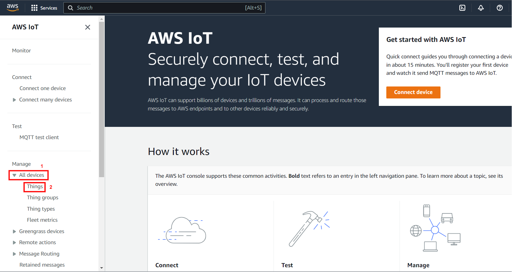

# Wi-Fi - AWS Device Shadow

## Table of Contents

- [Purpose/Scope](#purposescope)
- [Overview of AWS SDK](#overview-of-aws-sdk)
- [Prerequisites/Setup Requirements](#prerequisitessetup-requirements)
  - [Hardware Requirements](#hardware-requirements)
  - [Software Requirements](#software-requirements)
  - [Setup Diagram](#setup-diagram)
- [Getting Started](#getting-started)
- [Application Build Environment](#application-build-environment)
- [Test the Application](#test-the-application)
- [Additional Information](#additional-information)
  - [Setting up Security Certificates](#setting-up-security-certificates)
  - [Create an AWS Thing](#create-an-aws-thing)
  - [Steps to create a policy from AWS console](#steps-to-create-a-policy-from-aws-console)

## Purpose/Scope

This application demonstrates how to securely connect a Silicon Labs Si91x Wi-Fi device to AWS IoT Core to send and receive data.

To successfully use this application, developers should be familiar with the operation of [AWS IoT Core](https://docs.aws.amazon.com/iot/latest/developerguide/what-is-aws-iot.html) and the [AWS IoT Device Shadow Service](https://docs.aws.amazon.com/iot/latest/developerguide/iot-device-shadows.html). If you are new to AWS IoT Core, we recommend running through the [AWS IoT Core Tutorial](https://docs.aws.amazon.com/iot/latest/developerguide/iot-tutorials.html) before proceeding.
In the following text, 'AWS IoT Core' is referred to as 'AWS' for brevity.

AWS refers to 'Device Shadow' as a persistent, virtual representation of a device that can be accessed even if the physical device is offline. The device state is captured in its 'shadow' and is represented in a JSON format. The physical device can send commands using the MQTT protocol to get, update, and delete the state of the shadow as well as receive notifications via MQTT about changes in the state of the shadow.

The AWS IoT Device Shadow application publishes temperature and window open/close status on the topic `$aws/things/thingname/shadow/update`.
The room temperature and the window open/close status is available on the AWS cloud.

Additionally, the application subscribes to the shadow update topics:
```sh
$aws/things/thingName/shadow/name/shadowName/update/accepted
$aws/things/thingName/shadow/name/shadowName/update/rejected
$aws/things/thingName/shadow/name/shadowName/update/delta
```
## Prerequisites/Setup Requirements

### Hardware Requirements

- Windows PC
- Wi-Fi Access point with a connection to the internet
- **SoC Mode**:
  - Standalone
    - BRD4002A Wireless pro kit mainboard [SI-MB4002A]
    - Radio Boards 
      - BRD4338A [SiWx917-RB4338A]
      - BRD4342A [SiWx917-RB4342A]
      - BRD4343A [SiWx917-RB4343A]
  - Kits
  	- SiWx917 Pro Kit [Si917-PK6031A](https://www.silabs.com/development-tools/wireless/wi-fi/siwx917-pro-kit?tab=overview)
  	- SiWx917 Pro Kit [Si917-PK6032A]
    - SiWx917 AC1 Module Explorer Kit (BRD2708A)
  	
- **NCP Mode**:
  - Standalone
    - BRD4002A Wireless pro kit mainboard [SI-MB4002A]
    - EFR32xG24 Wireless 2.4 GHz +10 dBm Radio Board [xG24-RB4186C](https://www.silabs.com/development-tools/wireless/xg24-rb4186c-efr32xg24-wireless-gecko-radio-board?tab=overview)
    - NCP Expansion Kit with NCP Radio boards
      - (BRD4346A + BRD8045A) [SiWx917-EB4346A]
      - (BRD4357A + BRD8045A) [SiWx917-EB4357A]
  - Kits
  	- EFR32xG24 Pro Kit +10 dBm [xG24-PK6009A](https://www.silabs.com/development-tools/wireless/efr32xg24-pro-kit-10-dbm?tab=overview)
- STM32F411RE MCU
    - [STM32F411RE](https://www.st.com/en/microcontrollers-microprocessors/stm32f411re.html) MCU
    - NCP Expansion Kit with NCP Radio boards
      - (BRD4346A + BRD8045C)
      - (BRD4357A + BRD8045C)
- Interface and Host MCU Supported
    - SPI - EFR32 & STM32
    - UART - EFR32

### Software Requirements

- Simplicity Studio IDE (to be used with Silicon Labs MCU)
- Keil IDE (to be used with STM32F411RE MCU)
- Serial Terminal - [Docklight](https://docklight.de/)/[Tera Term](https://ttssh2.osdn.jp/index.html.en) (to be used with Keil IDE)

### Setup Diagram


## Getting Started

### Instructions for Simplicity Studio IDE and Silicon Labs devices (SoC and NCP Modes)
  Refer to the instructions [here](https://docs.silabs.com/wiseconnect/latest/wiseconnect-getting-started/) to:

  - Install Studio and WiSeConnect 3 extension
  - Connect your device to the computer
  - Upgrade your connectivity firmware
  - Create a Studio project

### Instructions for Keil IDE and STM32F411RE MCU (NCP Mode)
Refer to the instructions [here](https://docs.silabs.com/wiseconnect/latest/wiseconnect-getting-started/getting-started-with-ncp-mode-with-stm32) to:

  - Install the [Keil IDE](https://www.keil.com/).
  - Download [WiSeConnect 3 SDK](https://github.com/SiliconLabs/wiseconnect)
  - Update the device's connectivity firmware as mentioned [here](https://docs.silabs.com/wiseconnect/latest/wiseconnect-getting-started/getting-started-with-ncp-mode-with-stm32#upgrade-the-si-wx91x-connectivity-firmware).
  - Connect the SiWx91x NCP to STM32F411RE Nucleo Board following the steps below.
   - Connect the male Arduino compatible header on the carrier board to the female Arduino compatible header on the STM32F411RE Nucleo board.
   - Mount the NCP Radio board (BRD4346A/BRD4357A) onto the radio board socket available on the base board (BRD8045C).
   - After connecting all the boards, the setup should look like the image shown below:
    
   - Connect the setup to the computer.
  - Open the AWS DEVICE SHADOW µVision project - **aws_device_shadow.uvprojx** by navigating to **WiSeConnect 3 SDK → examples → featured → aws_device_shadow → keil_project**. 

## Application Build Environment

The application can be configured to suit user requirements and the development environment. Read through the following sections and make any changes needed.

### Configure sl_net_default_values.h

**File path for Simplicity Studio IDE:**
- In the Project Explorer pane, expand the **config** folder and open the **sl_net_default_values.h** file. 

**File path for Keil IDE:**
- In the Project pane, expand the **resources/defaults** folder and open the **sl_net_default_values.h** file. 

### STA instance related parameters

  - DEFAULT_WIFI_CLIENT_PROFILE_SSID refers to the name of the Wi-Fi network that shall be advertised and the Si91X module connected to it.

    ```c
    #define DEFAULT_WIFI_CLIENT_PROFILE_SSID               "YOUR_AP_SSID"      
    ```

  - DEFAULT_WIFI_CLIENT_CREDENTIAL refers to the secret key if the Access point is configured in WPA-PSK/WPA2-PSK security modes.

    ```c
    #define DEFAULT_WIFI_CLIENT_CREDENTIAL                 "YOUR_AP_PASSPHRASE" 
    ```
  
  - DEFAULT_WIFI_CLIENT_SECURITY_TYPE refers to the security type if the Access point is configured in WPA/WPA2 or mixed security modes.

    ```c
    #define DEFAULT_WIFI_CLIENT_SECURITY_TYPE              SL_WIFI_WPA2 
    ```

- Other STA instance configurations can be modified if required in `default_wifi_client_profile` configuration structure.

### Configure the following parameters in the `aws_iot_config.h` file present at `<project>/config`

> - Before configuring the parameters in `aws_iot_config.h`, register the SiWx917 device in the AWS IoT registry by following the steps described in [Create an AWS Thing](#create-an-aws-thing) section.

> - Configure AWS_IOT_MQTT_HOST macro with the device data endpoint to connect to AWS. To get the device data endpoint in the AWS IoT Console, navigate to Settings, copy the Endpoint, and define the AWS_IOT_MQTT_HOST macro with this value.

  

  ```c
  #define AWS_IOT_MQTT_HOST     "a2m21kovu9tcsh-ats.iot.us-east-2.amazonaws.com" ///< Customer specific MQTT HOST. The same will be used for Thing Shadow
  #define AWS_IOT_MQTT_PORT       8883                ///< Default port for MQTT/S
  #define AWS_IOT_MQTT_CLIENT_ID "silicon_labs_thing" ///< MQTT client ID should be unique for every device
  #define AWS_IOT_MY_THING_NAME  "silicon_labs_thing" ///< Thing Name of the Shadow this device is associated with
  ```

> - To authenticate and securely connect with AWS, the SiWx917 device requires a unique x.509 security certificate and private key, as well as a CA certificate. At this point, you must have a device certificate, private key, and CA certificate, which are downloaded during the creation/registration of AWS Thing.

> - By default, the certificate and private key that are downloaded from the AWS are in [.pem format](https://en.wikipedia.org/wiki/Privacy-Enhanced_Mail). To load the certificate and private key to the SiWx917, the certificate and private key should be converted into a C-array. For converting the certificates and private key into C-array, refer to [Setting up Security Certificates](#setting-up-security-certificates).

> - By default, the WiSeConnect 3 SDK contains the Starfield Root CA Certificate in C-array format. 

> **Note** :
 The included Cloud connectivity certificates are for reference only. If using default certificates in the release, the cloud connection will not work. Replace the default certificates with valid certificates while connecting to the appropriate Cloud/OpenSSL Server.

## Test the Application

### Instructions for Simplicity Studio IDE and Silicon Labs Devices (SoC and NCP Modes)

Refer to the instructions [here](https://docs.silabs.com/wiseconnect/latest/wiseconnect-getting-started/) to:

- Build the application.
- Flash, run, and debug the application.

### Instructions for Keil IDE and STM32F411RE MCU

- Build the application.
- Set the Docklight up by connecting STM32's Serial COM port. This enables you to view the application prints.
- Flash, run, and debug the application.

After successful execution, the device updates are written to the AWS cloud and they can be observed in the AWS thing shadow.


## Additional Information

### Setting up Security Certificates

- The WiSeConnect 3 SDK provides a conversion script (written in Python 3) to make the conversion straightforward. The script, [certificate_to_array.py](https://github.com/SiliconLabs/wiseconnect/tree/master/resources/certificates/),
is provided in the SDK at `<SDK>/resources/scripts` directory.

- Copy the downloaded device certificate, private key from AWS, and also the certificate_to_array.py to the `<SDK>/resources/certificates`.

- To convert the device certificate and private key to C arrays, open a system command prompt in the same path and give the following commands.

  ```sh
  $> python3 certificate_to_array.py <input filename> <output arrayname>

  For example:
  $> python3 certificate_to_array.py d8f3a44d3f.pem.crt aws_device_certificate
  $> python3 certificate_to_array.py d8f3a44d3f.pem.key aws_private_key
  ```

- After running the above commands, two new files shall be created as below:

  ```sh
  aws_device_certificate.crt.h
  aws_private_key.key.h
  ```


- After converting the certificate and private key to C - array, it is essential to include the device certificate: aws_device_certificate.crt.h and private key: aws_private_key.key.h in the app.c.

- Ensure to load the certificate and private key to SiWx917 using [sl_net_set_credential()](https://docs.silabs.com/wiseconnect/latest/wiseconnect-api-reference-guide-nwk-mgmt/net-credential-functions#sl-net-set-credential) API.

- Ensure to update the certificate names in the **IoT_Client_Init_Params** structure before calling the **aws_iot_mqtt_init()** API.

- The Starfield Root CA certificate used by your Wi-Fi device to verify the AWS server is already included in the WiSeConnect 3 SDK at `<SDK>/resources/certificates`; no additional setup is required.
    
> **NOTE :**
> Amazon uses [Starfield Technologies](https://www.starfieldtech.com/) to secure the AWS website. The WiSeConnect SDK includes the [Starfield CA Certificate](https://github.com/SiliconLabs/wiseconnect/tree/master/resources/certificates/aws_starfield_ca.pem.h).
>
> AWS has announced that there will be changes in their root CA chain. More details can be found in the reference link: (https://aws.amazon.com/blogs/security/acm-will-no-longer-cross-sign-certificates-with-starfield-class-2-starting-august-2024/)
>
> We are providing both root CAs (Starfield class-2 and Starfield G2) in aws_starfield_ca.pem.h, which is located in the WiSeConnect directory: `<SDK>/resources/certificates/aws_starfield_ca.pem.h`
>
> For AWS connectivity, StarField Root CA certificate has the highest authority being at the top of the signing hierarchy.
>
> The StarField Root CA certificate is an expected/required certificate which usually comes pre-installed in the operating systems and plays a key part in certificate chain verification when a device is performing TLS authentication with the IoT endpoint.
>
> On the SiWx91x device, we do not maintain the root CA trust repository due to memory constraints, so it is mandatory to load the Starfield Root CA certificate for successful mutual authentication to the AWS server.
>
> The certificate chain sent by AWS server is as below:
> Starfield Class 2 :
> id-at-commonName=Amazon,RSA 2048 M01,id-at-organizationName=Amazon,id-at-countryName=US
> id-at-commonName=Amazon Root CA 1,id-at-organizationName=Amazon,id-at-countryName=US
> id-at-commonName=Starfield Services Root Certificate Authority - G2,id-at-organizationName=Starfield Technologies, Inc.,id-at-localityName=Scottsdale,id-at- stateOrProvinceName=Arizona,id-at-countryName=US
>id-at-organizationalUnitName=Starfield Class 2 Certification Authority,id-at-organizationName=Starfield Technologies, Inc.,id-at-countryName=US
>
> Starfield G2:
> id-at-commonName=Amazon RSA 2048 M01,id-at-organizationName=Amazon,id-at-countryName=US
> id-at-commonName=Amazon Root CA 1,id-at-organizationName=Amazon,id-at-countryName=US
> id-at-commonName=Starfield Services Root Certificate Authority - G2,id-at-organizationName=Starfield Technologies, Inc.,id-at-localityName=Scottsdale,id-at-stateOrProvinceName=Arizona,id-at-countryName=US
>
> To authenticate the AWS server on SiWx91x, first validate the Root CA (validate the Root CA received with the Root CA loaded on the device). Once the Root CA validation is successful, other certificates sent from the AWS server are validated.
> Alternate certification chains support is added, which means that only the peer certificate must validate to a trusted certificate, as opposed to requiring full chain validation. This allows loading intermediate root CAs as trusted.
> The default CA certificate is the Starfield Combined CA certificate. To use the Intermediate Amazon Root CA 1 certificate, define the `SL_SI91X_AWS_IOT_ROOT_CA1` macro in the application.
      
### Create an AWS Thing

 **Thing Note**: By default, we are naming ThingName as: silicon_labs_thing. If you want your own thing name, you can follow the procedure below.

Create a thing in the AWS IoT registry to represent your IoT device.

- In the [AWS IoT console](https://console.aws.amazon.com/iot/home), in the navigation pane, under Manage, choose All devices, and then choose Things.

  

- If **No things** message is displayed, click on **Create things**.

  

- On the **Create things** page, choose **Create a single thing** and click next.

  

- On the **Specify thing properties** page, enter a name for your IoT thing (for example, **Test_IoT**), and choose **Unnamed shadow (classic)** in the Device Shadow section, then choose **Next**. You can't change the name of a thing after you create it. To change a thing's name, you must create a new thing, give it the new name, and then delete the old thing.

  

- During the **Configure device certificate** step, choose **Auto-generate a new certificate (recommended)** option and click next.

  

- Attach the policy to the thing created.

  - If you have any existing policy, attach it and click on create thing.

  

- If the policy is not yet created, follow the below steps.  
  - Choose **Create policy** and fill in the fields as per your requirements.
  

  - Give the **Name** to your Policy. Fill in the **Action** and **Resource ARN** fields as shown in the image below. Click on **Allow** under **Effect** and click **Create**.
  

  - Choose the created policy and click on **Create thing**.

- Choose the **Download** links to download the device certificate and private key. Note that Root CA certificate is already present in SDK (aws_starfield_ca.pem.h), and can be directly used.
  > **Warning:** This is the only instance you can download your device certificate and private key. Make sure to save them securely.

  

- Click **Done**.

- The created thing should now be visible on the AWS console (Manage > All devices > Things).
