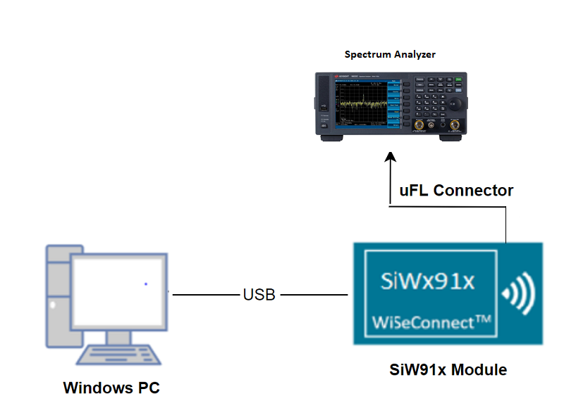
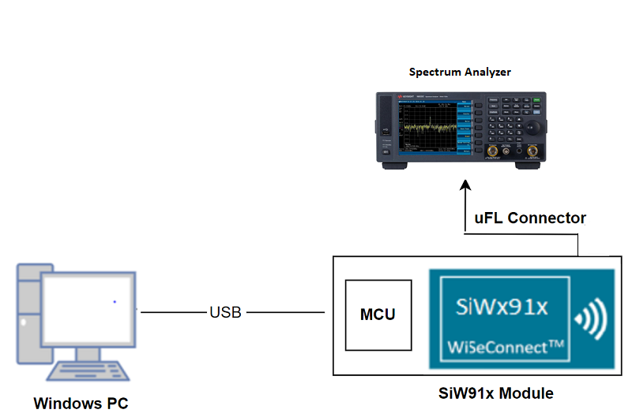
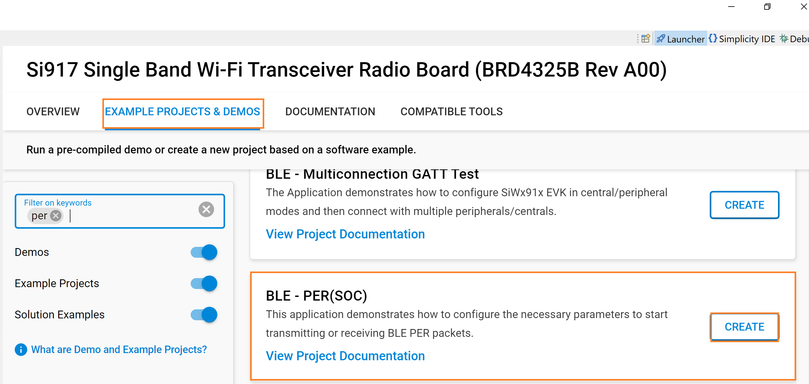
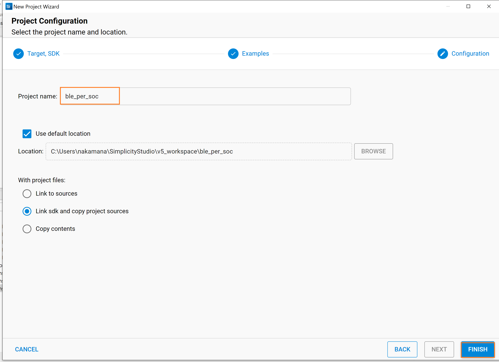
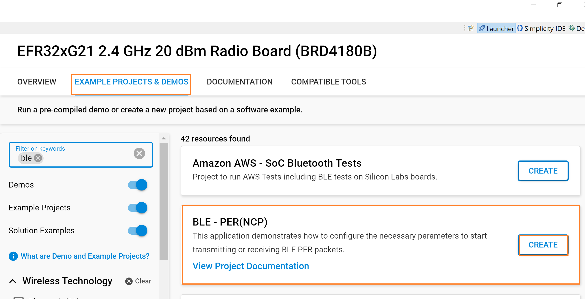
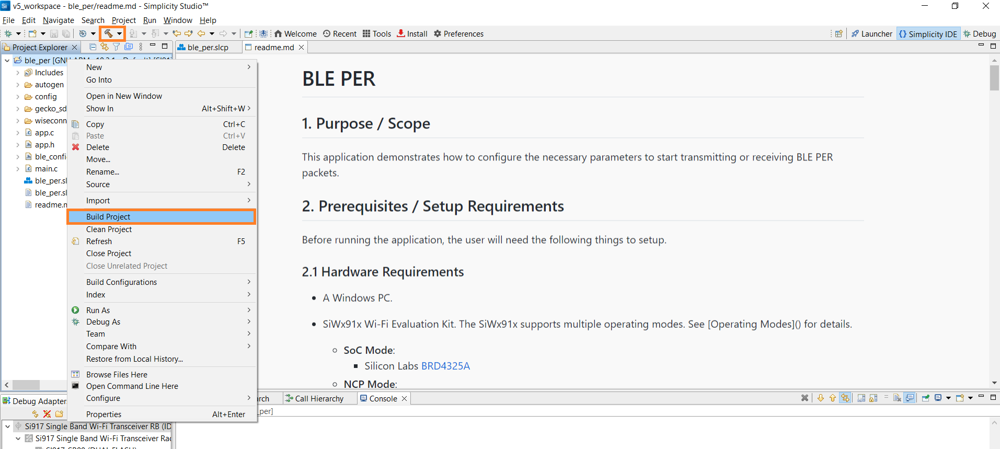
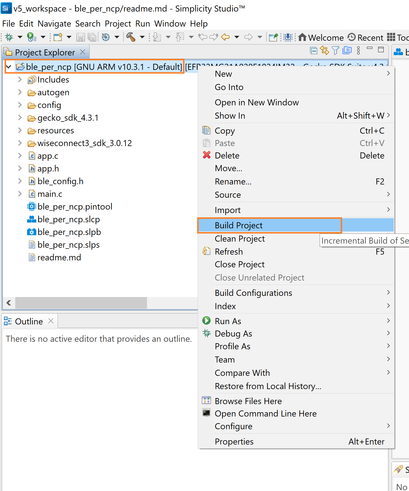
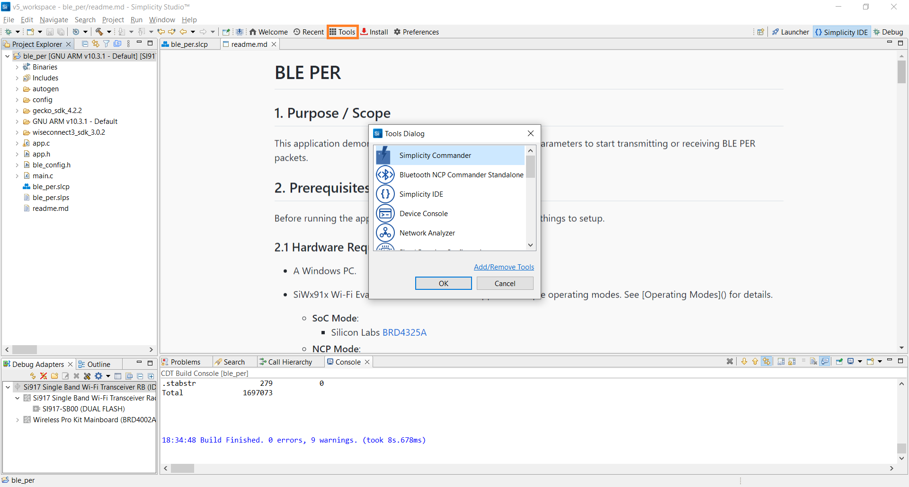
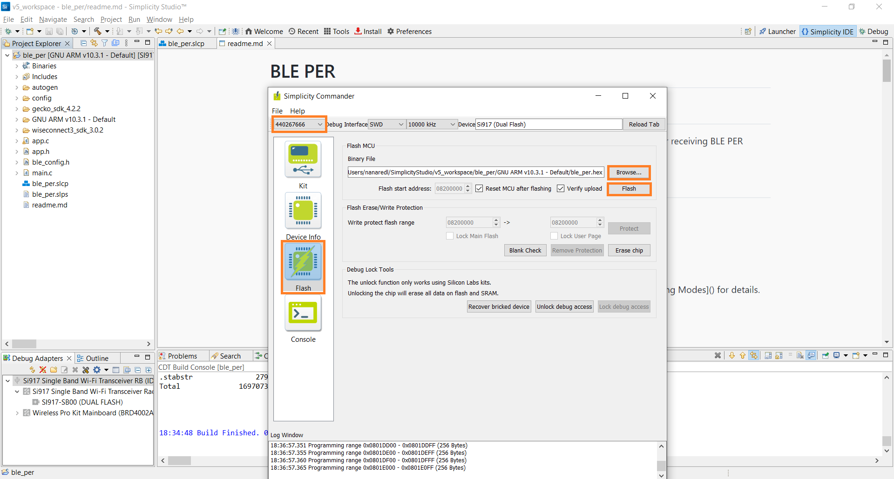

# BLE PER

## 1. Purpose / Scope

This application demonstrates how to configure the necessary parameters to start transmitting or receiving BLE PER packets.

## 2. Prerequisites / Setup Requirements

Before running the application, the user will need the following things to setup.

### 2.1 Hardware Requirements

- A Windows PC.
- SiWx91x Wi-Fi Evaluation Kit. The SiWx91x supports multiple operating modes. See [Operating Modes](https://www.silabs.com) for details.
  - **SoC Mode**:
    - Silicon Labs [BRD4325A, BRD4325B, BRD4325C, BRD4325G, BRD4338A](https://www.silabs.com/)
  - **NCP Mode**:
    - Silicon Labs [BRD4180B](https://www.silabs.com/)
    - Host MCU Eval Kit. This example has been tested with:
      - Silicon Labs [WSTK + EFR32MG21](https://www.silabs.com/development-tools/wireless/efr32xg21-bluetooth-starter-kit)

- Spectrum Analyzer and/or Power Analyzer

### 2.2 Software Requirements

- Embedded Development Environment
  - For Silicon Labs EFx32, use the latest version of [Simplicity Studio](https://www.silabs.com/developers/simplicity-studio)

### 2.3 Setup Diagram

**SoC Mode :**


  
**NCP Mode :**



Follow the [Getting Started with Wiseconnect3 SDK](https://docs.silabs.com/wiseconnect/latest/wiseconnect-getting-started/) guide to set up the hardware connections and Simplicity Studio IDE.

## 3. Project Environment

1. Ensure the SiWx91x loaded with the latest firmware following the [Upgrade Si91x firmware](https://docs.silabs.com/wiseconnect/latest/wiseconnect-getting-started/getting-started-with-soc-mode#upgrade-si-wx91x-connectivity-firmware)

### 3.1 Create the Project

#### 3.1.1 SoC Mode

1. Ensure the SiWx91x setup is connected to your PC.

- In the Simplicity Studio IDE, the SiWx91x SoC board will be detected under **Debug Adapters** pane as shown below.

   

- Studio should detect your board. Your board will be shown here. Click on the board detected and go to **EXAMPLE PROJECTS & DEMOS** section.  

- Filter for Bluetooth examples from the Gecko SDK added. For this, check the *Bluetooth* checkbox under **Wireless Technology** and select *BLE - PER* application.

   

- Click 'Create'. The "New Project Wizard" window appears. Click 'Finish'

  

#### 3.1.2 NCP Mode

1. Ensure the EFx32 and SiWx91x setup is connected to your PC.

- In the Simplicity Studio IDE, the EFR32 board will be detected under **Debug Adapters** pane as shown below.

   

- Ensure the latest Gecko SDK along with the WiSeConnect 3 extension is added to Simplicity Studio.

- Go to the 'EXAMPLE PROJECT & DEMOS' tab and select *BLE - PER* application.

  

- Click 'Create'. The "New Project Wizard" window appears. Click 'Finish'.

  

### 3.2 Setup for Application Prints

#### 3.2.1 SoC Mode

  You can use either of the below USB to UART converters for application prints.

1. Setup using USB to UART converter board.

   - Connect Tx (Pin-6) to P27 on WSTK
   - Connect GND (Pin 8 or 10) to GND on WSTK

****

2. Setup using USB to UART converter cable

   - Connect RX (Pin 5) of TTL convertor to P27 on WSTK
   - Connect GND (Pin1) of TTL convertor to GND on WSTK

****

**Tera Term setup - for NCP and SoC modes**

1. Open the Tera Term tool.

   - For SoC mode, choose the serial port to which USB to UART converter is connected and click on **OK**.

   ****

   - For NCP mode, choose the J-Link port and click on **OK**.

   ****

2. Navigate to the Setup → Serial port and update the baud rate to **115200** and click on **OK**.

  ****

  ****

## 4. Application Build Environment

### 4.1 Application Configuration Parameters

The application can be configured to suit your requirements and development environment. Read through the following sections and make any changes needed.

**4.1** Open `app.c` file

Update or modify following macros

- `RSI_CONFIG_PER_MODE` refers configuration mode BT PER TX or RX

```c
  #define RSI_CONFIG_PER_MODE RSI_BLE_PER_TRANSMIT_MODE
                                 OR
  #define RSI_CONFIG_PER_MODE RSI_BLE_PER_RECEIVE_MODE```
- `CMD_ID` refers the command id for transmit or receive
```c
  #define BLE_TRANSMIT_CMD_ID 0x13
  #define BLE_RECEIVE_CMD_ID  0x14```
- `PAYLOAD_TYPE` refers type of payload to be transmitted
```c
  #define DATA_PRBS9                 0x00
  #define DATA_FOUR_ONES_FOUR_ZEROES 0x01
  #define DATA_ALT_ONES_AND_ZEROES 0x02
  #define DATA_PRSB15                 0x03
  #define DATA_ALL_ONES                 0x04
  #define DATA_ALL_ZEROES         0x05
  #define DATA_FOUR_ZEROES_FOUR_ONES 0x06
  #define DATA_ALT_ZEROES_AND_ONES 0x07```
- `LE_CHNL_TYPE`: advertising channel - 0 data channel - 1
```c
  #define LE_ADV_CHNL_TYPE 0
  #define LE_DATA_CHNL_TYPE 1```
- `PACKET_LEN`: Length of the packet, in bytes, to be transmitted. Packet length range 0 to 255.
```c
  #define BLE_TX_PKT_LEN                32```
- `BLE_RX_CHNL_NUM`- Receive channel index, as per the Bluetooth standard.i.e, 0 to 39
- `BLE_TX_CHNL_NUM` - Transmit channel index, as per the Bluetooth standard. i.e, 0 to 39
```c
  #define BLE_RX_CHNL_NUM 10
  #define BLE_TX_CHNL_NUM 10```
- `BLE_PHY_RATE`: ,2Mbps - 2 , 125Kbps - 4, 500Kbps - 8
```c
  #define LE_ONE_MBPS         1
  #define LE_TWO_MBPS         2
  #define LE_125_KBPS_CODED   4
  #define LE_500_KBPS_CODED   8
  #define BLE_PHY_RATE LE_ONE_MBPS```
- `SCRAMBLER_SEED`: Initial seed to be used for whitening. It should be set to '0' in order to disable whitening.
```c
  #define SCRAMBLER_SEED 0```
- `TX_MODE`: Burst mode - 0 Continuous mode - 1
```c
  #define BURST_MODE         0
  #define CONTINUOUS_MODE 1```
- `HOPPING TYPE` : no hopping -0 fixed hopping - 1 random hopping - 2
```c
  #define NO_HOPPING 0
  #define FIXED_HOPPING 1
  #define RANDOM_HOPPING 2```
- `ANT_SEL` : onchip antenna - 2 u.f.l - 3
```c
  #define ONBOARD_ANT_SEL 2
  #define EXT_ANT_SEL     3```
- `RF_TYPE` : External RF – 0 Internal RF – 1
```c
  #define BLE_EXTERNAL_RF 0
  #define BLE_INTERNAL_RF 1```
- `RF CHAIN`: Select the required RF chain
```c
     #define NO_CHAIN_SEL 0
     #define WLAN_HP_CHAIN_BIT 0
  #define WLAN_LP_CHAIN_BIT 1
  #define BT_HP_CHAIN_BIT 2
  #define BT_LP_CHAIN_BIT 3```
- `PLL MODE` : PLL_MODE0 – 0 PLL_MODE1 – 1
```c
     #define PLL_MODE_0 0
  #define PLL_MODE_1 1
```

- `LOOP_BACK_MODE` : enable 1 or disable 0 #define LOOP_BACK_MODE_DISABLE 0

```c
     #define LOOP_BACK_MODE_ENABLE 1
```

**4.1.2** Open `rsi_ble_config.h` file and update/modify following macros,

```c
  #define RSI_BLE_PWR_INX                                30
  #define RSI_BLE_PWR_SAVE_OPTIONS                       BLE_DISABLE_DUTY_CYCLING
```

**Opermode command parameters**

```c
  #define RSI_FEATURE_BIT_MAP                            FEAT_SECURITY_OPEN
  #define RSI_TCP_IP_BYPASS                              RSI_DISABLE
  #define RSI_TCP_IP_FEATURE_BIT_MAP                     TCP_IP_FEAT_DHCPV4_CLIENT
  #define RSI_CUSTOM_FEATURE_BIT_MAP                     FEAT_CUSTOM_FEAT_EXTENTION_VALID
  #define RSI_EXT_CUSTOM_FEATURE_BIT_MAP                 0
```

**Note:** `ble_config.h` files are already set with desired configuration in respective example folders user need not change for each example. 

### 4.2 Build the Application

- Follow the below steps for the successful execution of the application.

#### Build Project - SoC Mode

- Once the project is created, click on the build icon (hammer) to build the project (or) right click on project and click on Build Project.

   

- Successful build output will show as below.

#### Build Project - NCP Mode

   

## 5. Test the Application

- Follow the below steps for the successful execution of the application.

### 5.1 Load the SiWx91x Firmware

Refer [Getting started with PC](https://docs.silabs.com/rs9116/latest/wiseconnect-getting-started) to load the firmware into SiWx91x EVK. The firmware binary is located in `<SDK>/firmware/`

### 5.2 Load the Application Image

1. Click on Tools and Simplicity Commander as shown below.

   

2. Load the application image

    - Select the board.
    - Browse the application image (.hex) and click on Flash button.

   

### 6. Run the Application

Follow the steps below for the successful execution of the application.

1. Compile and flash the project in to Host MCU

2. Debug the project

3. Free run the project

4. After the program gets executed, Silicon Labs module starts BLE PER transmit or BLE PER receive.

5. For receiving purpose use BT dongle and keep it in BLE PER RX mode.

6. Check for BLE PER stats whatever configured values are affecting or not.

7. After successful program execution of BLE PER Transmit the waveform on the spectrum looks as shown below.  

8. After successful program execution the prints in Tera Term looks as shown below.


### Note

For NCP mode, following defines have to enabled manually in preprocessor setting of example project

- For 917A0 expansion board, enable CHIP_917 = 1
- For 917B0 1.2 expansion board, enable CHIP_917 = 1, CHIP_917B0 = 1
- For 917B0 2.0 expansion board, enable CHIP_917 = 1, CHIP_917B0 = 1, SI917_RADIO_BOARD_V2 = 1 (This is enabled by default for all examples)
