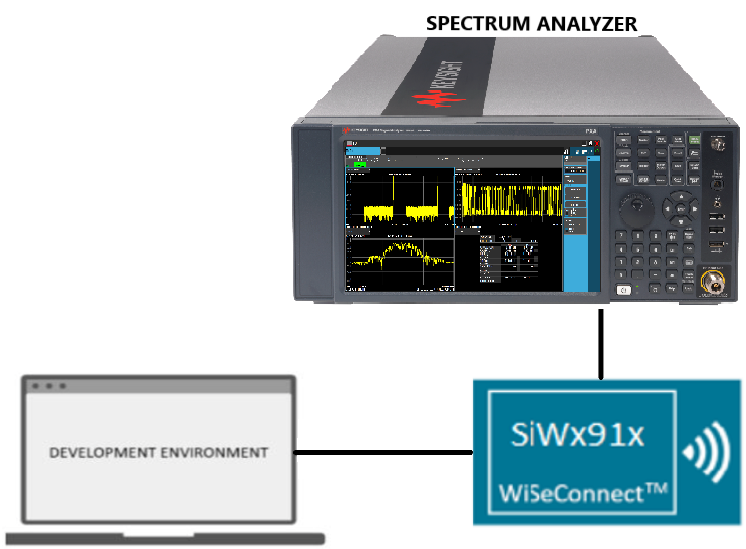
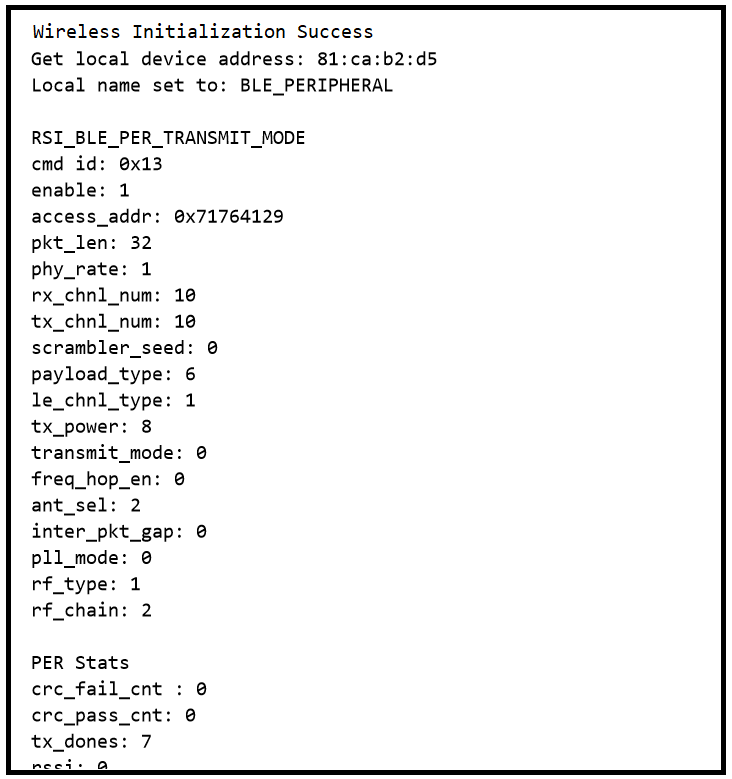
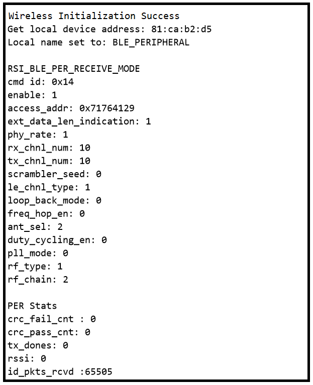

# BLE - PER

## Table of Contents

- [Purpose/Scope](#purposescope)
- [Prerequisites/Setup Requirements](#prerequisitessetup-requirements)
  - [Hardware Requirements](#hardware-requirements)
  - [Software Requirements](#software-requirements)
  - [Setup Diagram](#setup-diagram)
- [Getting Started](#getting-started)
- [Application Build Environment](#application-build-environment)
  - [Application Configuration Parameters](#application-configuration-parameters)
  - [Opermode Command Parameters](#opermode-command-parameters)
- [Test the Application](#test-the-application)

## Purpose/Scope

This application demonstrates how to configure the necessary parameters to start transmitting or receiving BLE PER packets.

## Prerequisites/Setup Requirements

Before running the application, the user will need the following things to setup.

### Hardware Requirements

- A Windows PC
- SiWx91x Wi-Fi Evaluation Kit. The SiWx91x supports multiple operating modes. See [Operating Modes](https://www.silabs.com) for details.
- **SoC Mode**:
  - Standalone
    - BRD4002A Wireless Pro Kit Mainboard [SI-MB4002A]
    - Radio Boards 
  	  - BRD4338A [SiWx917-RB4338A]
      - BRD4342A [SiWx917-RB4342A]
      - BRD4343A [SiWx917-RB4343A]
  - Kits
  	- SiWx917 Pro Kit [Si917-PK6031A](https://www.silabs.com/development-tools/wireless/wi-fi/siwx917-pro-kit?tab=overview)
  	- SiWx917 Pro Kit [Si917-PK6032A]
    - SiWx917 AC1 Module Explorer Kit (BRD2708A)
  	
- **NCP Mode**:
  - Standalone
    - BRD4002A Wireless pro kit mainboard [SI-MB4002A]
    - EFR32xG24 Wireless 2.4 GHz +10 dBm Radio Board [xG24-RB4186C](https://www.silabs.com/development-tools/wireless/xg24-rb4186c-efr32xg24-wireless-gecko-radio-board?tab=overview)
    - NCP Expansion Kit with NCP Radio boards
      - (BRD4346A + BRD8045A) [SiWx917-EB4346A]
      - (BRD4357A + BRD8045A) [SiWx917-EB4357A]
  - Kits
  	- EFR32xG24 Pro Kit +10 dBm [xG24-PK6009A](https://www.silabs.com/development-tools/wireless/efr32xg24-pro-kit-10-dbm?tab=overview)
  - Interface and Host MCU Supported
    - SPI - EFR32 
    - UART - EFR32
- Spectrum Analyzer

### Software Requirements

- Simplicity Studio IDE (to be used with Silicon Labs MCU)
- Keil IDE (to be used with STM32F411RE MCU)
- Serial Terminal - [Docklight](https://docklight.de/)/[Tera Term](https://ttssh2.osdn.jp/index.html.en) (to be used with Keil IDE)

### Setup Diagram

  

## Getting Started

### Instructions for Simplicity Studio IDE and Silicon Labs Devices (SoC and NCP Modes)

  Refer to the instructions [here](https://docs.silabs.com/wiseconnect/latest/wiseconnect-getting-started/) to:

   - Install Studio and WiSeConnect 3 extension
   - Connect your device to the computer
   - Upgrade your connectivity firmware
   - Create a Studio project
   
For details on the project folder structure, see the [WiSeConnect Examples](https://docs.silabs.com/wiseconnect/latest/wiseconnect-examples/#example-folder-structure) page.   
   
### Instructions for Keil IDE and STM32F411RE MCU (NCP Mode)

  - Install the [Keil IDE](https://www.keil.com/).
  - Download [WiSeConnect 3 SDK](https://github.com/SiliconLabs/wiseconnect)
  - Update the device's connectivity firmware as mentioned [here](https://docs.silabs.com/wiseconnect/latest/wiseconnect-getting-started/getting-started-with-ncp-mode).
  - Connect the SiWx91x NCP to STM32F411RE Nucleo Board following the steps below:
   	- Connect the male Arduino compatible header on carrier board to female Arduino compatible header on STM32F411RE Nucleo board.
   	- Mount the NCP Radio board (BRD4346A) onto the radio board socket available on the base board (BRD8045C).
   	- After connecting all the boards, the setup should look like the image shown below:
    
   	- Connect the setup to the computer.
  	- Open the BLE PER µVision project - **ble_per.uvprojx** by navigating to **WiSeConnect 3 SDK → examples → featured → ble_per → keil_project**. 

## Application Build Environment

### Application Configuration Parameters

The application can be configured to suit your requirements and development environment. Read through the following sections and make any changes needed.

- Open `app.c` file and update or modify the following macros:

  - `RSI_CONFIG_PER_MODE` refers configuration mode BT PER TX or RX

  ```c
    #define RSI_CONFIG_PER_MODE RSI_BLE_PER_TRANSMIT_MODE
                                  OR
    #define RSI_CONFIG_PER_MODE RSI_BLE_PER_RECEIVE_MODE
  ```
  - `CMD_ID` refers to the command id for transmit or receive.
  
  ```c
    #define BLE_TRANSMIT_CMD_ID 0x13
    #define BLE_RECEIVE_CMD_ID  0x14
  ```
  - `PAYLOAD_TYPE` refers to the type of payload to be transmitted.
  
  ```c
    #define DATA_PRBS9                 0x00
    #define DATA_FOUR_ONES_FOUR_ZEROES 0x01
    #define DATA_ALT_ONES_AND_ZEROES   0x02
    #define DATA_PRSB15                0x03
    #define DATA_ALL_ONES              0x04
    #define DATA_ALL_ZEROES            0x05
    #define DATA_FOUR_ZEROES_FOUR_ONES 0x06
    #define DATA_ALT_ZEROES_AND_ONES   0x07
  ```
  - `LE_CHNL_TYPE`: advertising channel - 0 data channel - 1
  
  ```c
    #define LE_ADV_CHNL_TYPE  0
    #define LE_DATA_CHNL_TYPE 1
  ```
  - `PACKET_LEN`: Length of the packet, in bytes, to be transmitted. Packet length range 0 to 255.
  
  ```c
    #define BLE_TX_PKT_LEN                32
  ```
  - `BLE_RX_CHNL_NUM`- Receive channel index, as per the Bluetooth standard, i.e, 0 to 39.
  - `BLE_TX_CHNL_NUM` - Transmit channel index, as per the Bluetooth standard, i.e, 0 to 39.
  
  ```c
    #define BLE_RX_CHNL_NUM 10
    #define BLE_TX_CHNL_NUM 10
  ```
  - `BLE_PHY_RATE`: 2 Mbps - 2 , 125 Kbps - 4, 500 Kbps - 8
  
  ```c
    #define LE_ONE_MBPS         1
    #define LE_TWO_MBPS         2
    #define LE_125_KBPS_CODED   4
    #define LE_500_KBPS_CODED   8
    #define BLE_PHY_RATE LE_ONE_MBPS
  ```
  - `SCRAMBLER_SEED`: Initial seed to be used for whitening. It should be set to '0' to disable whitening.
  
  ```c
    #define SCRAMBLER_SEED 0
  ```
  - `TX_MODE`: Burst mode - 0, Continuous mode - 1
  
  ```c
    #define BURST_MODE      0
    #define CONTINUOUS_MODE 1
  ```
  - `HOPPING TYPE` : No hopping -0, fixed hopping - 1, random hopping - 2
  
  ```c
    #define NO_HOPPING     0
    #define FIXED_HOPPING  1
    #define RANDOM_HOPPING 2
  ```
  - `ANT_SEL` : On-chip antenna - 2 u.f.l - 3
  
  ```c
    #define ONBOARD_ANT_SEL 2
    #define EXT_ANT_SEL     3
  ```
  - `RF_TYPE` : External RF – 0, Internal RF – 1
  
  ```c
    #define BLE_EXTERNAL_RF 0
    #define BLE_INTERNAL_RF 1
  ```
  - `RF CHAIN`: Select the required RF chain
  
  ```c
    #define NO_CHAIN_SEL      0
    #define WLAN_HP_CHAIN_BIT 0
    #define WLAN_LP_CHAIN_BIT 1
    #define BT_HP_CHAIN_BIT   2
    #define BT_LP_CHAIN_BIT   3
  ```
  - `PLL MODE` : PLL_MODE0 – 0, PLL_MODE1 – 1
  
  ```c
    #define PLL_MODE_0 0
    #define PLL_MODE_1 1
  ```

  - `LOOP_BACK_MODE` : Enable 1 or Disable 0 

  ```c
    #define LOOP_BACK_MODE_ENABLE 1
    #define LOOP_BACK_MODE_DISABLE 0
  ```

  Set the following macro to update Max TX power and offset:
```c
#define GAIN_TABLE_AND_MAX_POWER_UPDATE_ENABLE 1 //! To update gain table and max tx power and offsets
```

   The API used to update the gain table is:
```c
int32_t rsi_bt_cmd_update_gain_table_offset_or_max_pwr(uint8_t node_id,
                                                       uint8_t payload_len,
                                                       uint8_t *payload,
                                                       uint8_t req_type)
```
---

> Note: 
> The user can configure default region specific regulatory information using `sl_wifi_region_db_config.h'.

**Note!**
* This command must be used immediately after opermode request.
* Internally, the firmware maintains two tables.
    * Gain table holding Max Tx power values for all regions
    * Gain table with Max power vs offset values for each channel of all regions
* The five regions supported are FCC, ETSI, TELEC, KCC, and WORLDWIDE. These FCC/ETSI/TELEC/KCC gain table max power levels and offset values should be loaded in end-to-end mode via the BLE User Gain table. This has to be called upon every boot-up since this information is not saved inside flash. SoC uses these tables in FCC/ETSI/TELEC/KCC to limit power and avoid violating allowed limits.
* For Worldwide region, the firmware uses Worldwide values for Tx. For other regions (FCC/ETSI/TELEC/KCC), the firmware uses the min value out of Worldwide and Region based values for Tx. Also, there will be part-to-part variation across chips and offsets are estimated during manufacturing flow which will be applied as a correction factor during normal mode of operation.
* This frame must be used by customers who have done FCC/ETSI/TELEC/KCC certification with their own antenna. All other customers should not use this. Inappropriate use of this frame may result in violation of FCC/ETSI/TELEC/KCC or any certifications and Silicon labs is not liable for these uses.

---

* BLE power offset like <CHANNEL_NUM>, <1M_OFFSET>, <2M_OFFSET>, <500kbps_oFFSET>, <125kbps_oFFSET>

---

**req_type** can be set to one of the following macros :
```c
#define BLE_GAIN_TABLE_MAXPOWER_UPDATE 0
#define BLE_GAIN_TABLE_OFFSET_UPDATE   1
#define BLE_GAIN_TABLE_LP_CHAIN_0DBM_OFFSET_UPDATE  2
#define BLE_GAIN_TABLE_LP_CHAIN_10DBM_OFFSET_UPDATE 3
```
**node_id** refers to BLE Node id :
```c
#define BLE_NODE 0  // For selecting BLE node
```

The following arrays will be used to update_gain_table based on `node_id` and `req_type`.

| `node_id`  | `req_type`                    | Payload Array                                    |
| ---------- | ----------------------------- | ------------------------------------------------ |
| `BLE_NODE` | `UPDATE_GAIN_TABLE_MAX_POWER` | `Si917_BLE_REGION_BASED_MAXPOWER_XX`           |
| `BLE_NODE` | `UPDATE_GAIN_TABLE_OFFSET`    | `Si917_BLE_REGION_BASED_MAXPOWER_VS_OFFSET_XX` |
| `BLE_NODE` | `BLE_GAIN_TABLE_LP_CHAIN_0DBM_OFFSET_UPDATE` | `Si917_BLE_REGION_BASED_LP_CHAIN_0DBM_OFFSET_XX`           |
| `BLE_NODE` | `BLE_GAIN_TABLE_LP_CHAIN_10DBM_OFFSET_UPDATE`    | `Si917_BLE_REGION_BASED_LP_CHAIN_10DBM_OFFSET_XX` |

**Gain Table Max Power Array Format**

```c
uint8_t _Si917_BLE_REGION_BASED_MAXPOWER_XX[] = {}; //! Fill the user gain table max power values as shown below.

<TABLE NAME>[] = { 
                   <REGION NAME 1>, <MAX POWER>, 
                   <REGION NAME 1>, <MAX POWER>,
                    .
                    .
                   <REGION NAME N>, <MAX POWER> 
                 };
```

**Gain Table Offset Array Format**
```c
uint8_t _Si917_BLE_REGION_BASED_MAXPOWER_VS_OFFSET[] = {};  // Fill the user gain table offset values as shown.

<TABLE NAME>[] = {
                  <Number Of Regions - 'r'>,
                    <REGION NAME 1>, <Number of Channels - 'm'>,
                      <CHANNEL NUMBER 1>, <OFFSET>, <OFFSET>, <OFFSET>, <OFFSET>
                      <CHANNEL NUMBER 2>, <OFFSET>, <OFFSET>, <OFFSET>, <OFFSET>
                      .
                      .
                      <CHANNEL NUMBER m>, <OFFSET>,
                    <REGION NAME 2>, <Number of Channels - 'n'>,
                      <CHANNEL NUMBER 1>, <OFFSET>, <OFFSET>, <OFFSET>, <OFFSET>
                      <CHANNEL NUMBER 2>, <OFFSET>, <OFFSET>, <OFFSET>, <OFFSET>
                      .
                      .
                      <CHANNEL NUMBER n>, <OFFSET>, <OFFSET>, <OFFSET>, <OFFSET>
                     .
                     .
                     <REGION NAME r>, <Number of Channels - 'n'>,
                       <CHANNEL NUMBER 1>, <OFFSET>, <OFFSET>, <OFFSET>, <OFFSET>
                       <CHANNEL NUMBER 2>, <OFFSET>, <OFFSET>, <OFFSET>, <OFFSET>
                       .
                       .
                       <CHANNEL NUMBER n>, <OFFSET>, <OFFSET>, <OFFSET>, <OFFSET>
                   };

uint8_t Si917_BLE_REGION_BASED_LP_CHAIN_0DBM_OFFSET_XX[] = {};  // Fill the user gain table offset values as shown.

<TABLE NAME>[] = {
                  <Number Of Regions - 'r'>,
                    <REGION NAME 1>, <Number of Channels - 'm'>,
                      <CHANNEL NUMBER 1>, <OFFSET>, <OFFSET>, <OFFSET>, <OFFSET>
                      <CHANNEL NUMBER 2>, <OFFSET>, <OFFSET>, <OFFSET>, <OFFSET>
                      .
                      .
                      <CHANNEL NUMBER m>, <OFFSET>,
                    <REGION NAME 2>, <Number of Channels - 'n'>,
                      <CHANNEL NUMBER 1>, <OFFSET>, <OFFSET>, <OFFSET>, <OFFSET>
                      <CHANNEL NUMBER 2>, <OFFSET>, <OFFSET>, <OFFSET>, <OFFSET>
                      .
                      .
                      <CHANNEL NUMBER n>, <OFFSET>, <OFFSET>, <OFFSET>, <OFFSET>
                     .
                     .
                     <REGION NAME r>, <Number of Channels - 'n'>,
                       <CHANNEL NUMBER 1>, <OFFSET>, <OFFSET>, <OFFSET>, <OFFSET>
                       <CHANNEL NUMBER 2>, <OFFSET>, <OFFSET>, <OFFSET>, <OFFSET>
                       .
                       .
                       <CHANNEL NUMBER n>, <OFFSET>, <OFFSET>, <OFFSET>, <OFFSET>
                   };

uint8_t Si917_BLE_REGION_BASED_LP_CHAIN_10DBM_OFFSET_XX[] = {};  // Fill the user gain table offset values as shown.

<TABLE NAME>[] = {
                  <Number Of Regions - 'r'>,
                    <REGION NAME 1>, <Number of Channels - 'm'>,
                      <CHANNEL NUMBER 1>, <OFFSET>, <OFFSET>, <OFFSET>, <OFFSET>
                      <CHANNEL NUMBER 2>, <OFFSET>, <OFFSET>, <OFFSET>, <OFFSET>
                      .
                      .
                      <CHANNEL NUMBER m>, <OFFSET>,
                    <REGION NAME 2>, <Number of Channels - 'n'>,
                      <CHANNEL NUMBER 1>, <OFFSET>, <OFFSET>, <OFFSET>, <OFFSET>
                      <CHANNEL NUMBER 2>, <OFFSET>, <OFFSET>, <OFFSET>, <OFFSET>
                      .
                      .
                      <CHANNEL NUMBER n>, <OFFSET>, <OFFSET>, <OFFSET>, <OFFSET>
                     .
                     .
                     <REGION NAME r>, <Number of Channels - 'n'>,
                       <CHANNEL NUMBER 1>, <OFFSET>, <OFFSET>, <OFFSET>, <OFFSET>
                       <CHANNEL NUMBER 2>, <OFFSET>, <OFFSET>, <OFFSET>, <OFFSET>
                       .
                       .
                       <CHANNEL NUMBER n>, <OFFSET>, <OFFSET>, <OFFSET>, <OFFSET>
                   };

```

**Region Name and Values**

|  Region Name | Value   | 
|--------------|---------|
| `FCC`          | `0`       |
| `ETSI`         | `1`       | 
| `TELEC`        | `2`       |
| `WORLDWIDE`    | `3`       |
| `KCC`          | `4`       |

- Open `ble_config.h` file and update/modify the following macros:

  ```c
    #define RSI_BLE_PWR_INX                                30
    #define RSI_BLE_PWR_SAVE_OPTIONS                       BLE_DISABLE_DUTY_CYCLING
  ```

  > **Note:** `ble_config.h` files are already set with desired configuration in the respective example folders. The user does not need to change these for each example.
  
## Test the Application

### Instructions for Simplicity Studio IDE and Silicon Labs Devices (SoC and NCP Modes)

Refer to the instructions [here](https://docs.silabs.com/wiseconnect/latest/wiseconnect-getting-started/) to:

- Build the application.
- Flash, run, and debug the application.

### Instructions for Keil IDE and STM32F411RE MCU

- Build the application.
- Set the Docklight up by connecting STM32's Serial COM port. This enables you to view the application prints.
- Flash, run, and debug the application.

Follow the steps as mentioned for the successful execution of the application:

1. After the program gets executed, the Silicon Labs module starts BLE PER transmit or BLE PER receive.

2. The BLE-PER-RX can be validated between two SiWx91x device modes.
    - Configure an SiWx91x device in PER-TX mode and configure another SiWx91x device in BLE PER RX mode.

3. If the SiWx91x device is configured in BLE-PER-TX Mode, the SiWx91x device sends the packets with the configured mode in the configured channel.

4. Check the BLE PER stats to see if configured values are affected or not.

5. After successful program execution, the prints in Tera Term appear as shown in the following images.

### BLE-PER-TX

  

### BLE-PER-RX

  


