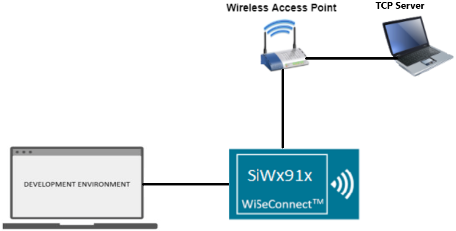
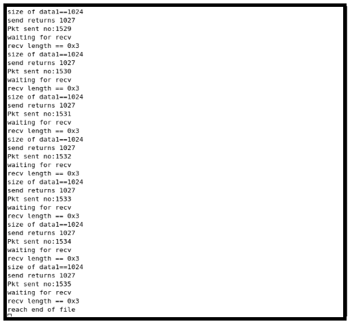
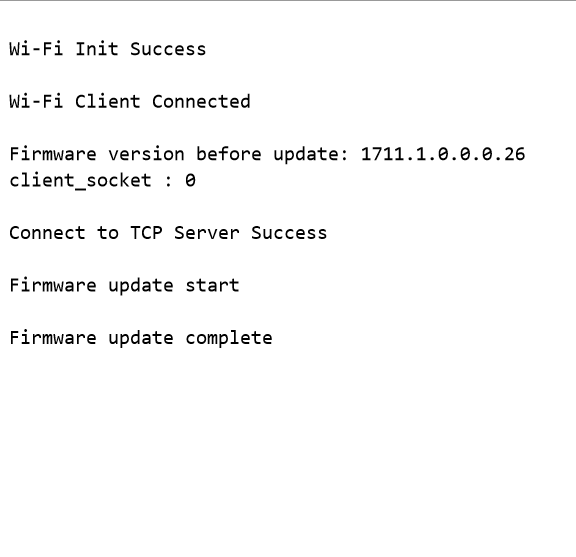
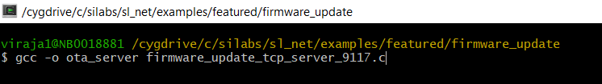

# Wi-Fi - NWP Or Combined (NWP & M4) Firmware Update via TCP

## High-Level Overview

SiWx91x firmware update example: Connect to Wi-Fi as a TCP client, download NWP or combined NWP and M4 firmware from a remote TCP server, and apply the update over the air in SoC and NCP modes.

## Table of Contents

- [Wi-Fi - NWP Or Combined (NWP & M4) Firmware Update via TCP](#wi-fi---nwp-or-combined-nwp--m4-firmware-update-via-tcp)
  - [High-Level Overview](#high-level-overview)
  - [Table of Contents](#table-of-contents)
  - [Purpose/Scope](#purposescope)
  - [Prerequisites/Setup Requirements](#prerequisitessetup-requirements)
    - [Hardware Requirements](#hardware-requirements)
    - [Software Requirements](#software-requirements)
    - [Setup Diagram](#setup-diagram)
  - [Getting Started](#getting-started)
  - [Application Build Environment](#application-build-environment)
    - [Configure sl\_net\_default\_values.h](#configure-sl_net_default_valuesh)
    - [STA Instance Related Parameters](#sta-instance-related-parameters)
    - [TCP Configuration](#tcp-configuration)
    - [Combined Image Configuration](#combined-image-configuration)
  - [Test the Application](#test-the-application)
    - [Build and Run the TCP Server (Linux PC)](#build-and-run-the-tcp-server-linux-pc)
    - [Build and Run the TCP Server (Windows PC)](#build-and-run-the-tcp-server-windows-pc)
  - [Troubleshooting](#troubleshooting)
  - [Resources](#resources)
  - [Report Bugs and Get Support](#report-bugs-and-get-support)

## Purpose/Scope

This application shows how to update the NWP firmware of a device via Wi-Fi by downloading the firmware file from a remote TCP server. The server can be run on a local PC. Here's how the update process works:

 - **Connection** : The device connects to a Wi-Fi network and acts as a TCP client.
 - **Request**    : The device sends a request to the TCP server for the firmware update file.
 - **Download**   : The server sends the firmware file to the device.
 - **Update**     : The device writes the new firmware to its memory and then restarts to complete the update.

This process allows the device to update its software over the air (OTA) without needing a physical connection.


## Prerequisites/Setup Requirements

### Hardware Requirements  

- PC or Mac
- Linux PC or [Cygwin](https://www.cygwin.com/install.html) on Windows (to build and run the TCP server source provided)
- Wi-Fi Access point with a connection to the internet
- **SoC Mode**:
  - Standalone
    - BRD4002A Wireless pro kit mainboard [SI-MB4002A](https://www.silabs.com/development-tools/wireless/wireless-pro-kit-mainboard?tab=overview)
    - Radio Boards 
  	  - BRD4338A [SiWx917-RB4338A](https://www.silabs.com/development-tools/wireless/wi-fi/siwx917-rb4338a-wifi-6-bluetooth-le-soc-radio-board?tab=overview)
      - BRD4342A [SiWx917-RB4342A](https://www.silabs.com/development-tools/wireless/wi-fi/siwx91x-rb4342a-wifi-6-bluetooth-le-soc-radio-board?tab=overview)
      - BRD4339B [SiWx917-RB4339B](https://docs.silabs.com/wiseconnect/latest/wiseconnect-getting-started/getting-started-with-at)
      - BRD4340A [SiWx917-RB4340A](https://docs.silabs.com/wiseconnect/latest/wiseconnect-getting-started/getting-started-with-at)
      - BRD4343A [SiWx917-RB4343A](https://www.silabs.com/development-tools/wireless/wi-fi/siw917y-rb4343a-wi-fi-6-bluetooth-le-8mb-flash-radio-board-for-module?tab=overview)
      - BRD4343C [SiWx917-RB4343C](https://www.silabs.com/development-tools/wireless/wi-fi/siw917y-rb4343c-wi-fi-6-bluetooth-le-8mb-flash-radio-board-for-module?tab=overview)
  - Kits
  	- SiWG917 Dev Kit [BRD2605A](https://www.silabs.com/development-tools/wireless/wi-fi/siwx917-dk2605a-wifi-6-bluetooth-le-soc-dev-kit?tab=overview)
  	- SiWx917 Pro Kit [Si917-PK6031A](https://www.silabs.com/development-tools/wireless/wi-fi/siwx917-pro-kit?tab=overview)
  	- SiWx917 Pro Kit [Si917-PK6032A]
    - SiWx917 AC1 Module Explorer Kit [BRD2708A](https://www.silabs.com/development-tools/wireless/wi-fi/siw917y-ek2708a-explorer-kit?tab=overview)
  	
- **NCP Mode**:
  - Standalone
    - BRD4002A Wireless Pro Kit Mainboard [SI-MB4002A](https://www.silabs.com/development-tools/wireless/wireless-pro-kit-mainboard?tab=overview)
    - EFR32xG24 Wireless 2.4 GHz +10 dBm Radio Board [xG24-RB4186C](https://www.silabs.com/development-tools/wireless/xg24-rb4186c-efr32xg24-wireless-gecko-radio-board?tab=overview)
    - EFR32FG25 863-876 MHz +16 dBm Radio Board [FG25-RB4271A](https://www.silabs.com/development-tools/wireless/proprietary/fg25-rb4271a-efr32fg25-radio-board?tab=overview)
    - NCP Expansion Kit with NCP Radio Boards
      - [BRD4346A](https://www.silabs.com/development-tools/wireless/wi-fi/siwx917-rb4346a-wifi-6-bluetooth-le-soc-4mb-flash-radio-board?tab=overview) + [BRD8045A](https://www.silabs.com/development-tools/wireless/wi-fi/expansion-adapter-board-for-co-processor-radio-boards?tab=overview)
      - [BRD4357A](https://www.silabs.com/development-tools/wireless/wi-fi/siw917y-rb4357a-wi-fi-6-bluetooth-le-4mb-flash-radio-board-for-rcp-and-ncp-modules?tab=overview) + [BRD8045A](https://www.silabs.com/development-tools/wireless/wi-fi/expansion-adapter-board-for-co-processor-radio-boards?tab=overview)
      - [BRD4357C](https://www.silabs.com/development-tools/wireless/wi-fi/siw917y-rb4357c-wi-fi-6-bluetooth-le-4mb-flash-radio-board-for-rcp-and-ncp-modules?tab=overview) + [BRD8045A](https://www.silabs.com/development-tools/wireless/wi-fi/expansion-adapter-board-for-co-processor-radio-boards?tab=overview)
  - Kits
  	- EFR32xG24 Pro Kit +10 dBm [xG24-PK6009A](https://www.silabs.com/development-tools/wireless/efr32xg24-pro-kit-10-dbm?tab=overview)
  - STM32F411RE MCU
    - [STM32F411RE](https://www.st.com/en/microcontrollers-microprocessors/stm32f411re.html) MCU
    - NCP Expansion Kit with NCP Radio Boards
      - [BRD4346A](https://www.silabs.com/development-tools/wireless/wi-fi/siwx917-rb4346a-wifi-6-bluetooth-le-soc-4mb-flash-radio-board?tab=overview) + [BRD8045C](https://www.silabs.com/development-tools/wireless/wi-fi/shield-adapter-board-for-co-processor-radio-boards?tab=overview)
      - [BRD4357A](https://www.silabs.com/development-tools/wireless/wi-fi/siw917y-rb4357a-wi-fi-6-bluetooth-le-4mb-flash-radio-board-for-rcp-and-ncp-modules?tab=overview) + [BRD8045C](https://www.silabs.com/development-tools/wireless/wi-fi/shield-adapter-board-for-co-processor-radio-boards?tab=overview)
      - [BRD4357C](https://www.silabs.com/development-tools/wireless/wi-fi/siw917y-rb4357c-wi-fi-6-bluetooth-le-4mb-flash-radio-board-for-rcp-and-ncp-modules?tab=overview) + [BRD8045C](https://www.silabs.com/development-tools/wireless/wi-fi/shield-adapter-board-for-co-processor-radio-boards?tab=overview)
  - Interface and Host MCU Supported
    - SPI - EFR32 and STM32
    - UART - EFR32

### Software Requirements

- Simplicity Studio IDE (to be used with Silicon Labs MCU)
- Keil IDE (to be used with STM32F411RE MCU)
- Serial Terminal - [Docklight](https://docklight.de/)/[Tera Term](https://ttssh2.osdn.jp/index.html.en) (to be used with Keil IDE)

### Setup Diagram



## Getting Started

### Instructions for Simplicity Studio IDE, and Silicon Labs Devices (SoC, and NCP Modes)

  Refer to the instructions [here](https://docs.silabs.com/wiseconnect/latest/wiseconnect-getting-started/) to:

  - Install Studio and WiSeConnect extension
  - Connect your device to the computer
  - Upgrade your connectivity firmware
  - Create a Studio project

### Instructions for Keil IDE and STM32F411RE MCU (NCP Mode)
  Refer to the instructions [here](https://docs.silabs.com/wiseconnect/latest/wiseconnect-getting-started/getting-started-with-ncp-mode-with-stm32) to:

  - Install the [Keil IDE](https://www.keil.com/).
  - Download [WiSeConnect SDK](https://github.com/SiliconLabs/wiseconnect)
  - Update the device's connectivity firmware as mentioned [here](https://docs.silabs.com/wiseconnect/latest/wiseconnect-getting-started/getting-started-with-ncp-mode-with-stm32#upgrade-the-si-wx91x-connectivity-firmware).
  - Connect the SiWx91x NCP to STM32F411RE Nucleo Board follow the below steps:
   	- Connect the male Arduino compatible header on carrier board to female Arduino compatible header on STM32F411RE Nucleo board.
   	- Mount the NCP Radio board (BRD4346A/BRD4357A) onto the radio board socket available on the base board (BRD8045C).
   	- After connecting all the boards, the setup should look like the following image:
    
   	- Connect the setup to the computer.
  - Open the FIRMWARE UPDATE µVision project - **firmware_update.uvprojx** by navigating to **WiSeConnect SDK → examples → featured → firmware_update → keil_project**. 

## Application Build Environment

The application can be configured to suit user requirements and development environment. Read through the following sections and make any changes needed.

### Configure sl_net_default_values.h

**File path for Simplicity Studio IDE:**
- In the Project Explorer pane, expand the **config** folder and open the **sl_net_default_values.h** file. 

**File path for Keil IDE:**
- In the Project pane, expand the **resources/defaults** folder and open the **sl_net_default_values.h** file.


### STA Instance Related Parameters

- DEFAULT_WIFI_CLIENT_PROFILE_SSID refers to the name with which the Wi-Fi network shall be advertised. The SiWx91x module is connected to it.

  	```c
  	#define DEFAULT_WIFI_CLIENT_PROFILE_SSID               "YOUR_AP_SSID"      
  	```

	- DEFAULT_WIFI_CLIENT_CREDENTIAL refers to the secret key if the Access point is configured in WPA-PSK/WPA2-PSK security modes.

  ```c
  #define DEFAULT_WIFI_CLIENT_CREDENTIAL                 "YOUR_AP_PASSPHRASE" 
  ```

- DEFAULT_WIFI_CLIENT_SECURITY_TYPE refers to the security type of the Access point. The supported security modes are mentioned in `sl_wifi_security_t`.

  ```c
  #define DEFAULT_WIFI_CLIENT_SECURITY_TYPE               SL_WIFI_WPA2 
  ```

- Other STA instance configurations can be modified if required in `default_wifi_client_profile` configuration structure.

> **Note**: For recommended settings, please refer the [recommendations guide](https://docs.silabs.com/wiseconnect/latest/wiseconnect-developers-guide-prog-recommended-settings/).

### TCP Configuration

```c
#define SERVER_PORT        5001        // TCP server port of the remote TCP server
#define SERVER_IP_ADDRESS  "172.20.10.3"  // Server IP address 
```

### Combined Image Configuration

```c
#define COMBINED_IMAGE    0        //Set 1 for combined image upgrade and 0 for NWP firmware upgrade
```

> **Note:**
> - Use a combined image to update the firmware whenever possible. A combined image includes both the Network Processor (NWP) and Application Processor (M4) images in a single package.
> - When generating a combined image, use the NWP and M4 images from the same release package. Using different versions may result in undefined behavior due to a version mismatch.
> - For devices with 4 MB flash, updating with a combined image is not supported because of memory limitations. In this case, update the NWP image first, and then update the M4 image.
> - For NCP mode, update the NWP image first, followed by the host image from the same release version.

## Test the Application

### Instructions for Simplicity Studio IDE and Silicon Labs Devices (SoC and NCP Modes)

Refer to the instructions [here](https://docs.silabs.com/wiseconnect/latest/wiseconnect-getting-started/) to:

- Build the application
- Flash, run and debug the application.

### Instructions for Keil IDE and STM32F411RE MCU

- Build the application.
- Set the Docklight up by connecting STM32's Serial COM port. This enables you to view the application prints.
- Flash, Run, and Debug the application.

  

  

- When the firmware update completes, the SiWx91x should be rebooted after which it may take a few minutes to overwrite the old firmware with the new firmware in Flash memory.

  > Note:
  > Image size displayed may vary depending on the firmware provided by the server.

### Steps to Create a Combined Image

  #### Case 1: When Security is Disabled

  1. Navigate to the Commander directory.

  2. Copy the NWP firmware image and M4 image into the Commander directory.

  3. Create the nwp_combined_image.rps file:

      ```c
      commander rps convert <nwp_combined_image.rps> --taapp <original non-encrypted TA rps> --combinedimage
      ```

  4. Create the m4_combined_image.rps file:

      ```c
      commander rps convert <m4_combined_image.rps> --app <original non-encrypted M4 rps> --combinedimage
      ```

  5. Create the final combined image:

      ```c
      commander rps convert <combined_image.rps> --app <m4_combined_image.rps> --taapp <nwp_combined_image.rps>
      ```

  #### Case 2: When Security is Enabled

  For devices with security enabled, additional signing and encryption steps are required. Follow the detailed instructions in **Section 6 - Combined Image (NWP + M4)** of the [UG574 SiWx917 SoC Manufacturing Utility User Guide](https://www.silabs.com/documents/public/user-guides/ug574-siwx917-soc-manufacturing-utility-user-guide.pdf#page=24).

### Build and Run the TCP Server (Linux PC)

  1. Copy the TCP server application [firmware_update_tcp_server_9117.c](firmware_update_tcp_server_9117.c) provided with the application source to a Linux PC connected to the Wi-Fi access point.
  2. Compile the application
  
     ```c
	  user@linux:~$ gcc firmware_update_tcp_server_9117.c -o ota_server.bin
	  ```

  3. Run the application providing the TCP port number (specified in the SiWx91x app) together with the firmware file from `<SDK>/connectivity_firmware/` (see [Update SiWx91x Connectivity Firmware](https://docs.silabs.com/wiseconnect/latest/wiseconnect-developers-guide-developing-for-silabs-hosts/using-the-simplicity-studio-ide#update-siwx91x-connectivity-firmware)), for example `SiWG917-B.2.x.x.x.x.x.rps`.

      ```c
      user@linux:~$ ./ota_server.bin 5001 SiWG917-B.2.x.x.x.x.x.rps
      ```

### Build and Run the TCP Server (Windows PC)

  1. Open the FIRMWARE UPDATE project in cygwin terminal - by navigating to **WiSeConnect SDK → examples → featured → firmware_update**.  
  
  2. Compile the application

      
  
  3. Run the application providing the TCP port number (specified in the SiWx91x app) together with the firmware file from `<SDK>/connectivity_firmware/` (see [Update SiWx91x Connectivity Firmware](https://docs.silabs.com/wiseconnect/latest/wiseconnect-developers-guide-developing-for-silabs-hosts/using-the-simplicity-studio-ide#update-siwx91x-connectivity-firmware)), for example `SiWG917-B.2.x.x.x.x.x.rps`.

      ```c
      ./ota_server 5001 SiWG917-B.2.x.x.x.x.x.rps
      ```

## Troubleshooting

If you encounter issues while running the Firmware Update example, check the following:

- Verify that `DEFAULT_WIFI_CLIENT_PROFILE_SSID`, `DEFAULT_WIFI_CLIENT_CREDENTIAL`, and `DEFAULT_WIFI_CLIENT_SECURITY_TYPE` in the `sl_net_default_values.h` file match your access point settings.
- Confirm `SERVER_IP_ADDRESS` and `SERVER_PORT` in `app.c` match the IP address and port of the TCP server running on the PC.
- Start the TCP server on the PC before flash and run the SiWx91x application so the firmware file is available when the device connects.
- Ensure the firmware file path passed to `ota_server` or `ota_server.bin` is correct and the image version is compatible with the target device.
- Set `COMBINED_IMAGE` to `1` only when using a combined NWP and M4 image from the same release package. Set it to `0` for NWP-only updates.
- On devices with 4 MB flash, do not use a combined image. Update the NWP image first, then update the M4 image separately.
- In NCP mode, update the NWP image first, then update the host image from the same release version.
- On Windows, use Cygwin to build the TCP server as described in [Build and Run the TCP Server (Windows PC)](#build-and-run-the-tcp-server-windows-pc).
- If the update become unresponsive after download, wait a few minutes while the device writes the new firmware to flash and reboots.

## Resources

- [WiSeConnect Getting Started Guide](https://docs.silabs.com/wiseconnect/latest/wiseconnect-getting-started/)
- [SiWx91x Connectivity Firmware](https://docs.silabs.com/wiseconnect/latest/wiseconnect-developers-guide-developing-for-silabs-hosts/using-the-simplicity-studio-ide#update-siwx91x-connectivity-firmware)
- [UG574 SiWx917 SoC Manufacturing Utility User Guide](https://www.silabs.com/documents/public/user-guides/ug574-siwx917-soc-manufacturing-utility-user-guide.pdf)
- [WiSeConnect Recommended Settings Guide](https://docs.silabs.com/wiseconnect/latest/wiseconnect-developers-guide-prog-recommended-settings/)

## Report Bugs and Get Support

Report issues and get help from the Silicon Labs community:

- [Silicon Labs Community](https://www.silabs.com/community)
