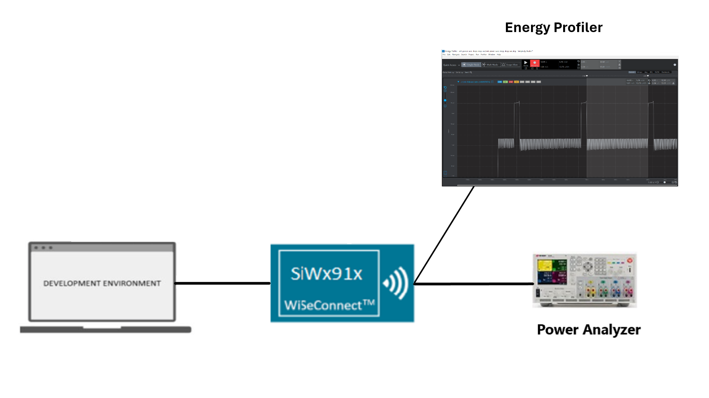
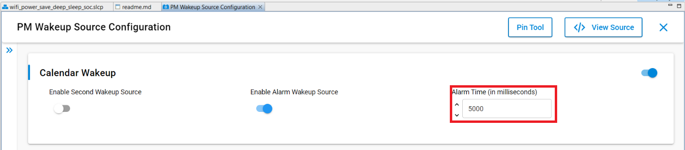
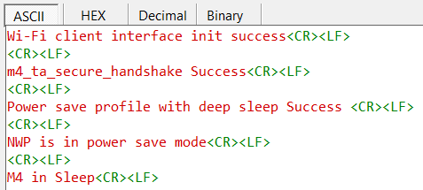
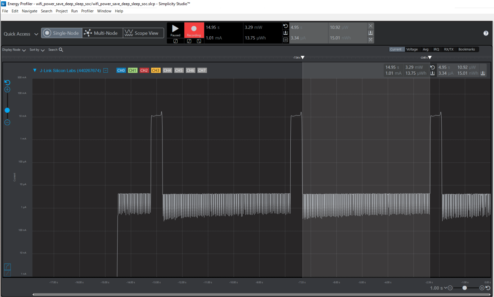
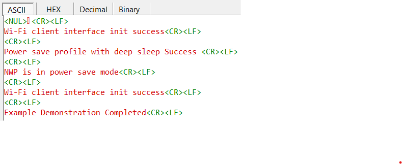
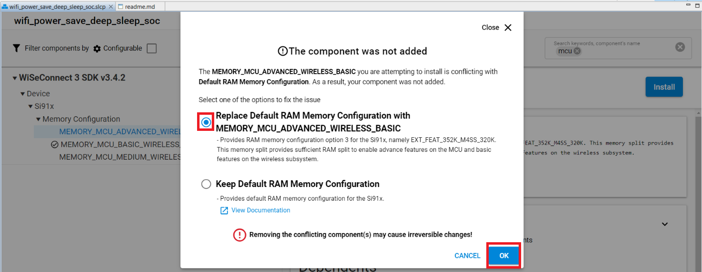

# Wi-Fi - Powersave Deep Sleep

## Table of Contents

- [Wi-Fi - Powersave Deep Sleep](#wi-fi---powersave-deep-sleep)
  - [Table of Contents](#table-of-contents)
  - [Purpose/Scope](#purposescope)
  - [Prerequisites/Setup Requirements](#prerequisitessetup-requirements)
    - [Hardware Requirements](#hardware-requirements)
    - [Software Requirements](#software-requirements)
    - [Set up Diagram](#set-up-diagram)
  - [Getting Started](#getting-started)
    - [Instructions for Simplicity Studio IDE and Silicon Labs Devices (SoC and NCP Modes)](#instructions-for-simplicity-studio-ide-and-silicon-labs-devices-soc-and-ncp-modes)
    - [Instructions for Keil IDE and STM32F411RE MCU (NCP Mode)](#instructions-for-keil-ide-and-stm32f411re-mcu-ncp-mode)
  - [Application Build Environment](#application-build-environment)
  - [Test the Application](#test-the-application)
    - [Instructions for Simplicity Studio IDE and Silicon Labs Devices (SoC and NCP Modes)](#instructions-for-simplicity-studio-ide-and-silicon-labs-devices-soc-and-ncp-modes-1)
    - [Instructions for Keil IDE and STM32F411RE MCU](#instructions-for-keil-ide-and-stm32f411re-mcu)
  - [Application Output](#application-output)
    - [Using Simplicity Studio Energy Profiler for Current Measurement](#using-simplicity-studio-energy-profiler-for-current-measurement)

## Purpose/Scope

This application demonstrates how to enable power save deep sleep profile with SiWx91x. This application configures the SiWx91x in standby power save mode (Unassociated mode (NWP)) without RAM retention to reduce the current consumption.

Refer to the datasheet for current consumption values without RAM retention.

## Prerequisites/Setup Requirements

### Hardware Requirements

- Windows PC
- (Optional) Power analyzer 
- **SoC Mode**:
  - Standalone
    - BRD4002A Wireless Pro Kit Mainboard [SI-MB4002A](https://www.silabs.com/development-tools/wireless/wireless-pro-kit-mainboard?tab=overview)
    - Radio Boards 
  	  - BRD4338A [SiWx917-RB4338A](https://www.silabs.com/development-tools/wireless/wi-fi/siwx917-rb4338a-wifi-6-bluetooth-le-soc-radio-board?tab=overview)
  - Kits
  	- SiWx917 Pro Kit [Si917-PK6031A](https://www.silabs.com/development-tools/wireless/wi-fi/siwx917-pro-kit?tab=overview)
  	
- **NCP Mode**:
  - Standalone
    - BRD4002A Wireless Pro Kit Mainboard [SI-MB4002A](https://www.silabs.com/development-tools/wireless/wireless-pro-kit-mainboard?tab=overview)
    - EFR32xG24 Wireless 2.4 GHz +10 dBm Radio Board [xG24-RB4186C](https://www.silabs.com/development-tools/wireless/xg24-rb4186c-efr32xg24-wireless-gecko-radio-board?tab=overview)
    - NCP Expansion Kit with NCP Radio Boards
      - [BRD4346A](https://www.silabs.com/development-tools/wireless/wi-fi/siwx917-rb4346a-wifi-6-bluetooth-le-soc-4mb-flash-radio-board?tab=overview) + [BRD8045A](https://www.silabs.com/development-tools/wireless/wi-fi/expansion-adapter-board-for-co-processor-radio-boards?tab=overview)
      - [BRD4357A](https://www.silabs.com/development-tools/wireless/wi-fi/siw917y-rb4357a-wi-fi-6-bluetooth-le-4mb-flash-radio-board-for-rcp-and-ncp-modules?tab=overview) + [BRD8045A](https://www.silabs.com/development-tools/wireless/wi-fi/expansion-adapter-board-for-co-processor-radio-boards?tab=overview)
  - Kits
  	- EFR32xG24 Pro Kit +10 dBm [xG24-PK6009A](https://www.silabs.com/development-tools/wireless/efr32xg24-pro-kit-10-dbm?tab=overview)
  - STM32F411RE MCU
    - [STM32F411RE](https://www.st.com/en/microcontrollers-microprocessors/stm32f411re.html) MCU
    - NCP Expansion Kit with NCP Radio Boards
      - [BRD4346A](https://www.silabs.com/development-tools/wireless/wi-fi/siwx917-rb4346a-wifi-6-bluetooth-le-soc-4mb-flash-radio-board?tab=overview) + [BRD8045C](https://www.silabs.com/development-tools/wireless/wi-fi/shield-adapter-board-for-co-processor-radio-boards?tab=overview)
      - [BRD4357A](https://www.silabs.com/development-tools/wireless/wi-fi/siw917y-rb4357a-wi-fi-6-bluetooth-le-4mb-flash-radio-board-for-rcp-and-ncp-modules?tab=overview) + [BRD8045C](https://www.silabs.com/development-tools/wireless/wi-fi/shield-adapter-board-for-co-processor-radio-boards?tab=overview)
  - Interface and Host MCU Supported
    - SPI - EFR32 & STM32
    - UART - EFR32

### Software Requirements

- Simplicity Studio IDE - [Simplicity Studio IDE](https://www.silabs.com/developer-tools/simplicity-studio) (to be used with Silicon Labs MCU)
- Keil IDE - [Keil IDE](https://www.keil.com/) (to be used with STM32F411RE MCU)
- Serial Terminal - [Docklight](https://docklight.de/)/[Tera Term](https://ttssh2.osdn.jp/index.html.en) (to be used with Keil IDE)

### Set up Diagram

  

## Getting Started

### Instructions for Simplicity Studio IDE and Silicon Labs Devices (SoC and NCP Modes)

  Refer to the instructions [here](https://docs.silabs.com/wiseconnect/latest/wiseconnect-getting-started/) to:

- [Install Simplicity Studio](https://docs.silabs.com/wiseconnect/latest/wiseconnect-developers-guide-developing-for-silabs-hosts/#install-simplicity-studio).
- [Install WiSeConnect 3 extension](https://docs.silabs.com/wiseconnect/latest/wiseconnect-developers-guide-developing-for-silabs-hosts/#install-the-wi-se-connect-3-extension).
- [Connect your device to the computer](https://docs.silabs.com/wiseconnect/latest/wiseconnect-developers-guide-developing-for-silabs-hosts/#connect-si-wx91x-to-computer).
- [Upgrade your connectivity firmware ](https://docs.silabs.com/wiseconnect/latest/wiseconnect-developers-guide-developing-for-silabs-hosts/#update-si-wx91x-connectivity-firmware).
- [Create a Studio project ](https://docs.silabs.com/wiseconnect/latest/wiseconnect-developers-guide-developing-for-silabs-hosts/#create-a-project).
  
For details on the project folder structure, see the [WiSeConnect Examples](https://docs.silabs.com/wiseconnect/latest/wiseconnect-examples/#example-folder-structure) page.

### Instructions for Keil IDE and STM32F411RE MCU (NCP Mode)

  - Install the [Keil IDE](https://www.keil.com/).
  - Download [WiSeConnect 3 SDK](https://github.com/SiliconLabs/wiseconnect).
  - Update the device's connectivity firmware as mentioned [here](https://docs.silabs.com/wiseconnect/latest/wiseconnect-getting-started/getting-started-with-ncp-mode).
  - Connect the SiWx91x NCP to the STM32F411RE Nucleo Board by following these steps:
   	- Connect the male Arduino compatible header on the carrier board to the female Arduino compatible header on the STM32F411RE Nucleo board.
    - Mount the NCP Radio board (BRD4346A/BRD4357A) onto the radio board socket available on the base board (BRD8045C).
    - After connecting all the boards, the setup should look like the image shown below:
      
   	- Connect the setup to the computer.
  - Open the POWERSAVE DEEP SLEEP µVision project - **power_save_deep_sleep.uvprojx** by navigating to **WiSeConnect 3 SDK → examples → featured → low_power → power_save_deep_sleep → keil_project**. 

## Application Build Environment

**Soc Mode**:

The M4 processor is set to sleep mode. To wakeup the M4 processor, use the method shown below:

- ALARM timer-based - In this method, an ALARM timer is run that wakes up the M4 processor periodically as configured in the Universal Configurator in 'Wakeup Source Configuration' under `WiseConnect 3 SDK v3.4.2 -> Device -> Si91x -> MCU -> Service -> Power Manager -> UULP Wakeup Sources -> PM Wakeup Source Configuration`, as shown below.

  

  

- Configure the following parameter in **app.c**.

  - Power Profile

    ```c
    #define POWER_SAVE_PROFILE DEEP_SLEEP_WITHOUT_RAM_RETENTION
    ```

    > **Note** : By default DEEP_SLEEP_WITHOUT_RAM_RETENTION is enabled.

> **Note**: For recommended settings, see the [recommendations guide](https://docs.silabs.com/wiseconnect/latest/wiseconnect-developers-guide-prog-recommended-settings/).

## Test the Application

### Instructions for Simplicity Studio IDE and Silicon Labs Devices (SoC and NCP Modes)

Refer to the instructions [here](https://docs.silabs.com/simplicity-studio-5-users-guide/5.10.1/ss-5-users-guide-building-and-flashing/) to:

- Build the application.
- Flash, run, and debug the application.

### Instructions for Keil IDE and STM32F411RE MCU

Refer to the instructions [here](https://docs.silabs.com/wiseconnect/latest/wiseconnect-getting-started/getting-started-with-ncp-mode-with-stm32#build-an-application) to:

- Build the application.
- Set the Docklight up by connecting STM32's Serial COM port. This enables you to view the application prints.
- Flash, run, and debug the application.

## Application Output

**SoC Mode**:

  
  
  

**NCP Mode**:

  

### Using Simplicity Studio Energy Profiler for Current Measurement
  
- After flashing the application code to the module, the Energy profiler can be used for current consumption measurements.

- From tools, choose Energy Profiler and click "OK".

    

- From Quick Access, choose the Start Energy Capture option.

    

    > **Note:** The target part and board name have to be reverted to default to flash application binary.
- Select board and click "OK".

  
- Average current consumption measured in power-meter.

    

> **Note:**
> - The reference images which are captured were measured in an isolated chamber and might vary in an open environment.
> - To achieve the lowest power numbers in unconnected sleep, in SoC mode, configure both NWP and M4 to sleep without RAM retention.
> - To achieve the datasheet number for the deepsleep with 352 k RAM retained, configure `RAM_LEVEL` to `SL_SI91X_RAM_LEVEL_NWP_BASIC_MCU_ADV` and M4 to sleep without RAM retention.
> - This can be configured by navigating to `WiseConnect 3 SDK v3.4.2 -> Device -> Si91x -> Memory Configuration`, as shown below:
>   
>   
> - A flash erase is required to flash any other application after the user runs the powersave application(s). If not, the module will not allow any application to be flashed.
