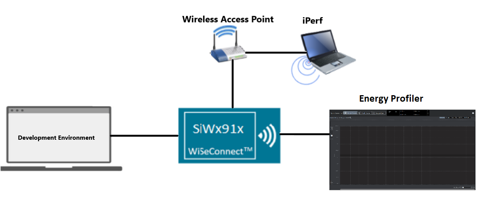
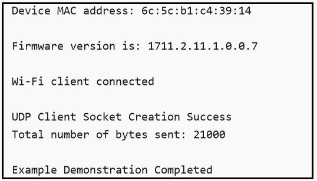
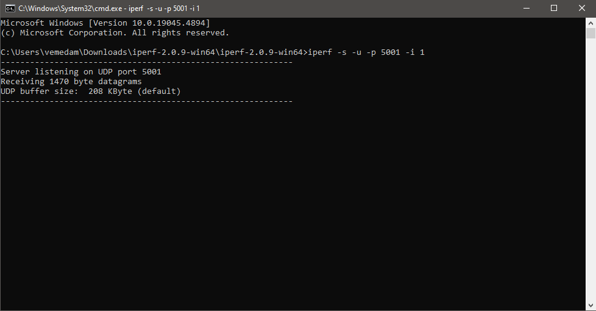
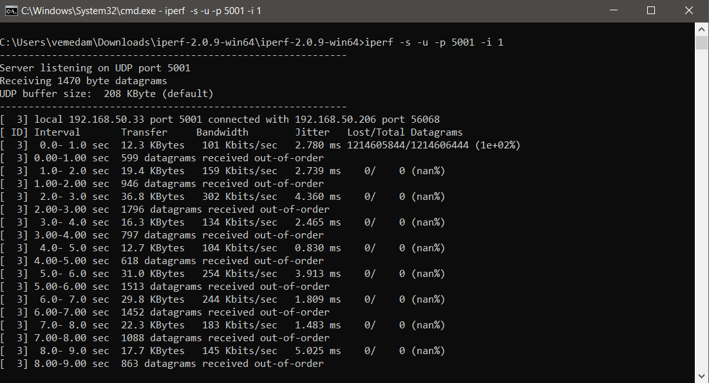
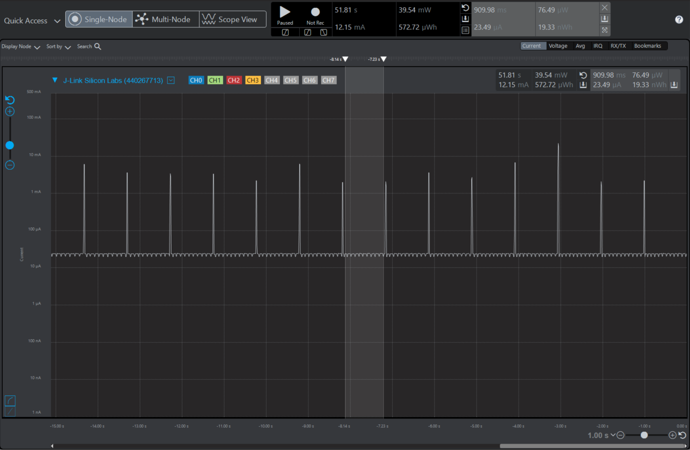

# Wi-Fi - Powersave Standby Associated

## Table of Contents

- [Wi-Fi - Powersave Standby Associated](#wi-fi---powersave-standby-associated)
  - [Table of Contents](#table-of-contents)
  - [Purpose/Scope](#purposescope)
  - [Prerequisites/Setup Requirements](#prerequisitessetup-requirements)
    - [Hardware Requirements](#hardware-requirements)
    - [Software Requirements](#software-requirements)
    - [Setup Diagram](#setup-diagram)
  - [Getting Started](#getting-started)
    - [Instructions for Simplicity Studio IDE and Silicon Labs Devices (SoC and NCP Modes)](#instructions-for-simplicity-studio-ide-and-silicon-labs-devices-soc-and-ncp-modes)
    - [Instructions for Keil IDE and STM32F411RE MCU (NCP Mode)](#instructions-for-keil-ide-and-stm32f411re-mcu-ncp-mode)
  - [Application Build Environment](#application-build-environment)
    - [Configure sl\_net\_default\_values.h](#configure-sl_net_default_valuesh)
  - [Test the Application](#test-the-application)
    - [Instructions for Simplicity Studio IDE and Silicon Labs Devices (SoC and NCP Modes)](#instructions-for-simplicity-studio-ide-and-silicon-labs-devices-soc-and-ncp-modes-1)
    - [Instructions for Keil IDE and STM32F411RE MCU](#instructions-for-keil-ide-and-stm32f411re-mcu)
    - [Run the iPerf Server](#run-the-iperf-server)
    - [Using Simplicity Studio Energy Profiler for Current Measurement](#using-simplicity-studio-energy-profiler-for-current-measurement)

## Purpose/Scope

This application demonstrates using SiWx91x to enable UDP data transfer in low-power mode, with NWP in associated power save mode with retention and keeping M4 in sleep with retention after data transfer. NWP wakes up periodically based on the DTIM or listen interval configured by the user.

The application connects to a remote server to send UDP data and also enables the analysis of various performance profiles using a power analyzer during the ASSOCIATED_POWER_SAVE with data transfer via UDP.

## Prerequisites/Setup Requirements

### Hardware Requirements  

- Windows PC
- Wi-Fi Access point with a connection to the internet
- PC2 (Remote PC) with UDP server application (iPerf)
- Power analyzer

- **SoC Mode**:
  - Standalone
    - BRD4002A Wireless Pro Kit Mainboard [SI-MB4002A]
    - Radio Boards
      - BRD4338A [SiWx917-RB4338A]
      - BRD4342A [SiWx917-RB4342A]
      - BRD4343A [SiWx917-RB4343A]
  - Kits
    - SiWx917 Pro Kit [Si917-PK6031A](https://www.silabs.com/development-tools/wireless/wi-fi/siwx917-pro-kit?tab=overview)
    - SiWx917 Pro Kit [Si917-PK6032A]
    - SiWx917 AC1 Module Explorer Kit (BRD2708A)
  	
- **NCP Mode**:
  - Standalone
    - BRD4002A Wireless Pro Kit Mainboard [SI-MB4002A]
    - EFR32xG24 Wireless 2.4 GHz +10 dBm Radio Board [xG24-RB4186C](https://www.silabs.com/development-tools/wireless/xg24-rb4186c-efr32xg24-wireless-gecko-radio-board?tab=overview)
    - NCP Expansion Kit with NCP Radio Boards
      - (BRD4346A + BRD8045A) [SiWx917-EB4346A]
      - (BRD4357A + BRD8045A) [SiWx917-EB4357A]
  - Kits
    - EFR32xG24 Pro Kit +10 dBm [xG24-PK6009A](https://www.silabs.com/development-tools/wireless/efr32xg24-pro-kit-10-dbm?tab=overview)
  - STM32F411RE MCU
    - [STM32F411RE](https://www.st.com/en/microcontrollers-microprocessors/stm32f411re.html) MCU
    - NCP Expansion Kit with NCP Radio boards
      - (BRD4346A + BRD8045C)
      - (BRD4357A + BRD8045C)
  - Interface and Host MCU Supported
    - SPI - EFR32 & STM32
    - UART - EFR32

### Software Requirements

- Simplicity Studio IDE (to be used with Silicon Labs MCU)
- Keil IDE (to be used with STM32F411RE MCU)
- Serial Terminal - [Docklight](https://docklight.de/)/[Tera Term](https://ttssh2.osdn.jp/index.html.en)
- [iPerf Application](https://sourceforge.net/projects/iperf2/files/iperf-2.0.8-win.zip/download). iPerf is a tool for active measurements of the maximum achievable bandwidth on IP networks. It supports tuning of various parameters related to timing, buffers, and protocols (TCP and UDP with IPv4 and IPv6).

### Setup Diagram

  
  
## Getting Started

### Instructions for Simplicity Studio IDE and Silicon Labs Devices (SoC and NCP Modes)

Refer to the instructions [here](https://docs.silabs.com/wiseconnect/latest/wiseconnect-getting-started/) to:

1. Install Studio and WiSeConnect extension.
2. Connect your device to the computer.
3. Upgrade your connectivity firmware.
4. Create a Studio project.
  
For details on the project folder structure, see the [WiSeConnect Examples](https://docs.silabs.com/wiseconnect/latest/wiseconnect-examples/#example-folder-structure) page.

### Instructions for Keil IDE and STM32F411RE MCU (NCP Mode)

Refer to the instructions [here](https://docs.silabs.com/wiseconnect/latest/wiseconnect-getting-started/) to:

1. Install the [Keil IDE](https://www.keil.com/).
2. Download [WiSeConnect SDK](https://github.com/SiliconLabs/wiseconnect)
3. Update the device's connectivity firmware as mentioned [here](https://docs.silabs.com/wiseconnect/latest/wiseconnect-getting-started/getting-started-with-ncp-mode-with-stm32#upgrade-the-si-wx91x-connectivity-firmware).
4. Connect the SiWx91x NCP to STM32F411RE Nucleo Board by completing the following  steps:
   1. Connect the male Arduino compatible header on carrier board to female Arduino compatible header on STM32F411RE Nucleo board.
   2. Mount the NCP Radio board (BRD4346A/BRD4357A) onto the radio board socket available on the base board (BRD8045C).
   3. After connecting all the boards, the setup should look like the image shown below:
    
   4. Connect the setup to the computer.
5. Open the Powersave standby associated µVision project - **powersave_standby_associated.uvprojx** by navigating to **WiSeConnect SDK → examples → featured → powersave_standby_associated → keil_project**.

## Application Build Environment

The application can be configured to suit user requirements and development environment. Read through the following sections and make any changes needed.

### Configure sl_net_default_values.h

**File path for Simplicity Studio IDE:**

- In the Project Explorer pane, expand the **config** folder and open the **sl_net_default_values.h** file.

**File path for Keil IDE:**

1. In the Project pane, expand the **resources/defaults** folder and open the **sl_net_default_values.h** file.

2. Configure the following parameters to enable your Silicon Labs Wi-Fi device to connect to your Wi-Fi network:

   - DEFAULT_WIFI_CLIENT_PROFILE_SSID refers to the name with which the Wi-Fi network shall be advertised. The Si91X module is connected to it.

      ```c
      #define DEFAULT_WIFI_CLIENT_PROFILE_SSID               "YOUR_AP_SSID"      
      ```

   - DEFAULT_WIFI_CLIENT_CREDENTIAL refers to the secret key if the Access point is configured in WPA-PSK/WPA2-PSK security modes.

      ```c
      #define DEFAULT_WIFI_CLIENT_CREDENTIAL                 "YOUR_AP_PASSPHRASE" 
      ```

   - DEFAULT_WIFI_CLIENT_SECURITY_TYPE refers to the security type of the Access point. The supported security modes are mentioned in `sl_wifi_security_t`.

      ```c
      #define DEFAULT_WIFI_CLIENT_SECURITY_TYPE              SL_WIFI_WPA2
      ```

   - Other STA instance configurations can be modified if required in `default_wifi_client_profile` configuration structure.

3. Configure the following parameters in **app.c** as per requirements:

    - To enable Data Transfer, change the `ENABLE_DATA_TRANSFER` to 1.
    - `SERVER_PORT` is the remote UDP server port number on the PC running iPerf.
    - `SERVER_IP_ADDRESS` is the remote UDP server IP address on the PC running iPerf.
    - `NUMBER_OF_PACKETS` controls the number of packets sent to the remote UDP server.

      ```c
      #define SERVER_IP_ADDRESS   "192.168.50.40"
      #define SERVER_PORT         5001
      #define NUMBER_OF_PACKETS   1000
      ```

    - The user can configure monitor interval through `sl_wifi_set_performance_profile_v2()` API. The default interval is set to 50 millisecs if montior_interval is set to 0. This is only valid when the performance profile is set to ASSOCIATED_POWER_SAVE_LOW_LATENCY.
    - The user can configure listen interval through `sl_wifi_set_listen_interval_v2()` API. The default interval is set to 1 millisec.

> **Note**: For recommended settings, please refer the [recommendations guide](https://docs.silabs.com/wiseconnect/latest/wiseconnect-developers-guide-prog-recommended-settings/).

## Test the Application

### Instructions for Simplicity Studio IDE and Silicon Labs Devices (SoC and NCP Modes)

Refer to the instructions [here](https://docs.silabs.com/wiseconnect/latest/wiseconnect-getting-started/) to:

1. Build the application.
2. Flash, run, and debug the application.

### Instructions for Keil IDE and STM32F411RE MCU

1. Build the application.
2. Set the Docklight up by connecting STM32's Serial COM port. This enables you to view the application prints.
3. Flash, run, and debug the application.

   The application prints
    

### Run the iPerf Server

- Start a UDP server using the following command at a command prompt.

  `C:\ iperf.exe –s -u -p <SERVER_PORT> -i 1`

  

  > **Note**: If the iPerf server does not start and gives an error in the form of "Access Denied", the user can resolve this error by running the command prompt as an administrator.

- When the powersave application runs, SiWx91x scans and connects to the Wi-Fi access point and obtains an IP address. After a successful connection, the device goes into configured power save and sends the the configured number of UDP packets to the remote peer which is connected to access point. The following image shows active reception of UDP data on the UDP server.

    

### Using Simplicity Studio Energy Profiler for Current Measurement
  
After flashing the application code to the module. Energy profiler can be used for current consumption measurements.

1. From Tools, choose **Energy Profiler** and click "OK".

    

2. From Quick Access, choose **Start Energy Capture** option.

    

    > **Note** The target part and board name must be reverted to default to flash application binary.
    >
    >

   The following image illustrates the average current consumption measured in the power meter:

   

> **Note:**
>
> - The captured reference images are measured in an isolated chamber using the ASUS RT-AX3000 Dual Band Wi-Fi. However, variations may occur in open environments, and slight differences might be observed with certain access points APs.
> - The measured current also varies with the different protocols used. The example above uses UDP protocol. Refer to the datasheet for current consumption values for Standby associated with TCP protocol.  
> - To achieve the lowest power numbers in connected sleep, in SoC mode, configure `RAM_LEVEL` to `SL_SI91X_RAM_LEVEL_NWP_BASIC_MCU_ADV` and M4 to sleep without RAM retention, i.e., `sl_si91x_configure_ram_retention` should not be done.
> - A flash erase is required to flash any other application after the user runs the powersave application(s). If not, the module will not allow any application to be flashed.

