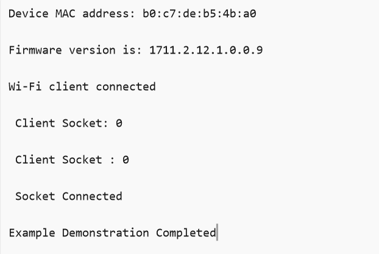

# Wi-Fi - Powersave Standby Associated TCP Client

## Table of Contents

- [Wi-Fi - Powersave Standby Associated TCP Client](#wi-fi---powersave-standby-associated-tcp-client)
  - [Table of Contents](#table-of-contents)
  - [Purpose/Scope](#purposescope)
  - [Prerequisites/Setup Requirements](#prerequisitessetup-requirements)
    - [Hardware Requirements](#hardware-requirements)
    - [Software Requirements](#software-requirements)
    - [Setup Diagram](#setup-diagram)
  - [Getting Started](#getting-started)
    - [Instructions for Simplicity Studio IDE and Silicon Labs Devices (SoC and NCP Modes)](#instructions-for-simplicity-studio-ide-and-silicon-labs-devices-soc-and-ncp-modes)
  - [Application Build Environment](#application-build-environment)
    - [Configure sl\_net\_default\_values.h](#configure-sl_net_default_valuesh)
  - [Test the Application](#test-the-application)
    - [Instructions for Simplicity Studio IDE and Silicon Labs Devices (SoC and NCP Modes)](#instructions-for-simplicity-studio-ide-and-silicon-labs-devices-soc-and-ncp-modes-1)
    - [Run the iPerf Server](#run-the-iperf-server)
    - [Using Simplicity Studio Energy Profiler for Current Measurement](#using-simplicity-studio-energy-profiler-for-current-measurement)

## Purpose/Scope

This application demonstrates SiWx91x to enable TCP data transfer in low power mode, with NWP in associated power save mode with retention and keeping M4 in sleep with retention after data transfer. NWP wakes up periodically based on the DTIM or listen interval configured by the user.

The application also demonstrates SiWx91x to connect to a remote server to send TCP data. It also enables the analysis of various performance profiles using a power analyzer during power save with data transfer via TCP.
## Prerequisites/Setup Requirements

### Hardware Requirements  

- Windows PC
- Wi-Fi access point with a connection to the internet
- PC2 (Remote PC) with TCP server application (iPerf)
- Power analyzer

- **SoC Mode**:
  - Standalone
    - BRD4002A Wireless Pro Kit Mainboard [SI-MB4002A]
    - Radio Boards 
  	  - BRD4338A [SiWx917-RB4338A]
      - BRD4342A [SiWx917-RB4342A]
      - BRD4343A [SiWx917-RB4343A]
  - Kits
  	- SiWx917 Pro Kit [Si917-PK6031A](https://www.silabs.com/development-tools/wireless/wi-fi/siwx917-pro-kit?tab=overview)
  	- SiWx917 Pro Kit [Si917-PK6032A]
    - SiWx917 AC1 Module Explorer Kit (BRD2708A)
  	
- **NCP Mode**:
  - Standalone
    - BRD4002A Wireless pro kit mainboard [SI-MB4002A]
    - EFR32xG24 Wireless 2.4 GHz +10 dBm Radio Board [xG24-RB4186C](https://www.silabs.com/development-tools/wireless/xg24-rb4186c-efr32xg24-wireless-gecko-radio-board?tab=overview)
    - NCP Expansion Kit with NCP Radio boards
      - (BRD4346A + BRD8045A) [SiWx917-EB4346A]
      - (BRD4357A + BRD8045A) [SiWx917-EB4357A]
  - Kits
  	- EFR32xG24 Pro Kit +10 dBm [xG24-PK6009A](https://www.silabs.com/development-tools/wireless/efr32xg24-pro-kit-10-dbm?tab=overview)

### Software Requirements

- Simplicity Studio IDE (to be used with Silicon Labs MCU)
- Serial Terminal - [Docklight](https://docklight.de/)/[Tera Term](https://ttssh2.osdn.jp/index.html.en)
- [iPerf Application](https://sourceforge.net/projects/iperf2/files/iperf-2.0.8-win.zip/download). iPerf is a tool for active measurements of the maximum achievable bandwidth on IP networks. It supports tuning of various parameters related to timing, buffers and protocols (TCP and UDP with IPv4 and IPv6).

### Setup Diagram

  
  
## Getting Started

### Instructions for Simplicity Studio IDE and Silicon Labs Devices (SoC and NCP Modes)
  Refer to the instructions [here](https://docs.silabs.com/wiseconnect/latest/wiseconnect-getting-started/) to:

  - Install Studio and WiSeConnect extension
  - Connect your device to the computer
  - Upgrade your connectivity firmware
  - Create a Studio project
  
For details on the project folder structure, see the [WiSeConnect Examples](https://docs.silabs.com/wiseconnect/latest/wiseconnect-examples/#example-folder-structure) page.

## Application Build Environment

The application can be configured to suit user requirements and development environment. Read through the following sections and make any changes needed.

### Configure sl_net_default_values.h

**File path for Simplicity Studio IDE:**
- In the Project Explorer pane, expand the **config** folder and open the **sl_net_default_values.h** file. 

Configure the following parameters to enable your Silicon Labs Wi-Fi device to connect to your Wi-Fi network:

  - DEFAULT_WIFI_CLIENT_PROFILE_SSID refers to the name with which the Wi-Fi network shall be advertised. The Si91X module is connected to it.

    ```c
    #define DEFAULT_WIFI_CLIENT_PROFILE_SSID               "YOUR_AP_SSID"      
    ```

  - DEFAULT_WIFI_CLIENT_CREDENTIAL refers to the secret key if the access point is configured in WPA-PSK/WPA2-PSK security modes.

    ```c
    #define DEFAULT_WIFI_CLIENT_CREDENTIAL                 "YOUR_AP_PASSPHRASE" 
    ```

  - DEFAULT_WIFI_CLIENT_SECURITY_TYPE refers to the security type of the access point. The supported security modes are mentioned in `sl_wifi_security_t`.

    ```c
    #define DEFAULT_WIFI_CLIENT_SECURITY_TYPE              SL_WIFI_WPA2
    ```

- Other STA instance configurations can be modified if required in `default_wifi_client_profile` configuration structure.

> **Note**: For recommended settings, please refer the [recommendations guide](https://docs.silabs.com/wiseconnect/latest/wiseconnect-developers-guide-prog-recommended-settings/).

- Configure the following parameters in **app.c** to test throughput app as per requirements:
  - `SERVER_PORT` is the remote TCP server port number on the PC running iPerf.
  - `SERVER_IP_ADDRESS` is the remote TCP server IP address on the PC running iPerf.
  - `NUMBER_OF_PACKETS` controls the number of packets sent to the remote TCP server.

      ```c
      #define SERVER_IP_ADDRESS   "192.168.0.198"
      #define SERVER_PORT         5656
      #define NUMBER_OF_PACKETS   1000
      ```
- To send the TCP data, change the `SEND_TCP_DATA` to `1`.

 - The user can configure the monitor interval through sl_wifi_set_performance_profile_v2() API. The default interval is set to 50 
   millisecs if the montior_interval is set to 0. This is only valid when the performance profile is set to ASSOCIATED_POWER_SAVE_LOW_LATENCY.
 - The user can configure the listen interval through sl_wifi_set_listen_interval_v2() API. The default interval is set to 1 
   millisec.

## Test the Application

### Instructions for Simplicity Studio IDE and Silicon Labs Devices (SoC and NCP Modes)

Refer to the instructions [here](https://docs.silabs.com/wiseconnect/latest/wiseconnect-getting-started/) to:

- Build the application.
- Flash, run, and debug the application.
- Application prints
    

### Run the iPerf Server

- Start a TCP server using the following command in command prompt.

  > `C:\ iperf.exe –s -p <SERVER_PORT> -i 1`

    

  > If the iPerf server does not start and gives an error in the form of "Access Denied", the user can resolve this error by running the command prompt as an administrator.

- When the powersave application runs, SiWx91x scans and connects to the Wi-Fi access point and obtains an IP address. After a successful connection, the device goes into configured power save and sends the configured number of TCP packets to the remote peer which is connected to access point. The following image shows active reception of TCP data on the TCP server.

    


### Using Simplicity Studio Energy Profiler for Current Measurement
  
- After flashing the application code to the module, the energy profiler can be used for current consumption measurements.

- From tools, choose Energy Profiler and click "OK".

    

- From Quick Access, choose Start Energy Capture option.

    

    > **Note** The target part and board name have to be reverted to default to flash application binary.

  
- Average current consumption measured in power-meter.

    

> **Note:**
> - The captured reference images are measured in an isolated chamber using the ASUS RT-AX3000 Dual Band Wi-Fi. However, variations may occur in open environments, and slight differences might be observed with certain access points APs.
> - The measured current is for `DTIM = 10` and with `TCP Keep Alive at 240 secs`. Refer to the datasheet for current consumption values for Standby associated with TCP protocol.  
> - To achieve the lowest power numbers in connected sleep, in SoC mode, configure `RAM_LEVEL` to `SL_SI91X_RAM_LEVEL_NWP_BASIC_MCU_ADV` and M4 to sleep without RAM retention, i.e., do not configure to `sl_si91x_configure_ram_retention`.
> - A flash erase is required to flash any other application after the user runs the powersave application(s). If not, the module will not allow any application to be flashed.
