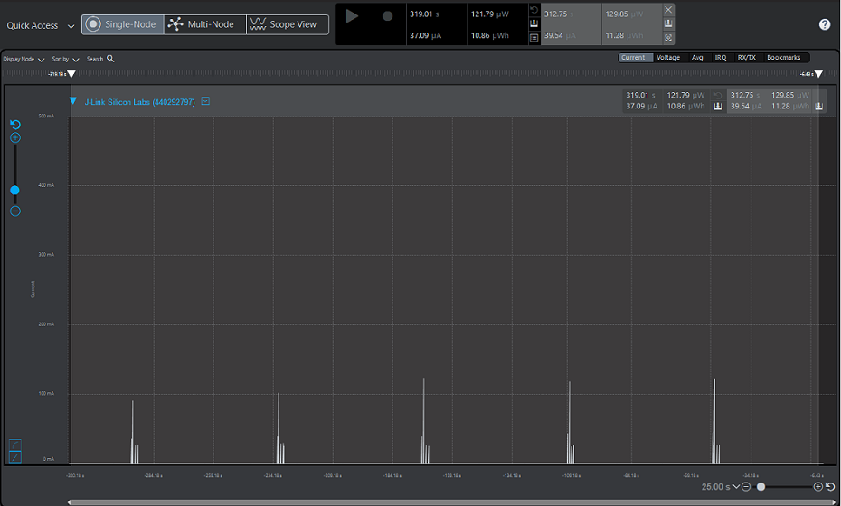

# Wi-Fi - TWT TCP Client

## Table of Contents

- [Purpose/Scope](#purposescope)
- [Prerequisites/Setup Requirements](#prerequisitessetup-requirements)
  - [Hardware Requirements](#hardware-requirements)
  - [Software Requirements](#software-requirements)
  - [Setup Diagram](#setup-diagram)
- [Getting Started](#getting-started)
- [Application Build Environment](#application-build-environment)
- [iTWT Session Status Codes](#itwt-session-status-codes)
- [TWT Recommendations](#twt-recommendations)
- [Test the application](#test-the-application)
- [Additional Information](#additional-information)

## Purpose/Scope

This application demonstrates how SiWx91x is configured in Associated Powersave mode (NWP) with TWT and M4 in sleep with retention. It also describes the procedure to setup individual Target Wake Time (iTWT) session and configure the SiWx91x in TCP client role. 

In this application, the SiWx91x connects to a Wi-Fi access point, obtains an IP address, connects to a TCP (iPerf) server running on a remote PC, and maintains TCP Socket connection and periodically wakes up as per the configured TWT wakeup interval in powersave.

## Prerequisites/Setup Requirements

### Hardware Requirements  

- Windows PC
- Wi-Fi access point with 11ax and TWT responder mode support.
- PC2 (Remote PC) with TCP server application (iPerf)
- **SoC Mode**:
  - Standalone
    - BRD4002A Wireless Pro Kit Mainboard [SI-MB4002A]
    - Radio Boards 
  	  - BRD4338A [SiWx917-RB4338A]
  	  - BRD4343A [SiWx917-RB4343A]
  - Kits
  	- SiWx917 Pro Kit [Si917-PK6031A](https://www.silabs.com/development-tools/wireless/wi-fi/siwx917-pro-kit?tab=overview)
  	- SiWx917 Pro Kit [Si917-PK6032A]
    - SiWx917 AC1 Module Explorer Kit (BRD2708A)
  	
- **NCP Mode**:
  - Standalone
    - BRD4002A Wireless Pro Kit Mainboard [SI-MB4002A]
    - EFR32xG24 Wireless 2.4 GHz +10 dBm Radio Board [xG24-RB4186C](https://www.silabs.com/development-tools/wireless/xg24-rb4186c-efr32xg24-wireless-gecko-radio-board?tab=overview)
    - NCP Expansion Kit with NCP Radio Boards
      - (BRD4346A + BRD8045A) [SiWx917-EB4346A]
      - (BRD4357A + BRD8045A) [SiWx917-EB4357A]
  - Kits
  	- EFR32xG24 Pro Kit +10 dBm [xG24-PK6009A](https://www.silabs.com/development-tools/wireless/efr32xg24-pro-kit-10-dbm?tab=overview) 
  - Interface and Host MCU Supported
    - SPI - EFR32 

### Software Requirements

- Simplicity Studio
- [iPerf Application](https://sourceforge.net/projects/iperf2/files/iperf-2.0.8-win.zip/download). iPerf is a tool for active measurements of the maximum achievable bandwidth on IP networks. It supports tuning of various parameters related to timing, buffers, and protocols (TCP and UDP with IPv4 and IPv6).
- TCP server application (iPerf)

### Setup Diagram


## Getting Started

Refer to the instructions [here](https://docs.silabs.com/wiseconnect/latest/wiseconnect-getting-started/) to:

- [Install Simplicity Studio](https://docs.silabs.com/wiseconnect/latest/wiseconnect-developers-guide-developing-for-silabs-hosts/#install-simplicity-studio)
- [Install WiSeConnect 3 extension](https://docs.silabs.com/wiseconnect/latest/wiseconnect-developers-guide-developing-for-silabs-hosts/#install-the-wi-se-connect-3-extension)
- [Connect your device to the computer](https://docs.silabs.com/wiseconnect/latest/wiseconnect-developers-guide-developing-for-silabs-hosts/#connect-si-wx91x-to-computer)
- [Upgrade your connectivity firmware ](https://docs.silabs.com/wiseconnect/latest/wiseconnect-developers-guide-developing-for-silabs-hosts/#update-si-wx91x-connectivity-firmware)
- [Create a Studio project ](https://docs.silabs.com/wiseconnect/latest/wiseconnect-developers-guide-developing-for-silabs-hosts/#create-a-project)

For details on the project folder structure, see the [WiSeConnect Examples](https://docs.silabs.com/wiseconnect/latest/wiseconnect-examples/#example-folder-structure) page.

## Application Build Environment

The application can be configured to suit your requirements and development environment.

- In the Project explorer pane, expand the **config** folder and open the **sl_net_default_values.h** file. Configure the following parameters to enable your SiWx917 device to connect to your Wi-Fi network.

- STA instance related parameters

  - DEFAULT_WIFI_CLIENT_PROFILE_SSID refers to the name with which Wi-Fi network that shall be advertised and Si91X device is connected to it.
  
     ```c
     #define DEFAULT_WIFI_CLIENT_PROFILE_SSID               "YOUR_AP_SSID"      
     ```

  - DEFAULT_WIFI_CLIENT_CREDENTIAL refers to the secret key if the Access point is configured in WPA-PSK/WPA2-PSK security modes.

     ```c 
     #define DEFAULT_WIFI_CLIENT_CREDENTIAL                 "YOUR_AP_PASSPHRASE" 
     ```

  - DEFAULT_WIFI_CLIENT_SECURITY_TYPE refers to the security type if the Access point is configured in WPA/WPA2 or mixed security modes.

     ```c
     #define DEFAULT_WIFI_CLIENT_SECURITY_TYPE              SL_WIFI_WPA2 
     ```
  
  - Other STA instance configurations can be modified if required in `default_wifi_client_profile` configuration structure.

  > Note: 
  > The user can configure default region specific regulatory information using `sl_wifi_region_db_config.h`.

  - Configure the following parameters in **app.c** to test the application as per requirements:
    - `SERVER_PORT` is the remote TCP server port number on the PC running iPerf.
    - `SERVER_IP` is the remote TCP server IP address on the PC running iPerf. 

    ```c
    #define SERVER_IP   "192.168.0.247"
    #define SERVER_PORT         5001
    ```
    To enable the TCP data transfer, define SEND_TCP_DATA to 1. By default, this is disbaled.
    ```c
    #define SEND_TCP_DATA 1
    ```    

- Configure TCP Keep Alive timeout in **app.c**, timeout in seconds.

    ```c
    #define TCP_KEEP_ALIVE_TIME 240
    ```    

- individual Target Wake Time (iTWT) Configuration

     To configure iTWT parameters, open **app.c**.
     There are three TWT configuration APIs. 
     >
     > - **sl_wifi_target_wake_time_auto_selection** - This API calculates and automatically configures suitable TWT parameters based on the given inputs (described below). Enables or disables a TWT session. Recommended for user applications.
     > - **sl_wifi_enable_target_wake_time** - This API allows users to manually configure iTWT session parameters and enables the iTWT session. This API is not recommended for users. It is for internal certification purposes only.
     > - **sl_wifi_disable_target_wake_time** - Disables a TWT session.

    **sl_wifi_target_wake_time_auto_selection API**

    ```c
      sl_status_t sl_wifi_target_wake_time_auto_selection(sl_wifi_twt_selection_t *twt_auto_request)
    ```

     This TWT API is recommended because it is designed for maintaining connections, improving throughput, and enhancing power performance.
     Input parameters description is as follows:

     - **twt_enable** : TWT enable. 
     0 - TWT session teardown 
     1 - TWT session setup
     - **average_tx_throughput** : This is the expected average Tx throughput in Kbps. 
     Value ranges from 0 to 10 Mbps, which is half of the default [device_average_throughput](https://docs.silabs.com/wiseconnect/latest/wiseconnect-api-reference-guide-wi-fi/sl-wifi-twt-selection-t#device-average-throughput) (20 Mbps by default).
     - **tx_latency** : The allowed latency, in milliseconds, within which the given Tx operation is expected to be completed. 
     If 0 is configured, maximum allowed Tx latency is the same as rx_latency. 
     Otherwise, valid values are in the range of [200 ms - 6 hrs].
     - **rx_latency** : The maximum latency, in milliseconds, for receiving buffered packets from the AP. The device wakes up at least once for a TWT service period within the configured rx_latency if there are any pending packets destined for the device from the AP. 
     If set to 0, the default latency of 2 seconds is used. 
     Valid range is between 2 seconds to 6 hours. Recommended range is 2 seconds to 60 seconds to avoid connection failures with AP due to longer sleep time.

     For more information on input parameters, refer to [sl_wifi_twt_selection_t](https://docs.silabs.com/wiseconnect/latest/wiseconnect-api-reference-guide-wi-fi/sl-wifi-twt-selection-t).

     Enable TWT_AUTO_CONFIG MACRO in the app.c file to enable usage of this API. By default, this is enabled.

     ```c
     #define TWT_AUTO_CONFIG         1
     ```
     The following are sample configurations:

    ```c
    sl_wifi_twt_selection_t default_twt_selection_configuration = {
      .twt_enable                            = 1,
      .average_tx_throughput                 = 0,
      .tx_latency                            = 0,
      .rx_latency                            = TWT_RX_LATENCY,
      .device_average_throughput             = DEVICE_AVERAGE_THROUGHPUT,
      .estimated_extra_wake_duration_percent = ESTIMATE_EXTRA_WAKE_DURATION_PERCENT,
      .twt_tolerable_deviation               = TWT_TOLERABLE_DEVIATION,
      .default_wake_interval_ms              = TWT_DEFAULT_WAKE_INTERVAL_MS,
      .default_minimum_wake_duration_ms      = TWT_DEFAULT_WAKE_DURATION_MS,
      .beacon_wake_up_count_after_sp         = MAX_BEACON_WAKE_UP_AFTER_SP
    };
    ```
     - The following are the default macro settings. The user should not change these values as it may affect the working of the algorithm. 

     ```c
     #define TWT_RX_LATENCY                       60000    // in milliseconds
     #define DEVICE_AVG_THROUGHPUT                20000    // Kbps
     #define ESTIMATE_EXTRA_WAKE_DURATION_PERCENT 0        // in percentage
     #define TWT_TOLERABLE_DEVIATION              10       // in percentage
     #define TWT_DEFAULT_WAKE_INTERVAL_MS         1024     // in milliseconds
     #define TWT_DEFAULT_WAKE_DURATION_MS         16       // in milliseconds
     #define MAX_BEACON_WAKE_UP_AFTER_SP \
     2 // The number of beacons after the service period completion for which the module wakes up and listens for any pending RX.
     ```

    > Note :  WLAN Keep-Alive timeout should not be disabled while using this API as there may be interoperability disconnection issues. It is recommended to use WLAN Keep Alive timeout of 30 sec, which is the default configuration.

    **sl_wifi_enable_target_wake_time API**

    Usage of this API requires knowledge of individual TWT setup negotiation. This API doesn't take care of network disconnections.

    ```c
    sl_status_t sl_wifi_enable_target_wake_time(sl_wifi_twt_request_t *twt_req);
    ```

    iTWT parameters should be configured and filled into the structure type *sl_wifi_twt_request_t*  in app.c and passed as a parameter to *sl_wifi_enable_target_wake_time()* API.

    The following are sample configurations:

    ```c
    sl_wifi_twt_request_t default_twt_setup_configuration = {
      .twt_enable              = 1,
      .twt_flow_id             = 1,
      .wake_duration           = 0x60,
      .wake_duration_unit      = 0,
      .wake_duration_tol       = 0x60,
      .wake_int_exp            = 13,
      .wake_int_exp_tol        = 13,
      .wake_int_mantissa       = 0x1D4C,
      .wake_int_mantissa_tol   = 0x1D4C,
      .implicit_twt            = 1,
      .un_announced_twt        = 1,
      .triggered_twt           = 0,
      .twt_channel             = 0,
      .twt_protection          = 0,
      .restrict_tx_outside_tsp = 1,
      .twt_retry_limit         = 6,
      .twt_retry_interval      = 10,
      .req_type                = 1,
      .negotiation_type        = 0,
    };
    ```

    These parameters with their limits are defined as below.

    - **twt_enable**:  1- Setup ; 0 - teardown
    - **twt_flow_id**: range 0-7 or 0xFF
    - **twt_req_params**: Structure with parameters in case of setup and NULL in case of teardown.
    - **wake_duration**: This is the nominal minimum wake duration of TWT. This is the time for which DUT will be in wake state for transmission or reception of data. Allowed values range is  0-255.
    - **wake_duration_unit**: This parameter defines the unit for wake_duration. Allowed values are  0 (256 uS) and 1 (1024 uS).
    - **wake_duration_tol**: This is the tolerance allowed for wake duration in case of Suggest TWT. Received TWT wake duration from AP will be validated against tolerance limits and decided if TWT config received is in acceptable range. Allowed values are 0-255.
    - **wake_int_exp**: TWT Wake interval exponent. It is exponent to base 2. Allowed values are 0 - 31.
    - **wake_int_exp_tol**: This is the allowed tolerance for wake_int_exp in case of Suggest TWT request. Received TWT wake interval exponent from AP will be validated against tolerance limits and decided if TWT config received is in acceptable range. Allowed values are 0 - 31.
    - **wake_int_mantissa**: This is the TWT wake interval mantissa. Allowed values are 0-65535.
    - **wake_int_mantissa_tol**: This is tolerance allowed for wake_int_mantissa in case of Suggest TWT. Received TWT wake interval mantissa from AP will be validated against tolerance limits and decided if TWT config received is in acceptable range. Allowed values are 0-65535.
    - **implicit_twt**: If enabled (1), the TWT requesting STA calculates the Next TWT by adding a fixed value to the current TWT value. Explicit TWT is currently not allowed.
    - **un_announced_twt**: If enabled (1), TWT requesting STA does not announce its wake up to AP through PS-POLLs or UAPSD Trigger frames.
    - **triggered_twt**: If enabled(1), at least one trigger frame is included in the TWT Service Period (TSP).
    - **twt_channel**: Currently, this configuration is not supported. Allowed values are 0-7.
    - **twt_protection**:  If enabled (1), TSP is protected. This is negotiable with AP. Currently not supported. Only zero is allowed.
    - **restrict_tx_outside_tsp**: If enabled (1), any Tx outside the TSP is restricted. Else, TX can happen outside the TSP also.
    - **twt_retry_limit**: This is the maximum number of retries allowed, if the TWT response frame is not received for the sent TWT request frame. Allowed values are 0 - 15.
    - **twt_retry_interval**: The interval, in seconds, between two TWT request retries. Allowed values are 5 - 255.
    - **req_type**: This is the TWT request type.
      - 0 - Request TWT
      - 1 - Suggest TWT
      - 2 - Demand TWT

    The following is the sample TWT setup API call:

    ```c
      status                          = sl_wifi_enable_target_wake_time(&twt_request);
    ```

    > Note:
    >
    > - TWT Wake duration depends on the wake duration unit. For example, for the above configuration, the wake duration value is  (0x60 * 256 = 24.5 msec).
    > - TWT Wake interval is calculated as mantissa *2 ^ exp.  For example, for the above configuration, the wake interval value is (0x1D4C * 2^13  = 61.4 sec).
    > - Configuring the TWT Wake interval beyond 1 min might lead to disconnections from the AP.
    > - There might be disconnections while using TWT with wake interval > 4 sec when connected to an AP with non-zero GTK key renewal time.
    > - Keep Alive timeout should be non-zero when negotiated TWT setup is **unannounced**, otherwise there might be disconnections.

- iTWT Teardown Configuration

    To teardown the TWT session, use the matching TWT teardown API corresponding to the TWT setup configuration API:
    1. For TWT parameters Auto Selection API, call the following API to teardown:
    ```c
      status = sl_wifi_target_wake_time_auto_selection(twt_selection);
    ```
    - Set twt_enable parameter to '0' in the **twt_selection** structure. 
    - The other parameters in the structure are ignored. 

    2. For manually configurable TWT parameters API, call the following API to teardown:
    ```c
      status = sl_wifi_disable_target_wake_time(&twt_req);
    ```
    - twt_req->twt_enable should be set to '0' for teardown operation.
    - twt_req->twt_flow_id should be configured as described below: 
      - This paramater value range is 0-7. It should be the same as setup flow ID, otherwise an error will be triggered.
      - 0xFF - To tear down all active sessions. This value is valid only in case of Teardown command.
    - The rest of the parameters in the structure are ignored for a Teardown operation. 

    > Note : To set a new TWT session, you must first tear down the existing TWT session.


## iTWT Session Status Codes

The user can get asynchronous TWT session updates if *twt_response_handler* is defined and the callback is registered. A *twt_response_handler* is provided in the example application. The following are the TWT session status codes.

|S.No|  MACRO|  Session status code|  Description|
|:----|:------|:-------------------|:--------------|
|1.|  TWT_SESSION_SUCC| 0|  TWT session setup success. TWT session is active.|
|2.|  TWT_UNSOL_SESSION_SUCC| 1|  Unsolicited TWT setup response from AP accepted. TWT session is active.|
|3.|  TWT_SETUP_AP_REJECTED|  4|  TWT Reject frame received in response for the sent TWT setup frame.|
|4.|  TWT_SETUP_RSP_OUTOF_TOL|5|  TWT response parameters from AP for TWT Suggest request is not within tolerance set by user.|
|5.|  TWT_SETUP_RSP_NOT_MATCHED|  6|  TWT response parameters from AP for TWT Demand request does not match parameters given by user.|
|6.|  TWT_SETUP_UNSUPPORTED_RSP|  10| Unsupported TWT response from AP.|
|7.|  TWT_TEARDOWN_SUCC|  11| TWT session teardown success|
|8.|  TWT_AP_TEARDOWN_SUCC| 12| TWT session teardown from AP success|
|9.|  TWT_SETUP_FAIL_MAX_RETRIES_REACHED| 15| TWT setup request retried maximum number of times as configured by user.|
|10.| TWT_INACTIVE_DUETO_ROAMING| 16  |TWT session inactive due to roaming|
|11.| TWT_INACTIVE_DUETO_DISCONNECT|  17| TWT session inactive due to disconnect|
|12.| TWT_INACTIVE_NO_AP_SUPPORT| 18| TWT session inactive as connected AP does not support TWT.|

> Note:
> **twt_session_active** variable is provided in the example application and is updated according to the asychronous TWT session notifications. User can utilise this variable to teardown or configure new session parameters depending upon existing session status. 

## TWT Recommendations

1. Use sl_wifi_target_wake_time_auto_selection with appropriate Rx Latency input according to the use case as it has improved design over sl_wifi_enable_target_wake_time. Also, it handles network level disconnections such as ARP, Embedded MQTT, and TCP connections. It has better user interface and simplifies TWT usage.
2. iTWT setup is recommended after IP assignment/TCP connection/application connection.
3. When using sl_wifi_target_wake_time_auto_selection API, Rx Latency should be less than TCP / ARP Timeouts at the remote side.
4. When using sl_wifi_enable_target_wake_time API, TWT interval configured should be less than TCP / ARP Timeouts at the remote side.
5. For iTWT, GTK Interval should be kept at the maximum possible value or zero. If GTK interval is not configurable, recommended TWT interval (in case of sl_wifi_enable_target_wake_time) / RX Latency (in case of sl_wifi_target_wake_time_auto_selection API) is less than 4 sec.
6. When sl_wifi_enable_target_wake_time API is used, configuring TWT Wake interval beyond 1 min might lead to disconnections from the AP. We recommend using a TWT wakeup interval less than or equal to 1 min.
7. WLAN Keep Alive timeout should **not** be disabled when sl_wifi_target_wake_time_auto_selection API is used or when unannounced TWT session is set up using sl_wifi_enable_target_wake_time API. We recommend using WLAN Keep Alive timeout of 30 sec, which is the default timeout even if not configured specifically by the user.

## Soc Mode:

### Without Tickless Mode:

The M4 processor is configured to be in sleep mode. The M4 processor can be woken in several ways as described below:

- ALARM timer-based - In this method, an ALARM timer runs and wakes the M4 processor periodically.
  - We can enable the ALARM timer-wakeup by setting the macros "SL_ENABLE_CALENDAR_WAKEUP_SOURCE" and "ENABLE_ALARM" to '1'.
  - We can configure the periodic alarm time by setting the macro "ALARM_TIME_MSEC" to a specific value.
- Button press-based (GPIO) - In this method, the M4 processor wakes up upon pressing a button (BTN0).
  - We can enable the Button press-based wakeup by setting the macro "ENABLE_NPSS_GPIO_2" to '1'.
- Wireless-based - When an RX packet is to be received by the NWP, the M4 processor is woken up.

### Tickless Mode

In Tickless Mode, the device enters sleep based on the idle time set by the scheduler. The device can be awakened by two methods: SysRTC or a wireless signal.

- **System Real-Time Clock (SysRTC)**: By default, the device uses SysRTC as the wakeup source. The device will enter sleep mode and then wake up when the SysRTC matches the idle time set by the scheduler.

- **Wireless Wakeup**: The device can also be awakened by a wireless signal. If this signal is triggered before the idle time set by the scheduler, the device will wake up in response to it.

## Test the Application

Refer to the instructions [here](https://docs.silabs.com/wiseconnect/latest/wiseconnect-getting-started/) to:

- Build the application.
- Flash, run, and debug the application.

- Application prints

  

### Additional Information

#### Using Simplicity Studio Energy Profiler for current measurement
  
  After flashing the application code to the module, the Energy Profiler can be used for current consumption measurements.

- From **Tools**, choose Energy Profiler and click "OK".

  

- From Quick Access, choose Start Energy Capture option.

  

- Expected output in Energy Profiler:

  

>**NOTE:**
> - The reference images which are captured are measured in an isolated chamber and might vary in an open environment. Occasionally, there might be a slight variation observed with some APs.

#### Using Simplicity Studio Energy Profiler in Min/max Mode

- THe Energy Profiler can be configured to Min/Max mode, as shown below:

   
