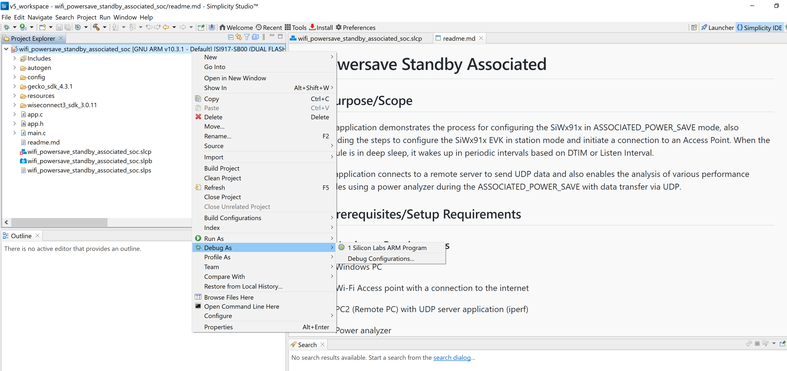
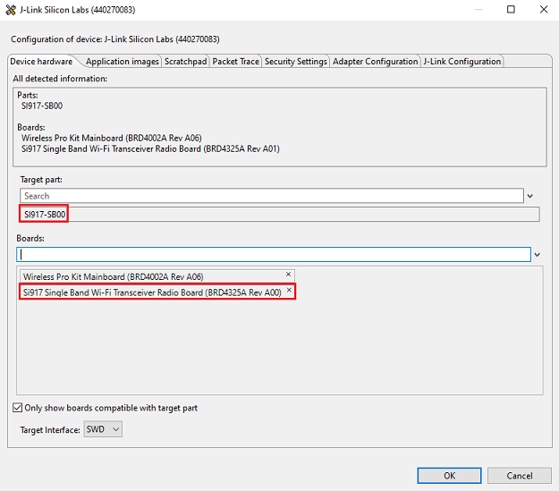

# Powersave Standby Associated

## 1 Purpose/Scope

This application demonstrates the process for configuring the SiWx91x in ASSOCIATED_POWER_SAVE mode, also providing the steps to configure the SiWx91x EVK in station mode and initiate a connection to an Access Point. When the module is in deep sleep, it wakes up in periodic intervals based on DTIM or Listen Interval.

The application connects to a remote server to send UDP data and also enables the analysis of various performance profiles using a power analyzer during the ASSOCIATED_POWER_SAVE with data transfer via UDP.

## 2 Prerequisites/Setup Requirements

### 2.1 Hardware Requirements  

- Windows PC
- Wi-Fi Access point with a connection to the internet
- PC2 (Remote PC) with UDP server application (iperf)
- Power analyzer
- **SoC Mode**:
  - Silicon Labs [BRD4325A, BRD4325B, BRD4325C, BRD4325G, BRD4338A, BRD4340A](https://www.silabs.com/)
  - For Soc Mode, Simplicity Studio Energy Profiler can be used for the current consumption measurement - [Simplicity Studio Energy Profiler](#using-simplicity-studio-energy-profiler-for-current-measurement).
- **NCP Mode**:
  - Silicon Labs [BRD4180B](https://www.silabs.com/) **AND**
  - Host MCU Eval Kit. This example has been tested with:
    - Silicon Labs [WSTK + EFR32MG21](https://www.silabs.com/development-tools/wireless/efr32xg21-bluetooth-starter-kit)
  - Current consumption measurement pins for using power-meter (NCP mode):

    

    Negative probe of power meter is used for pin-1 and positive probe is used for pin-2

### 2.2 Software Requirements

- Simplicity Studio IDE

  - Download the latest [Simplicity Studio IDE](https://www.silabs.com/developers/simplicity-studio)
  - Follow the [Simplicity Studio user guide](https://docs.silabs.com/simplicity-studio-5-users-guide/1.1.0/ss-5-users-guide-getting-started/install-ss-5-and-software#install-ssv5) to install Simplicity Studio IDE

- [Iperf Application](https://iperf.fr/iperf-download.php)

### 2.3 Setup Diagram

#### SoC Mode


  
#### NCP Mode  


Follow the [Getting Started with Wiseconnect SDK](https://docs.silabs.com/wiseconnect/latest/wiseconnect-getting-started/) guide to set up the hardware connections and Simplicity Studio IDE.

**NOTE**:

- The Host MCU platform (EFR32MG21) and the SiWx91x interact with each other through the SPI interface.

Follow the [Getting Started with Wiseconnect3 SDK](https://docs.silabs.com/wiseconnect/latest/wiseconnect-getting-started/) guide to set up the hardware connections and Simplicity Studio IDE.

## 3 Project Environment

- Ensure the SiWx91x loaded with the latest firmware following the [Upgrade Si91x firmware](https://docs.silabs.com/wiseconnect/latest/wiseconnect-getting-started/getting-started-with-soc-mode#upgrade-si-wx91x-connectivity-firmware)

- Ensure the latest Gecko SDK along with the extension WiSeConnect3 is added to Simplicity Studio.

### 3.1 Creating the project

#### 3.1.1 SoC mode

- Ensure the SiWx91x set up is connected to your PC.

- In the Simplicity Studio IDE, the SiWx91x SoC board will be detected under **Debug Adapters** pane as shown below.

  ****

#### 3.1.2 NCP mode

- Ensure the EFx32 and SiWx91x set up is connected to your PC.

- In the Simplicity Studio IDE, the EFR32 board will be detected under **Debug Adapters** pane as shown below.

  ****

### 3.2 Importing the project

- Studio should detect your board. Your board will be shown here. Click on the board detected and go to **EXAMPLE PROJECTS & DEMOS** section 

#### SOC Mode

- Select **Wi-Fi - Powersave Standby Associated(SOC)** test application

  ****

- Click 'Create'. The "New Project Wizard" window appears. Click 'Finish'

  ****

#### NCP Mode

- Select **Wi-Fi - Powersave Standby Associated(NCP)** test application

  ****

- Click 'Create'. The "New Project Wizard" window appears. Click 'Finish'

  ****

### 3.3 Set up for application prints

#### 3.3.1 Teraterm set up - for BRD4325A, BRD4325B, BRD4325C, BRD4325G, BRD4340A 

You can use either of the below USB to UART converters for application prints.

1. Set up using USB to UART converter board.

   - Connect Tx (Pin-6) to P27 on WSTK
   - Connect GND (Pin 8 or 10) to GND on WSTK

   ****

2. Set up using USB to UART converter cable.

   - Connect RX (Pin 5) of TTL convertor to P27 on WSTK
   - Connect GND (Pin1) of TTL convertor to GND on WSTK

   ****

3. Open the Teraterm tool.

   - For SoC mode, choose the serial port to which USB to UART converter is connected and click on **OK**.

     ****

**Note:** For Other 917 SoC boards please refer section #3.3.2

#### 3.3.2 **Teraterm set up - for NCP and SoC modes**

1. Open the Teraterm tool.

- choose the J-Link port and click on **OK**.
    
    ****

2. Navigate to the Setup → Serial port and update the baud rate to **115200** and click on **OK**.

    ****

    ****

## 4 Application Build Environment

The application can be configured to suit your requirements and development environment.

### 4.1.1 In the Project explorer pane, expand the **config** folder and open the **sl_net_default_values.h** file. Configure the following parameters to enable your Silicon Labs Wi-Fi device to connect to your Wi-Fi network

- **STA instance related parameters**

	- DEFAULT_WIFI_CLIENT_PROFILE_SSID refers to the name with which Wi-Fi network that shall be advertised and Si91X module is connected to it.
	
  	```c
  	#define DEFAULT_WIFI_CLIENT_PROFILE_SSID               "YOUR_AP_SSID"      
  	```

	- DEFAULT_WIFI_CLIENT_CREDENTIAL refers to the secret key if the Access point is configured in WPA-PSK/WPA2-PSK security modes.

  	```c
  	#define DEFAULT_WIFI_CLIENT_CREDENTIAL                 "YOUR_AP_PASSPHRASE" 
  	```

	- DEFAULT_WIFI_CLIENT_SECURITY_TYPE refers to the security type of the Access point. The supported security modes are mentioned in `sl_wifi_security_t`.

  	```c
  	#define DEFAULT_WIFI_CLIENT_SECURITY_TYPE              SL_WIFI_WPA2
  	```

- Other STA instance configurations can be modified if required in `default_wifi_client_profile` configuration structure.

### 4.1.2 Configure the application

- `SERVER_PORT` is the remote UDP server port number on the PC running Iperf.
- `SERVER_IP_ADDRESS` is the remote UDP server IP address on the PC running Iperf. 
- `NUMBER_OF_PACKETS` controls the number of packets sent to the remote UDP server.

```c
#define SERVER_IP_ADDRESS   "192.168.0.198"
#define SERVER_PORT         5656
#define NUMBER_OF_PACKETS   1000
```

### 4.2 Build the application

- SoC mode: Build as Powersave Standby Associated Example

    ****

- NCP mode: Build as Powersave Standby Associated Example

  ****

### 4.3 Run and Test the application

- Once the build was successful, right click on project and click on Debug As->Silicon Labs ARM Program as shown in below image.

  - SoC

    

  - NCP

    

- Start a UDP server using the below command in command prompt.

> `C:\ iperf.exe –s -u -p <SERVER_PORT> -i 1`

  

> If the IPerf server does not start and gives an error in the form of "Access Denied", the user can resolve this error by running the command prompt as an administrator.

- When the powersave application runs, SiWx91x scans and connect to the Wi-Fi access point and obtains an IP address. After a successful connection, the device goes into configured power save and sends configured number of UDP packets to the remote peer which is connected to access point. The following image shows active reception of UDP data on the UDP server.

  

### 4.4 Application Output

- SoC and NCP mode:

  

### 4.5 Additional Information

- Average current consumption measured in power-meter

  

  **NOTE** : The measured current may vary if the scenario is performed in open environment. AP to AP variation is also observed.
  **NOTE** : To achieve the lowest power numbers in connected sleep, in SoC mode, one should configure `RAM_LEVEL` to `RAM_LEVEL_NWP_BASIC_MCU_ADV` and M4 to without RAM retention i.e. `sl_si91x_configure_ram_retention` should not be done.

4.5.1 Using Simplicity Studio Energy Profiler for current measurement:
  
- After flashing the application code to the module. Energy profiler can be used for current consumption measurements.

- Go to launcher → Debug Adapters pane and click on the board name.
  
  

- Click on Device configuration symbol
  
  

- Open the device configuration tab
  
  

- Change the Target part name to "EFR32MG21A020F1024IM32"

  

- Change board name to "BRD4180B", click "OK"

  

- From tools, choose Energy Profiler and click "OK"

  

- From Quick Access, choose Start Energy Capture option

  

**NOTE** : The target part and board name have to be reverted to default to flash application binary.

  

### Note

For NCP mode, following defines have to enabled manually in preprocessor setting of example project

- For 917A0 expansion board, enable CHIP_917 = 1
- For 917B0 1.2 expansion board, enable CHIP_917 = 1, CHIP_917B0 = 1
- For 917B0 2.0 expansion board, enable CHIP_917 = 1, CHIP_917B0 = 1, SI917_RADIO_BOARD_V2 = 1 (This is enabled by default for all examples)  
