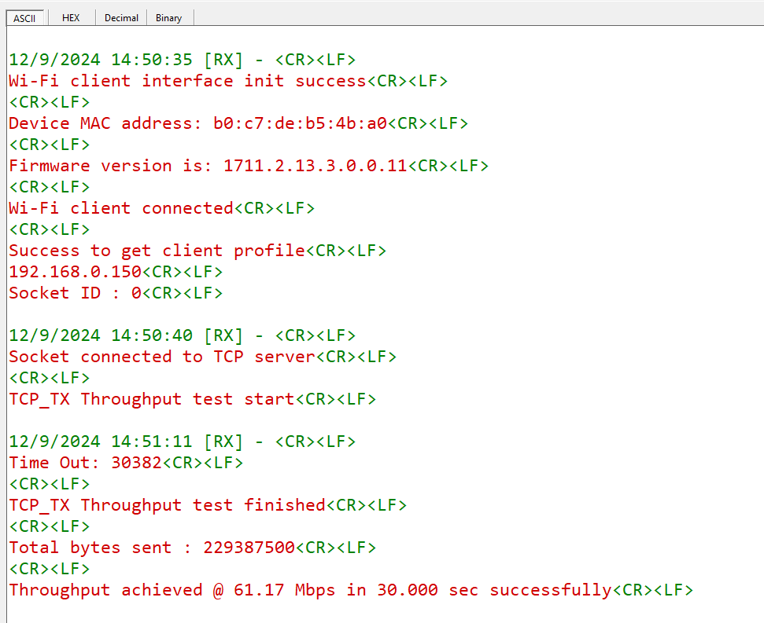

# Wi-Fi - Throughput 

## Table of Contents

- [Wi-Fi - Throughput](#wi-fi---throughput)
  - [Table of Contents](#table-of-contents)
  - [Purpose/Scope](#purposescope)
  - [Prerequisites/Setup Requirements](#prerequisitessetup-requirements)
    - [Hardware Requirements](#hardware-requirements)
    - [Software Requirements](#software-requirements)
    - [Setup Diagram](#setup-diagram)
  - [Getting Started](#getting-started)
    - [Instructions for Keil IDE and STM32F411RE MCU (NCP Mode)](#instructions-for-keil-ide-and-stm32f411re-mcu-ncp-mode)
    - [Instructions for Simplicity Studio IDE and Silicon Labs Devices (SoC and NCP Modes)](#instructions-for-simplicity-studio-ide-and-silicon-labs-devices-soc-and-ncp-modes)
  - [Application Build Environment](#application-build-environment)
    - [Configure sl\_net\_default\_values.h](#configure-sl_net_default_valuesh)
  - [Test the Application](#test-the-application)
    - [Instructions for Simplicity Studio IDE and Silicon Labs Devices (SoC and NCP Modes)](#instructions-for-simplicity-studio-ide-and-silicon-labs-devices-soc-and-ncp-modes-1)
    - [Instructions for Keil IDE and STM32F411RE MCU](#instructions-for-keil-ide-and-stm32f411re-mcu)
    - [Application Prints:](#application-prints)
    - [To Run Server](#to-run-server)
      - [UDP Tx Throughput](#udp-tx-throughput)
        - [For SOC:](#for-soc)
        - [For NCP with EFR host:](#for-ncp-with-efr-host)
      - [UDP Rx Throughput](#udp-rx-throughput)
        - [For SOC:](#for-soc-1)
        - [For NCP with EFR host:](#for-ncp-with-efr-host-1)
      - [TCP Tx Throughput](#tcp-tx-throughput)
        - [For SOC:](#for-soc-2)
        - [For NCP with EFR host:](#for-ncp-with-efr-host-2)
      - [TCP Rx Throughput](#tcp-rx-throughput)
        - [For SOC:](#for-soc-3)
        - [For NCP with EFR host:](#for-ncp-with-efr-host-3)
      - [TLS Tx Throughput](#tls-tx-throughput)
        - [For SOC:](#for-soc-4)
        - [For NCP with EFR host:](#for-ncp-with-efr-host-4)
      - [TLS Rx Throughput](#tls-rx-throughput)
        - [For SOC:](#for-soc-5)
        - [For NCP with EFR host:](#for-ncp-with-efr-host-5)
  
## Purpose/Scope

This application demonstrates the procedure to measure WLAN UDP/TCP/TLS throughput by configuring the SiWx91x in client/server role.
In this application, the SiWx91x connects to a Wi-Fi access point, obtains an IP address, connects to iPerf server/client or Python-based TLS scripts, running on a remote PC, and measures Tx/Rx throughput transmitted/received from remote PC.

## Prerequisites/Setup Requirements

### Hardware Requirements

- Windows PC
- Wireless Access Point
- **SoC Mode**:
  - Standalone
    - BRD4002A Wireless Pro Kit Mainboard [SI-MB4002A]
    - Radio Boards 
  	  - BRD4338A [SiWx917-RB4338A]
      - BRD4342A [SiWx917-RB4342A]
      - BRD4343A [SiWx917-RB4343A]
  - Kits
  	- SiWx917 Pro Kit [Si917-PK6031A](https://www.silabs.com/development-tools/wireless/wi-fi/siwx917-pro-kit?tab=overview)
  	- SiWx917 Pro Kit [Si917-PK6032A]
    - SiWx917 AC1 Module Explorer Kit (BRD2708A)
  	
- **NCP Mode**:
  - Standalone
    - BRD4002A Wireless Wireless Pro Kit Mainboard [SI-MB4002A]
    - EFR32xG24 Wireless 2.4 GHz +10 dBm Radio Board [xG24-RB4186C](https://www.silabs.com/development-tools/wireless/xg24-rb4186c-efr32xg24-wireless-gecko-radio-board?tab=overview)
    - NCP Expansion Kit with NCP Radio Boards
      - (BRD4346A + BRD8045A) [SiWx917-EB4346A]
      - (BRD4357A + BRD8045A) [SiWx917-EB4357A]
  - Kits
  	- EFR32xG24 Pro Kit +10 dBm [xG24-PK6009A](https://www.silabs.com/development-tools/wireless/efr32xg24-pro-kit-10-dbm?tab=overview)
  - STM32F411RE MCU
     - [STM32F411RE](https://www.st.com/en/microcontrollers-microprocessors/stm32f411re.html) MCU
     - NCP Expansion Kit with NCP Radio boards
      - (BRD4346A + BRD8045C)
      - (BRD4357A + BRD8045C)
  - Interface and Host MCU Supported
    - SPI - EFR32 & STM32
    - UART - EFR32

### Software Requirements

- Simplicity Studio IDE (to be used with Silicon Labs MCU)
- Keil IDE (to be used with STM32F411RE MCU)
- [iPerf Application](https://sourceforge.net/projects/iperf2/files/iperf-2.0.8-win.zip/download). iPerf is a tool for active measurements of the maximum achievable bandwidth on IP networks. It supports tuning of various parameters related to timing, buffers, and protocols (TCP and UDP with IPv4 and IPv6).
- [Python Environment](https://www.python.org/downloads/)
- Serial Terminal - [Docklight](https://docklight.de/)/[Tera Term](https://ttssh2.osdn.jp/index.html.en) (to be used with Keil IDE)

### Setup Diagram

  

 In this diagram: 

1. The development environment refers to either Simplicity Studio or Keil IDE (NCP with STM32 host).
2. After the application is flashed onto the SiWx91x module, it connects to a Wireless Access Point (WAP).
3. To operate as a server, another device connects to this AP.
4. The data transfer is facilitated by an iperf application running on a third-party device.

## Getting Started

### Instructions for Keil IDE and STM32F411RE MCU (NCP Mode)

Refer to the instructions [here](https://docs.silabs.com/wiseconnect/latest/wiseconnect-getting-started/) to:

- Install the [Keil IDE](https://www.keil.com/).
- Download [WiSeConnect 3 SDK](https://github.com/SiliconLabs/wiseconnect)
- Update the device's connectivity firmware as mentioned [here](https://docs.silabs.com/wiseconnect/latest/wiseconnect-getting-started/getting-started-with-ncp-mode-with-stm32#upgrade-the-si-wx91x-connectivity-firmware).
- Connect the SiWx91x NCP to STM32F411RE Nucleo Board using the following steps:
  - Connect the male Arduino compatible header on the carrier board to the female Arduino compatible header on the STM32F411RE Nucleo board.
  - Mount the NCP radio board (BRD4346A/BRD4357A) onto the radio board socket available on the base board (BRD8045C).
  - After connecting all the boards, the setup should look like the image shown below:
  
    
  - Connect the setup to the computer.
- Open the Wi-Fi Throughput µVision project - **wlan_throughput.uvprojx** by navigating to **WiSeConnect 3 SDK → examples → wlan_throughput → Keil project**.

### Instructions for Simplicity Studio IDE and Silicon Labs Devices (SoC and NCP Modes)

Refer to the instructions [here](https://docs.silabs.com/wiseconnect/latest/wiseconnect-getting-started/) to:

- Install Studio and WiSeConnect 3 extension 
- Connect your device to the computer
- Upgrade your connectivity firmware
- Create a Studio project

For details on the project folder structure, see the [WiSeConnect Examples](https://docs.silabs.com/wiseconnect/latest/wiseconnect-examples/#example-folder-structure) page.

## Application Build Environment

The application can be configured to suit user requirements and development environment. Read through the following sections and make any changes needed.

### Configure sl_net_default_values.h

**File path for Simplicity Studio IDE:**
- In the Project Explorer pane, expand the **config** folder and open the **sl_net_default_values.h** file. 

**File path for Keil IDE:**
- In the Project pane, expand the **resources/defaults** folder and open the **sl_net_default_values.h** file. 

Configure the following parameters to enable your Silicon Labs Wi-Fi device to connect to your Wi-Fi network:

- STA instance-related parameters:

  - DEFAULT_WIFI_CLIENT_PROFILE_SSID refers to the name with which the Wi-Fi network shall be advertised. The Si91X module is connected to it.

    ```c
    #define DEFAULT_WIFI_CLIENT_PROFILE_SSID               "YOUR_AP_SSID"      
    ```

  - DEFAULT_WIFI_CLIENT_CREDENTIAL refers to the secret key if the access point is configured in WPA-PSK/WPA2-PSK security modes.

      ```c
      #define DEFAULT_WIFI_CLIENT_CREDENTIAL                 "YOUR_AP_PASSPHRASE" 
      ```

  - DEFAULT_WIFI_CLIENT_SECURITY_TYPE refers to the security type of the access point. The supported security modes are mentioned in `sl_wifi_security_t`.

      ```c
      #define DEFAULT_WIFI_CLIENT_SECURITY_TYPE               SL_WIFI_WPA2
      ```

- Other STA instance configurations can be modified if required in `default_wifi_client_profile` configuration structure.

**Path for app.c in Keil IDE:**

- Expand the **Application/User/Core** folder and open the **app.c** file.

**Path for app.c in Simplicity Studio IDE:**

- The app.c file will be located at **wifi_wlan_throughput_soc**.

Configure the following parameters in `app.c` to test the throughput app as per requirements.

  - Client/Server IP Settings

      ```c
      #define LISTENING_PORT     <local_port>       // Local port to use
      #define SERVER_PORT        <remote_port>      // Remote server port
      #define SERVER_IP  "192.168.0.100"    		// Remote server IP address
      #define SOCKET_ASYNC_FEATURE 1                // Type of Socket used. Synchronous = 0, Asynchronous = 1
      ```

  - Throughput Measurement Types

    - The application may be configured to measure throughput using UDP, TCP, or TLS packets. Choose the measurement type using the `THROUGHPUT_TYPE` macro.

      ```c
      #define THROUGHPUT_TYPE  TCP_TX     // Selects the throughput option

      #define TCP_TX           0   // SiWx91x transmits packets to remote TCP client
      #define TCP_RX           1   // SiWx91x receives packets from remote TCP server
      #define UDP_TX           2   // SiWx91x transmits packets to remote UDP client
      #define UDP_RX           3   // SiWx91x receives packets from remote UDP server
      #define TLS_TX           4   // SiWx91x transmits packets to remote TLS server
      #define TLS_RX           5   // SiWx91x receives packets from remote TLS server
      ```

  - Throughput Test Options

      ```c
      #define BYTES_TO_SEND     (1 << 29)     // To measure TX throughput with 512 MB data transfer
      #define BYTES_TO_RECEIVE  (1 << 20)     // To measure RX throughput with 1 MB data transfer
      #define TEST_TIMEOUT      10000         // Throughput test timeout in ms
      ```
  -  Change the PLL_MODE to 1 in sl_si91x_protocol_types.h.

     **File path for Simplicity Studio IDE:**

     - In the Project explorer pane, expand the **wiseconnect3_sdk_xxx** > **components** > **device** > **silabs** > **si91x** > **wireless** > **inc** folder and open **sl_si91x_protocol_types.h** file.

     **File path for Keil IDE:**

     - In the Project pane, expand the **components/device/silabs/si91x/wireless/inc** folder and open the **sl_si91x_protocol_types.h** file.

      ```c
      #define PLL_MODE      1
      ```

  > **Note**: For recommended settings, see the [recommendations guide](https://docs.silabs.com/wiseconnect/latest/wiseconnect-developers-guide-prog-recommended-settings/).

## Test the Application

### Instructions for Simplicity Studio IDE and Silicon Labs Devices (SoC and NCP Modes)

Refer to the instructions [here](https://docs.silabs.com/wiseconnect/latest/wiseconnect-getting-started/) to:

- Build the application.
- Flash, run, and debug the application.

  > **Note:** The SiWx91x, which is configured as a UDP/TCP/TLS server/client, connects to the iPerf server/client and sends/receives data for configured intervals. While the module is transmitting/receiving the data, the application prints the throughput numbers in the serial console.

### Instructions for Keil IDE and STM32F411RE MCU

- Build the application.
- Set up the Tera Term by connecting STM32's Serial COM port. This enables you to view the application prints.
- Flash, run, and debug the application.
- The application prints appear as follows in the serial terminal.
  
### Application Prints:

  

### To Run Server

#### UDP Tx Throughput

To measure UDP Tx throughput, configure the SiWx91x as a UDP client and start a UDP server on the remote PC. To establish UDP Server on the remote PC, open [iPerf Application](https://sourceforge.net/projects/iperf2/files/iperf-2.0.8-win.zip/download) and run the following command from the installed folder's path in the command prompt.
The iPerf command to start the UDP server on the PC is:

  > `C:\> iperf.exe -s -u -p <SERVER_PORT> -i 1`
  >
  > For example ...
  >
  > `C:\> iperf.exe -s -u -p 5001 -i 1`

#####  For SOC:
  

##### For NCP with EFR host:
  

#### UDP Rx Throughput

To measure UDP Rx throughput, configure the SiWx91x as a UDP server and start a UDP client on the remote PC.
The iPerf command to start the UDP client is:

  > `C:\> iperf.exe -c <Module_IP> -u -p <LISTENING_PORT> -i 1 -b <Bandwidth> -t <time interval in seconds>`
  >
  > For example ...
  >
  > `C:\> iperf.exe -c 192.168.0.100 -u -p 5001 -i 1 -b 70M -t 30`  

#####  For SOC:
  

##### For NCP with EFR host:
  

#### TCP Tx Throughput

To measure TCP Tx throughput, configure the SiWx91x as a TCP client and start a TCP server on the remote PC. To establish TCP Server on the remote PC, open [iPerf Application](https://sourceforge.net/projects/iperf2/files/iperf-2.0.8-win.zip/download) and run the followng command from the installed folder's path in the command prompt.
The iPerf command to start the TCP server is:
  
  > `C:\> iperf.exe -s -p <SERVER_PORT> -i 1 -S 0xC8`
  >
  > For example ...
  >
  > `C:\> iperf.exe -s -p 5001 -i 1 -S 0xC8`

#####  For SOC:
  

##### For NCP with EFR host:
  

#### TCP Rx Throughput

To measure TCP Rx throughput, configure the SiWx91x as TCP server and start a TCP client on the remote PC.
The iPerf command to start the TCP client is:

  > `C:\> iperf.exe -c <Module_IP> -p <LISTENING_PORT> -i 1 -t <time interval in sec> -S 0xC8`
  >
  > For example ...
  >
  > `C:\> iperf.exe -c 192.168.0.100 -p 5001 -i 1 -t 30 -S 0xC8`  

#####  For SOC:
  

##### For NCP with EFR host:
  

> **Note:** The client must set the SNI extension when connecting to an AWS server using TLS 1.3 version.

#### TLS Tx Throughput

To measure TLS Tx throughput, configure the SiWx91x as a TLS client and start a TLS server on the remote PC as described in the following bullets:

- Copy the `SSL_Server_throughput_d.py` script from the release `/resources/scripts/` directory to the `/resources/certificates/` directory.
- Open a command prompt and cd to the folder `/resources/certificates/`, then run the following command:
  - `C:\> python SSL_Server_throughput_d.py`

    > **Note:** The SSL_Server_throughput_d.py script works only with Python version 2 and above.

    >   The TLSv1_3 works for Python version greater than 3.6.

#####  For SOC:
  

##### For NCP with EFR host:
  

#### TLS Rx Throughput

To measure TLS RX throughput, configure the SiWx91x as a TLS client and open a TLS server on the remote PC as described in the following bullets:

- Copy the `SSL_tx_throughput.py` script from the release `/resources/scripts/` directory to the `/resources/certificates/`.
- Open a command prompt and cd to the folder `/resources/certificates/`, then run the following command:
  - `C:\> python SSL_tx_throughput.py`

    > **Note:** The SSL_tx_throughput.py script works only with Python version 2 and above.

    >   The TLSv1_3 works for python version greater than 3.6.

#####  For SOC:
  

##### For NCP with EFR host:
  

**Note:**
>  The captured reference images are measured in an isolated chamber. However, variations can be observed if throughputs are measured in dense environments, i.e., in a dense environment, we can observe less throughput.
