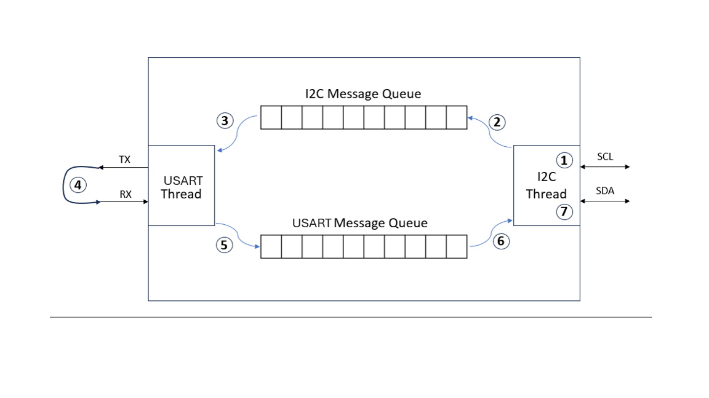
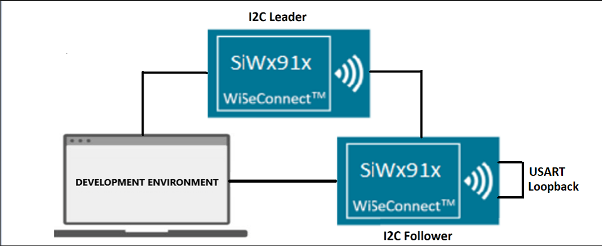
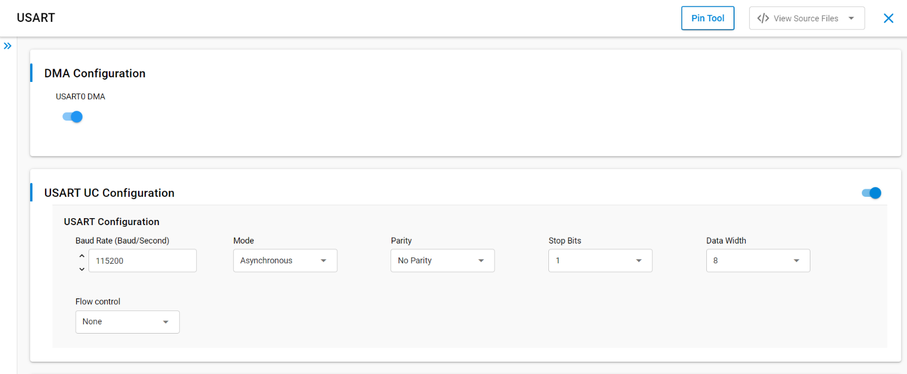
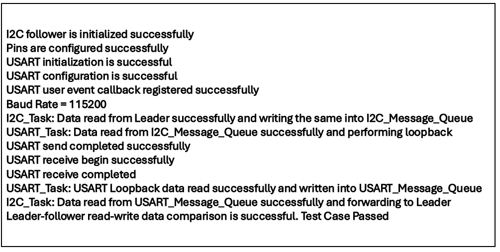

# SL MESSAGE QUEUE EXAMPLE

## Table of Contents

- [Purpose/Scope](#purposescope)
- [Overview](#overview)
- [About Example Code](#about-example-code)
- [Prerequisites/Setup Requirements](#prerequisitessetup-requirements)
  - [Hardware Requirements](#hardware-requirements)
  - [Software Requirements](#software-requirements)
  - [Setup Diagram](#setup-diagram)
- [Getting Started](#getting-started)
- [Application Build Environment](#application-build-environment)
  - [Pin Configuration](#pin-configuration)
- [Test the Application](#test-the-application)

## Purpose/Scope

- The purpose of this application is to demonstrate the use of CMSIS-RTOS concepts embedded with multiple peripherals. The following concepts are demonstrated:
  - Message Queues
- This application contains a comprehensive sample application which includes multiple perpherals listed below
  - I2C (as a Follower)
  - UART
- This example creates separate threads for each above mentioned peripheral.
- These threads run in parallel but are synchronized by using above mentioned CMSIS-RTOS concepts
- This application deals with low level driver example and demonstrates the I2C will be configured in follower mode. The SCL and SDA lines of leader controller are connected to Follower's SCL and SDA pins.
After transmission the data is compared and result is printed on the console.
- This application demonstrates how to configure ULP UART In asynchronous mode, it will send and receive data in loopback mode.

> **Note:** 
>
>- The master-slave terminology is now replaced with leader-follower. Master is now recognized as Leader, and Slave as Follower.
>- Here the SCL and SDA lines of follower are configured as internal pull-up.
>- Data is transferred from leader to follower and follower to leader. 

## Overview
 - Each of the threads, I2C and UART, creates their own message queues for sharing with other.
 - These threads synchronize with the message queues.
 - All the steps involved in this example are described below as per the figure:

 

    1. I2C thread received message from the leader
    2. All the received data is written into I2C's message queue and waits for data in UART's message queue
    3. On the other hand, UART thread has been waiting for data in I2C message queue and now it received
    4. UART thread performs a loopback operation with this data. It transmits and receives same data
    5. If the Tx and Rx data comparison passes, it then fills this data into UART's message queue
    6. I2C thread which has been waiting in step-2 has now got the data
    7. I2C thread then sends this data back to Leader, followed by data comparison
    
**1. I2C**
- There are three configurable I2C Leader/Follower controllers in M4 - two in the MCU HP peripherals (I2C1, I2C2) and one in the MCU ULP subsystem (ULP_I2C).
- The I2C interface allows the processor to serve as a leader or follower on the I2C bus.
- I2C can be configured with following features
  - I2C standard compliant bus interface with open-drain pins
  - Configurable as Leader or Follower
  - Four speed modes: Standard Mode (100 kbps), Fast Mode (400 kbps), Fast Mode Plus (1Mbps) and High-Speed Mode (3.4 Mbps)
  - 7 or 10-bit addressing and combined format transfers
  - Support for Clock synchronization and Bus Clear

**2. UART**
- ULP UART is used in communication through wired medium in Asynchronous fashion. It enables the device to communicate using serial protocols
- This application is configured with following configs
  - Tx and Rx enabled
  - Asynchronous mode
  - 8 Bit data transfer
  - Stop bits 1
  - No Parity
  - No Auto Flow control
  - Baud Rates - 115200

## Prerequisites/Setup Requirements

- To use this application following Hardware, Software and the Project Setup is required

### Hardware Requirements

- Windows PC
- Silicon Labs [WPK(BRD4002) + BRD4338A]. It will act as a leader 
- Silicon Labs [WPK(BRD4002) + BRD4338A]. It will act as a follower 

### Software Requirements

- Si91x
- Simplicity Studio
- Serial console Setup
  - The Serial Console setup instructions are provided below:
Refer [here](https://docs.silabs.com/wiseconnect/latest/wiseconnect-getting-started/getting-started-with-soc-mode#perform-console-output-and-input-for-brd4338-a).

### Setup Diagram

> 

## Getting Started

Refer to the instructions [here](https://docs.silabs.com/wiseconnect/latest/wiseconnect-getting-started/) to:

- Install Studio and WiSeConnect 3 extension
- Connect your device to the computer
- Upgrade your connectivity firmware
- Create a Studio project

## Application Build Environment

- Configure the following macros in i2c_follower_example.c file and update/modify following macros if required.

  ```C
    #define I2C_INSTANCE    2    // I2C Instance for Pin configuration
    #define I2C             I2C2 // I2C Instance 
  ```

- `Available Configurations`: Apart from I2C2, other configurations are given below.
 
  ```C
    #define I2C_INSTANCE    1    // I2C Instance for Pin configuration
    #define I2C             I2C1 // I2C Instance 
    #define I2C_INSTANCE    0    // I2C Instance for Pin configuration
    #define I2C             I2C0 // I2C Instance 
  ```

- Change the value of following macros in config/RTE_Device_917.h for I2C0

  ```c
    #define RTE_I2C0_SCL_PORT_ID 0   // SCL pin port id
    #define RTE_I2C0_SDA_PORT_ID 0   // SDA pin port id
  ```

### I2C Pin Configuration

**I2C0:**

| PIN |   ULP GPIO PIN     |   Description             |
| --- | ------------------ | ------------------------- |
| SCL |   GPIO_7 [P20]     | Connect to Leader SCL pin |
| SDA |   GPIO_6 [P19]     | Connect to Leader SDA pin |

**I2C1:**

| PIN |   GPIO PIN        |    Description            |
| --- | ----------------- | ------------------------- |
| SCL |   GPIO_50 [P32]   | Connect to Leader SCL pin |
| SDA |   GPIO_51 [P34]   | Connect to Leader SDA pin |

**I2C2:**

| PIN |   ULP GPIO PIN             |   Description             |
| --- | -------------------------- | ------------------------- |
| SCL | ULP_GPIO_7 [EXP_HEADER-15] | Connect to Leader SCL pin |
| SDA | ULP_GPIO_6 [EXP_HEADER-16] | Connect to Leader SDA pin |


- Configuration of USART at UC.
  > 

## USART Pin Configuration

  | USART PINS     | GPIO    | Connector     | UART-TTL cable |
  | -------------- | ------- | ------------- | -------------- |
  | USART0_TX_PIN  | GPIO_30 |     P35       | RX pin         |
  | USART0_RX_PIN  | GPIO_29 |     P33       | TX Pin         | 


 > 
  
## Test the Application

Refer to the instructions [here](https://docs.silabs.com/wiseconnect/latest/wiseconnect-getting-started/) to:

1. Compile and run the application.
2. After running this application below console output can be observed.
3. Connect ULP_GPIO_6 and ULP_GPIO_7 with the leader device for I2C2. Connect TX pin(GPIO_30) to RX pin(GPIO_29) forming a loopback.
4. When the application runs, it receives and sends data.
5. After the transfer is completed, it validates the data and prints on the console.
6. Will get "Test Case Passed" print on console.
7. After successful program execution the prints in serial console looks as shown below.

    