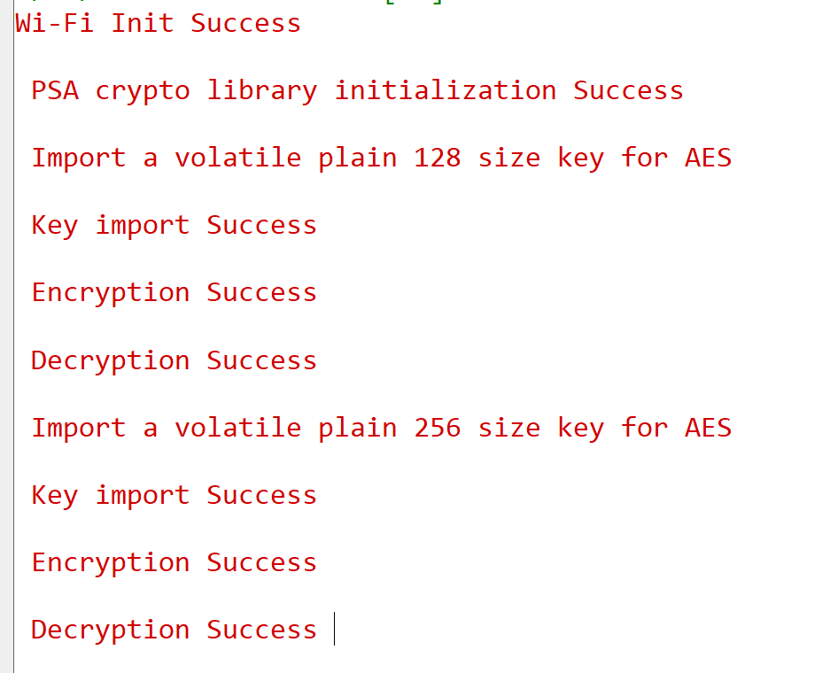

# SiWx91x Platform PSA AES Cipher

## Table of Contents

- [SiWx91x Platform PSA AES Cipher](#siwx91x-platform-psa-aes-cipher)
  - [Table of Contents](#table-of-contents)
  - [Purpose/Scope](#purposescope)
  - [Prerequisites/Setup Requirements](#prerequisitessetup-requirements)
    - [Hardware Requirements](#hardware-requirements)
    - [Software Requirements](#software-requirements)
    - [Setup Diagram](#setup-diagram)
  - [Getting Started](#getting-started)
  - [Application Build Environment](#application-build-environment)
    - [Application Configuration Parameters](#application-configuration-parameters)
  - [Test the Application](#test-the-application)
    - [Expected output](#expected-output)
  - [Troubleshooting](#troubleshooting)
  - [Resources](#resources)
  - [Report Bugs/Support](#report-bugssupport)

## Purpose/Scope

- This application contains an example code to demonstrate the PSA AES functionality.

## Prerequisites/Setup Requirements

Before running the application, the user will need the following things to setup.

### Hardware Requirements

- Windows PC
- Silicon Labs SiWx91x Evaluation Kit [WPK(BRD4002)+ BRD4338A]

### Software Requirements

- Simplicity Studio

### Setup Diagram

 

## Getting Started

Refer to the instructions [here](https://docs.silabs.com/wiseconnect/latest/wiseconnect-getting-started/) to:

- [Install Simplicity Studio](https://docs.silabs.com/wiseconnect/latest/wiseconnect-developers-guide-developing-for-silabs-hosts/#install-simplicity-studio)
- [Install WiSeConnect extension](https://docs.silabs.com/wiseconnect/latest/wiseconnect-developers-guide-developing-for-silabs-hosts/#install-the-wi-se-connect-extension)
- [Connect your device to the computer](https://docs.silabs.com/wiseconnect/latest/wiseconnect-developers-guide-developing-for-silabs-hosts/#connect-si-wx91x-to-computer)
- [Upgrade your connectivity firmware](https://docs.silabs.com/wiseconnect/latest/wiseconnect-developers-guide-developing-for-silabs-hosts/#update-si-wx91x-connectivity-firmware)
- [Create a Studio project](https://docs.silabs.com/wiseconnect/latest/wiseconnect-developers-guide-developing-for-silabs-hosts/#create-a-project)

For details on the project folder structure, see the [WiSeConnect Examples](https://docs.silabs.com/wiseconnect/latest/wiseconnect-examples/#example-folder-structure) page.

## Application Build Environment

- To program the device, refer **"Burn M4 Binary"** section in **getting-started-with-siwx917-soc** guide at **release_package/docs/index.html** to work with SiWx91x and Simplicity Studio.

### Application Configuration Parameters

- To use CTR/CBC algorithms, pass the respective PSA_ALG macro (PSA_ALG_CTR or PSA_ALG_CBC_NO_PADDING) as a parameter to `test_psa_aes()` in `app.c`
- To use CTR/CBC algorithms, change encryption_output size to CIPHER_TEXT_SIZE
- To use software fallback instead of hardware accelerators:

- Add mbedtls_aes and mbedtls_cipher_xxx in component section of slcp file
- Undefine the macro SLI_CIPHER_DEVICE_SI91X

> **Note**: For recommended settings, please refer the [recommendations guide](https://docs.silabs.com/wiseconnect/latest/wiseconnect-developers-guide-prog-recommended-settings/).

> **Note**: To enable **sideband crypto**, Use **one** of the following methods, depending on your workflow:
>
> **Option 1 — Edit the example's `.slcp` file (the `.slcp` inside the example folder, not the project `.slcp`):**
>
> Add the `define` entry at example scope:
>
> ```yaml
> define:
>   - name: SL_SI91X_SIDE_BAND_CRYPTO
> ```
>
> **Option 2 — Add the macro using Configurators 2.0:**
>
> 1. Create the desired PSA example project and open it in any compatible IDE.
> 2. In the project explorer, right-click the project and select **Open Configurators 2.0**.
>
>    
>
> 3. In the configurator view, switch to the **Build Configurator** tab.
>
>    
>
> 4. Under **Compiler Flags → C**, add `-DSL_SI91X_SIDE_BAND_CRYPTO` to the options list and save the configuration.
>
>    
>
> 5. **Clean** the project and then **rebuild** it for the change to take effect.

## Test the Application

Refer to the instructions [here](https://docs.silabs.com/wiseconnect/latest/wiseconnect-getting-started/) to:

- Build the application.
- Flash, run and debug the application.

### Expected output

  

Follow the steps as mentioned for the successful execution of the application:

- [AN1311: Integrating Crypto Functionality Using PSA Crypto Compared to Mbed TLS Guide](https://www.silabs.com/documents/public/application-notes/an1311-mbedtls-psa-crypto-porting-guide.pdf)

- [AN1135: Using Third Generation Non-Volatile Memory (NVM3) Data Storage](https://www.silabs.com/documents/public/application-notes/an1135-using-third-generation-nonvolatile-memory.pdf)

## Troubleshooting

- If the project does not build, ensure Simplicity Studio and the WiSeConnect extension are installed and the board is connected.
- If the device is not detected, reinstall the connectivity firmware and check USB drivers.

## Resources

- [WiSeConnect Getting Started](https://docs.silabs.com/wiseconnect/latest/wiseconnect-getting-started/)
- [WiSeConnect Examples](https://docs.silabs.com/wiseconnect/latest/wiseconnect-examples/)
- [SiWx91x SoC Documentation](https://docs.silabs.com/wiseconnect/latest/)

## Report Bugs/Support

For issues and support, use the Silicon Labs Community or your normal support channel.
