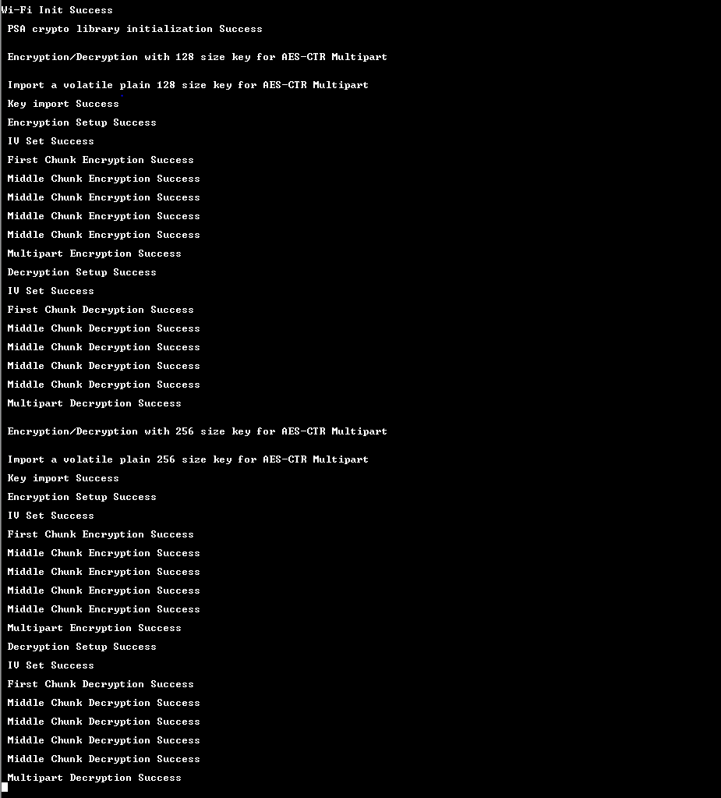

# PSA AES-CTR Multipart for SI91X

## Table of Contents

- [PSA AES-CTR Multipart for SI91X](#psa-aes-ctr-multipart-for-si91x)
  - [Table of Contents](#table-of-contents)
  - [Purpose/Scope](#purposescope)
  - [Prerequisites/Setup Requirements](#prerequisitessetup-requirements)
    - [Hardware Requirements](#hardware-requirements)
    - [Software Requirements](#software-requirements)
    - [Setup Diagram](#setup-diagram)
  - [Getting Started](#getting-started)
  - [Application Build Environment](#application-build-environment)
    - [Application Configuration Parameters](#application-configuration-parameters)
  - [Test the Application](#test-the-application)
    - [Expected output](#expected-output)

## Purpose/Scope

- This application contains an example code to demonstrate the PSA AES-CTR Multipart functionality.

## Prerequisites/Setup Requirements

Before running the application, the user will need the following things to setup.

### Hardware Requirements

  - Windows PC
  - Silicon Labs Si917 Evaluation Kit [WPK(BRD4002)+ BRD4338A]

### Software Requirements

- Simplicity Studio

### Setup Diagram

 

## Getting Started

Refer to the instructions [here](https://docs.silabs.com/wiseconnect/latest/wiseconnect-getting-started/) to:

- [Install Simplicity Studio](https://docs.silabs.com/wiseconnect/latest/wiseconnect-developers-guide-developing-for-silabs-hosts/#install-simplicity-studio)
- [Install WiSeConnect extension](https://docs.silabs.com/wiseconnect/latest/wiseconnect-developers-guide-developing-for-silabs-hosts/#install-the-wi-se-connect-extension)
- [Connect your device to the computer](https://docs.silabs.com/wiseconnect/latest/wiseconnect-developers-guide-developing-for-silabs-hosts/#connect-si-wx91x-to-computer)
- [Upgrade your connectivity firmware ](https://docs.silabs.com/wiseconnect/latest/wiseconnect-developers-guide-developing-for-silabs-hosts/#update-si-wx91x-connectivity-firmware)
- [Create a Studio project ](https://docs.silabs.com/wiseconnect/latest/wiseconnect-developers-guide-developing-for-silabs-hosts/#create-a-project)

For details on the project folder structure, see the [WiSeConnect Examples](https://docs.silabs.com/wiseconnect/latest/wiseconnect-examples/#example-folder-structure) page.

## Application Build Environment

- To program the device ,refer **"Burn M4 Binary"** section in **getting-started-with-siwx917-soc** guide at **release_package/docs/index.html** to work with Si91x and Simplicity Studio.

### Application Configuration Parameters

- This AES multipart sample application demonstrates how to split the encryption and decryption process into multiple chunks and handle each chunk separately. 

- The function `test_psa_aes()` is used to perform AES encryption and decryption on large messages by splitting them into smaller chunks. The function will first send the first chunk data and then remaining chunks will be considered as middle chunks.

- The function by default defines the size of first chunk as 16 bytes and subsequent four middle chunks size as 32 bytes.

- The length of the first chunk of incoming message can be configured by using the below macro

```c
#define FISRT_CHUNK_SIZE   16
```

- The length of the Middle chunk of incoming message can be configured by using the below macro

```c
#define MIDDLE_CHUNK_SIZE   32
```

- The length of the input message/plain text can be configured by using the below macro. By default it is 144 bytes.

```c
#define AES_TEST_PT_MAX_LEN 144
```

- In AES multipart operation, data must be transmitted in 16-byte aligned chunks.

- Multipart support will not be avilable in the event of power loss. Operations will need to restart from the beginning.

 * To use software fallback instead of hardware accelerators:
  - Add mbedtls_aes and mbedtls_cipher_ctr in component section of slcp file
  - Undefine the macro SLI_CIPHER_DEVICE_SI91X

> **Note**: For recommended settings, please refer the [recommendations guide](https://docs.silabs.com/wiseconnect/latest/wiseconnect-developers-guide-prog-recommended-settings/).

## Test the Application

Refer to the instructions [here](https://docs.silabs.com/wiseconnect/latest/wiseconnect-getting-started/) to:

- Build the application.
- Flash, run and debug the application.

### Expected output

  

Follow the steps as mentioned for the successful execution of the application:

* [AN1311: Integrating Crypto Functionality Using PSA Crypto Compared to Mbed TLS Guide](https://www.silabs.com/documents/public/application-notes/an1311-mbedtls-psa-crypto-porting-guide.pdf)

* [AN1135: Using Third Generation Non-Volatile Memory (NVM3) Data Storage](https://www.silabs.com/documents/public/application-notes/an1135-using-third-generation-nonvolatile-memory.pdf)