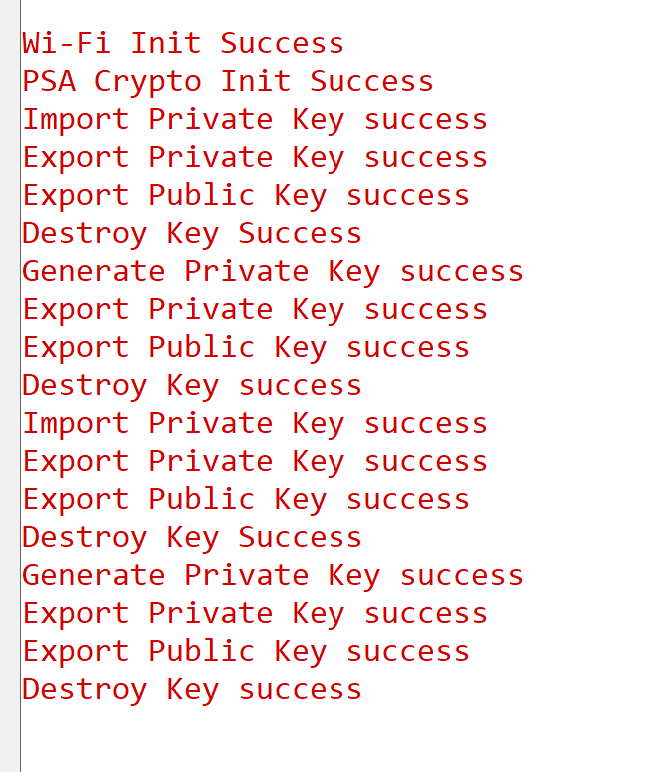

# PSA Asymmetric Key storage for SI91X

## Table of Contents

- [Purpose/Scope](#purposescope)
- [Prerequisites/Setup Requirements](#prerequisitessetup-requirements)
  - [Hardware Requirements](#hardware-requirements)
  - [Software Requirements](#software-requirements)
  - [Setup Diagram](#setup-diagram)
- [Getting Started](#getting-started)
- [Application Build Environment](#application-build-environment)
  - [Application Configuration Parameters](#application-configuration-parameters)
- [Test the Application](#test-the-application)
  - [Expected output](#expected-output)

## Purpose/Scope

- This application contains an example code to demonstrate the PSA asymmetric key storage functionality.
- This application uses hardware accelerator for key generation using ecc curve and ecdh calculation.

## Prerequisites/Setup Requirements

Before running the application, the user will need the following things to setup.

### Hardware Requirements

  - Windows PC
  - Silicon Labs Si917 Evaluation Kit [WPK(BRD4002)+ BRD4338A]

### Software Requirements

- Simplicity Studio

### Setup Diagram

 

## Getting Started

Refer to the instructions [here](https://docs.silabs.com/wiseconnect/latest/wiseconnect-getting-started/) to:

- [Install Simplicity Studio](https://docs.silabs.com/wiseconnect/latest/wiseconnect-developers-guide-developing-for-silabs-hosts/#install-simplicity-studio)
- [Install WiSeConnect 3 extension](https://docs.silabs.com/wiseconnect/latest/wiseconnect-developers-guide-developing-for-silabs-hosts/#install-the-wi-se-connect-3-extension)
- [Connect your device to the computer](https://docs.silabs.com/wiseconnect/latest/wiseconnect-developers-guide-developing-for-silabs-hosts/#connect-si-wx91x-to-computer)
- [Upgrade your connectivity firmware ](https://docs.silabs.com/wiseconnect/latest/wiseconnect-developers-guide-developing-for-silabs-hosts/#update-si-wx91x-connectivity-firmware)
- [Create a Studio project ](https://docs.silabs.com/wiseconnect/latest/wiseconnect-developers-guide-developing-for-silabs-hosts/#create-a-project)

For details on the project folder structure, see the [WiSeConnect Examples](https://docs.silabs.com/wiseconnect/latest/wiseconnect-examples/#example-folder-structure) page.

## Application Build Environment

- To program the device ,refer **"Burn M4 Binary"** section in **getting-started-with-siwx917-soc** guide at **release_package/docs/index.html** to work with Si91x and Simplicity Studio.

### Application Configuration Parameters

 * PERSISTENT_KEY_ID in psa_asymmetric_key_storage_app.c file denotes key uid which will be stored in NVM3.
 * KEY_SIZE_BITS macro in psa_asymmetric_key_storage_app.c file is size of plain private key in bits.
 * KEY_MAX_SIZE is the max size of the key buffer used to store the generated public key.
 * Private_key in psa_asymmetric_key_storage_app.c file is the private key to be imported.
 * The public key generated will replace the private key in key_attributes.
 * Public_key in psa_asymmetric_key_storage_app.c is the public key generated and exported.
 * Default algo for asymmetric key generation is ECDH.
 * Default ecc curve is SEP256R1
 * Default key size is 256 bits - can choose between 192 and 256
 * To change the ecc curve and key size, change the corresponding macro in psa_asymmetric_key_storage_app.c - psa_set_key_type() and change the KEY_MAX_SIZE to the corresponding length of public key generated.

## Test the Application

Refer to the instructions [here](https://docs.silabs.com/wiseconnect/latest/wiseconnect-getting-started/) to:

- Build the application.
- Flash, run and debug the application.

### Expected output

  

Follow the steps as mentioned for the successful execution of the application:

* [AN1311: Integrating Crypto Functionality Using PSA Crypto Compared to Mbed TLS Guide](https://www.silabs.com/documents/public/application-notes/an1311-mbedtls-psa-crypto-porting-guide.pdf)