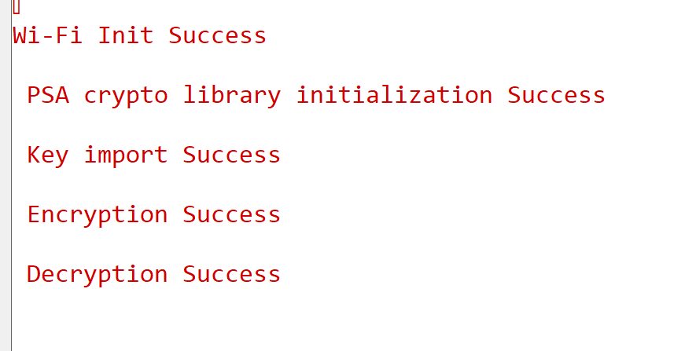

# PSA ChachaPoly for SI91X

## Table of Contents

- [PSA ChachaPoly for SI91X](#psa-chachapoly-for-si91x)
  - [Table of Contents](#table-of-contents)
  - [Purpose/Scope](#purposescope)
  - [Prerequisites/Setup Requirements](#prerequisitessetup-requirements)
    - [Hardware Requirements](#hardware-requirements)
    - [Software Requirements](#software-requirements)
    - [Setup Diagram](#setup-diagram)
  - [Getting Started](#getting-started)
  - [Application Build Environment](#application-build-environment)
    - [Application Configuration Parameters](#application-configuration-parameters)
  - [Test the Application](#test-the-application)
    - [Expected output](#expected-output)

## Purpose/Scope

- This application contains an example code to demonstrate the PSA ChachaPoly functionality.

## Prerequisites/Setup Requirements

Before running the application, the user will need the following things to setup.

### Hardware Requirements

  - Windows PC
  - Silicon Labs Si917 Evaluation Kit [WPK(BRD4002)+ BRD4338A]
  - For the Wrap Key feature of this application to work, the keys should be programmed and secure boot (ta_secure_boot) should be enabled in the device

### Software Requirements

- Simplicity Studio

### Setup Diagram

 

## Getting Started

Refer to the instructions [here](https://docs.silabs.com/wiseconnect/latest/wiseconnect-getting-started/) to:

- [Install Simplicity Studio](https://docs.silabs.com/wiseconnect/latest/wiseconnect-developers-guide-developing-for-silabs-hosts/#install-simplicity-studio)
- [Install WiSeConnect 3 extension](https://docs.silabs.com/wiseconnect/latest/wiseconnect-developers-guide-developing-for-silabs-hosts/#install-the-wi-se-connect-3-extension)
- [Connect your device to the computer](https://docs.silabs.com/wiseconnect/latest/wiseconnect-developers-guide-developing-for-silabs-hosts/#connect-si-wx91x-to-computer)
- [Upgrade your connectivity firmware ](https://docs.silabs.com/wiseconnect/latest/wiseconnect-developers-guide-developing-for-silabs-hosts/#update-si-wx91x-connectivity-firmware)
- [Create a Studio project ](https://docs.silabs.com/wiseconnect/latest/wiseconnect-developers-guide-developing-for-silabs-hosts/#create-a-project)

For details on the project folder structure, see the [WiSeConnect Examples](https://docs.silabs.com/wiseconnect/latest/wiseconnect-examples/#example-folder-structure) page.

## Application Build Environment

- To program the device ,refer **"Burn M4 Binary"** section in **getting-started-with-siwx917-soc** guide at **release_package/docs/index.html** to work with Si91x and Simplicity Studio.

### Application Configuration Parameters

 * Wrapped key support is provided for AES,Chachapoly,HMAC,GCM with CBC/ECB mode. This example demonstrate the use of wrapped key with AES-ChachaPoly using wrap CBC mode.
 * To wrap the input key and use it, set WRAP_INPUT_KEYS macro to 1 in [`psa_chachapoly_app.c`](https://github.com/SiliconLabs/wiseconnect/blob/master/examples/si91x_soc/crypto/si91x_psa_chachapoly/psa_chachapoly_app.c)
 * To use a wrapped key directly, set IMPORT_WRAPPED_KEYS macro to 1 in [`psa_chachapoly_app.c`](https://github.com/SiliconLabs/wiseconnect/blob/master/examples/si91x_soc/crypto/si91x_psa_chachapoly/psa_chachapoly_app.c)
 * To use software fallback instead of hardware accelerators for plain key:
  - Add mbedtls_chachapoly in component section of slcp file
  - Undefine the macro SLI_AEAD_DEVICE_SI91X

> **Note**: For recommended settings, see the [recommendations guide](https://docs.silabs.com/wiseconnect/latest/wiseconnect-developers-guide-prog-recommended-settings/).

## Test the Application

Refer to the instructions [here](https://docs.silabs.com/wiseconnect/latest/wiseconnect-getting-started/) to:

- Build the application.
- Flash, run and debug the application.

### Expected output

  

Follow the steps as mentioned for the successful execution of the application:

* [AN1311: Integrating Crypto Functionality Using PSA Crypto Compared to Mbed TLS Guide](https://www.silabs.com/documents/public/application-notes/an1311-mbedtls-psa-crypto-porting-guide.pdf)
