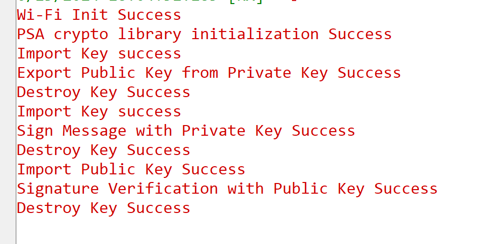

# SiWx91x Platform PSA ECDSA

## Table of Contents

- [SiWx91x Platform PSA ECDSA](#platform-siwx91x-psa-ecdsa)
  - [Table of Contents](#table-of-contents)
  - [Purpose/Scope](#purposescope)
  - [Prerequisites/Setup Requirements](#prerequisitessetup-requirements)
    - [Hardware Requirements](#hardware-requirements)
    - [Software Requirements](#software-requirements)
    - [Setup Diagram](#setup-diagram)
  - [Getting Started](#getting-started)
  - [Application Build Environment](#application-build-environment)
    - [Application Configuration Parameters](#application-configuration-parameters)
  - [Test the Application](#test-the-application)
    - [Expected output](#expected-output)
  - [Troubleshooting](#troubleshooting)
  - [Resources](#resources)
  - [Report Bugs/Support](#report-bugssupport)

## Purpose/Scope

- This application contains an example code to demonstrate the PSA ECDSA functionality
- This application uses hardware accelerators for key generation of SECPR1 curves and NWP execution for signature generation / verification
- Key generation : HW accelerators for P192R1 and P256R1 ; SW implementation for P224R1
- Sign and Verify Plain message : NWP execution for P224R1 and P256R1 ; SW implementation for P192R1
- Sign and Verify with Wrapped message : NWP execution for P224R1 and P256R1 ; P192R1 not supported

## Prerequisites/Setup Requirements

### Hardware Requirements

  - Windows PC
  - Silicon Labs SiWx91x Evaluation Kit [WPK(BRD4002)+ BRD4338A]
  - For the Wrap Key feature of this application to work, the keys should be programmed and secure boot (ta_secure_boot) should be enabled in the device

### Software Requirements

- Simplicity Studio

### Setup Diagram

  

## Getting Started

Refer to the instructions [here](https://docs.silabs.com/wiseconnect/latest/wiseconnect-getting-started/) to:

- Install Studio and WiSeConnect extension
- Connect your device to the computer
- Upgrade your connectivity firmware
- Create a Studio project

For details on the project folder structure, see the [WiSeConnect Examples](https://docs.silabs.com/wiseconnect/latest/wiseconnect-examples/#example-folder-structure) page.

## Application Build Environment

- To program the device, refer **"Burn M4 Binary"** section in **getting-started-with-siwx917-soc** guide at **release_package/docs/index.html** to work with SiWx91x and Simplicity Studio.

### Application Configuration Parameters

curve : SL_SI91X_ECC_SECP192R1

| Macro | Size |
|---------------| ------------------|
| SL_SI91X_PRIVATE_KEY_SIZE | 24 |
| SL_SI91X_PUBLIC_KEY_SIZE | 49 |

curve : SL_SI91X_ECC_SECP224R1

| Macro | Size |
|---------------| ------------------|
| SL_SI91X_PRIVATE_KEY_SIZE | 28 |
| SL_SI91X_PUBLIC_KEY_SIZE | 57 |

curve : SL_SI91X_ECC_SECP256R1

| Macro | Size |
|---------------| ------------------|
| SL_SI91X_PRIVATE_KEY_SIZE | 32 |
| SL_SI91X_PUBLIC_KEY_SIZE | 65 |

- Default ecc curve is SEP256R1, can be changed to SECP192R1 or SECP224R1 by changing private key size in [`psa_ecdsa_app.c`](psa_ecdsa_app.c) : psa_set_key_bits();
- Default private key size is 256 bits, can be changed to 192 bits or 224 bits
- Default public key size is corresponding to 256 bits private key size
- Default SHA hashing used is SHA256, can be changed to SHA384 or SHA512
- To change the SHA algorithm, set the psa_key_algorithm to PSA_ALG_ECDSA(PSA_ALG_SHA_XXX) in [`psa_ecdsa_app.c`](psa_ecdsa_app.c)
- To wrap the input private key and use it, set WRAP_INPUT_KEYS macro to 1 in [`psa_ecdsa_app.c`](psa_ecdsa_app.c)
- To use a wrapped private key directly, set IMPORT_WRAPPED_KEYS macro to 1 in [`psa_ecdsa_app.c`](psa_ecdsa_app.c)

> **Note**: For recommended settings, please refer the [recommendations guide](https://docs.silabs.com/wiseconnect/latest/wiseconnect-developers-guide-prog-recommended-settings/).

> **Note**: To enable **sideband crypto**, Use **one** of the following methods, depending on your workflow:
>
> **Option 1 — Edit the example's `.slcp` file (the `.slcp` inside the example folder, not the project `.slcp`):**
>
> Add the `define` entry at example scope:
>
> ```yaml
> define:
>   - name: SL_SI91X_SIDE_BAND_CRYPTO
> ```
>
> **Option 2 — Add the macro using Configurators 2.0:**
>
> 1. Create the desired PSA example project and open it in any compatible IDE.
> 2. In the project explorer, right-click the project and select **Open Configurators 2.0**.
>
>    
>
> 3. In the configurator view, switch to the **Build Configurator** tab.
>
>    
>
> 4. Under **Compiler Flags → C**, add `-DSL_SI91X_SIDE_BAND_CRYPTO` to the options list and save the configuration.
>
>    
>
> 5. **Clean** the project and then **rebuild** it for the change to take effect.

## Test the Application

Refer to the instructions [here](https://docs.silabs.com/wiseconnect/latest/wiseconnect-getting-started/) to:

- Build the application.
- Flash, run and debug the application.
- Application Output

### Expected output

  

Follow the steps as mentioned for the successful execution of the application:

* [AN1311: Integrating Crypto Functionality Using PSA Crypto Compared to Mbed TLS Guide](https://www.silabs.com/documents/public/application-notes/an1311-mbedtls-psa-crypto-porting-guide.pdf)

## Troubleshooting

- If the project does not build, ensure Simplicity Studio and the WiSeConnect extension are installed and the board is connected.
- If the device is not detected, reinstall the connectivity firmware and check USB drivers.

## Resources

- [WiSeConnect Getting Started](https://docs.silabs.com/wiseconnect/latest/wiseconnect-getting-started/)
- [WiSeConnect Examples](https://docs.silabs.com/wiseconnect/latest/wiseconnect-examples/)
- [SiWx91x SoC Documentation](https://docs.silabs.com/wiseconnect/latest/)

## Report Bugs/Support

For issues and support, use the Silicon Labs Community or your normal support channel.
