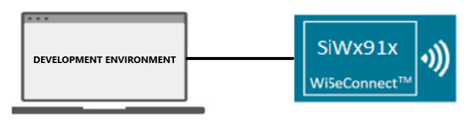

# PSA Crypto HMAC for SI91X

## Introduction 
- This example uses the PSA Crypto API to perform Message Authentication Code (HMAC) operations on the supported device.

## Setting Up 
 - To use this application following Hardware, Software and the Project Setup is required

### Hardware Requirements	
  - Windows PC 
  - Silicon Labs [Si917 Evaluation Kit WSTK + BRD4325A]
 

### Software Requirements
  - GSDK version 4.3.2
  - Si91x SDK
  - Embedded Development Environment
    - For Silicon Labs Si91x, use the latest version of Simplicity Studio (refer **"Download and Install Simplicity Studio"** section in **getting-started-with-siwx917-soc** guide at **release_package/docs/index.html**)
 
## Project Setup
- **Silicon Labs Si91x** refer **"Download SDKs"**, **"Add SDK to Simplicity Studio"**, **"Connect SiWx917"**, **"Open Example Project in Simplicity Studio"** section in **getting-started-with-siwx917-soc** guide at **release_package/docs/index.html** to work with Si91x and Simplicity Studio

## Build 
- Compile the application in Simplicity Studio using build icon 

## Device Programming
- To program the device ,refer **"Burn M4 Binary"** section in **getting-started-with-siwx917-soc** guide at **release_package/docs/index.html** to work with Si91x and Simplicity Studio

## Executing the Application
- The current implementation will support HMAC single-part mac computation and verification.

## MAC Algorithm

The following MAC algorithms are supported in this example:

* `PSA_ALG_HMAC` (single-part)

## Hash Algorithm (HMAC)

The following hash algorithms are supported in this example:

* `PSA_ALG_SHA_1`
* `PSA_ALG_SHA_224` (Software Fallback)
* `PSA_ALG_SHA_256`
* `PSA_ALG_SHA_384`
* `PSA_ALG_SHA_512`

## Expected Results 
- The `psa_mac_compute()` and `psa_mac_verify()` functions should give the expected results. 
 
## Resources

[AN1311: Integrating Crypto Functionality Using PSA Crypto Compared to Mbed TLS Guide](https://www.silabs.com/documents/public/application-notes/an1311-mbedtls-psa-crypto-porting-guide.pdf)
