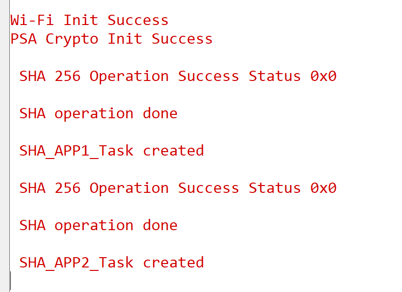
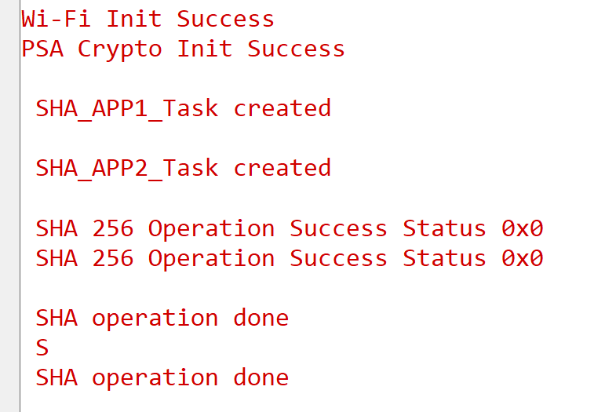
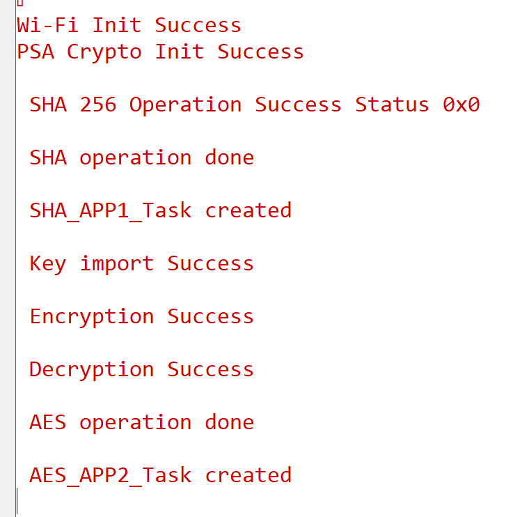
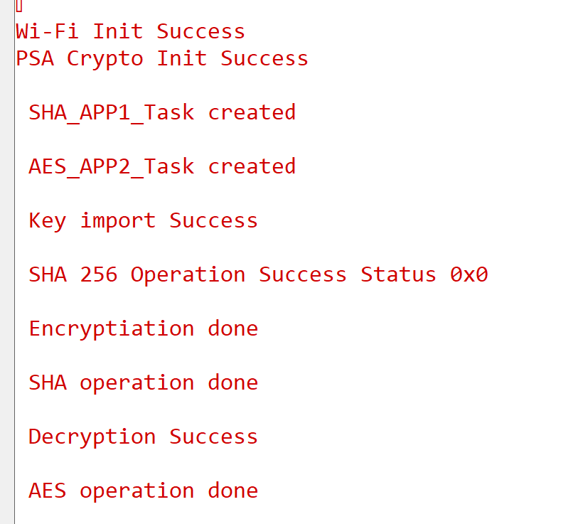

# PSA MULTITHREAD for SI91X

## Table of Contents

- [PSA MULTITHREAD for SI91X](#psa-multithread-for-si91x)
  - [Table of Contents](#table-of-contents)
  - [Purpose/Scope](#purposescope)
  - [Prerequisites/Setup Requirements](#prerequisitessetup-requirements)
    - [Hardware Requirements](#hardware-requirements)
    - [Software Requirements](#software-requirements)
    - [Setup Diagram](#setup-diagram)
  - [Getting Started](#getting-started)
  - [Application Build Environment](#application-build-environment)
    - [Application Configuration Parameters](#application-configuration-parameters)
  - [Test the Application](#test-the-application)
    - [Expected output](#expected-output)

## Purpose/Scope

- This application contains an example code to demonstrate the use of thread-safe mechanism while using crypto hardware accelerators.

## Prerequisites/Setup Requirements

 - To use this application following Hardware, Software and the Project Setup is required

### Hardware Requirements

  - Windows PC
  - Silicon Labs Si917 Evaluation Kit [WPK(BRD4002)+ BRD4338A]

### Software Requirements
  - Simplicity SDK version: 2024.6.2
  - Si91x SDK
  - Embedded Development Environment
    - For Silicon Labs Si91x, use the latest version of Simplicity Studio (refer **"Download and Install Simplicity Studio"** section in **getting-started-with-siwx917-soc** guide at **release_package/docs/index.html**)

### Setup Diagram

 

## Getting Started

- **Silicon Labs Si91x** refer **"Download SDKs"**, **"Add SDK to Simplicity Studio"**, **"Connect SiWx917"**, **"Open Example Project in Simplicity Studio"** section in **getting-started-with-siwx917-soc** guide at **release_package/docs/index.html** to work with Si91x and Simplicity Studio

## Application Build Environment

- To program the device ,refer **"Burn M4 Binary"** section in **getting-started-with-siwx917-soc** guide at **release_package/docs/index.html** to work with Si91x and Simplicity Studio

### Application Configuration Parameters

- With default configuration, the application executes SHA and AES in two threads one after another.
- Set the priority of threads (thread0, thread1, thread2) to low, low4, low4 respectively to execute task1 and task2 applications one after another.
- Set the priority of threads (thread0, thread1, thread2) to low4, low, low respectively to execute the task1 and task2 application threads parallely in round-robin mode.
- Uncomment SAME_CRYPTO_ACCELERATORS and comment DIFFERENT_CRYPTO_ACCELERATORS in [`app.c`](https://github.com/SiliconLabs/wiseconnect/blob/master/examples/si91x_soc/crypto/si91x_psa_multithread/app.c) to execute sha operation in both threads.

> **Note**: For recommended settings, see the [recommendations guide](https://docs.silabs.com/wiseconnect/latest/wiseconnect-developers-guide-prog-recommended-settings/).

## Test the Application

Refer to the instructions [here](https://docs.silabs.com/wiseconnect/latest/wiseconnect-getting-started/) to:

- Build the application.
- Flash, run and debug the application.
- The current implementation executes AES-ECB single-part encryption and decryption for AES.
- The current implementation executes the SHA 256 hashing.
- The Encryption/Decryption function should produce the expected results.
- The SHA hashing should produce the expected result.
- The two threads should use semaphores for crypto accelerator functionalities.

### Expected output
- Run two threads of same crypto accelerators one after another
  

- Run two threads with same crypto accelerators parallely
  

- Run two threads of different crypto accelerators one after another
  

- Run two threads of different crypto accelerators parallely
  

Follow the steps as mentioned for the successful execution of the application:

* [AN1311: Integrating Crypto Functionality Using PSA Crypto Compared to Mbed TLS Guide](https://www.silabs.com/documents/public/application-notes/an1311-mbedtls-psa-crypto-porting-guide.pdf)

* [AN1135: Using Third Generation Non-Volatile Memory (NVM3) Data Storage](https://www.silabs.com/documents/public/application-notes/an1135-using-third-generation-nonvolatile-memory.pdf)