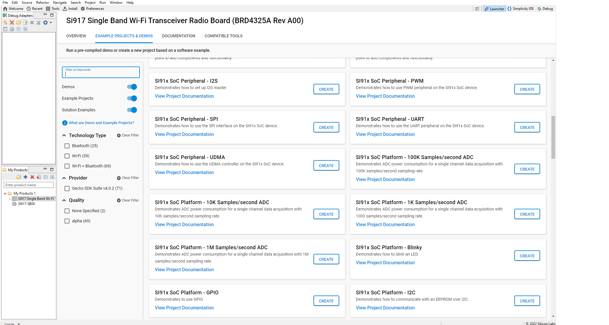

# PSA Symmetric Key Storage for SI91X

## Introduction 
- This application contains an example code to demonstrate PSA SHA.

## Setting Up 
 - To use this application following Hardware, Software and the Project Setup is required

### Hardware Requirements	
  - Windows PC 
  - Silicon Labs [Si917 Evaluation Kit WSTK + BRD4325A]

### Software Requirements
  - GSDK version 4.3.2
  - Si91x SDK
  - Embedded Development Environment
    - For Silicon Labs Si91x, use the latest version of Simplicity Studio (refer **"Download and Install Simplicity Studio"** section in **getting-started-with-siwx917-soc** guide at **release_package/docs/index.html**)
 
## Project Setup
- **Silicon Labs Si91x** refer **"Download SDKs"**, **"Add SDK to Simplicity Studio"**, **"Connect SiWx917"**, **"Open Example Project in Simplicity Studio"** section in **getting-started-with-siwx917-soc** guide at **release_package/docs/index.html** to work with Si91x and Simplicity Studio

## Loading Application on Simplicity Studio

- With the product Si917 selected, navigate to the example projects by clicking on Example Projects & Demos 
in simplicity studio and click on to `SI91x - SoC PSA symmetric key storage` Example application as shown below: 
	

## Build
- Compile the application in Simplicity Studio using build icon 

## Device Programming
- To program the device ,refer **"Burn M4 Binary"** section in **getting-started-with-siwx917-soc** guide at **release_package/docs/index.html** to work with Si91x and Simplicity Studio

## Executing the Application
- The user can run the application to verify the following SHA modes:
- SHA 1
- SHA 224
- SHA 256
- SHA 384
- SHA 512
- Enable the desired SHA algorithm in psa_sha_app.h by enabling corresponding macro
- By defauit SHA 256 is enabled

## Expected Results 
- The hash should produce the expected results. 
 
## Resources

* [AN1311: Integrating Crypto Functionality Using PSA Crypto Compared to Mbed TLS Guide](https://www.silabs.com/documents/public/application-notes/an1311-mbedtls-psa-crypto-porting-guide.pdf)

* [AN1135: Using Third Generation Non-Volatile Memory (NVM3) Data Storage](https://www.silabs.com/documents/public/application-notes/an1135-using-third-generation-nonvolatile-memory.pdf)