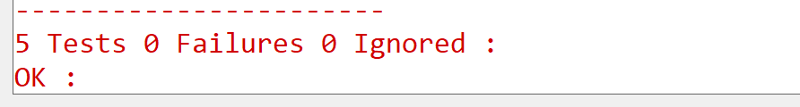

# Test PSA Hash algorithms for SI91X devices

## Table of Contents

- [Purpose/Scope](#purposescope)
- [Prerequisites/Setup Requirements](#prerequisitessetup-requirements)
  - [Hardware Requirements](#hardware-requirements)
  - [Software Requirements](#software-requirements)
  - [Setup Diagram](#setup-diagram)
- [Getting Started](#getting-started)
- [Application Build Environment](#application-build-environment)
- [Executing the Application](#executing-the-application)
- [Expected output](#expected-output)

## Purpose/Scope

- This application contains an example code to demonstrate the PSA hash functionality.

## Prerequisites/Setup Requirements

Before running the application, the user will need the following things to setup.

### Hardware Requirements

  - Windows PC
  - Silicon Labs Si917 Evaluation Kit [WPK(BRD4002)+ BRD4338A]

### Software Requirements

- Simplicity Studio

### Setup Diagram

 

## Getting Started

Refer to the instructions [here](https://docs.silabs.com/wiseconnect/latest/wiseconnect-getting-started/) to:

- [Install Simplicity Studio](https://docs.silabs.com/wiseconnect/latest/wiseconnect-developers-guide-developing-for-silabs-hosts/#install-simplicity-studio)
- [Install WiSeConnect 3 extension](https://docs.silabs.com/wiseconnect/latest/wiseconnect-developers-guide-developing-for-silabs-hosts/#install-the-wi-se-connect-3-extension)
- [Connect your device to the computer](https://docs.silabs.com/wiseconnect/latest/wiseconnect-developers-guide-developing-for-silabs-hosts/#connect-si-wx91x-to-computer)
- [Upgrade your connectivity firmware ](https://docs.silabs.com/wiseconnect/latest/wiseconnect-developers-guide-developing-for-silabs-hosts/#update-si-wx91x-connectivity-firmware)
- [Create a Studio project ](https://docs.silabs.com/wiseconnect/latest/wiseconnect-developers-guide-developing-for-silabs-hosts/#create-a-project)

For details on the project folder structure, see the [WiSeConnect Examples](https://docs.silabs.com/wiseconnect/latest/wiseconnect-examples/#example-folder-structure) page.

## Application Build Environment

- To program the device ,refer **"Burn M4 Binary"** section in **getting-started-with-siwx917-soc** guide at **release_package/docs/index.html** to work with Si91x and Simplicity Studio.

### Application Configuration Parameters

 * To use CTR/CBC algorithms, pass the respective PSA_ALG macro (PSA_ALG_CTR or PSA_ALG_CBC_NO_PADDING) as a parameter to `test_psa_aes()` in `app.c`
 * To use CTR/CBC algorithms, change encryption_output size to CIPHER_TEXT_SIZE
 * To use software fallback instead of hardware accelerators:
  - Add mbedtls_aes and mbedtls_cipher_xxx in component section of slcp file
  - Undefine the macro SLI_CIPHER_DEVICE_SI91X

## Executing the Application

- Enable any one of the SHA mode at a time.
  Application tests the Following SHA modes:
  - SHA-1
  - SHA-224
  - SHA-256
  - SHA-384
  - SHA-512
  
  To enable the test case for SHA-1 uncomment the macros TEST_SL_SHA1_SHORT and TEST_SL_SHA1_LONG present in **psa_driver_hash_test.h**.
  To enable the test case for SHA-224 uncomment the macros TEST_SL_SHA224_SHORT and TEST_SL_SHA224_LONG present in **psa_driver_hash_test.h**.
  To enable the test case for SHA-256 uncomment the macros TEST_SL_SHA256_SHORT and TEST_SL_SHA256_LONG present in **psa_driver_hash_test.h**.
  To enable the test case for SHA-384 uncomment the macros TEST_SL_SI91X_SHA384_SHORT and TEST_SL_SI91X_SHA384_LONG in **psa_driver_hash_test.h**.
  To enable the test case for SHA-512 uncomment the macros TEST_SL_SI91X_SHA512_SHORT and TEST_SL_SI91X_SHA512_LONG in **psa_driver_hash_test.h**.
  Multiple test cases can also be enabled at the same time, eg. SHA-1, SHA-224 and SHA256 can be tested at once and SHA-384, SHA512 can be tested at once.

## Expected output

- All Test cases should PASS.
  