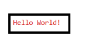

# SiWx91x Platform Hello World

## Table of Contents

- [SiWx91x Platform Hello World](#platform-siwx91x-hello-world)
  - [Table of Contents](#table-of-contents)
  - [Purpose/Scope](#purposescope)
  - [Overview](#overview)
  - [Prerequisites/Setup Requirements](#prerequisitessetup-requirements)
    - [Hardware Requirements](#hardware-requirements)
    - [Software Requirements](#software-requirements)
    - [Setup Diagram](#setup-diagram)
  - [Getting Started](#getting-started)
  - [Test the Application](#test-the-application)
  - [Troubleshooting](#troubleshooting)
  - [Resources](#resources)
  - [Report Bugs/Support](#report-bugssupport)

## Purpose/Scope

- This example project shows a hello world example that can be used as a starting point to add components and functionality to the SiWx91x SoC.

## Overview

Minimal SiWx91x SoC application that prints to console. Use it as a template to add components and build more complex examples.

## Prerequisites/Setup Requirements

### Hardware Requirements

- Windows PC
- Silicon Labs SiWx91x Evaluation Kit [[BRD4002](https://www.silabs.com/development-tools/wireless/wireless-pro-kit-mainboard?tab=overview) + [BRD4338A](https://www.silabs.com/development-tools/wireless/wi-fi/siwx917-rb4338a-wifi-6-bluetooth-le-soc-radio-board?tab=overview) / [BRD4342A](https://www.silabs.com/development-tools/wireless/wi-fi/siwx91x-rb4342a-wifi-6-bluetooth-le-soc-radio-board?tab=overview) / [BRD4343A](https://www.silabs.com/development-tools/wireless/wi-fi/siw917y-rb4343a-wi-fi-6-bluetooth-le-8mb-flash-radio-board-for-module?tab=overview) / [BRD4343C](https://www.silabs.com/development-tools/wireless/wi-fi/siw917y-rb4343c-wi-fi-6-bluetooth-le-8mb-flash-radio-board-for-module?tab=overview)]

### Software Requirements

- Simplicity Studio

### Setup Diagram

> 

## Getting Started

Refer to the instructions [here](https://docs.silabs.com/wiseconnect/latest/wiseconnect-getting-started/) to:

- [Install Simplicity Studio](https://docs.silabs.com/wiseconnect/latest/wiseconnect-developers-guide-developing-for-silabs-hosts/#install-simplicity-studio)
- [Install WiSeConnect extension](https://docs.silabs.com/wiseconnect/latest/wiseconnect-developers-guide-developing-for-silabs-hosts/#install-the-wi-se-connect-extension)
- [Connect your device to the computer](https://docs.silabs.com/wiseconnect/latest/wiseconnect-developers-guide-developing-for-silabs-hosts/#connect-si-wx91x-to-computer)
- [Upgrade your connectivity firmware ](https://docs.silabs.com/wiseconnect/latest/wiseconnect-developers-guide-developing-for-silabs-hosts/#update-si-wx91x-connectivity-firmware)
- [Create a Studio project ](https://docs.silabs.com/wiseconnect/latest/wiseconnect-developers-guide-developing-for-silabs-hosts/#create-a-project)

For details on the project folder structure, see the [WiSeConnect Examples](https://docs.silabs.com/wiseconnect/latest/wiseconnect-examples/#example-folder-structure) page.

> **Note**: For recommended settings, please refer the [recommendations guide](https://docs.silabs.com/wiseconnect/latest/wiseconnect-developers-guide-prog-recommended-settings/).

## Test the Application

 Refer instructions [here](https://docs.silabs.com/wiseconnect/latest/wiseconnect-getting-started/) to:

- Compile and run the application.

- Console Output:

    

## Troubleshooting

- If the project does not build, ensure Simplicity Studio and the WiSeConnect extension are installed and the board is connected.
- If the device is not detected, reinstall the connectivity firmware and check USB drivers.

## Resources

- [WiSeConnect Getting Started](https://docs.silabs.com/wiseconnect/latest/wiseconnect-getting-started/)
- [WiSeConnect Examples](https://docs.silabs.com/wiseconnect/latest/wiseconnect-examples/)
- [SiWx91x SoC Documentation](https://docs.silabs.com/wiseconnect/latest/)

## Report Bugs/Support

For issues and support, use the Silicon Labs Community or your normal support channel.
