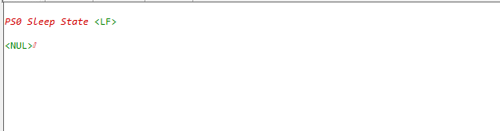

# PS0 State Without RAM Retention and NWP Shutdown

## Table of Contents

- [PS0 State Without RAM Retention and NWP Shutdown](#ps0-state-without-ram-retention-and-nwp-shutdown)
  - [Table of Contents](#table-of-contents)
  - [Purpose/Scope](#purposescope)
  - [About Example Code](#about-example-code)
  - [Prerequisites/Setup Requirements](#prerequisitessetup-requirements)
    - [Hardware Requirements](#hardware-requirements)
    - [Software Requirements](#software-requirements)
    - [Setup Diagram](#setup-diagram)
  - [Getting Started](#getting-started)
  - [Test the Application](#test-the-application)

## Purpose/Scope

- This application demonstrates the PS0 sleep without RAM retention and NWP shutdown. 
  ```c
  Note: This application is designed to validate the MCU's power consumption values specified in the datasheet, and thus contain meticulous optimizations. This application should not be taken as reference for a real-time use case project bring up. This application does not support wake-up sources.
  ```

## About Example Code
- This example demonstrates the transition to the PS0 sleep states, without RAM retention and NWP shutdown.
- Initially, the Power Manager service is initialized, transitioning the processor to the PS3 state with the clock set to 40 MHz (Power Save) using sl_si91x_power_manager_init.
- The power domains will be disabled and NWP will be shutdown.
- Finally, the application will then switch to the PS0 sleep state.

## Prerequisites/Setup Requirements

- To use this application following Hardware, Software and Project Setup is required.

### Hardware Requirements

- Windows PC
- Silicon Labs Si917 Evaluation Kit [WPK(BRD4002) + BRD4338A / BRD4342A / BRD4343A ]
  - The Serial Console setup instructions are provided below:
Refer instructions [here](https://docs.silabs.com/wiseconnect/latest/wiseconnect-developers-guide-developing-for-silabs-hosts/#console-input-and-output).

### Software Requirements

- Simplicity Studio
- Embedded Development Environment
  - For Silicon Labs Si91x, use the latest version of Simplicity Studio (refer **"Download and Install Simplicity Studio"** section in **getting-started-with-siwx917-soc** guide at **release_package/docs/index.html**)

### Setup Diagram


## Getting Started

Refer instructions [here](https://docs.silabs.com/wiseconnect/latest/wiseconnect-getting-started/) for the following tasks:

- Install Studio and WiSeConnect 3 extension
- Connect your device to the computer
- Upgrade your connectivity firmware
- Create a Studio project

For details on the project folder structure, see the [WiSeConnect Examples](https://docs.silabs.com/wiseconnect/latest/wiseconnect-examples/#example-folder-structure) page.

> **Note**: For recommended settings, see the [recommendations guide](https://docs.silabs.com/wiseconnect/latest/wiseconnect-developers-guide-prog-recommended-settings/).

## Test the Application

Refer instructions [here](https://docs.silabs.com/wiseconnect/latest/wiseconnect-getting-started/) for the following tasks:

1. Compile and run the application.
2. By default it switches the NWP off, add the PS0 requirement and goes to sleep.
3. After successful program execution, the prints in the serial console look as shown below.
  
