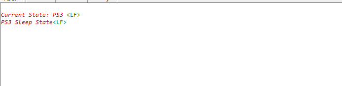
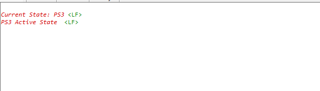

# PS3 State With NWP Shutdown

## Table of Contents

- [PS3 State With NWP Shutdown](#ps3-state-with-nwp-shutdown)
  - [Table of Contents](#table-of-contents)
  - [Purpose/Scope](#purposescope)
  - [About Example Code](#about-example-code)
  - [Prerequisites/Setup Requirements](#prerequisitessetup-requirements)
    - [Hardware Requirements](#hardware-requirements)
    - [Software Requirements](#software-requirements)
    - [Setup Diagram](#setup-diagram)
  - [Getting Started](#getting-started)
  - [Application Build Environment](#application-build-environment)
  - [Test the Application](#test-the-application)

## Purpose/Scope

- This application demonstrates the PS3 sleep and active state with RAM retention and NWP shutdown. 
  ```c
  Note: This application is designed to validate the MCU's power consumption values specified in the datasheet, and thus contain meticulous optimizations. This application should not be taken as reference for a real-time use case project bring up. This application does not support wake-up sources.
  ```

## About Example Code
- This example demonstrates the transition to the PS3 active and sleep states, with RAM retention and NWP shutdown. By default, our application is configured to retain 320KB RAM.
- Initially, the Power Manager service is initialized, transitioning the processor to the PS3 state with the clock set to 40 MHz (Power Save) using sl_si91x_power_manager_init.
- In the application, RET LDO voltage is changed to 0.75V.
- The power domains will be disabled and NWP will be shutdown.
- The application will then switch the clock to 90 MHz in performance mode (This is specifically for this application).
- Finally, the application will enter the ps3 sleep mode.
- To ensure a continuous PS3 active state, configure the ACTIVE_STATE macro to 1 in the application. This will transition the application to the PS3 state with the clock running at 90 MHz and begin toggling the NPSS GPIO 3(P18 on the WPK).

## Prerequisites/Setup Requirements

- To use this application following Hardware, Software and Project Setup is required.

### Hardware Requirements

- Windows PC
- Silicon Labs Si917 Evaluation Kit [WPK(BRD4002) + BRD4338A / BRD4342A / BRD4343A ]
  - The Serial Console setup instructions are provided below:
Refer instructions [here](https://docs.silabs.com/wiseconnect/latest/wiseconnect-developers-guide-developing-for-silabs-hosts/#console-input-and-output).

### Software Requirements

- Simplicity Studio
- Embedded Development Environment
  - For Silicon Labs Si91x, use the latest version of Simplicity Studio (refer **"Download and Install Simplicity Studio"** section in **getting-started-with-siwx917-soc** guide at **release_package/docs/index.html**)

### Setup Diagram


## Getting Started

Refer instructions [here](https://docs.silabs.com/wiseconnect/latest/wiseconnect-getting-started/) for the following tasks:

- Install Studio and WiSeConnect 3 extension
- Connect your device to the computer
- Upgrade your connectivity firmware
- Create a Studio project

For details on the project folder structure, see the [WiSeConnect Examples](https://docs.silabs.com/wiseconnect/latest/wiseconnect-examples/#example-folder-structure) page.

## Application Build Environment

The application can be configured to suit user requirements and development environment. Read through the following sections and make any changes needed.

Configure the following parameters to enable your PS3 Active or sleep state.

  - By default, the ACTIVE_STATE macro is set to 0, which means the application will enter the sleep state.

    ```c
    #define ACTIVE_STATE                                      0 
    ```

    - To enable the PS3 active state, configure the ACTIVE_STATE macro to 1.

    ```c
    #define ACTIVE_STATE                                      1
    ```

## Test the Application

Refer instructions [here](https://docs.silabs.com/wiseconnect/latest/wiseconnect-getting-started/) for the following tasks:

1. Compile and run the application.
2. By default it switches the NWP off, add the PS3 requirement and goes to sleep.
3. After successful program execution, the prints in the serial console look as shown below.
  
4. For Active number, please set the ACTIVE_STATE macro as 1.
5. This will continuously toggle the NPSS GPIO 3 (P18 on the WPK), indicating that the application is in an active state.
6. After successful program execution, the prints in the serial console look as shown below.
  
