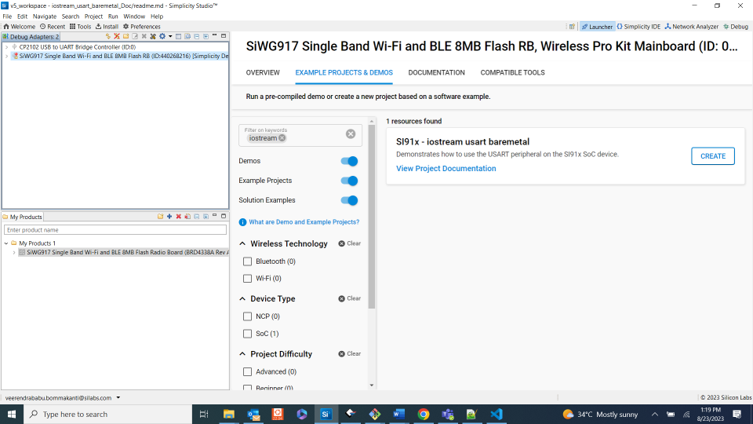

# IOSTREAM USART

## Introduction

- This example project demonstrates the use of UART communication over the virtual COM port (VCOM) in a bare metal environment using I/O stream service. The example will echo back any charaters it receives over the serial connection. The VCOM serial port can be used over USB.
- This application is configured with following configs
  - Tx and Rx enabled
  - Synchronous Master mode
  - 8 Bit data transfer
  - Stop bits 1
  - No Parity
  - No Auto Flow control
  - Baud Rates - 115200

## Setting Up

- To use this application following Hardware, Software and Project Setup is required

### Hardware Requirements

- Windows PC
- Silicon Labs [Si917 Evaluation Kit WSTK + BRD4338A]


### VCOM Setup
- The Docklight tool's setup instructions are provided below..


### Software Requirements

- Si91x SDK
- Embedded Development Environment
  - For Silicon Labs Si91x, use the latest version of Simplicity Studio (refer **"Download and Install Simplicity Studio"** section in **getting-started-with-siwx917-soc** guide at **release_package/docs/index.html**)

## Project Setup

- **Silicon Labs Si91x** refer **"Download SDK"** section in **getting-started-with-siwx917-soc** guide at **release_package/docs/index.html** to work with Si91x and Simplicity Studio

## Build

Compile the application in Simplicity Studio using build icon

## Device Programming

- To program the device ,refer **"Burn M4 Binary"** section in **getting-started-with-siwx917-soc** guide at **release_package/docs/index.html** to work with Si91x and Simplicity Studio

## Pin Configuration

| Discription   | GPIO    | Connector    |
| ------------- | ------- | ------------ |
| USART0_TX_PIN | GPIO_30 |      P35     |
| USART0_RX_PIN | GPIO_29 |      P33     |


## Executing the Application
```c
Note: On 2.0 boards, To see the prints on vcom console turn on VCOM enable switch and perform the below steps and Remove the DEBUG_UART macro from preprocessor window.

```
- In softwate components, search for iostream and open the configuration window


- Turn on the vcom enable the button


- Remove the debug uart macro from preprocessor window


1. Connect USART TX pin(GPIO_30) to RX pin, RX pin(GPIO_29) to TX pin pin of UART header to see prints on serail console.

## Expected Results

- Can see the prints on UART serial terminal and echos back the data what we send to usart
