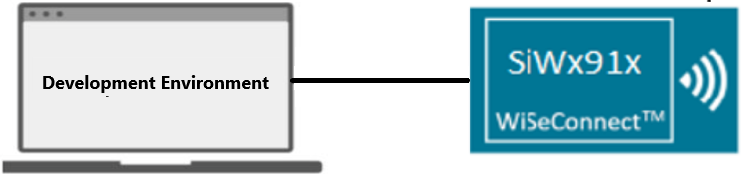

# MEMLCD

## Table of Contents

- [Purpose/Scope](#purposescope)
- [Overview](#overview)
- [About Example Code](#about-example-code)
- [Prerequisites/Setup Requirements](#prerequisitessetup-requirements)
  - [Hardware Requirements](#hardware-requirements)
  - [Software Requirements](#software-requirements)
  - [Setup Diagram](#setup-diagram)
- [Getting Started](#getting-started)
- [Test the Application](#test-the-application)

## Purpose/Scope

- This example project demonstrates use of the Memory Liquid Crystal Display (MEMLCD) module in a bare metal application, using Silicon Labs Graphics Library (glib).

## Overview

- MEMLCD could be used to render characters, strings, QR codes and pictures.
- MEMLCD uses Silicon Labs Graphics Library (GLIB) for renders. Documentation for the library can be found at [GLIB documentation](https://docs.silabs.com/gecko-platform/3.0/middleware/api/group-glib).
- The Memory LCD-TFT available on the WPK has a resolution of 128 x 128 pixels. It is a reflective monochrome display, so each pixel can only be light or
dark, and no backlight is needed in normal daylight conditions.

## About Example Code

- This example demonstrates how simple strings could be rendered on the MEMLCD LS013B7DH03, present on WPK[BRD4002A].

## Prerequisites/Setup Requirements

### Hardware Requirements

- Windows PC
- Silicon Labs Si917 Evaluation Kit [WPK + BRD4338A]

### Software Requirements

- Si91x
- Simplicity Studio

### Setup Diagram

## Getting Started

Refer to the instructions [here](https://docs.silabs.com/wiseconnect/latest/wiseconnect-getting-started/) to:

- Install Studio and WiSeConnect 3 extension
- Connect your device to the computer
- Upgrade your connectivity firmware
- Create a Studio project

## Test the Application

Refer to the instructions [here](https://docs.silabs.com/wiseconnect/latest/wiseconnect-getting-started/) to:

- Build the SI91x - MEMLCD Baremetal example in Studio.
- Flash, run and debug the application

Follow the steps below for successful execution of the application:

1. Compile and run the application.
2. Renders "MEMLCD Sample App" and "Hello There!" strings on MEMLCD display.