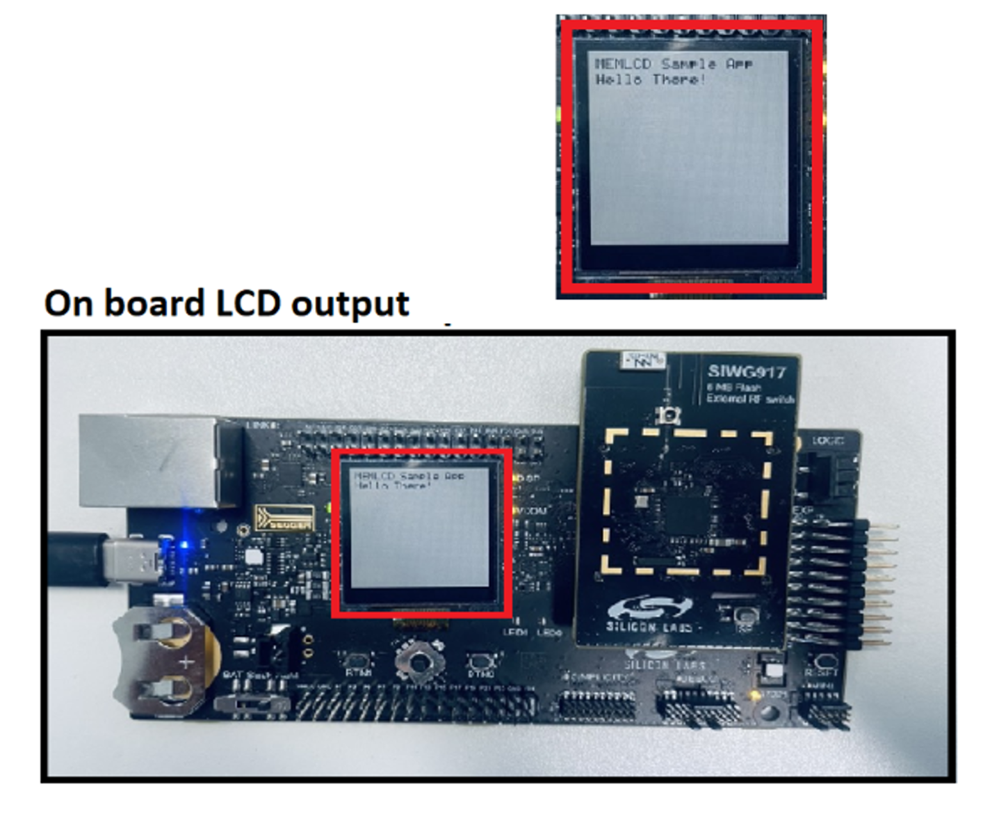

# MEMLCD BAREMATAL

## Table of Contents

- [MEMLCD BAREMATAL](#memlcd-barematal)
  - [Table of Contents](#table-of-contents)
  - [Purpose/Scope](#purposescope)
  - [Overview](#overview)
  - [About Example Code](#about-example-code)
  - [Prerequisites/Setup Requirements](#prerequisitessetup-requirements)
    - [Hardware Requirements](#hardware-requirements)
    - [Software Requirements](#software-requirements)
    - [Setup Diagram](#setup-diagram)
  - [Getting Started](#getting-started)
  - [Test the Application](#test-the-application)

## Purpose/Scope

- This example project demonstrates use of the Memory Liquid Crystal Display (MEMLCD) module in a bare metal application, using Silicon Labs Graphics Library (glib).

## Overview

- MEMLCD could be used to render characters, strings, QR codes and pictures.
- MEMLCD uses Silicon Labs Graphics Library (GLIB) for renders. Documentation for the library can be found at [GLIB documentation](https://docs.silabs.com/gecko-platform/3.0/middleware/api/group-glib).
- The Memory LCD-TFT available on the WPK has a resolution of 128 x 128 pixels. It is a reflective monochrome display, so each pixel can only be light or
dark, and no backlight is needed in normal daylight conditions.

## About Example Code

- This example demonstrates how simple strings could be rendered on the MEMLCD LS013B7DH03, present on WPK[BRD4002A].

## Prerequisites/Setup Requirements

### Hardware Requirements

- Windows PC
- Silicon Labs Si917 Evaluation Kit [WPK(BRD4002) + BRD4338A / BRD4342A / BRD4343A ]

### Software Requirements

- Simplicity Studio

### Setup Diagram

> 

## Getting Started

Refer to the instructions [here](https://docs.silabs.com/wiseconnect/latest/wiseconnect-getting-started/) to:

- [Install Simplicity Studio](https://docs.silabs.com/wiseconnect/latest/wiseconnect-developers-guide-developing-for-silabs-hosts/#install-simplicity-studio)
- [Install WiSeConnect 3 extension](https://docs.silabs.com/wiseconnect/latest/wiseconnect-developers-guide-developing-for-silabs-hosts/#install-the-wi-se-connect-3-extension)
- [Connect your device to the computer](https://docs.silabs.com/wiseconnect/latest/wiseconnect-developers-guide-developing-for-silabs-hosts/#connect-si-wx91x-to-computer)
- [Upgrade your connectivity firmware ](https://docs.silabs.com/wiseconnect/latest/wiseconnect-developers-guide-developing-for-silabs-hosts/#update-si-wx91x-connectivity-firmware)
- [Create a Studio project ](https://docs.silabs.com/wiseconnect/latest/wiseconnect-developers-guide-developing-for-silabs-hosts/#create-a-project)

For details on the project folder structure, see the [WiSeConnect Examples](https://docs.silabs.com/wiseconnect/latest/wiseconnect-examples/#example-folder-structure) page.

> **Note**: For recommended settings, see the [recommendations guide](https://docs.silabs.com/wiseconnect/latest/wiseconnect-developers-guide-prog-recommended-settings/).

## Test the Application

Refer to the instructions [here](https://docs.silabs.com/wiseconnect/latest/wiseconnect-getting-started/) to:

1. Build the SI91x - MEMLCD Baremetal example in Studio.
2. Flash, run and debug the application
3. Renders "MEMLCD Sample App" and "Hello There!" strings on MEMLCD display.
 
   > 

> **Note:**
>
> - Interrupt handlers are implemented in the driver layer, and user callbacks are provided for custom code. If you want to write your own interrupt handler instead of using the default one, make the driver interrupt handler a weak handler. Then, copy the necessary code from the driver handler to your custom interrupt handler.
