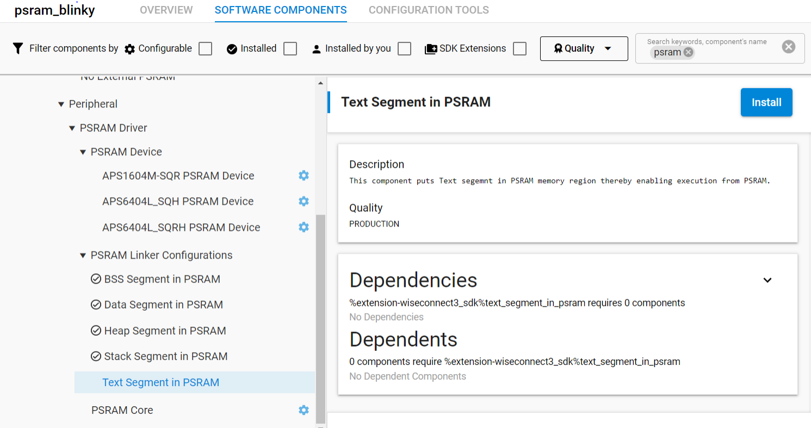

# SiWx91x Platform PSRAM Blinky

## Table of Contents

- [SiWx91x Platform PSRAM Blinky](#platform-siwx91x-psram-blinky)
  - [Table of Contents](#table-of-contents)
  - [Purpo/sescope](#purposescope)
  - [Prerequisites/Setup Requirements](#prerequisitessetup-requirements)
    - [Hardware Requirements](#hardware-requirements)
    - [Software Requirements](#software-requirements)
    - [Setup Diagram](#setup-diagram)
  - [Getting Started](#getting-started)
  - [Application Build Environment](#application-build-environment)
  - [PSRAM Linker Component Installation](#psram-linker-component-installation)
  - [Test the Application](#test-the-application)
  - [Troubleshooting](#troubleshooting)
  - [Resources](#resources)
  - [Report Bugs/Support](#report-bugssupport)

## Purpo/sescope

- This example project demonstrates blinky application (GPIO/LED toggle) executing from PSRAM. By default, the Text and Data segments are placed in PSRAM.

## Prerequisites/Setup Requirements

### Hardware Requirements

- Windows PC
- Silicon Labs SiWx91x Evaluation Kit [WPK(BRD4002) + BRD4342A]

### Software Requirements

- Simplicity Studio

### Setup Diagram

 

## Getting Started

Refer to the instructions [here](https://docs.silabs.com/wiseconnect/latest/wiseconnect-getting-started/) to:

- [Install Simplicity Studio](https://docs.silabs.com/wiseconnect/latest/wiseconnect-developers-guide-developing-for-silabs-hosts/using-the-simplicity-studio-ide#install-simplicity-studio)
- [Install WiSeConnect extension](https://docs.silabs.com/wiseconnect/latest/wiseconnect-developers-guide-developing-for-silabs-hosts/using-the-simplicity-studio-ide#install-the-wiseconnect-3-extension)
- [Connect your device to the computer](https://docs.silabs.com/wiseconnect/latest/wiseconnect-developers-guide-developing-for-silabs-hosts/using-the-simplicity-studio-ide#connect-siwx91x-to-computer)
- [Upgrade your connectivity firmware](https://docs.silabs.com/wiseconnect/latest/wiseconnect-developers-guide-developing-for-silabs-hosts/using-the-simplicity-studio-ide#update-siwx91x-connectivity-firmware)
- [Create a Studio project](https://docs.silabs.com/wiseconnect/latest/wiseconnect-developers-guide-developing-for-silabs-hosts/using-the-simplicity-studio-ide#create-a-project)

For details on the project folder structure, see the [WiSeConnect Examples](https://docs.silabs.com/wiseconnect/latest/wiseconnect-examples/#example-folder-structure) page.

## Application Build Environment

- Configure the following parameter in [`app.c`](app.c) file, update/modify following macro if required

  - `LED_INSTANCE`: Selects the LED instance used by the blinky example. By default, it is set to `led_led0`.

    ```c
    #define LED_INSTANCE    led_led0 // LED instance
    ```

  - `TOOGLE_DELAY_MS`: Delay (in milliseconds) between successive LED toggles. By default, it is set to 500.

    ```c
    #define TOOGLE_DELAY_MS 500      // Toggle delay in ms
    ```
- Sections can be included in PSRAM by installing components present under "PSRAM Linker Configurations" from "SOFTWARE COMPONENTS" GUI. Same can be removed from PSRAM and placed into default memory by uninstalling the respective component from software component selection GUI.

## PSRAM Linker Component Installation

1. Open the .slcp file generated for your specific project by double-clicking it.
2. Navigate to the SOFTWARE COMPONENTS tab within the interface.
3. Utilize the search bar to look for "PSRAM."
4. Install the necessary component sections located within the PSRAM Linker Configurations.

> 

> **Note**: For recommended settings, please refer the [recommendations guide](https://docs.silabs.com/wiseconnect/latest/wiseconnect-developers-guide-prog-recommended-settings/).

## Test the Application

1. Compile and run the application.
2. Toggles the state of LED0 at configured blink rate.
3. LED0 should blink on WPK base board.

> **Note!**
>
> LED0 will continuously be turned on and off.


> **Note:**
>
> - Interrupt handlers are implemented in the driver layer, and user callbacks are provided for custom code. If you want to write your own interrupt handler instead of using the default one, make the driver interrupt handler a weak handler. Then, copy the necessary code from the driver handler to your custom interrupt handler.

## Troubleshooting

- If the project does not build, ensure Simplicity Studio and the WiSeConnect extension are installed and the board is connected.
- If the device is not detected, reinstall the connectivity firmware and check USB drivers.

## Resources

- [WiSeConnect Getting Started](https://docs.silabs.com/wiseconnect/latest/wiseconnect-getting-started/)
- [WiSeConnect Examples](https://docs.silabs.com/wiseconnect/latest/wiseconnect-examples/)
- [SiWx91x SoC Documentation](https://docs.silabs.com/wiseconnect/latest/)

## Report Bugs/Support

For issues and support, use the Silicon Labs Community or your normal support channel.

