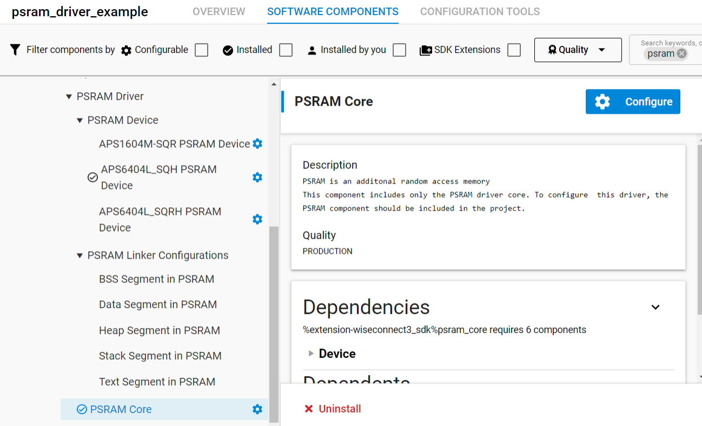
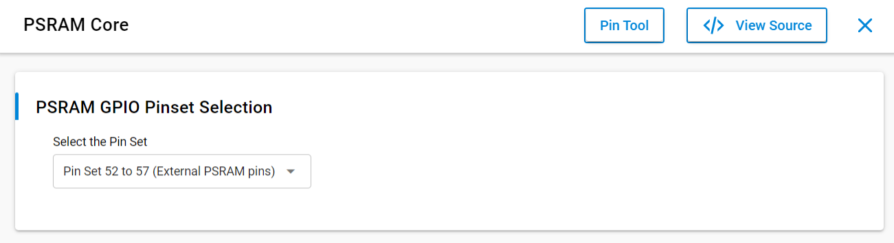
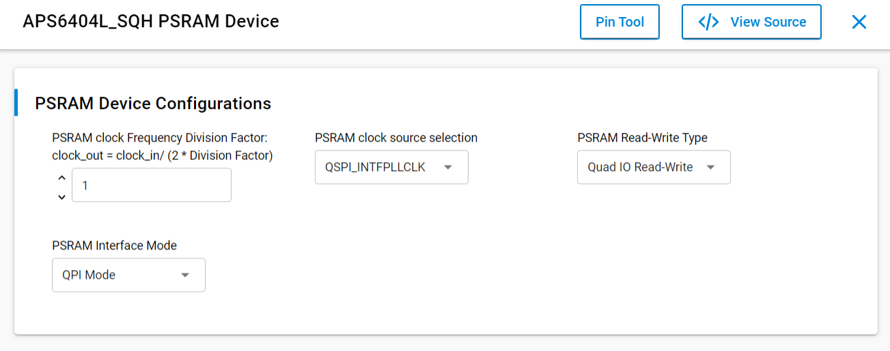
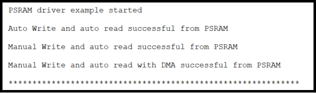

# SiWx91x Platform Peripheral PSRAM Driver Example

## Table of Contents

- [SiWx91x Platform Peripheral PSRAM Driver Example](#platform-siwx91x-peripheral-psram-driver-example)
  - [Table of Contents](#table-of-contents)
  - [Purpose/Scope](#purposescope)
  - [Prerequisites/Setup Requirements](#prerequisitessetup-requirements)
    - [Hardware Requirements](#hardware-requirements)
    - [Software Requirements](#software-requirements)
    - [Setup Diagram](#setup-diagram)
  - [Getting Started](#getting-started)
  - [Application Build Environment](#application-build-environment)
  - [PSRAM Core Component Installation](#psram-core-component-installation)
  - [Test the Application](#test-the-application)
  - [Troubleshooting](#troubleshooting)
  - [Resources](#resources)
  - [Report Bugs/Support](#report-bugssupport)

## Purpose/Scope

- This example project demonstrates use of the PSRAM Driver APIs via QSPI interface. The example writes and reads data to and from PSRAM using auto mode, manual blocking mode and DMA mode. The application makes use of default configurations of PSRAM device with fast quad read and write in QPI (Quad IO) interface mode.

## Prerequisites/Setup Requirements

### Hardware Requirements

- Windows PC
- Silicon Labs SiWx91x Evaluation Kit [WPK(BRD4002) + BRD4342A]

### Software Requirements

- Simplicity Studio
- Serial console Setup
  - For Serial Console setup instructions, refer to [link name](https://docs.silabs.com/wiseconnect/latest/wiseconnect-developers-guide-developing-for-silabs-hosts/using-the-simplicity-studio-ide#console-input-and-output).

### Setup Diagram

> 

## Getting Started

Refer to the instructions [here](https://docs.silabs.com/wiseconnect/latest/wiseconnect-getting-started/) to:

- [Install Simplicity Studio](https://docs.silabs.com/wiseconnect/latest/wiseconnect-developers-guide-developing-for-silabs-hosts/using-the-simplicity-studio-ide#install-simplicity-studio)
- [Install WiSeConnect extension](https://docs.silabs.com/wiseconnect/latest/wiseconnect-developers-guide-developing-for-silabs-hosts/using-the-simplicity-studio-ide#install-the-wiseconnect-3-extension)
- [Connect your device to the computer](https://docs.silabs.com/wiseconnect/latest/wiseconnect-developers-guide-developing-for-silabs-hosts/using-the-simplicity-studio-ide#connect-siwx91x-to-computer)
- [Upgrade your connectivity firmware](https://docs.silabs.com/wiseconnect/latest/wiseconnect-developers-guide-developing-for-silabs-hosts/using-the-simplicity-studio-ide#update-siwx91x-connectivity-firmware)
- [Create a Studio project](https://docs.silabs.com/wiseconnect/latest/wiseconnect-developers-guide-developing-for-silabs-hosts/using-the-simplicity-studio-ide#create-a-project)

For details on the project folder structure, see the [WiSeConnect Examples](https://docs.silabs.com/wiseconnect/latest/wiseconnect-examples/#example-folder-structure) page.

## Application Build Environment

- Configure the following macros in [`main.c`](main.c) file and update/modify following macros, if required.

  - `READ_WRITE_LENGTH`: Number of bytes transferred in each PSRAM read/write test (auto mode, manual mode, and DMA mode). By default, it is set to 256.

    ```c
    #define READ_WRITE_LENGTH       256 // Read/write length
    ```

  - `BIT_8_READ_WRITE_LENGTH`: Number of bytes used for the 8-bit wide PSRAM read/write tests. By default, it is set to 32.

    ```c
    #define BIT_8_READ_WRITE_LENGTH 32  // 8-bit read/write length
    ```

- PSRAM Read-Write type and interface mode can be configured from "PSRAM Core" component under "Software Components" tab via GUI.

## PSRAM Core Component Installation

1. Open the .slcp file generated for your specific project by double-clicking it.
2. Navigate to the SOFTWARE COMPONENTS tab within the interface.
3. Utilize the search bar to look for "PSRAM."
4. Install the PSRAM core component and configure the necessary device configs

> 
- Configuration for Pinset
> 
- Configuration for Read-Write type and Interface mode
> 

> **Note**: For recommended settings, please refer the [recommendations guide](https://docs.silabs.com/wiseconnect/latest/wiseconnect-developers-guide-prog-recommended-settings/).

## Test the Application

> **Note:** Use **`Log_script.py`** from the **SiWx91x Platform Logger** example (`examples/si91x_soc/service/sl_si91x_logger/`) to decode structured console log output. Run:
>
> `python Log_script.py --out firmware.out --descriptor SYSVIEW_CaptiveCore.txt --port COM5 --max-args 3`
>
> Replace **COM5** with the serial port your board uses on the host PC.


1. Compile and run the application.
2. Logs are printed with success or failure status for PSRAM read & write events in auto mode, manual mode, and manual via DMA mode.
3. Serial console output will be below.

    > 

> **Note:** PSRAM driver application is integrated with logger, where sl_si91x_log_backend_uart is used as the backend.

> **Note:**
>
> - Interrupt handlers are implemented in the driver layer, and user callbacks are provided for custom code. If you want to write your own interrupt handler instead of using the default one, make the driver interrupt handler a weak handler. Then, copy the necessary code from the driver handler to your custom interrupt handler.

## Troubleshooting

- If the project does not build, ensure Simplicity Studio and the WiSeConnect extension are installed and the board is connected.
- If the device is not detected, reinstall the connectivity firmware and check USB drivers.

## Resources

- [WiSeConnect Getting Started](https://docs.silabs.com/wiseconnect/latest/wiseconnect-getting-started/)
- [WiSeConnect Examples](https://docs.silabs.com/wiseconnect/latest/wiseconnect-examples/)
- [SiWx91x SoC Documentation](https://docs.silabs.com/wiseconnect/latest/)

## Report Bugs/Support

For issues and support, use the Silicon Labs Community or your normal support channel.

