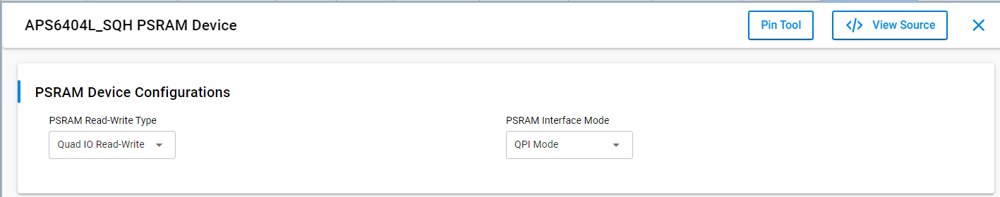

# PSRAM Driver Example

## Table of Contents

- [Purpose/Scope](#purposescope)
- [Prerequisites/Setup Requirements](#prerequisitessetup-requirements)
  - [Hardware Requirements](#hardware-requirements)
  - [Software Requirements](#software-requirements)
  - [Setup Diagram](#setup-diagram)
- [Getting Started](#getting-started)
- [Application Build Environment](#application-build-environment)
- [PSRAM Core Component Installation](#psram-core-component-installation)
- [Test the Application](#test-the-application)

## Purpose/Scope

- This example project demonstrates use of the PSRAM Driver APIs via QSPI interface. The example writes and reads data to and from PSRAM using auto mode, manual blocking mode and DMA mode. The application makes use of default configurations of PSRAM device with fast quad read and write in QPI (Quad IO) interface mode.

## Prerequisites/Setup Requirements

### Hardware Requirements

- Windows PC
- Silicon Labs Si917 Evaluation Kit [WPK(BRD4002) + BRD4342A]

### Software Requirements

- Simplicity Studio
- Serial console Setup
  - For Serial Console setup instructions, refer [here](https://docs.silabs.com/wiseconnect/latest/wiseconnect-developers-guide-developing-for-silabs-hosts/#console-input-and-output).

### Setup Diagram

> 

## Getting Started

Refer to the instructions [here](https://docs.silabs.com/wiseconnect/latest/wiseconnect-getting-started/) to:

- [Install Simplicity Studio](https://docs.silabs.com/wiseconnect/latest/wiseconnect-developers-guide-developing-for-silabs-hosts/#install-simplicity-studio)
- [Install WiSeConnect 3 extension](https://docs.silabs.com/wiseconnect/latest/wiseconnect-developers-guide-developing-for-silabs-hosts/#install-the-wi-se-connect-3-extension)
- [Connect your device to the computer](https://docs.silabs.com/wiseconnect/latest/wiseconnect-developers-guide-developing-for-silabs-hosts/#connect-si-wx91x-to-computer)
- [Upgrade your connectivity firmware ](https://docs.silabs.com/wiseconnect/latest/wiseconnect-developers-guide-developing-for-silabs-hosts/#update-si-wx91x-connectivity-firmware)
- [Create a Studio project ](https://docs.silabs.com/wiseconnect/latest/wiseconnect-developers-guide-developing-for-silabs-hosts/#create-a-project)

For details on the project folder structure, see the [WiSeConnect Examples](https://docs.silabs.com/wiseconnect/latest/wiseconnect-examples/#example-folder-structure) page.

## Application Build Environment

- PSRAM Read-Write type and interface mode can be configured from "PSRAM Core" component under "Software Components" tab via GUI.

## PSRAM Core Component Installation

1. Open the .slcp file generated for your specific project by double-clicking it.
2. Navigate to the SOFTWARE COMPONENTS tab within the interface.
3. Utilize the search bar to look for "PSRAM."
4. Install the PSRAM core component and configure the necessary device configs

> 
- Configuration for Pinset
> 
- Configuration for Read-Write type and Interface mode
> 
  
## Test the Application

1. Compile and run the application.
2. Logs are printed with success or failure status for PSRAM read & write events in auto mode, manual mode, and manual via DMA mode.
3. Serial console output will be below.

    > 

> **Note:**
>
> - Interrupt handlers are implemented in the driver layer, and user callbacks are provided for custom code. If you want to write your own interrupt handler instead of using the default one, make the driver interrupt handler a weak handler. Then, copy the necessary code from the driver handler to your custom interrupt handler.
