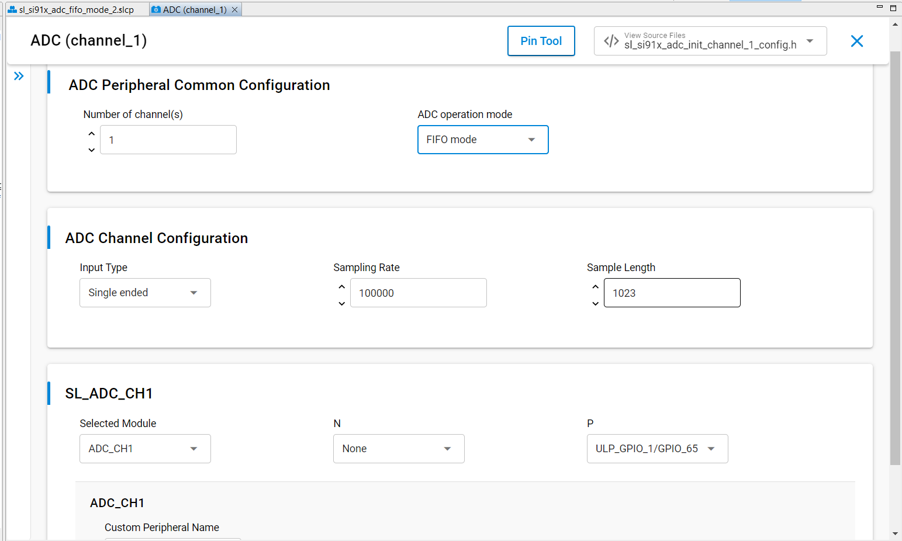
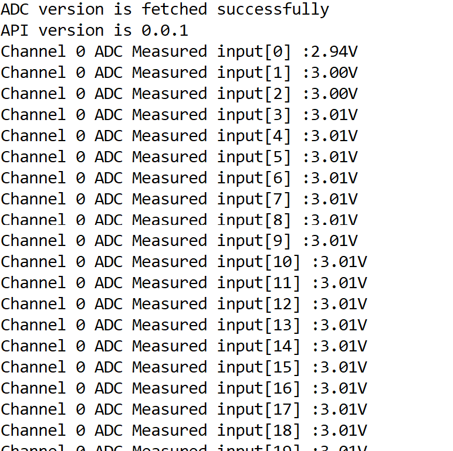

# SiWx91x Platform ADC FIFO Mode FreeRTOS

## Table of Contents

- [SiWx91x Platform ADC FIFO Mode FreeRTOS](#platform-siwx91x-adc-fifo-mode-freertos)
  - [Purpose/Scope](#purposescope)
  - [Overview](#overview)
  - [About Example Code](#about-example-code)
  - [Prerequisites/Setup Requirements](#prerequisitessetup-requirements)
    - [Hardware Requirements](#hardware-requirements)
    - [Software Requirements](#software-requirements)
    - [Setup Diagram](#setup-diagram)
  - [Getting Started](#getting-started)
  - [Application Build Environment](#application-build-environment)
    - [Application Configuration Parameters](#application-configuration-parameters)
    - [Pin Configuration](#pin-configuration)
      - [Pin Configuration of the WPK \[BRD4002A\] Base Board, and with radio board](#pin-configuration-of-the-wpk-brd4002a-base-board-and-with-radio-board)
      - [Pin Configuration of the AC1 Module Explorer Kit](#pin-configuration-of-the-ac1-module-explorer-kit)
  - [Test the Application](#test-the-application)
  - [Troubleshooting](#troubleshooting)
  - [Resources](#resources)
  - [Report Bugs / Support](#report-bugs--support)

## Purpose/Scope

This application demonstrates the ADC peripheral driver usage in a FreeRTOS environment, including:

- Converting analog input to 12-bit digital output.
- Sampling the data at configurable rates from **80 Hz to 2.5 MHz**.
- Converting data into equivalent input voltage based on operation mode.
- Multi-channel FIFO sampling with CMSIS-RTOS2 event flags for task synchronization.

## Overview

- The ADC Controller works on an ADC with a resolution of 12-bits at 10 Msps when ADC reference voltage is greater than 2.8 V or 5 Msps when ADC reference voltage is less than 2.8 V.
- Sample application will be 12-bit ADC output in 2's complement representation.
- **Sampling rate range:** The ADC supports a sampling rate range from **80 Hz to 2.5 MHz**, providing flexibility for various application requirements from low-frequency sensor monitoring to high-speed signal acquisition.
- There are two operating modes in the AUX ADC controller:
  - **Static mode operation:** ADC data input will be sampled and written to a register in this mode.
  - **FIFO mode operation:** ADC data input will be sampled and written to the ADC FIFO in this mode.
- There is a dedicated ADC DMA to support 16 channels.
- DMA mode supports dual-buffer cyclic mode to avoid loss of data when the buffer is full. In dual-buffer cyclic mode, if buffer 1 is full for a particular channel, incoming sampled data is written into buffer 2 such that samples from buffer 1 are read back by the controller during this time. That is why there are two start addresses, two buffer lengths and two valid signals for each channel.
- The AUX ADC can take analog inputs in single-ended or differential. The output is 12-bit digital which can be given out with or without noise averaging.
- The Aux VRef can be connected directly to Vbat (Aux LDO bypass mode) or to the Aux LDO output.

## About Example Code

- This example demonstrates ADC in FIFO mode of operation in a FreeRTOS task. It reads the sampled data from the specific channel buffer of the ADC and converts it into equivalent input voltage.

### FIFO Mode with FreeRTOS

- **ADC FIFO mode is used with internal DMA and Ping/Pong buffers. A single FreeRTOS task runs the application flow:**

#### Task flow

1. Creates CMSIS-RTOS2 **event flags** (`osEventFlags`) for DMA-complete signaling (no semaphore).
2. Optionally initializes the DAC when `DAC_FIFO_MODE_EN` is defined.
3. In a loop, for each enabled channel:
   - Builds a per-channel local config (one channel in slot 0), initializes ADC, starts conversion.
   - Waits for **DMA complete** via `osEventFlagsWait(adc_event_flags, ADC_EVT_FIFO_DMA_DONE, ...)`.
   - Reads FIFO data with `sl_si91x_adc_read_data()`, then de-initializes ADC for that channel.
   - Converts samples to voltage and prints. Returns the average voltage for that channel.
4. After all channels are read, optionally feeds the last channel’s buffer to the DAC (write/start or rewrite when `dac_fifo_intr_flag` is set).
5. Delays before the next round (`osDelay`).

- **Ping/Pong DMA buffers are required for FIFO mode** – the task configures `chnl_ping_address`, `chnl_pong_address`, and `rx_buf` per channel before init.
- Various parameters like Number of Channel, ADC operation mode, Input type, Sampling rate, and Sample length can be configured using UC.
- The [`sl_si91x_adc_common_config.h`](https://github.com/SiliconLabs/wiseconnect/blob/v4.1.0-content-for-docs/components/device/silabs/si91x/mcu/drivers/unified_api/config/sl_si91x_adc_common_config.h) file contains the common configurations for ADC, and [`sl_si91x_adc_init_inst_config.h`](https://github.com/SiliconLabs/wiseconnect/blob/v4.1.0-content-for-docs/components/device/silabs/si91x/mcu/drivers/unified_api/config/sl_si91x_adc_init_inst_config.h) contains channel instance configuration.
- This example uses ADC FIFO mode with **internal DMA** and **Ping/Pong dual-buffer** operation.

### DMA Ping/Pong buffer configuration

When using FIFO mode with internal DMA, you **must** configure Ping/Pong buffer addresses before starting ADC operations:

**Required structure fields (`sl_adc_channel_config_t`):**

- `chnl_ping_address[channel]`: DMA base address for the Ping buffer  
- `chnl_pong_address[channel]`: DMA base address for the Pong buffer  
- `rx_buf[channel]`: CPU-accessible buffer for reading samples  

**Example configuration (from this demo):**

```c
uint8_t adc_channel = sl_adc_channel_config.channel;

// Configure Ping/Pong DMA buffer addresses - REQUIRED for FIFO+DMA mode
sl_adc_channel_config.rx_buf[adc_channel]             = adc_output;
sl_adc_channel_config.chnl_ping_address[adc_channel]  = ADC_PING_BUFFER;
sl_adc_channel_config.chnl_pong_address[adc_channel]  =
  ADC_PING_BUFFER + (sl_adc_channel_config.num_of_samples[adc_channel]);

// Initialize and configure ADC
sl_si91x_adc_init(sl_adc_channel_config, sl_adc_config, vref_value);
sl_si91x_adc_set_channel_configuration(sl_adc_channel_config, sl_adc_config);
```

**Important notes:**

- Ping/Pong addresses must be valid ULP SRAM memory locations.
- These addresses are configured **before** calling `sl_si91x_adc_init()` and `sl_si91x_adc_set_channel_configuration()`.
- The init function does **not** automatically set these addresses; you must configure them explicitly.
- Static mode does not use Ping/Pong buffers.

- The firmware version of the API is fetched using [sl_si91x_adc_get_version](https://docs.silabs.com/wiseconnect/latest/wiseconnect-api-reference-guide-si91x-peripherals/adc#sl-si91x-adc-get-version), which includes the release version, major version and minor version [sl_adc_version_t](https://docs.silabs.com/wiseconnect/latest/wiseconnect-api-reference-guide-si91x-peripherals/adc#sl-adc-version-t).
- ADC initialization should call [sl_si91x_adc_init](https://docs.silabs.com/wiseconnect/latest/wiseconnect-api-reference-guide-si91x-peripherals/adc#sl-si91x-adc-init) API and pass the parameters [sl_adc_channel_config_t](https://docs.silabs.com/wiseconnect/latest/wiseconnect-api-reference-guide-si91x-peripherals/adc#sl-adc-channel-config-t), [sl_adc_config_t](https://docs.silabs.com/wiseconnect/latest/wiseconnect-api-reference-guide-si91x-peripherals/adc#sl-adc-config-t) and reference voltage value.
- All necessary parameters are configured using [sl_si91x_adc_set_channel_configuration](https://docs.silabs.com/wiseconnect/latest/wiseconnect-api-reference-guide-si91x-peripherals/adc#sl-si91x-adc-set-channel-configuration) API. It expects a structure with the required parameters [sl_adc_channel_config_t](https://docs.silabs.com/wiseconnect/latest/wiseconnect-api-reference-guide-si91x-peripherals/adc#sl-adc-channel-config-t) and [sl_adc_config_t](https://docs.silabs.com/wiseconnect/latest/wiseconnect-api-reference-guide-si91x-peripherals/adc#sl-adc-config-t).
- After configuration, a callback register API is called to register the callback at the time of events [sl_si91x_adc_register_event_callback](https://docs.silabs.com/wiseconnect/latest/wiseconnect-api-reference-guide-si91x-peripherals/adc#sl-si91x-adc-register-event-callback).
- Then start the ADC to sample the data using [sl_si91x_adc_start](https://docs.silabs.com/wiseconnect/latest/wiseconnect-api-reference-guide-si91x-peripherals/adc#sl-si91x-adc-start) API.
- When FIFO DMA sampling is done, the callback sets an **event flag** (`osEventFlagsSet`) to unblock the task, which then reads the sampled data using [sl_si91x_adc_read_data](https://docs.silabs.com/wiseconnect/latest/wiseconnect-api-reference-guide-si91x-peripherals/adc#sl-si91x-adc-read-data) API for FIFO mode. This process runs continuously in the task loop.
- If the ADC is started, it is recommended to stop it before de-initializing. General flow of API calls for ADC: [sl_si91x_adc_init](https://docs.silabs.com/wiseconnect/latest/wiseconnect-api-reference-guide-si91x-peripherals/adc#sl-si91x-adc-init) → [sl_si91x_adc_start](https://docs.silabs.com/wiseconnect/latest/wiseconnect-api-reference-guide-si91x-peripherals/adc#sl-si91x-adc-start) → [sl_si91x_adc_stop](https://docs.silabs.com/wiseconnect/latest/wiseconnect-api-reference-guide-si91x-peripherals/adc#sl-si91x-adc-stop) → [sl_si91x_adc_deinit](https://docs.silabs.com/wiseconnect/latest/wiseconnect-api-reference-guide-si91x-peripherals/adc#sl-si91x-adc-deinit).

## Prerequisites/Setup Requirements

### Hardware Requirements

- Windows PC
- Silicon Labs SiWx917 Evaluation Kit [[BRD4002](https://www.silabs.com/development-tools/wireless/wireless-pro-kit-mainboard?tab=overview) + [BRD4338A](https://www.silabs.com/development-tools/wireless/wi-fi/siwx917-rb4338a-wifi-6-bluetooth-le-soc-radio-board?tab=overview) / [BRD4342A](https://www.silabs.com/development-tools/wireless/wi-fi/siwx91x-rb4342a-wifi-6-bluetooth-le-soc-radio-board?tab=overview) / [BRD4343A](https://www.silabs.com/development-tools/wireless/wi-fi/siw917y-rb4343a-wi-fi-6-bluetooth-le-8mb-flash-radio-board-for-module?tab=overview) / [BRD4343C](https://www.silabs.com/development-tools/wireless/wi-fi/siw917y-rb4343c-wi-fi-6-bluetooth-le-8mb-flash-radio-board-for-module?tab=overview)]
- SiWx917 AC1 Module Explorer Kit [BRD2708A](https://www.silabs.com/development-tools/wireless/wi-fi/siw917y-ek2708a-explorer-kit)

### Software Requirements

- Simplicity Studio
- Serial console setup  
  For Serial Console setup instructions, refer [here](https://docs.silabs.com/wiseconnect/latest/wiseconnect-developers-guide-developing-for-silabs-hosts/using-the-simplicity-studio-ide#console-input-and-output).

### Setup Diagram

> 

## Getting Started

Refer to the instructions [here](https://docs.silabs.com/wiseconnect/latest/wiseconnect-getting-started/) to:

- [Install Simplicity Studio](https://docs.silabs.com/wiseconnect/latest/wiseconnect-developers-guide-developing-for-silabs-hosts/using-the-simplicity-studio-ide#install-simplicity-studio)
- [Install WiSeConnect extension](https://docs.silabs.com/wiseconnect/latest/wiseconnect-developers-guide-developing-for-silabs-hosts/using-the-simplicity-studio-ide#install-the-wiseconnect-3-extension)
- [Connect your device to the computer](https://docs.silabs.com/wiseconnect/latest/wiseconnect-developers-guide-developing-for-silabs-hosts/using-the-simplicity-studio-ide#connect-siwx91x-to-computer)
- [Upgrade your connectivity firmware](https://docs.silabs.com/wiseconnect/latest/wiseconnect-developers-guide-developing-for-silabs-hosts/using-the-simplicity-studio-ide#update-siwx91x-connectivity-firmware)
- [Create a Studio project](https://docs.silabs.com/wiseconnect/latest/wiseconnect-developers-guide-developing-for-silabs-hosts/using-the-simplicity-studio-ide#create-a-project)

For details on the project folder structure, see the [WiSeConnect Examples](https://docs.silabs.com/wiseconnect/latest/wiseconnect-examples/#example-folder-structure) page.

## Application Build Environment

### Application Configuration Parameters

- Configure UC from the slcp component.
- Open **siwx91x_platform_adc_fifo_mode_freertos.slcp** project file, select **Software Component** tab, and search for **ADC** in the search bar.
- You can use the configuration wizard to configure different parameters. The configuration screen is below, with options for the user to pick based on need.

  - **ADC Peripheral Common Configuration**

    - Number of channel: By default channel is set to '1'. When the channel number is changed, care must be taken to create an instance of that respective channel number. Otherwise, an error is thrown.
    - ADC operation mode: There are 2 modes, FIFO mode and Static mode. By default it is in FIFO mode. When static mode is set, sample length should be '1'.
    - The user can install up to sixteen instances of the channel, which will execute in sequential order. To configure this, follow the steps below:

       1. Install the channel instances.
       2. Update the `Number of Channel(s)` value in the **ADC Peripheral Common Configuration** section; the number of channels should be equal to the number of instances added in UC.
    - The order of instances must be strictly sequential, starting from 1 and increasing consecutively (e.g., 1, 2, 3). Non-sequential orders such as 1, 4, 6 or 1, 5, 2 are not permitted.

  - **ADC Channel Configuration**

    - Input type: ADC input type can be configured to either single-ended or differential.
    - Sampling rate: Sample rate can be configured per ADC channel in units of samples per second. **The configuration range is from 80 Hz to 2.5 MHz (2,500,000 samples/second)**, allowing for both low-frequency precision measurements and high-speed data acquisition.
    - Sample length: Set the length of ADC samples (i.e. the number of ADC samples collected for operation). It should be a minimum of 1 and a maximum of 1023.

      

- After completing the above UC configurations, configure the following macros in `adc_fifo_mode_freertos.c` if required:

- `CHANNEL_SAMPLE_LENGTH`: Number of samples collected per ADC channel per operation. By default, it is set to 1023.

  ```c
    #define CHANNEL_SAMPLE_LENGTH 1023       // ADC channel sample length
  ```

- `ADC_MAX_OP_VALUE`: Maximum 12-bit raw value returned from the ADC data register. By default, it is set to 4095.

  ```c
    #define ADC_MAX_OP_VALUE      4095       // Maximum ADC output value
  ```

- `VREF_VALUE`: ADC reference voltage (in volts) used for computing the equivalent input voltage. By default, it is set to 3.3.

  ```c
    #define VREF_VALUE            3.3        // Reference voltage
  ```

- `MEASUREMENT_DELAY_MS`: Delay, in milliseconds, between consecutive ADC measurement rounds in the FreeRTOS task loop. By default, it is set to 1000.

  ```c
    #define MEASUREMENT_DELAY_MS  1000       // Delay between measurements (milliseconds)
  ```

- After running the application, it will store the equivalent input voltage from ADC output samples in 'vout'.
- ADC output will print the configured number of samples’ output voltage on the UART console.
- Apply different voltages (1.8 V to Vref) to the ADC input and observe console outputs as per input.
- Provided input voltage and console output data should match.

### Pin Configuration

#### Pin Configuration of the WPK [BRD4002A] Base Board, and with radio board

The following table lists the mentioned pin numbers for the radio board. If you want to use a different radio board, see the board-specific user guide.

  | CHANNEL | PIN TO ADCP | PIN TO ADCN |
  | --- | --- | --- |
  | 1 | ULP_GPIO_1 [P16] | GPIO_28 [P31]  |
  | 2 | GPIO_27 [P29] | GPIO_30 [P35] |
  | 3 | ULP_GPIO_8 [P15] | GPIO_26 [P27] |
  | 4 | GPIO_25 [P25] | ULP_GPIO_7 [EXP_HEADER-15] |
  | 5 | ULP_GPIO_8 [P15] | ULP_GPIO_1 [P16] |
  | 6 | ULP_GPIO_10 [P17] | ULP_GPIO_7 [EXP_HEADER-15] |
  | 7 | GPIO_25 [P25] | GPIO_26 [P27] |
  | 8 | GPIO_27 [P29] | GPIO_28 [P31] |
  | 9 | GPIO_29 [P33] | GPIO_30 [P35] |
  | 10 | GPIO_29 [P33] | GPIO_30 [P35] |
  | 11 | ULP_GPIO_1 [P16] | GPIO_30 [P35] |
  | 12 | ULP_GPIO_1 [P16] | GPIO_28 [P31] |
  | 13 | ULP_GPIO_7 [EXP_HEADER-15] | GPIO_26 [P27] |
  | 14 | GPIO_26 [P27] | ULP_GPIO_7 [EXP_HEADER-15] |
  | 15 | GPIO_28 [P31] | GPIO_26 [P27] |
  | 16 | GPIO_30 [P35] | ULP_GPIO_7 [EXP_HEADER-15] |

  | OTHER INPUT SELECTION | VALUE TO ADCP | VALUE TO ADCN |
  | --- | --- | --- |
  | OPAMP1_OUT            |         20    |     10        |
  | OPAMP2_OUT            |         21    |     11        |
  | OPAMP3_OUT            |         22    |     12        |
  | TEMP_SENSOR_OUT       |         23    |     --        |
  | DAC_OUT               |         24    |     13        |

#### Pin Configuration of the AC1 Module Explorer Kit

 | CHANNEL | PIN TO ADCP | PIN TO ADCN |
  | --- | --- | --- |
  | 1 | ULP_GPIO_1 [EXP_HEADER-5] | GPIO_28 [CS]  |
  | 2 | GPIO_27 [MOSI] | GPIO_30 [RST] |
  | 3 | ULP_GPIO_8 [EXP_HEADER-2] | GPIO_26 [MISO] |
  | 4 | GPIO_25 [SCK] | ULP_GPIO_7 [TX] |
  | 5 | ULP_GPIO_8 [EXP_HEADER-2] | ULP_GPIO_1 [EXP_HEADER-5] |
  | 6 | ULP_GPIO_5 [EXP_HEADER-9] | ULP_GPIO_7 [TX] |
  | 7 | GPIO_25 [SCK] | GPIO_26 [MISO] |
  | 8 | GPIO_27 [MOSI] | GPIO_28 [CS] |
  | 9 | GPIO_29 [AN] | GPIO_30 [RST] |
  | 10 | GPIO_29 [AN] | GPIO_30 [RST] |
  | 11 | ULP_GPIO_1 [EXP_HEADER-5] | GPIO_30 [RST] |
  | 12 | ULP_GPIO_1 [EXP_HEADER-5] | GPIO_28 [CS] |
  | 13 | ULP_GPIO_7 [TX] | GPIO_26 [MISO] |
  | 14 | GPIO_26 [MISO] | ULP_GPIO_7 [TX] |
  | 15 | GPIO_28 [CS] | GPIO_26 [MISO] |
  | 16 | GPIO_30 [RST] | ULP_GPIO_7 [TX] |

> **Note:** For recommended settings, please refer to the [recommendations guide](https://docs.silabs.com/wiseconnect/latest/wiseconnect-developers-guide-prog-recommended-settings/).

## Test the Application

Refer to the instructions [here](https://docs.silabs.com/wiseconnect/latest/wiseconnect-getting-started/) to:

1. Compile and run the application.
2. When the project is generated, the ADC channel by default is configured with the channel_1 instance for the SiWx917 board. Also note the following:
   - For single-ended mode, the positive analog input is set to ULP_GPIO_1 for SiWx917.
   - For differential mode, the positive analog input is set to ULP_GPIO_1 and the negative input to GPIO_28.
3. When the application runs, the ADC configures the settings as per the user and starts ADC conversion.
4. After completion of conversion of ADC input, it will print all the captured samples’ data in the console by connecting to the serial console.
5. After successful program execution, the prints in the serial console look as shown below when the input voltage provided is 3.25 V (approximately).

    

> **Note:**
>
>- Users can configure input selection GPIO in the example application if the default GPIO is a workaround.
>- ADC input selection rather than GPIO (e.g. OP-AMP, DAC and Temperature sensor): users can create their own instances and configure them as per other input selection.
>- The DAC component needs to be installed in order to verify support for 5 MHz ADC–DAC without losing samples (when `DAC_FIFO_MODE_EN` is used).
>- In the example, ensure [sl_adc_channel_config_t](https://docs.silabs.com/wiseconnect/latest/wiseconnect-api-reference-guide-si91x-peripherals/adc#sl-adc-channel-config-t) channel parameter reflects the installed channel number.

Use the following formula to find the equivalent input voltage of the ADC.

> **Differential ended mode:**
>
> vout = ((((float)ADC output/(float)4095) * Vref Voltage) - (Vref Voltage/2));
>
> > **Note:** If the positive input to the ADC is given as 2.4 V and the negative input is given as 1.5 V, the ADC output will be a digital value equivalent to 0.9 V.
>
> **Single-ended mode:**
>
> vout = (((float)ADC output/(float)4095) * Vref Voltage);
>
> > **Note:** If the positive input to the ADC is given as 2.4 V, the ADC output will be a digital value equivalent to 2.4 V.
>
> **Note:**
>
> - Interrupt handlers are implemented in the driver layer, and user callbacks are provided for custom code. If you want to write your own interrupt handler instead of using the default one, make the driver interrupt handler a weak handler. Then, copy the necessary code from the driver handler to your custom interrupt handler.

## Troubleshooting

- If the project does not build, ensure Simplicity Studio and the WiSeConnect extension are installed and the board is connected.
- If the device is not detected, reinstall the connectivity firmware and check USB drivers.

## Resources
- [WiSeConnect Getting Started](https://docs.silabs.com/wiseconnect/latest/wiseconnect-getting-started/)
- [WiSeConnect Examples](https://docs.silabs.com/wiseconnect/latest/wiseconnect-examples/)
- [Si91x SoC Documentation](https://docs.silabs.com/wiseconnect/latest/)

## Report Bugs / Support
For issues and support, use the Silicon Labs Community or your normal support channel.

