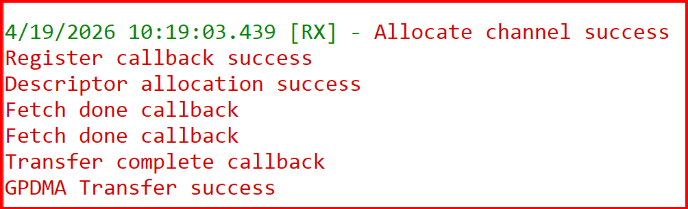

# SiWx91x Platform GPDMA FreeRTOS

## Table of Contents

- [SiWx91x Platform GPDMA FreeRTOS](#siwx91x-platform-gpdma-freertos)
  - [Table of Contents](#table-of-contents)
  - [Purpose/Scope](#purposescope)
  - [Overview](#overview)
  - [About Example Code](#about-example-code)
  - [Prerequisites/Setup Requirements](#prerequisitessetup-requirements)
    - [Hardware Requirements](#hardware-requirements)
    - [Software Requirements](#software-requirements)
    - [Setup Diagram](#setup-diagram)
  - [Getting Started](#getting-started)
  - [Application Build Environment](#application-build-environment)
  - [Test the Application](#test-the-application)
  - [Troubleshooting](#troubleshooting)
  - [Resources](#resources)
  - [Report Bugs/Support](#report-bugssupport)

## Purpose/Scope

This GPDMA example performs memory-to-memory DMA transfer of different sizes. Users can change the DMA transfer size by updating TRANSFER_LENGTH.

This example does both a Generic DMA transfer with a predefined config and a user-defined descriptor for performing DMA transfer in a FreeRTOS environment.

## Overview

- GPDMA is used for performing transfers without processor intervention.
- SiWx91x GPDMA supports memory-to-memory.
- The GPDMA supports both linked list mode and non linked list mode.
- In linked list mode GPDMA fetches linked descriptors without CPU intervention.
- GPDMA supports 8 channels.

## About Example Code

**FreeRTOS application structure**

- **`app.c`** — **`app_init()`** calls **`gpdma_freertos_init()`**. **`app_process_action()`** is empty.
- **`gpdma_freertos.c`** — All example logic lives in this file (alongside **`gpdma_freertos.h`**). The **`.slcp`** includes **`freertos_heap_4`**, **`sl_gpdma`**, and related components for CMSIS-RTOS2 and the GPDMA driver.
- **`gpdma_freertos_init()`** creates the **`gpdma`** thread (**`osThreadNew`**, stack **2048**, **`osPriorityLow1`**).

**GPDMA flow (same idea as bare-metal `sl_si91x_gpdma`)**

- **`gpdma_example_init()`** (file-local, returns **`bool`**) creates **CMSIS-RTOS2 event flags**, fills **src**/**dst** test buffers, allocates the GPDMA channel, registers callbacks, then either **`sl_si91x_gpdma_allocate_descriptor`** (simple transfer) or **`sl_si91x_gpdma_build_descriptor`** (when **`SL_GPDMA_SIMPLE_TRANSFER`** is 0). Any step that does not return **`SL_STATUS_OK`** makes **`gpdma_example_init()`** return **false**.
- **`gpdma_task`** calls **`gpdma_example_init()`**; on **false** it logs and calls **`osThreadExit()`**.
- It then starts **`sl_si91x_gpdma_transfer`** and waits with **`osEventFlagsWait`** on **`GPDMA_EVENTS_DONE`**. A **single** condition treats **`osFlagsError`**, **`GPDMA_EVENT_ERROR`**, or missing **`GPDMA_EVENT_TRANSFER_COMPLETE`** as failure; on failure the task logs and **`osThreadExit()`**.
- Transfer-complete and error paths in the driver use **`osEventFlagsSet()`** from ISRs/callbacks so the wait cannot block forever if the controller reports an error.
- After a successful wait, **`gpdma_task`** compares buffers and prints **success** or **fail**, then **`osThreadExit()`** (and **`osThreadExit()`** on compare failure). The example does **not** use an idle **`osDelay`** loop after the transfer.

## Prerequisites/Setup Requirements

### Hardware Requirements

- Windows PC
- Silicon Labs SiWx91x Evaluation Kit [[BRD4002](https://www.silabs.com/development-tools/wireless/wireless-pro-kit-mainboard?tab=overview) + [BRD4338A](https://www.silabs.com/development-tools/wireless/wi-fi/siwx917-rb4338a-wifi-6-bluetooth-le-soc-radio-board?tab=overview) / [BRD4342A](https://www.silabs.com/development-tools/wireless/wi-fi/siwx91x-rb4342a-wifi-6-bluetooth-le-soc-radio-board?tab=overview) / [BRD4343A](https://www.silabs.com/development-tools/wireless/wi-fi/siw917y-rb4343a-wi-fi-6-bluetooth-le-8mb-flash-radio-board-for-module?tab=overview) / [BRD4343C](https://www.silabs.com/development-tools/wireless/wi-fi/siw917y-rb4343c-wi-fi-6-bluetooth-le-8mb-flash-radio-board-for-module?tab=overview)]
- SiWx917 AC1 Module Explorer Kit [BRD2708A](https://www.silabs.com/development-tools/wireless/wi-fi/siw917y-ek2708a-explorer-kit)

### Software Requirements

- Simplicity Studio
- Serial console setup
  - For serial console setup instructions, see the [Console Input and Output](https://docs.silabs.com/wiseconnect/latest/wiseconnect-developers-guide-developing-for-silabs-hosts/using-the-simplicity-studio-ide#console-input-and-output) section in the *WiSeConnect Developer's Guide*.

### Setup Diagram

> 

## Getting Started

Refer to the instructions [here](https://docs.silabs.com/wiseconnect/latest/wiseconnect-getting-started/) to:

- [Install Simplicity Studio](https://docs.silabs.com/wiseconnect/latest/wiseconnect-developers-guide-developing-for-silabs-hosts/using-the-simplicity-studio-ide#install-simplicity-studio)
- [Install WiSeConnect extension](https://docs.silabs.com/wiseconnect/latest/wiseconnect-developers-guide-developing-for-silabs-hosts/using-the-simplicity-studio-ide#install-the-wiseconnect-3-extension)
- [Connect your device to the computer](https://docs.silabs.com/wiseconnect/latest/wiseconnect-developers-guide-developing-for-silabs-hosts/using-the-simplicity-studio-ide#connect-siwx91x-to-computer)
- [Upgrade your connectivity firmware](https://docs.silabs.com/wiseconnect/latest/wiseconnect-developers-guide-developing-for-silabs-hosts/using-the-simplicity-studio-ide#update-siwx91x-connectivity-firmware)
- [Create a Studio project](https://docs.silabs.com/wiseconnect/latest/wiseconnect-developers-guide-developing-for-silabs-hosts/using-the-simplicity-studio-ide#create-a-project)

For details on the project folder structure, see the [WiSeConnect Examples](https://docs.silabs.com/wiseconnect/latest/wiseconnect-examples/#example-folder-structure) page.

## Application Build Environment

- Open **`siwx91x_platform_gpdma_freertos.slcp`** in Simplicity Studio. On the **Software Component** tab, search for **SL_GPDMA** to inspect or adjust GPDMA configuration.

  

- Set `SL_GPDMA_MAX_CHANNEL` (0–7) to specify the maximum channel used in the application.
- Configure and update the required macros in **`gpdma_freertos.c`** as needed.

    ```C
    #define SL_GPDMA_SIMPLE_TRANSFER 1  ///< Enable/Disable simple transfer
    #define GPDMA_TRANSFER_LENGTH   4096  // Transfer length in bytes
    #define GPDMA_MAX_TRANSFER_LENGTH_CHANNEL0 4096 //Maximum transfer size per channel
    #define GPDMA_CHANNEL 0             //GPDMA channel to use for the transfer.
    ```
- When the `SL_GPDMA_SIMPLE_TRANSFER` macro is enabled, the transfer uses descriptors with predefined values.
- To use custom descriptor values, disable the `SL_GPDMA_SIMPLE_TRANSFER` macro.
- The `GPDMA_MAX_TRANSFER_LENGTH_CHANNEL0` macro defines the maximum transfer size for the specified channel. This macro should be defined for each channel in use.
- Set `GPDMA_CHANNEL` to any value from 0 to `SL_GPDMA_MAX_CHANNEL`, or use `0xFF` to automatically select an available channel.
- If using multiple channels, ensure each channel has its own buffer for storing descriptors.
- Allocate memory for the descriptors of every channel that is used.
- The size of the descriptor memory buffer for each channel can be calculated similarly to the `SL_MAX_NUMBER_OF_DESCRIPTORS_CHANNEL0` macro.
```C
#define SL_MAX_NUMBER_OF_DESCRIPTORS_CHANNEL0 \
  ((GPDMA_MAX_TRANSFER_LENGTH_CHANNEL0 + MAX_TRANSFER_PER_DESCRIPTOR - 1) / MAX_TRANSFER_PER_DESCRIPTOR)
```
- `MAX_TRANSFER_PER_DESCRIPTOR` specifies the maximum transfer length for each descriptor. The maximum allowed value is 4095 bytes.

   - `SL_GPDMA_SIMPLE_TRANSFER`: When this is enabled, descriptors with predefined values are used for transfer. To use custom descriptor values, disable the  `SL_GPDMA_SIMPLE_TRANSFER` macro and select values for the descriptor.
   - ` GPDMA_MAX_TRANSFER_LENGTH_CHANNEL0`: This is the maximum transfer that will be done in the given channel. This should be defined for every channel that is used.
   - Memory should be allocated descriptors of every channel that is used.
   - Size of the descriptor memory buffer can be calculated in the same way as macro `SL_MAX_NUMBER_OF_DESCRIPTORS_CHANNEL0`.
   
## Test the Application

Refer to the instructions [here](https://docs.silabs.com/wiseconnect/latest/wiseconnect-getting-started/) to:

1. compile and run the application.
2. The following prints should appear on console.

   > 

> **Note:**
>
> - In non-simple transfer FIFO mode or memory fill configurations, direct buffer comparison may fail. As a result, the actual console output may differ from the example shown above.
> - Max transfer size in non linked list mode is 4095.
> - The debug feature of Simplicity Studio will not work after M4 flash is turned off.
> - Only memory-to-memory transfer is supported in GPDMA.
> - By default, the FIFO size for each channel is allocated as 8 in allocate channel. The FIFO size should be higher than or equal to AHB burst size.
> - In case of sleep-wakeup, call `sl_si91x_gpdma_init()` after wakeup before starting a new GPDMA transfer to restore the GPDMA peripheral state.


## Troubleshooting

- If the project does not build, ensure Simplicity Studio and the WiSeConnect extension are installed and the board is connected.
- If the device is not detected, reinstall the connectivity firmware and check USB drivers.

## Resources

- [WiSeConnect Getting Started](https://docs.silabs.com/wiseconnect/latest/wiseconnect-getting-started/)
- [WiSeConnect Examples](https://docs.silabs.com/wiseconnect/latest/wiseconnect-examples/)
- [SiWx91x SoC Documentation](https://docs.silabs.com/wiseconnect/latest/)

## Report Bugs/Support

For issues and support, use the Silicon Labs Community or your normal support channel.
