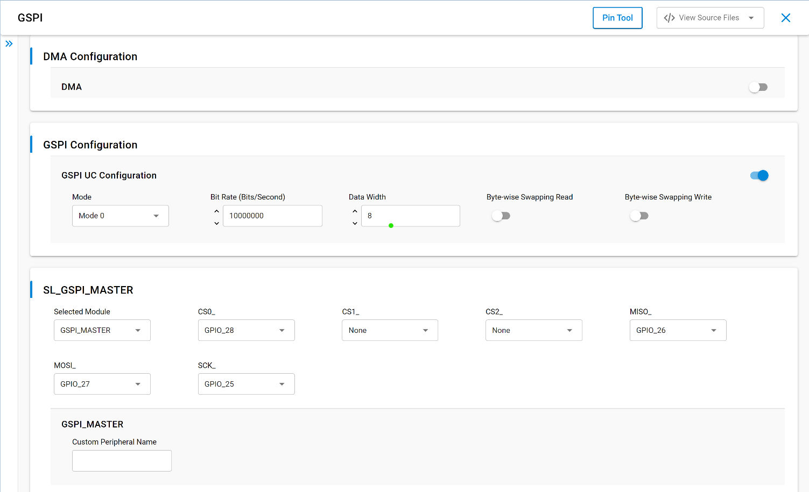
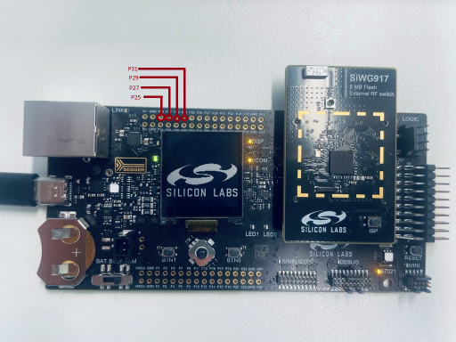
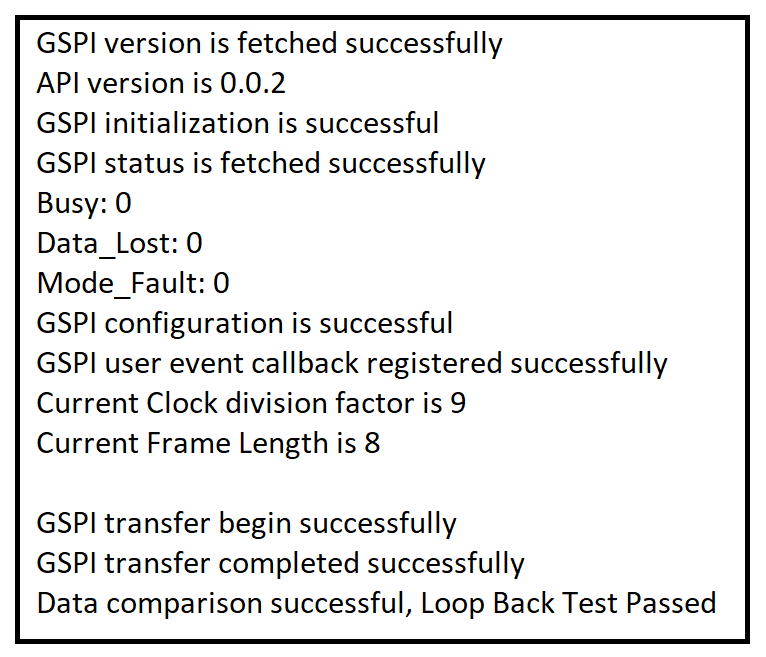

# SiWx91x Platform GSPI FreeRTOS

## Table of Contents

- [SiWx91x Platform GSPI FreeRTOS](#platform-siwx91x-gspi-freertos)
  - [Purpose/Scope](#purposescope)
  - [Overview](#overview)
  - [About Example Code](#about-example-code)
  - [Prerequisites/Setup Requirements](#prerequisitessetup-requirements)
    - [Hardware Requirements](#hardware-requirements)
    - [Software Requirements](#software-requirements)
    - [Setup Diagram](#setup-diagram)
  - [Getting Started](#getting-started)
  - [Application Build Environment](#application-build-environment)
    - [Application Configuration Parameters](#application-configuration-parameters)
    - [Pin Configuration](#pin-configuration)
    - [Pin Description](#pin-description)
  - [Test the Application](#test-the-application)
  - [Troubleshooting](#troubleshooting)
  - [Resources](#resources)
  - [Report Bugs / Support](#report-bugs--support)

## Purpose/Scope

This application demonstrates the GSPI for data transfer in full-duplex as well as half-duplex mode in a freertos environment.

- This application can run in synchronous mode with full-duplex operation.
- The master transmits data on the MOSI pin and receives the same data on the MISO pin.
- It also supports sending and receiving data with any SPI slave. Additionally, it supports both DMA and non-DMA transfer.
- For half-duplex communication (that is, send and receive), a master / slave connection is required.

## Overview

- It is an HP peripheral that can be used to drive a wide variety of SPI-compatible peripheral devices.
- SPI is a synchronous four-wire interface consisting of two data pins (MOSI, MISO), a device select pin (CSN), and a gated clock pin (SCLK).
- With the two data pins, it allows for full-duplex operation with other SPI-compatible devices.
- It supports full-duplex, single-bit SPI master mode.
- It has support for Mode-0 and Mode-3 (Motorola). Mode 0: Clock Polarity is zero and Clock Phase is zero, Mode 3: Clock Polarity is one, Clock Phase is one.
- The GSPI supports full-speed mode (up to 58 MHz) and high-speed mode (up to 116 MHz), depending on the configuration of the peripheral clock (INTF_PLL).
- The SPI clock is programmable to meet required baud rates.
- It can generate interrupts for different events, like transfer complete, data lost, and mode fault.
- It supports up to 32K bytes of read data from an SPI device in a single read operation.
- It also supports for byte-wise swapping of read and write data.
- It has programmable FIFO thresholds with maximum FIFO depth of 16.
- It has support for DMA (Dynamic Memory Access).

## About Example Code

- This example demonstrates GSPI transfer (that is, full-duplex communication) and GSPI send - GSPI receive (that is, half-duplex communication).
- Various parameters like swap read and write data, data width, mode, and bitrate can be configured using [`sl_gspi_control_config_t`](https://docs.silabs.com/wiseconnect/latest/wiseconnect-api-reference-guide-si91x-peripherals/sl-gspi-control-config-t)
- DMA and FIFO Threshold can also be configured using the UC.
- The file [`sl_si91x_gspi_config.h`](https://github.com/SiliconLabs/wiseconnect/blob/v4.1.1-content-for-docs/components/device/silabs/si91x/mcu/drivers/unified_api/config/sl_si91x_gspi_config.h) contains the control configurations and [`sl_si91x_gspi_common_config.h`](https://github.com/SiliconLabs/wiseconnect/blob/v4.1.1-content-for-docs/components/device/silabs/si91x/mcu/drivers/unified_api/config/sl_si91x_gspi_common_config.h) contains DMA and FIFO Threshold configuration.
- In the example code, firstly, the output buffer is filled with some data which is transferred to the slave.
- The firmware version of the API is fetched using [sl_si91x_gspi_get_version](https://docs.silabs.com/wiseconnect/latest/wiseconnect-api-reference-guide-si91x-peripherals/gspi#sl-si91x-gspi-get-version) which includes the release version, major version, and minor version [sl_gspi_version_t](https://docs.silabs.com/wiseconnect/latest/wiseconnect-api-reference-guide-si91x-peripherals/sl-gspi-version-t).
- [sl_si91x_gspi_init](https://docs.silabs.com/wiseconnect/latest/wiseconnect-api-reference-guide-si91x-peripherals/gspi#sl-si91x-gspi-init) is used to initialize the peripheral, which includes pin configuration and also enables DMA if configured.
- The GSPI instance must be passed in the init to get the respective instance handle [sl_gspi_instance_t](https://docs.silabs.com/wiseconnect/latest/wiseconnect-api-reference-guide-si91x-peripherals/gspi#sl-gspi-instance-t), which is used in other APIs
- All the necessary parameters are configured using [sl_si91x_gspi_set_configuration](https://docs.silabs.com/wiseconnect/latest/wiseconnect-api-reference-guide-si91x-peripherals/gspi#sl-si91x-gspi-set-configuration) API, which expects a structure with required parameters [sl_gspi_control_config_t](https://docs.silabs.com/wiseconnect/latest/wiseconnect-api-reference-guide-si91x-peripherals/sl-gspi-control-config-t).
- After configuration, a callback register API is called to register the callback at the time of events [sl_si91x_gspi_register_event_callback](https://docs.silabs.com/wiseconnect/latest/wiseconnect-api-reference-guide-si91x-peripherals/gspi#sl-si91x-gspi-register-event-callback).
- Current frame length and clock division factor are printed on the console, [sl_si91x_gspi_get_clock_division_factor](https://docs.silabs.com/wiseconnect/latest/wiseconnect-api-reference-guide-si91x-peripherals/gspi#sl-si91x-gspi-get-clock-division-factor) [sl_si91x_gspi_get_frame_length](https://docs.silabs.com/wiseconnect/latest/wiseconnect-api-reference-guide-si91x-peripherals/gspi#sl-si91x-gspi-get-frame-length).
- State machine code is implemented for transfer, send, and receive. The current mode is determined by `gspi_mode_enum_t`, which is declared in the example file.
- The `gspi_task` uses a `while` loop only to advance the state machine across one or more phases (transfer, then optional send/receive) depending on which macros are enabled; it is not a repeating demo. When all enabled phases complete, the task sets `SL_GSPI_TRANSMISSION_COMPLETED` and calls `osThreadExit()`.
- According to the macro enabled, the example code executes the transfer.

- If the **SL_USE_TRANSFER** macro is enabled, it will transfer the data (that is, send and receive data in full-duplex mode).

  - The current_mode enum is set to SL_TRANSFER_DATA and calls the [sl_si91x_gspi_transfer_data](https://docs.silabs.com/wiseconnect/latest/wiseconnect-api-reference-guide-si91x-peripherals/gspi#sl-si91x-gspi-transfer-data) API which expects data_out, data_in, and the number of data bytes to be transferred for sending and receiving data simultaneously.
  - This test can also be performed in a loopback condition (that is, connecting MISO and MOSI pins).
  - It waits on a semaphore till the transfer is completed; when the transfer complete event is generated, the callback releases the semaphore and the task compares the sent and received data.
  - The result is printed on the console.
  - Now the current_mode enum is updated as per the macros enabled (that is, either SL_USE_SEND or SL_USE_RECEIVE).
  - If no other macros are enabled, the current_mode is updated as SL_TRANSMISSION_COMPLETED.

- If the **SL_USE_RECEIVE** macro is enabled, it only receives the data from the slave, the SPI slave must be connected, and it cannot be tested in loopback mode.

  - The current_mode is set to the SL_RECEIVE_DATA and calls the [sl_si91x_gspi_receive_data](https://docs.silabs.com/wiseconnect/latest/wiseconnect-api-reference-guide-si91x-peripherals/gspi#sl-si91x-gspi-receive-data) API which expects data_in (empty buffer) and number of data bytes to be received.
  - It waits on a semaphore till the receive is completed (that is, the transfer complete event is generated and the callback releases the semaphore).
  - Now the current_mode enum is updated as per the macros enabled (SL_USE_SEND).
  - If no other macros are enabled, the current_mode is updated as SL_TRANSMISSION_COMPLETED.

- If **SL_USE_SEND** macro is enabled, it only sends the data to slave, SPI slave must be connected, and it cannot be tested in loopback mode.
  - The current_mode enum is set to SL_SEND_DATA and calls the [sl_si91x_gspi_send_data](https://docs.silabs.com/wiseconnect/latest/wiseconnect-api-reference-guide-si91x-peripherals/gspi#sl-si91x-gspi-send-data) API which expects data_out (data buffer that needs to be sent) and number of bytes to send.
  - It waits on a semaphore till the send is completed (that is, the transfer complete event is generated and the callback releases the semaphore).
  - Now the current_mode enum is updated as TRANSMISSION_COMPLETED.

- When all enabled phases complete (TRANSMISSION_COMPLETED), the task calls `osThreadExit()` to cleanly terminate.
- If any API call fails, the task prints an error via `DEBUGOUT` and calls `osThreadExit()` to terminate.

> **Note:**
>
>- If SSI Slave application is used with GSPI Master application, it is mandatory to enable DMA in SSI Slave application.

## Prerequisites/Setup Requirements

### Hardware Requirements

- Windows PC
- Silicon Labs SiWx917 Evaluation Kit [[BRD4002](https://www.silabs.com/development-tools/wireless/wireless-pro-kit-mainboard?tab=overview) + [BRD4338A](https://www.silabs.com/development-tools/wireless/wi-fi/siwx917-rb4338a-wifi-6-bluetooth-le-soc-radio-board?tab=overview) / [BRD4342A](https://www.silabs.com/development-tools/wireless/wi-fi/siwx91x-rb4342a-wifi-6-bluetooth-le-soc-radio-board?tab=overview) / [BRD4343A](https://www.silabs.com/development-tools/wireless/wi-fi/siw917y-rb4343a-wi-fi-6-bluetooth-le-8mb-flash-radio-board-for-module?tab=overview) / [BRD4343C](https://www.silabs.com/development-tools/wireless/wi-fi/siw917y-rb4343c-wi-fi-6-bluetooth-le-8mb-flash-radio-board-for-module?tab=overview)]
- SiWx917 AC1 Module Explorer Kit [BRD2708A](https://www.silabs.com/development-tools/wireless/wi-fi/siw917y-ek2708a-explorer-kit)

### Software Requirements

- SiWx91x
- Simplicity Studio
- Serial console Setup
  - For Serial Console setup instructions, refer [here](https://docs.silabs.com/wiseconnect/latest/wiseconnect-developers-guide-developing-for-silabs-hosts/using-the-simplicity-studio-ide#console-input-and-output).

### Setup Diagram


## Getting Started

Refer to the instructions [here](https://docs.silabs.com/wiseconnect/latest/wiseconnect-getting-started/) to:

- [Install Simplicity Studio](https://docs.silabs.com/wiseconnect/latest/wiseconnect-developers-guide-developing-for-silabs-hosts/using-the-simplicity-studio-ide#install-simplicity-studio)
- [Install WiSeConnect extension](https://docs.silabs.com/wiseconnect/latest/wiseconnect-developers-guide-developing-for-silabs-hosts/using-the-simplicity-studio-ide#install-the-wiseconnect-3-extension)
- [Connect your device to the computer](https://docs.silabs.com/wiseconnect/latest/wiseconnect-developers-guide-developing-for-silabs-hosts/using-the-simplicity-studio-ide#connect-siwx91x-to-computer)
- [Upgrade your connectivity firmware](https://docs.silabs.com/wiseconnect/latest/wiseconnect-developers-guide-developing-for-silabs-hosts/using-the-simplicity-studio-ide#update-siwx91x-connectivity-firmware)
- [Create a Studio project](https://docs.silabs.com/wiseconnect/latest/wiseconnect-developers-guide-developing-for-silabs-hosts/using-the-simplicity-studio-ide#create-a-project)

For details on the project folder structure, see the [WiSeConnect Examples](https://docs.silabs.com/wiseconnect/latest/wiseconnect-examples/#example-folder-structure) page.

## Application Build Environment

### Application Configuration Parameters

- Configure UC from the slcp component.
- Open the **siwx91x_platform_gspi_freertos.slcp** project file, select the **Software Component** tab, and search for **GSPI** in the search bar.
- You can use the configuration wizard to configure different parameters like:

  

- **GSPI Configuration**

  - Mode: SPI mode can be configured: Mode 0 and Mode 3 (motorola). Mode 0: Clock Polarity 0 and Clock Phase 0, Mode 3: Clock Polarity 1 and Clock Phase 1.
  - Bitrate: The speed of transfer can be configured (that is, bits/second).
  - Data Width: The size of data packet, it can be configured between 1 to 16.
  - Byte-wise swapping of read and write data, enable will swap the data and disable will not swap the data. (Can be used only if data width is configured as 16).

- **DMA Configuration**

  - Enable/Disable the DMA configuration.
  - Configure the FIFO thresholds (that is, **Almost Full** and **Almost Empty**). It can be configured between 0 to 15.
  - It is recommended to have maximum depth for FIFO threshold. Almost Full refers to the RX FIFO and Almost Empty refers to TX FIFO.
  - Configuration files are generated in **config folder**. If not changed, the code will run on default UC values.


- Configure the following macros in [`gspi_freertos.c`](gspi_freertos.c) if required:

- `GSPI_BUFFER_SIZE`: Defines the size of the data buffer used for GSPI transfer. By default, it is set to 1024.

  ```c
  #define GSPI_BUFFER_SIZE             1024      // Size of buffer
  ```

- `GSPI_BIT_WIDTH`: Defines the default GSPI data bit width used for each transfer frame. By default, it is set to 8.

  ```c
  #define GSPI_BIT_WIDTH               8         // Default bit width
  ```

- `GSPI_MAX_BIT_WIDTH`: Defines the maximum supported GSPI bit width used for buffer type selection. By default, it is set to 16.

  ```c
  #define GSPI_MAX_BIT_WIDTH           16        // Maximum bit width
  ```

- `SYNC_TIME`: Defines the delay (in milliseconds) used to synchronize master and slave before starting the transfer. By default, it is set to 5000.

  ```c
  #define SYNC_TIME                    5000      // Delay (ms) to sync master and slave
  ```

- `RECEIVE_SYNC_TIME`: Defines the delay (in milliseconds) used to settle the slave after a send operation completes. By default, it is set to 500.

  ```c
  #define RECEIVE_SYNC_TIME            500       // Delay (ms) to settle the slave after send
  ```

- Configure the following macros in [`gspi_freertos.h`](gspi_freertos.h) to select the operating mode. Only one of these should be enabled at a time for a given phase; by default, only `SL_USE_TRANSFER` is enabled (full-duplex loopback-capable operation).

- `SL_USE_TRANSFER`: When enabled, the application uses the GSPI transfer API to send and receive data simultaneously in full-duplex mode. By default, it is set to `ENABLE`.

  ```c
  #define SL_USE_TRANSFER ENABLE    ///< To use the transfer API
  ```

- `SL_USE_SEND`: When enabled, the application uses the GSPI send API to transmit data to a connected SPI slave (half-duplex, cannot be tested in loopback). By default, it is set to `DISABLE`.

  ```c
  #define SL_USE_SEND     DISABLE   ///< To use the send API
  ```

- `SL_USE_RECEIVE`: When enabled, the application uses the GSPI receive API to receive data from a connected SPI slave (half-duplex, cannot be tested in loopback). By default, it is set to `DISABLE`.

  ```c
  #define SL_USE_RECEIVE  DISABLE   ///< To use the receive API
  ```

- By default, an 8-bit unsigned integer is declared for data buffer. If using data-width more than 8-bit, update the variable to 16-bit unsigned integer. If the data-width is 16, use 8-bit unsigned integer.

      ```c
      // For data-width less than equal to 8 and data-width 16
      static uint8_t gspi_data_in[GSPI_BUFFER_SIZE];
      static uint8_t gspi_data_out[GSPI_BUFFER_SIZE];
      // For data-width greater than 8 and less than 16
      static uint16_t gspi_data_in[GSPI_BUFFER_SIZE];
      static uint16_t gspi_data_out[GSPI_BUFFER_SIZE];
      ```

### Pin Configuration

|   GPIO Pin    | Explorer kit GPIO|      Description        |
| ------------- | ---------------- | ----------------------- |
| GPIO_25 [P25] |   GPIO_25 [SCK]  |RTE_GSPI_MASTER_CLK_PIN  |
| GPIO_28 [P31] |   GPIO_28 [CS]   |RTE_GSPI_MASTER_CS0_PIN  |
| GPIO_27 [P29] |   GPIO_27 [MOSI] |RTE_GSPI_MASTER_MOSI_PIN |
| GPIO_26 [P27] |   GPIO_26 [MISO] |RTE_GSPI_MASTER_MISO_PIN |

### Pin Description



## Test the Application

Refer to the instructions [here](https://docs.silabs.com/wiseconnect/latest/wiseconnect-getting-started/) to:

1. Compile and run the application.
2. Connect GPIO_26 to GPIO_27 for loopback connection.
3. Enable the macro in `gspi_freertos.h` file as per requirement.

    - #define SL_USE_TRANSFER ENABLE
    - #define SL_USE_RECEIVE DISABLE
    - #define SL_USE_SEND DISABLE
    - By default transfer is enabled

4. When the application runs, it sends and receives data in loopback if USE_TRANSFER is enabled.
5. If USE_RECEIVE or USE_SEND is enabled, SPI slave will receive and send data respectively.
6. After successful program execution, the prints in serial console looks as shown below.

   

> **Note:**
>
>- Interrupt handlers are implemented in the driver layer, and user callbacks are provided for custom code. If you want to write your own interrupt handler instead of using the default one, make the driver interrupt handler a weak handler. Then, copy the necessary code from the driver handler to your custom interrupt handler.
>
>- To achieve 116 MHz for non-power-save applications, you must change the INTF_PLL frequency in `components\device\silabs\si91x\mcu\drivers\service\clock_manager\src\sl_si91x_clock_manager.c` to 116 MHz.
>
>   ```c
>   #define INTF_PLL_FREQ  (160000000UL) to (116000000UL) ///< Non Powersave Application
>   ```
>
>- To achieve 116 MHz for power-save applications, you must change the clock scaling mode to performance and INTF_PLL frequency in `components\device\silabs\si91x\mcu\drivers\service\clock_manager\src\sli_si91x_clock_manager.c` to 116 MHz.
>
>   ```c
>   #define PS4_PERFORMANCE_MODE_INTF_FREQ     (160000000UL) to (116000000UL)   ///< Powersave Application
>   ```
>
>   This change affects flash performance, as its operating frequency decreases from 80 MHz to 58 MHz.

## Troubleshooting

- If the project does not build, ensure Simplicity Studio and the WiSeConnect extension are installed and the board is connected.
- If the device is not detected, reinstall the connectivity firmware and check USB drivers.

## Resources

- [WiSeConnect Getting Started](https://docs.silabs.com/wiseconnect/latest/wiseconnect-getting-started/)
- [WiSeConnect Examples](https://docs.silabs.com/wiseconnect/latest/wiseconnect-examples/)
- [Si91x SoC Documentation](https://docs.silabs.com/wiseconnect/latest/)

## Report Bugs / Support

For issues and support, use the Silicon Labs Community or your normal support channel.


