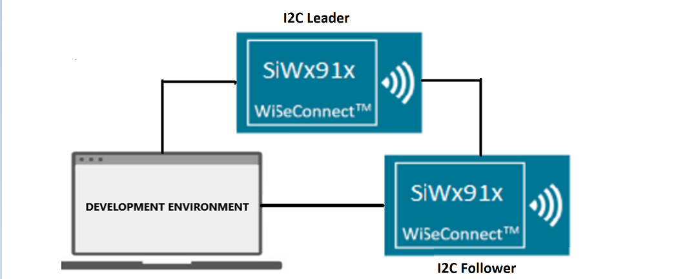
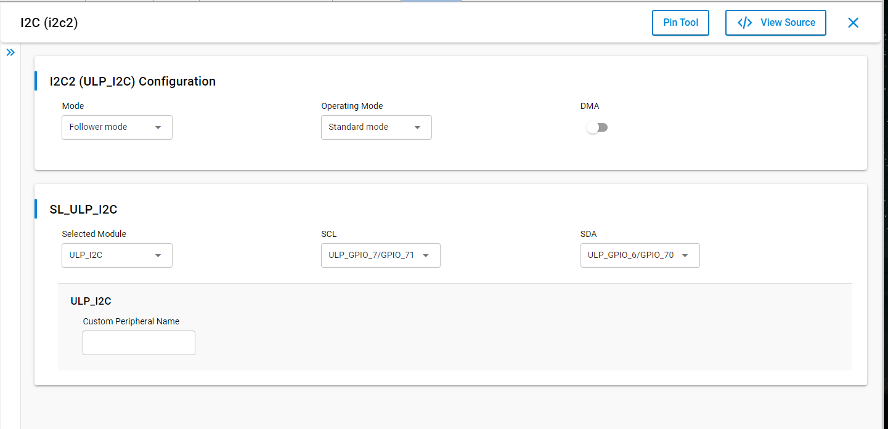
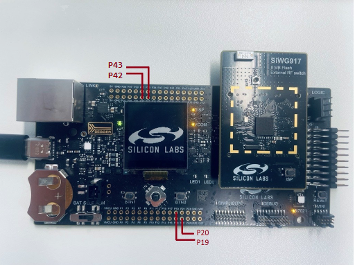
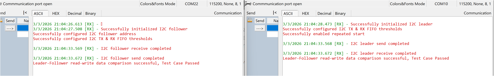

# SiWx91x Platform I2C DRIVER FOLLOWER FreeRTOS

## Table of Contents

- [SiWx91x Platform I2C DRIVER FOLLOWER FreeRTOS](#platform-siwx91x-i2c-driver-follower-freertos)
  - [Purpose/Scope](#purposescope)
  - [Overview](#overview)
  - [About Example Code](#about-example-code)
    - [FreeRTOS Architecture](#freertos-architecture)
  - [Prerequisites/Setup Requirements](#prerequisitessetup-requirements)
    - [Hardware Requirements](#hardware-requirements)
    - [Software Requirements](#software-requirements)
    - [Setup Diagram](#setup-diagram)
  - [Getting Started](#getting-started)
  - [Application Build Environment](#application-build-environment)
    - [Application Configuration Parameters](#application-configuration-parameters)
    - [Pin Configuration](#pin-configuration)
    - [Pin Connections Between Leader and Follower](#pin-connections-between-leader-and-follower)
  - [Test the Application](#test-the-application)
    - [Expected Output](#expected-output)
  - [Troubleshooting](#troubleshooting)
  - [Resources](#resources)
  - [Report Bugs / Support](#report-bugs--support)

## Purpose/Scope

The application demonstrates I2C data transfer from Leader to Follower and then Follower to Leader, running as a dedicated FreeRTOS task using CMSIS-RTOS2 APIs. After transmission the data is compared and the result is printed on the console.

> **Note:** The master-slave terminology is now replaced with Leader-Follower. Master is now recognized as Leader and slave is now recognized as Follower.

## Overview

- The I2C will be configured in Follower mode. The SCL and SDA lines of the Leader controller are connected to the Follower's SCL and SDA pins.
- Here the SCL and SDA lines of the Follower are configured as internal pull-up.
- There are three configurable I2C controllers in M4 - two in the MCU HP peripherals (I2C0, I2C1) and one in the MCU ULP subsystem (ULP_I2C). For this example, ULP_I2C (I2C2) is used by default.
- The I2C interface allows the processor to serve as a Leader or Follower on the I2C bus.
- I2C can be configured with the following features:
  - I2C standard compliant bus interface with open-drain pins
  - Configurable as Leader or Follower
  - Four speed modes: Standard Mode (100 kbps), Fast Mode (400 kbps), Fast Mode Plus (1 Mbps), and High-Speed Mode (3.4 Mbps)
  - 7- or 10-bit addressing and combined format transfers
  - Support for Clock synchronization and Bus Clear

## About Example Code

The source file for this example is `i2c_follower_freertos.c`.

This example demonstrates I2C data transfer between a Leader and Follower using Blocking APIs, running inside a dedicated FreeRTOS task.

- The I2C instance is initialized using [sl_i2c_driver_init](https://docs.silabs.com/wiseconnect/latest/wiseconnect-api-reference-guide-si91x-peripherals/i2-c#sl-i2c-driver-init) to configure the init structure parameters:
  - [sl_i2c_operating_mode_t](https://docs.silabs.com/wiseconnect/latest/wiseconnect-api-reference-guide-si91x-peripherals/i2-c#sl-i2c-operating-mode-t) bus speed (Standard, Fast, Fast Plus, or High Speed).
  - [sl_i2c_mode_t](https://docs.silabs.com/wiseconnect/latest/wiseconnect-api-reference-guide-si91x-peripherals/i2-c#sl-i2c-mode-t) mode, set to Follower mode.
  - [sl_i2c_transfer_type_t](https://docs.silabs.com/wiseconnect/latest/wiseconnect-api-reference-guide-si91x-peripherals/i2-c#sl-i2c-transfer-type-t), using non-DMA.
- The Follower's own address is set through [sl_i2c_driver_set_follower_address](https://docs.silabs.com/wiseconnect/latest/wiseconnect-api-reference-guide-si91x-peripherals/i2-c#sl-i2c-driver-set-follower-address).
- Transmit and receive FIFO thresholds are configured using [sl_i2c_driver_configure_fifo_threshold](https://docs.silabs.com/wiseconnect/latest/wiseconnect-api-reference-guide-si91x-peripherals/i2-c#sl-i2c-driver-configure-fifo-threshold).
- The TX buffer is filled with a test pattern.
- The task runs once: receives from the Leader using [sl_i2c_driver_receive_data_blocking](https://docs.silabs.com/wiseconnect/latest/wiseconnect-api-reference-guide-si91x-peripherals/i2-c#sl-i2c-driver-receive-data-blocking), sends back using [sl_i2c_driver_send_data_blocking](https://docs.silabs.com/wiseconnect/latest/wiseconnect-api-reference-guide-si91x-peripherals/i2-c#sl-i2c-driver-send-data-blocking), compares buffers, then calls `osThreadExit()`.
- If any API call fails, the task prints an error via `DEBUGOUT` and calls `osThreadExit()` to terminate.

### FreeRTOS Architecture

- On startup, `main.c` calls `sl_main_second_stage_init()` to initialize all SDK components, then calls `app_init()` which invokes `i2c_follower_example_init()`. This function creates the `i2c_follower_task` FreeRTOS thread using `osThreadNew()`.
- The `app_process_action()` function is a no-op since all application logic runs inside the dedicated task.
- The `main.c` flow calls `app_init()` followed by a `while (sl_main_start_task_should_continue())` loop that calls `app_process_action()` (no-op). The FreeRTOS scheduler manages task execution.

> **Note:**
>
> - I2C has three instances. You can handle these by adding the appropriate instance.
> - I2C0, I2C1, and I2C2 are the pre-defined names for the I2C instances.
> - For user-defined instances, you may need to define hardware-specific definitions in `config.h`.
> - It is recommended to install only a single instance intended for this application. If multiple instances are present, the application will select the first one it detects.


## Prerequisites/Setup Requirements

### Hardware Requirements

- Windows PC
- Silicon Labs SiWx917 Evaluation Kit [[BRD4002](https://www.silabs.com/development-tools/wireless/wireless-pro-kit-mainboard?tab=overview) + [BRD4338A](https://www.silabs.com/development-tools/wireless/wi-fi/siwx917-rb4338a-wifi-6-bluetooth-le-soc-radio-board?tab=overview) / [BRD4342A](https://www.silabs.com/development-tools/wireless/wi-fi/siwx91x-rb4342a-wifi-6-bluetooth-le-soc-radio-board?tab=overview) / [BRD4343A](https://www.silabs.com/development-tools/wireless/wi-fi/siw917y-rb4343a-wi-fi-6-bluetooth-le-8mb-flash-radio-board-for-module?tab=overview) / [BRD4343C](https://www.silabs.com/development-tools/wireless/wi-fi/siw917y-rb4343c-wi-fi-6-bluetooth-le-8mb-flash-radio-board-for-module?tab=overview)] - as Follower and Leader
- SiWx917 AC1 Module Explorer Kit [BRD2708A](https://www.silabs.com/development-tools/wireless/wi-fi/siw917y-ek2708a-explorer-kit) - as Follower and Leader

### Software Requirements

- Simplicity Studio
- Serial console setup
  - For serial console setup instructions, see the [Console Input and Output](https://docs.silabs.com/wiseconnect/latest/wiseconnect-developers-guide-developing-for-silabs-hosts/using-the-simplicity-studio-ide#console-input-and-output) section in the *WiSeConnect Developer's Guide*.

### Setup Diagram



## Getting Started

Refer to the instructions [here](https://docs.silabs.com/wiseconnect/latest/wiseconnect-getting-started/) to:

- [Install Simplicity Studio](https://docs.silabs.com/wiseconnect/latest/wiseconnect-developers-guide-developing-for-silabs-hosts/using-the-simplicity-studio-ide#install-simplicity-studio)
- [Install WiSeConnect extension](https://docs.silabs.com/wiseconnect/latest/wiseconnect-developers-guide-developing-for-silabs-hosts/using-the-simplicity-studio-ide#install-the-wiseconnect-3-extension)
- [Connect your device to the computer](https://docs.silabs.com/wiseconnect/latest/wiseconnect-developers-guide-developing-for-silabs-hosts/using-the-simplicity-studio-ide#connect-siwx91x-to-computer)
- [Upgrade your connectivity firmware](https://docs.silabs.com/wiseconnect/latest/wiseconnect-developers-guide-developing-for-silabs-hosts/using-the-simplicity-studio-ide#update-siwx91x-connectivity-firmware)
- [Create a Studio project](https://docs.silabs.com/wiseconnect/latest/wiseconnect-developers-guide-developing-for-silabs-hosts/using-the-simplicity-studio-ide#create-a-project)

For details on the project folder structure, see the [WiSeConnect Examples](https://docs.silabs.com/wiseconnect/latest/wiseconnect-examples/#example-folder-structure) page.

## Application Build Environment

### Application Configuration Parameters

- Open the `siwx91x_platform_i2c_driver_follower_freertos.slcp` project file, select the **Software Component** tab, and search for **i2c** in the search bar.
- Click on **I2C2** and configure the ULP_I2C instance as per the configuration parameters given in the wizard.
- For using any other I2C instance, add it by clicking on **I2C Instance** from the configuration wizard and then clicking **Add New Instance**.
- For creating I2C instances, write `i2c0`, `i2c1`, or `i2c2` (for ULP_I2C) on the wizard for the respective instance and then click **Done**. By default, `i2c2` (for ULP_I2C) will be created.
- After creating the instances, separate configuration files are generated in the **config** folder.
- If the project is built without selecting configurations, it will take default values from UC.
- Configure mode, operating mode, and transfer type of the I2C instance using the respective instance UC.
- Change 'Operating Mode' as per bus-speed requirement.
- After completing the above UC configurations, configure the following macros in `i2c_follower_freertos.c` if required:

- `I2C_BUFFER_SIZE`: Defines the number of bytes to send and receive between Leader and Follower. By default, it is set to 1024.

  ```c
  #define I2C_BUFFER_SIZE        1024 // Number of bytes to send and receive
  ```

- `OWN_I2C_ADDR`: 7-bit I2C follower address assigned to this device. The leader application must target this same address when communicating. By default, it is set to `0x50`.

  ```c
  #define OWN_I2C_ADDR           0x50 // Own I2C address
  ```

- `INITIAL_VALUE`: Defines the initial value used to fill the data buffer before transmission. By default, it is set to 0.

  ```c
  #define INITIAL_VALUE          0    // Initial value of buffer
  ```

> **Note:**
>
> - After completing the above configurations, connect the SCL and SDA pins of the Leader and Follower and run the application. Observe the results by connecting SDA and SCL pins to a logic analyzer. (If required, enable the glitch filter for the SCL channel with a time period of 100 ns to avoid glitches.)
> - For I2C1 High Speed mode, pin set `GPIO50 and GPIO51` is not working as expected.

- For proper speeds with Fast and Fast Plus modes, use an external pull-up of around 4.7K.
- For High-Speed mode data transfer, an external pull-up is required.
- Configure the UC as mentioned below.

  

### Pin Configuration

**I2C0:**

| PIN | WPK [BRD4002A] + BRD4338A | Explorer kit (BRD2708A) | Description              |
| --- | ------------------------- | ----------------------- | ------------------------ |
| SCL | GPIO_7 [P20]              | GPIO_7 [SCL]            | Connect to Leader SCL    |
| SDA | GPIO_6 [P19]              | GPIO_6 [SDA]            | Connect to Leader SDA    |

**I2C1:**

| PIN | WPK [BRD4002A] + BRD4338A | Explorer kit (BRD2708A) | Description              |
| --- | ------------------------- | ----------------------- | ------------------------ |
| SCL | GPIO_54 [P42]             | GPIO_6 [SDA]            | Connect to Leader SCL    |
| SDA | GPIO_55 [P43]             | GPIO_7 [SCL]            | Connect to Leader SDA    |

**ULP_I2C (default):**

| PIN | WPK [BRD4002A] + BRD4338A  | Explorer kit (BRD2708A) | Description              |
| --- | -------------------------- | ----------------------- | ------------------------ |
| SCL | ULP_GPIO_7 [EXP_HEADER-15] | ULP_GPIO_7 [TX]         | Connect to Leader SCL    |
| SDA | ULP_GPIO_6 [EXP_HEADER-16] | ULP_GPIO_6 [RX]         | Connect to Leader SDA    |




### Pin Connections Between Leader and Follower

| Signal | Follower Board Pin         | Leader Board Pin         | Wire        |
| ------ | -------------------------- | ------------------------ | ----------- |
| SCL    | ULP_GPIO_7                 | ULP_GPIO_7               | SCL to SCL  |
| SDA    | ULP_GPIO_6                 | ULP_GPIO_6               | SDA to SDA  |
| GND    | GND                        | GND                      | GND to GND  |

> **Note - In case of sleep-wakeup:**
>
> - As GPIO configurations will be lost after going to sleep state, the user has to reinitialize the I2C pins and driver after wakeup by using [sl_i2c_driver_init](https://docs.silabs.com/wiseconnect/latest/wiseconnect-api-reference-guide-si91x-peripherals/i2-c#sl-i2c-driver-init) for initializing the driver and [sl_si91x_i2c_pin_init](https://docs.silabs.com/wiseconnect/latest/wiseconnect-api-reference-guide-si91x-peripherals/i2-c#sl-si91x-i2c-pin-init) for initializing the pins.
> - If the project uses UC-generated I2C instances, call `sl_i2c_init_instances()` after wakeup before resuming I2C transfers so the configured I2C instances are restored.

## Test the Application

1. Flash the **Follower** board first and let it start. The I2C follower task **blocks** in `sl_i2c_driver_receive_data_blocking()` until the Leader starts that first read—this is **one** leader–follower transfer, not a continuous application loop or repeated wait cycle. After receive → send → compare, the task calls `osThreadExit()` and does not run the exchange again unless you reset the board.
2. Flash the **Leader** board. The Follower retries on `SL_I2C_TIMEOUT` until the Leader starts the transfer.
3. Connect the SCL (ULP_GPIO_7) and SDA (ULP_GPIO_6) pins between the Leader and Follower boards. Also connect GND.
4. When the Leader runs the transfer, the Follower completes that single exchange (receive from Leader, send back), validates, prints on the console, and the follower task ends.
5. Optionally, connect logic analyzer channels to the respective I2C instance SDA and SCL pins to observe the data on the lines.

### Expected Output



> **Note:**
>
> - Interrupt handlers are implemented in the driver layer, and user callbacks are provided for custom code. If you want to write your own interrupt handler instead of using the default one, make the driver interrupt handler a weak handler. Then, copy the necessary code from the driver handler to your custom interrupt handler.

## Troubleshooting

- If the project does not build, ensure Simplicity Studio and the WiSeConnect extension are installed and the board is connected.
- If the device is not detected, reinstall the connectivity firmware and check USB drivers.

## Resources

- [WiSeConnect Getting Started](https://docs.silabs.com/wiseconnect/latest/wiseconnect-getting-started/)
- [WiSeConnect Examples](https://docs.silabs.com/wiseconnect/latest/wiseconnect-examples/)
- [Si91x SoC Documentation](https://docs.silabs.com/wiseconnect/latest/)

## Report Bugs / Support

For issues and support, use the Silicon Labs Community or your normal support channel.

