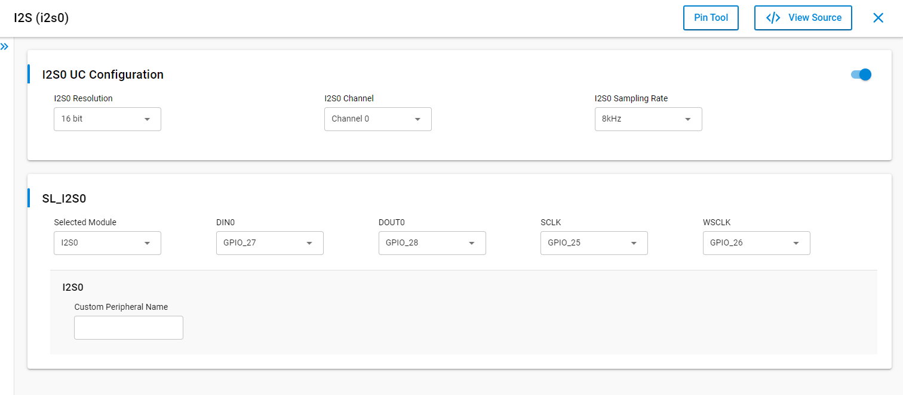
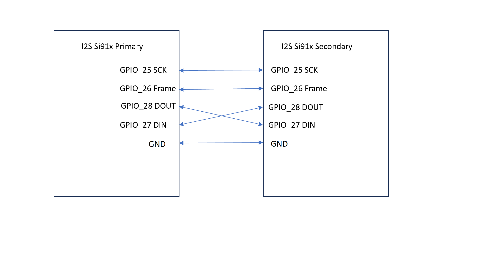
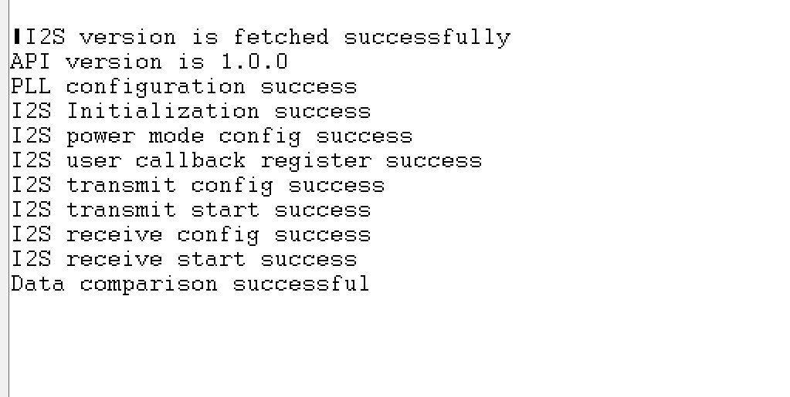

# SiWx91x Platform I2S SECONDARY FreeRTOS

## Table of Contents

- [SiWx91x Platform I2S SECONDARY FreeRTOS](#platform-siwx91x-i2s-secondary-freertos)
  - [Purpose/Scope](#purposescope)
  - [Overview](#overview)
  - [About Example Code](#about-example-code)
    - [FreeRTOS Architecture](#freertos-architecture)
    - [Initialization (i2s_secondary_init_function)](#initialization-i2s_secondary_init_function)
    - [Task Flow (i2s_secondary_task)](#task-flow-i2s_secondary_task)
  - [Prerequisites/Setup Requirements](#prerequisitessetup-requirements)
    - [Hardware Requirements](#hardware-requirements)
    - [Software Requirements](#software-requirements)
    - [Setup Diagram](#setup-diagram)
  - [Getting Started](#getting-started)
  - [Application Build Environment](#application-build-environment)
    - [Application Configuration Parameters](#application-configuration-parameters)
    - [Pin Configuration](#pin-configuration)
    - [Pin Connections Between Primary and Secondary](#pin-connections-between-primary-and-secondary)
  - [Test the Application](#test-the-application)
  - [Troubleshooting](#troubleshooting)
  - [Resources](#resources)
  - [Report Bugs / Support](#report-bugs--support)

## Purpose/Scope

This application runs on the **I2S secondary (slave)** device. It demonstrates **two-board** Inter-IC Sound (I2S) transfer with an **I2S primary (master)** board in a FreeRTOS environment.

## Overview

- The I2S_2CH supports two stereo channels, while the ULP_I2S and the NWP/Security subsystem I2S support one stereo channel.
- Supported programmable audio data resolutions are 16-, 24- and 32-bits.
- Supported audio sampling rates are 8, 11.025, 16, 22.05, 24, 32, 44.1, 48, 88.2, 96 and 192 kHz.
- Support for Master and Slave modes.
- Full-duplex communication due to the independence of transmitter and receiver.
- Programmable FIFO thresholds with maximum FIFO depth of 8 and support for DMA.
- Supports generation of interrupts for different events.

## About Example Code

This example demonstrates I2S **two-board** secondary transfer as a dedicated FreeRTOS task.

- Resolution, sampling rate, and channel can be configured using the **I2S** UC. Generated values appear as `SL_I2S0_*` macros in the **config folder**.
- The [`sl_si91x_i2s_config.h`](https://github.com/SiliconLabs/wiseconnect/blob/v4.1.1-content-for-docs/components/device/silabs/si91x/mcu/drivers/unified_api/config/sl_i2s_config/sl_si91x_i2s_config.h) file contains the UC-driven I2S instance configuration.

### FreeRTOS Architecture

- On startup, `main.c` calls `app_init()` which invokes `i2s_example_init()`. This function creates the `i2s_secondary_task` FreeRTOS thread using `osThreadNew()`. The `app_process_action()` function is a no-op since all application logic runs inside the dedicated task.
- The `main.c` FreeRTOS flow calls `app_init()` followed by a `while (sl_main_start_task_should_continue())` loop that calls `app_process_action()` (no-op). The FreeRTOS scheduler manages task execution.

### Initialization (i2s_secondary_init_function)

- The transmit buffer `i2s_secondary_data_out[]` is filled with a ramp pattern used for comparison after the receive phase.
- The firmware version of the API is fetched using [sl_si91x_i2s_get_version](https://docs.silabs.com/wiseconnect/latest/wiseconnect-api-reference-guide-si91x-peripherals/i2-s#sl-si91x-i2s-get-version).
- [sl_si91x_i2s_init](https://docs.silabs.com/wiseconnect/latest/wiseconnect-api-reference-guide-si91x-peripherals/i2-s#sl-si91x-i2s-init) initializes instance `I2S_INSTANCE` and returns `i2s_driver_handle`.
- [sl_si91x_i2s_configure_power_mode](https://docs.silabs.com/wiseconnect/latest/wiseconnect-api-reference-guide-si91x-peripherals/i2-s#sl-si91x-i2s-configure-power-mode) selects **full power** (`SL_I2S_FULL_POWER`).
- `i2s_event_flags` is created with `osEventFlagsNew()` (with a NULL guard so it is only created once).
- [sl_si91x_i2s_register_event_callback](https://docs.silabs.com/wiseconnect/latest/wiseconnect-api-reference-guide-si91x-peripherals/i2-s#sl-si91x-i2s-register-event-callback) installs a handler that calls `osEventFlagsSet()` on `SL_I2S_SEND_COMPLETE` and `SL_I2S_RECEIVE_COMPLETE`.

### Task Flow (i2s_secondary_task)

After successful initialization, the task fills `sl_i2s_xfer_config_t` for **secondary** mode (`SL_I2S_SLAVE`), UC-driven resolution and sampling rate, `SL_I2S_ASYNC`, and `SL_I2S_DATA_SIZE16`. It then runs **one** pass (no repeating loop):

1. **Transmit phase:** Sets `transfer_type` to `SL_I2S_TRANSMIT`, calls [sl_si91x_i2s_config_transmit_receive](https://docs.silabs.com/wiseconnect/latest/wiseconnect-api-reference-guide-si91x-peripherals/i2-s#sl-si91x-i2s-config-transmit-receive), starts [sl_si91x_i2s_transmit_data](https://docs.silabs.com/wiseconnect/latest/wiseconnect-api-reference-guide-si91x-peripherals/i2-s#sl-si91x-i2s-transmit-data) from `i2s_secondary_data_out[]`, and blocks on `osEventFlagsWait()` for `I2S_EVENT_SEND_COMPLETE` (the primary must be receiving).
2. **Receive phase:** Sets `transfer_type` to `SL_I2S_RECEIVE`, calls `sl_si91x_i2s_config_transmit_receive`, starts [sl_si91x_i2s_receive_data](https://docs.silabs.com/wiseconnect/latest/wiseconnect-api-reference-guide-si91x-peripherals/i2-s#sl-si91x-i2s-receive-data) into `i2s_secondary_data_in[]`, and blocks on `osEventFlagsWait()` for `I2S_EVENT_RECEIVE_COMPLETE`.
3. **Compare:** Calls `i2s_app_compare_data()` on `i2s_secondary_data_in[]` vs `i2s_secondary_data_out[]`.
4. The task calls **`osThreadExit()`** and does not loop.

If any API call fails, the task prints an error via `DEBUGOUT` and calls **`osThreadExit()`**.

**Note:**

- `sl_i2s_xfer_config_t` has the following parameters:
  - **mode** — Primary (master) or secondary (slave).
  - **sync** — Synchronous (shared SCK/WS) vs asynchronous (separate SCK/WS for TX/RX). The driver supports **ASYNC** in this example.
  - **protocol** — I2S vs PCM; the driver supports **I2S** here.
  - **resolution** — 16-, 24-, or 32-bit audio resolution.
  - **data_size** — Buffer element size (8-, 16-, 32-bit transfer encoding).
  - **sampling_rate** — Audio sampling rate.
  - **transfer_type** — Transmit, receive, or abort variants.
- Transfers with 16-bit resolution must use a `uint16_t` buffer and pass `SL_I2S_DATA_SIZE16` to the `data_size` field in `sl_i2s_xfer_config_t` while configuring the transfer.
- Transfers with 24-bit and 32-bit resolutions must use a `uint32_t` buffer and pass `SL_I2S_DATA_SIZE32`.
- Because 8-bit resolution is not supported, use a `uint8_t` buffer with 16-bit resolution, pass `SL_I2S_DATA_SIZE8`, cast the buffer to `(uint16_t *)`, and set the transfer size to half the 8-bit buffer length. (Refer to the **[I2S loopback FreeRTOS](https://github.com/SiliconLabs/wiseconnect/blob/v4.1.1-content-for-docs/examples/si91x_soc/peripheral/siwx91x_platform_i2s_loopback_freertos/readme.md)** example.) For 8-bit transfers, the transfer size in bytes must be a multiple of four (for example, 8, 12, 16, or 20).
- For 16-bit or 32-bit resolution, the transfer size must be an **even** value (8, 10, 12, 14…). For 24-bit resolution, it must be a **multiple of four** (8, 12, 16, 20…).
- SCK frequency is calculated as **SCK = 2 × bit_width × sampling_rate**. By default, I2S0 uses `I2S_PLL_CLK` as the clock source. This can generate any frequency range described in section 6.11.7 of the SiWx91x HRM.
- By default, ULP_I2S/I2S1 uses `ULP_MHZ_RC_CLK` for low-power operation, which limits the maximum supported sampling frequency of ULP_I2S to **48 kHz** (32 MHz RC trims to 20 MHz in sleep).

## Prerequisites/Setup Requirements

### Hardware Requirements

- Windows PC
- Silicon Labs SiWx917 Evaluation Kit [[BRD4002](https://www.silabs.com/development-tools/wireless/wireless-pro-kit-mainboard?tab=overview) + [BRD4338A](https://www.silabs.com/development-tools/wireless/wi-fi/siwx917-rb4338a-wifi-6-bluetooth-le-soc-radio-board?tab=overview) / [BRD4342A](https://www.silabs.com/development-tools/wireless/wi-fi/siwx91x-rb4342a-wifi-6-bluetooth-le-soc-radio-board?tab=overview) / [BRD4343A](https://www.silabs.com/development-tools/wireless/wi-fi/siw917y-rb4343a-wi-fi-6-bluetooth-le-8mb-flash-radio-board-for-module?tab=overview) / [BRD4343C](https://www.silabs.com/development-tools/wireless/wi-fi/siw917y-rb4343c-wi-fi-6-bluetooth-le-8mb-flash-radio-board-for-module?tab=overview)]
- SiWx917 AC1 Module Explorer Kit [BRD2708A](https://www.silabs.com/development-tools/wireless/wi-fi/siw917y-ek2708a-explorer-kit)

### Software Requirements

- Simplicity Studio
- Serial console setup
  - For Serial Console setup instructions, refer to [Console Input and Output](https://docs.silabs.com/wiseconnect/latest/wiseconnect-developers-guide-developing-for-silabs-hosts/using-the-simplicity-studio-ide#console-input-and-output).

### Setup Diagram


## Getting Started

Refer to the instructions [here](https://docs.silabs.com/wiseconnect/latest/wiseconnect-getting-started/) to:

- [Install Simplicity Studio](https://docs.silabs.com/wiseconnect/latest/wiseconnect-developers-guide-developing-for-silabs-hosts/using-the-simplicity-studio-ide#install-simplicity-studio)
- [Install WiSeConnect extension](https://docs.silabs.com/wiseconnect/latest/wiseconnect-developers-guide-developing-for-silabs-hosts/using-the-simplicity-studio-ide#install-the-wiseconnect-3-extension)
- [Connect your device to the computer](https://docs.silabs.com/wiseconnect/latest/wiseconnect-developers-guide-developing-for-silabs-hosts/using-the-simplicity-studio-ide#connect-siwx91x-to-computer)
- [Upgrade your connectivity firmware](https://docs.silabs.com/wiseconnect/latest/wiseconnect-developers-guide-developing-for-silabs-hosts/using-the-simplicity-studio-ide#update-siwx91x-connectivity-firmware)
- [Create a Studio project](https://docs.silabs.com/wiseconnect/latest/wiseconnect-developers-guide-developing-for-silabs-hosts/using-the-simplicity-studio-ide#create-a-project)

For details on the project folder structure, see the [WiSeConnect Examples](https://docs.silabs.com/wiseconnect/latest/wiseconnect-examples/#example-folder-structure) page.

## Application Build Environment

### Application Configuration Parameters

- Configure UC from the slcp component.
- Open the **siwx91x_platform_i2s_secondary_freertos.slcp** project file, select the **Software Component** tab, and search for **I2S** in the search bar.

  

- You can use the configuration wizard to configure different parameters like:

  - **General Configuration**
    - **SL_I2S0_RESOLUTION:** I2S0 resolution. Valid values are 16-, 24-, and 32-bit.
    - **SL_I2S0_SAMPLING_RATE:** I2S0 sampling rate. Valid values include 8 kHz, 11.025 kHz, 16 kHz, 22.05 kHz, 24 kHz, 32 kHz, 44.1 kHz, 48 kHz, 88.2 kHz, 96 kHz, and 192 kHz.
    - **SL_I2S0_CHANNEL:** I2S0 channel number (0 or 1).

- Configuration files are generated in the **config folder**. If the configurations are not changed, the code will run on default UC values.

- Configure the following macros in [`i2s_secondary_freertos.c`](i2s_secondary_freertos.c) if required:

- `I2S_SECONDARY_BUFFER_SIZE`: Defines the size of the transmit and receive buffers used by the I2S secondary. By default, it is set to 1024.

  ```c
  #define I2S_SECONDARY_BUFFER_SIZE  1024 // Transmit/Receive buffer size
  ```

- `I2S_INSTANCE`: Selects the I2S instance used by the application (0 for I2S0, 1 for ULP_I2S). By default, it is set to 0.

  ```c
  #define I2S_INSTANCE               0    // I2S instance
  ```

> **Note:** Use the **same** `SL_I2S0_*` UC settings on the **primary** board. **I2S Primary (Master) Setup:** For the companion application and pins, refer to [I2S Primary FreeRTOS](https://github.com/SiliconLabs/wiseconnect/blob/v4.1.1-content-for-docs/examples/si91x_soc/peripheral/siwx91x_platform_i2s_primary_freertos/readme.md).

### Pin Configuration

**I2S Secondary Pin Configuration:**

| WPK [BRD4002A] + BRD4338A | Explorer kit (BRD2708A) | Description   |
| ------------------------- | ----------------------- | ------------- |
| GPIO_25 [P25]             | GPIO_25 [SCK]           | I2S SCK       |
| GPIO_26 [P27]             | GPIO_26 [MISO]          | I2S WS (frame)|
| GPIO_28 [P31]             | GPIO_28 [CS]            | I2S DOUT      |
| GPIO_27 [P29]             | GPIO_27 [MOSI]          | I2S DIN       |



### Pin Connections Between Primary and Secondary

**If using WPK (BRD4002A) baseboard with BRD4338A radio board:**

| Signal     | Primary Board Pin (GPIO) | Primary Breakout | Secondary Board Pin (GPIO) | Secondary Breakout | Wire                         |
| ---------- | -------------------------- | ---------------- | ---------------------------- | ------------------ | ---------------------------- |
| SCK        | GPIO_25                    | P25              | GPIO_25                      | P25                | SCK → SCK                    |
| WS (frame) | GPIO_26                    | P27              | GPIO_26                      | P27                | WS → WS                      |
| DOUT       | GPIO_28                    | P31              | GPIO_27                      | P29                | Primary DOUT → Secondary DIN |
| DIN        | GPIO_27                    | P29              | GPIO_28                      | P31                | Primary DIN → Secondary DOUT |
| GND        | GND                        | GND              | GND                          | GND                | GND → GND                    |

**If using Explorer Kit (BRD2708A) on both sides:**

| Signal     | Primary Board GPIO | Secondary Board GPIO | Wire                         |
| ---------- | ------------------ | -------------------- | ---------------------------- |
| SCK        | GPIO_25 [SCK]      | GPIO_25 [SCK]        | SCK → SCK                    |
| WS (frame) | GPIO_26 [MISO]     | GPIO_26 [MISO]       | WS → WS                      |
| DOUT       | GPIO_28 [CS]       | GPIO_27 [MOSI]       | Primary DOUT → Secondary DIN |
| DIN        | GPIO_27 [MOSI]     | GPIO_28 [CS]         | Primary DIN → Secondary DOUT |
| GND        | GND                | GND                  | GND → GND                    |

>**Note:** Make sure the following pin configurations are in the `RTE_Device_917.h` file:
>
> - SiWx917: RTE_Device_917.h (path: /$project/config/RTE_Device_917.h)

## Test the Application

Refer to the instructions [here](https://docs.silabs.com/wiseconnect/latest/wiseconnect-getting-started/) to:

1. Build and flash this **secondary** application on one board and **[I2S Primary FreeRTOS](https://github.com/SiliconLabs/wiseconnect/blob/v4.1.1-content-for-docs/examples/si91x_soc/peripheral/siwx91x_platform_i2s_primary_freertos/readme.md)** on the other.
2. Connect I2S **SCK**, **WS**, crossed **DOUT/DIN**, and **GND** between the boards as per the pin connection tables above.
3. Open a serial console on each board. This task starts with **transmit**; the **primary (master)** must supply SCK/WS during that phase, so do not reset or start only this board while the primary is still stopped.
4. **Reset the secondary board first, then reset the primary board within a short time** so this board’s **transmit** lines up with the primary **receive** phase.
5. After the **single** exchange, both tasks call **`osThreadExit()`**. To run again, repeat from step 4. After successful execution, the serial console output should look as shown below.

   

> **Note:**
>
> - Interrupt handlers are implemented in the driver layer, and user callbacks are provided for custom code. If you want to write your own interrupt handler instead of using the default one, make the driver interrupt handler a weak handler. Then, copy the necessary code from the driver handler to your custom interrupt handler.

## Troubleshooting

- If the project does not build, ensure Simplicity Studio and the WiSeConnect extension are installed and the board is connected.
- If the device is not detected, reinstall the connectivity firmware and check USB drivers.

## Resources

- [WiSeConnect Getting Started](https://docs.silabs.com/wiseconnect/latest/wiseconnect-getting-started/)
- [WiSeConnect Examples](https://docs.silabs.com/wiseconnect/latest/wiseconnect-examples/)
- [Si91x SoC Documentation](https://docs.silabs.com/wiseconnect/latest/)

## Report Bugs / Support

For issues and support, use the Silicon Labs Community or your normal support channel.


