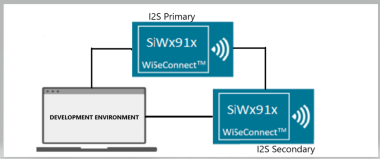
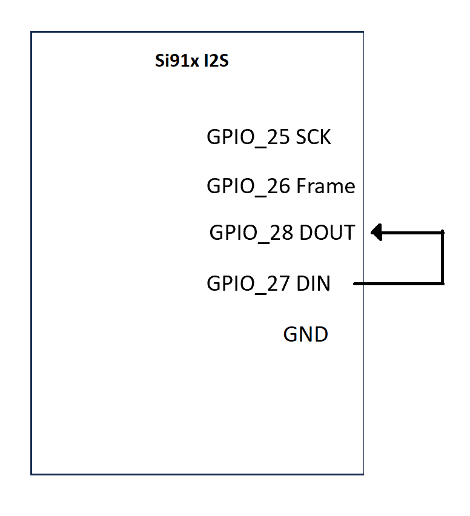
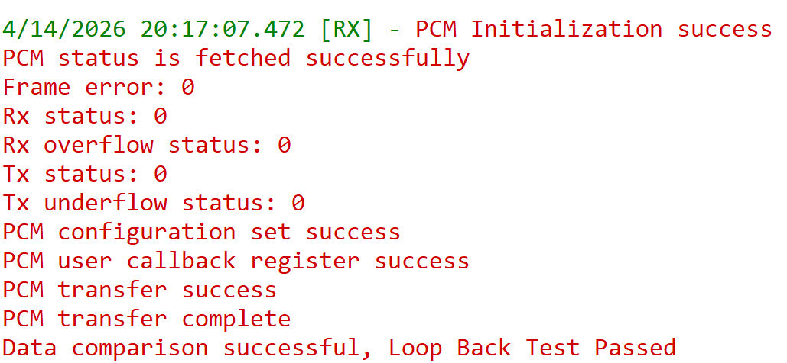

# SiWx91x Platform PCM Loopback FreeRTOS

## Table of Contents

- [SiWx91x Platform PCM Loopback FreeRTOS](#siwx91x-platform-pcm-loopback-freertos)
  - [Table of Contents](#table-of-contents)
  - [Purpose/Scope](#purposescope)
  - [Overview](#overview)
  - [About Example Code](#about-example-code)
  - [Prerequisites/Setup Requirements](#prerequisitessetup-requirements)
    - [Hardware Requirements](#hardware-requirements)
    - [Software Requirements](#software-requirements)
    - [Setup Diagram](#setup-diagram)
  - [Getting Started](#getting-started)
  - [Application Build Environment](#application-build-environment)
    - [General Configuration](#general-configuration)
    - [Using ULP\_PCM Instance](#using-ulp_pcm-instance)
    - [Pin Configuration](#pin-configuration)
    - [Pin Description](#pin-description)
  - [Test the Application](#test-the-application)
  - [Troubleshooting](#troubleshooting)
  - [Resources](#resources)
  - [Report Bugs/Support](#report-bugssupport)

## Purpose/Scope

- - This application demonstrates the PCM loopback functionality in a FreeRTOS environment.

## Overview

- Supports programmable audio data resolutions of 16, 24, and 32 bits.
- Supported audio sampling rates are 8, 11.025, 16, 22.05, and 24 kHz.
- Supports Master and Slave modes.
- Full duplex communication with independent transmitter and receiver.
- Programmable FIFO thresholds with a maximum FIFO depth of 8 and support for DMA.
- Generates interrupts for various events.

## About Example Code

**FreeRTOS application structure**

- The `.slcp` includes **`freertos_heap_4`**. **`app_init()`** calls **`pcm_example_init()`** (declared in `pcm_loopback_freertos.h`), which only **creates** the `pcm_loopback` thread. **`app_process_action()`** does nothing; PCM work runs entirely in that task.
- **`pcm_loopback_freertos.c`**: the task calls **`pcm_loopback_init_function()`** — `sl_si91x_pcm_init`, **`osEventFlagsNew`**, **`sl_si91x_pcm_register_event_callback`** (ISR path calls **`osEventFlagsSet`** for TX/RX complete), **`sl_si91x_pcm_set_configuration`**, TX/RX **`sl_si91x_pcm_config_transmit_receive`**, then **`sl_si91x_pcm_transfer`**. The task **blocks** on **`osEventFlagsWait`** (both events), checks data counts, **compares** buffers (with frame-offset handling), **aborts** TX/RX with **`sl_si91x_pcm_end_transfer`**, then **`osThreadExit()`** — **one transfer, single-shot** (same idea as `i2s_loopback_freertos`).

**PCM / driver steps (same peripheral flow as bare-metal loopback)**

- Stores the driver handle in `pcm_handle` using **`sl_si91x_pcm_init()`**.
- Configures PCM using **`sl_si91x_pcm_set_configuration()`** and starts one full-duplex loopback **`sl_si91x_pcm_transfer`** with DMA.
- Compares transmitted and received data after both DMA completions are reported via callbacks.

>**Note!**
>Ensure transfer sizes align with the resolution requirements (for example, multiples of 4 for 24-bit resolutions).

## Prerequisites/Setup Requirements

### Hardware Requirements

- Windows PC
- Silicon Labs SiWx91x Evaluation Kit [[BRD4002](https://www.silabs.com/development-tools/wireless/wireless-pro-kit-mainboard?tab=overview) + [BRD4338A](https://www.silabs.com/development-tools/wireless/wi-fi/siwx917-rb4338a-wifi-6-bluetooth-le-soc-radio-board?tab=overview) / [BRD4342A](https://www.silabs.com/development-tools/wireless/wi-fi/siwx91x-rb4342a-wifi-6-bluetooth-le-soc-radio-board?tab=overview) / [BRD4343A](https://www.silabs.com/development-tools/wireless/wi-fi/siw917y-rb4343a-wi-fi-6-bluetooth-le-8mb-flash-radio-board-for-module?tab=overview) / [BRD4343C](https://www.silabs.com/development-tools/wireless/wi-fi/siw917y-rb4343c-wi-fi-6-bluetooth-le-8mb-flash-radio-board-for-module?tab=overview)]
- SiWx917 AC1 Module Explorer Kit [BRD2708A](https://www.silabs.com/development-tools/wireless/wi-fi/siw917y-ek2708a-explorer-kit)

### Software Requirements

- Simplicity Studio
- Serial console setup
  - For serial console setup, see [Console input and output](https://docs.silabs.com/wiseconnect/latest/wiseconnect-developers-guide-developing-for-silabs-hosts/using-the-simplicity-studio-ide#console-input-and-output).

### Setup Diagram

>

## Getting Started

Refer to the instructions [here](https://docs.silabs.com/wiseconnect/latest/wiseconnect-getting-started/) to:

- [Install Simplicity Studio](https://docs.silabs.com/wiseconnect/latest/wiseconnect-developers-guide-developing-for-silabs-hosts/using-the-simplicity-studio-ide#install-simplicity-studio)
- [Install WiSeConnect extension](https://docs.silabs.com/wiseconnect/latest/wiseconnect-developers-guide-developing-for-silabs-hosts/using-the-simplicity-studio-ide#install-the-wiseconnect-3-extension)
- [Connect your device to the computer](https://docs.silabs.com/wiseconnect/latest/wiseconnect-developers-guide-developing-for-silabs-hosts/using-the-simplicity-studio-ide#connect-siwx91x-to-computer)
- [Upgrade your connectivity firmware](https://docs.silabs.com/wiseconnect/latest/wiseconnect-developers-guide-developing-for-silabs-hosts/using-the-simplicity-studio-ide#update-siwx91x-connectivity-firmware)
- [Create a Studio project](https://docs.silabs.com/wiseconnect/latest/wiseconnect-developers-guide-developing-for-silabs-hosts/using-the-simplicity-studio-ide#create-a-project).

For details on the project folder structure, see the [WiSeConnect Examples](https://docs.silabs.com/wiseconnect/latest/wiseconnect-examples/#example-folder-structure) page.

## Application Build Environment

1. Configure UC from the slcp component.
2. Open **siwx91x_platform_pcm_loopback_freertos.slcp** project file, select the **software component** tab, and search for **PCM** in the search bar.

### General Configuration

Using the configuration wizard, configure parameters as follows:

- `SL_PCM0_RESOLUTION`: PCM resolution can be configured through this macro. Valid resolution values are 16, 24, and 32 bits.
- `SL_PCM0_SAMPLING_RATE`: PCM sampling rate can be configured through this macro. Valid sampling rate values are 8 kHz, 11.025, 16, 22.05, and 24 kHz.

Configuration files are generated in the **config** folder. If not changed, the code will run on default UC values.

Configure the following macros in `pcm_loopback_freertos.c` and update or modify them if required.

  ```C
  #define PCM_BUFFER_SIZE 1024    ///< Transmit/Receive buffer size
  ```

- If the resolution is changed to 24-bit or 32-bit, update the typedef for `pcm_data_size_t` to `uint32_t` instead of `uint16_t` to accommodate the larger data size -

 ```C
 typedef uint32_t pcm_data_size_t;
 ```

### Using ULP_PCM Instance

To use the ULP_PCM instance instead of the default PCM0 instance:

- Change the `PCM_INSTANCE` macro value to `ULP_PCM` in `pcm_loopback_freertos.c`:

  ```C
  #define PCM_INSTANCE ULP_PCM
  ```

### Pin Configuration

|   GPIO    | Breakout pin on WPK (4002A baseboard) | Breakout pin Explorer kit |  Description     |
| ----------| --------------------------------------|-------------------------- | ---------------- |
| GPIO_25   |         P25                           |          [SCK]            | PCM SCK          |
| GPIO_26   |         P27                           |          [MISO]           | PCM Frame Sync   |
| GPIO_28   |         P31                           |          [CS]             | PCM DOUT         |
| GPIO_27   |         P29                           |          [MOSI]           | PCM DIN          |

- For pin connections, refer to the following diagram:

  

### Pin Description

>**Note:** The default pin configurations are set in the SiWx917:[RTE_Device_917.h](path:/$project/config/RTE_Device_917.h) file. Verify that these pin settings match your hardware setup. You can modify the pin configurations in this file if your board uses different GPIO pins for the PCM interface.

## Test the Application

Refer to the instructions [here](https://docs.silabs.com/wiseconnect/latest/wiseconnect-getting-started/) to:

1. Build and flash **SiWx91x Platform - PCM Loopback FreeRTOS** (`siwx91x_platform_pcm_loopback_freertos.slcp`).
2. Open the serial console. After reset, the PCM task runs **one** loopback transfer and prints comparison result; the PCM task then ends (idle thread and other RTOS activity continue).
3. After successful execution, console output should match the figure below. To run another PCM loopback cycle, **reset** the board (the example is single-shot per boot).

   

> **Note:**
>
> - Interrupt handlers are implemented in the driver layer, and user callbacks are provided for custom code. If you want to write your own interrupt handler instead of using the default one, make the driver interrupt handler a weak handler. Then, copy the necessary code from the driver handler to your custom interrupt handler.
> - pcm0 or ulp_pcm uses i2s0 and ulp_i2s peripherals internally. It is recommended not to install the i2s0 and ulp_i2s instances simultaneously with pcm0 or ulp_pcm, as this may cause resource conflicts.
## Troubleshooting

- If the project does not build, ensure Simplicity Studio and the WiSeConnect extension are installed and the board is connected.
- If the device is not detected, reinstall the connectivity firmware and check USB drivers.

## Resources

- [WiSeConnect Getting Started](https://docs.silabs.com/wiseconnect/latest/wiseconnect-getting-started/)
- [WiSeConnect Examples](https://docs.silabs.com/wiseconnect/latest/wiseconnect-examples/)
- [SiWx91x SoC Documentation](https://docs.silabs.com/wiseconnect/latest/)

## Report Bugs/Support

For issues and support, use the Silicon Labs Community or your normal support channel.
