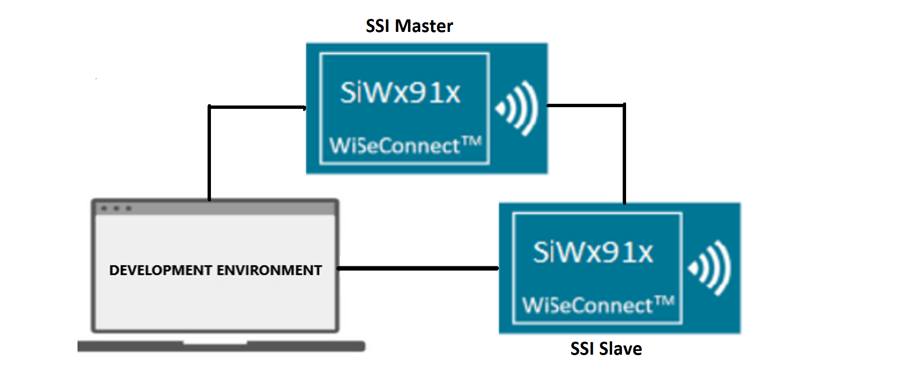
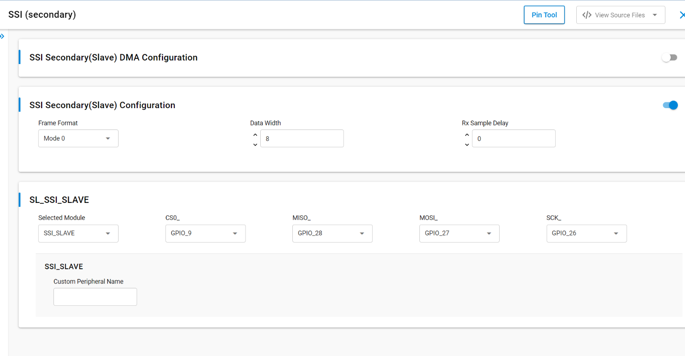
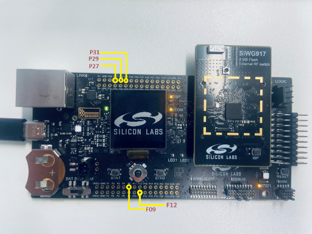

# SiWx91x Platform SSI SLAVE FreeRTOS

## Table of Contents

- [SiWx91x Platform SSI SLAVE FreeRTOS](#platform-siwx91x-ssi-slave-freertos)
  - [Purpose/Scope](#purposescope)
  - [Overview](#overview)
  - [About Example Code](#about-example-code)
    - [FreeRTOS Architecture](#freertos-architecture)
    - [Initialization (init_function)](#initialization-init_function)
    - [Task Flow (ssi_slave_task)](#task-flow-ssi_slave_task)
  - [Prerequisites/Setup Requirements](#prerequisitessetup-requirements)
    - [Hardware Requirements](#hardware-requirements)
    - [Software Requirements](#software-requirements)
    - [Setup Diagram](#setup-diagram)
  - [Getting Started](#getting-started)
  - [Application Build Environment](#application-build-environment)
    - [Application Configuration Parameters](#application-configuration-parameters)
    - [Pin Configuration](#pin-configuration)
    - [Pin Connections Between Master and Slave](#pin-connections-between-master-and-slave)
  - [Test the Application](#test-the-application)
  - [Troubleshooting](#troubleshooting)
  - [Resources](#resources)
  - [Report Bugs / Support](#report-bugs--support)

## Purpose/Scope

This application demonstrates the use of Synchronous Serial Interface (SSI) for data transfer in full duplex in slave mode in a FreeRTOS environment.

## Overview

- SSI is a synchronous, point-to-point, serial communication channel for digital data transmission.
- Synchronous data transmission is one in which the data is transmitted by synchronizing the transmission at the receiving and sending ends using a common clock signal.
- SSI is a synchronous four-wire interface consisting of two data pins(MOSI, MISO), a device select pin (CSN) and a gated clock pin(SCLK).
- With the two data pins, it allows for full-duplex operation with other SSI compatible devices.
- It supports a full-duplex, single-bit SPI master mode.
- It supports 6 modes:  
  - Mode 0: Clock Polarity is zero and Clock Phase is zero.
  - Mode 1: Clock Polarity is zero, Clock Phase is one.
  - Mode 2: Clock Polarity is one and Clock Phase is zero.
  - Mode 3: Clock Polarity is one and Clock Phase is one.
  - Mode-4: TEXAS_INSTRUMENTS SSI.
  - Mode-5: NATIONAL_SEMICONDUCTORS_MICROWIRE.
- The SPI clock is programmable to meet required baud rates.
- It can generate interrupts for different events like transfer complete, data lost, and mode fault.
- It supports up to 32K bytes of read data from an SSI device in a single read operation.
- It has support for DMA (Dynamic Memory Access).
- It can run in synchronous mode with full-duplex operation.
  - Master transmits data on MOSI pin and receives the same data on MISO pin
- It also supports send and receives data with any SSI slave. Additionally, it also supports DMA and non-DMA transfer.
- For half-duplex communication (that is, send and receive), a master / slave connection is required.

>**Note!** Make sure to use non-ROM SSI APIs for this application and SL_SSI driver.

## About Example Code

This example demonstrates SSI transfer (full-duplex communication) and SSI send/SSI receive (half-duplex communication) running as a dedicated FreeRTOS task.

- Various parameters like SSI clock mode, Bit-width, Manual cs pin, and SSI baud rate can be configured using the UC. Also, Master or Slave or ULP Master DMA can be configured using UC.
- The [`sl_si91x_ssi_config.h`](https://github.com/SiliconLabs/wiseconnect/blob/v4.1.1-content-for-docs/components/device/silabs/si91x/mcu/drivers/unified_api/config/sl_si91x_ssi_config.h) file contains the control configurations and [`sl_si91x_ssi_common_config.h`](https://github.com/SiliconLabs/wiseconnect/blob/v4.1.1-content-for-docs/components/device/silabs/si91x/mcu/drivers/unified_api/config/sl_si91x_ssi_common_config.h) contains DMA configuration selection.

### FreeRTOS Architecture

- On startup, `main.c` calls `app_init()` which invokes `ssi_slave_example_init()`. This function creates the `ssi_slave_task` FreeRTOS thread using `osThreadNew()`. The `app_process_action()` function is a no-op since all application logic runs inside the dedicated task.
- The `main.c` FreeRTOS flow calls `app_init()` followed by a `while (sl_main_start_task_should_continue())` loop that calls `app_process_action()` (no-op). The FreeRTOS scheduler manages task execution.

### Initialization (init_function)

- The output buffer is filled with data which is transferred to the master.
- The firmware version of the API is fetched using [sl_si91x_ssi_get_version](https://docs.silabs.com/wiseconnect/latest/wiseconnect-api-reference-guide-si91x-peripherals/ssi#sl-si91x-ssi-get-version) which includes the release version, major version, and minor version [sl_ssi_version_t](https://docs.silabs.com/wiseconnect/latest/wiseconnect-api-reference-guide-si91x-peripherals/sl-ssi-version-t).
- [sl_si91x_ssi_init](https://docs.silabs.com/wiseconnect/latest/wiseconnect-api-reference-guide-si91x-peripherals/ssi#sl-si91x-ssi-init) is used to initialize the peripheral, that includes pin configuration and it powers up the module.
- SSI instance must be passed in init to get the instance handle [sl_ssi_instance_t](https://docs.silabs.com/wiseconnect/latest/wiseconnect-api-reference-guide-si91x-peripherals/ssi#sl-ssi-instance-t), which is used in other APIs.
- All the necessary parameters are configured using [sl_si91x_ssi_set_configuration](https://docs.silabs.com/wiseconnect/latest/wiseconnect-api-reference-guide-si91x-peripherals/ssi#sl-si91x-ssi-set-configuration) API. It expects a structure with required parameters [sl_ssi_control_config_t](https://docs.silabs.com/wiseconnect/latest/wiseconnect-api-reference-guide-si91x-peripherals/sl-ssi-control-config-t).
- A binary semaphore (`ssi_transfer_sem`) is created using `osSemaphoreNew()` to signal transfer completion from the ISR callback to the task.
- A callback is registered using [sl_si91x_ssi_register_event_callback](https://docs.silabs.com/wiseconnect/latest/wiseconnect-api-reference-guide-si91x-peripherals/ssi#sl-si91x-ssi-register-event-callback). On `SSI_EVENT_TRANSFER_COMPLETE`, the callback releases the semaphore via `osSemaphoreRelease()`.

### Task Flow (ssi_slave_task)

After initialization, the task configures `UULP_VBAT_GPIO_2` as a sync input and waits for a button press from the master-side sync line, then executes the transfer phases sequentially based on the macros enabled in `ssi_slave_freertos.h`:

- If the **SSI_SLAVE_TRANSFER** macro is enabled, it will transfer the data (that is, send and receive data) in full-duplex mode.

  - Calls [sl_si91x_ssi_transfer_data](https://docs.silabs.com/wiseconnect/latest/wiseconnect-api-reference-guide-si91x-peripherals/ssi#sl-si91x-ssi-transfer-data) which expects data_out, data_in and number of data bytes to be transferred for sending and receiving data simultaneously (full duplex).
  - This test can also be performed in loopback state (that is, connect MISO and MOSI pins).
  - The task blocks on `osSemaphoreAcquire()` until the transfer complete event releases the semaphore. It then compares the sent and received data. The result is printed on the console.

- If the **SSI_SLAVE_RECEIVE** macro is enabled, it only receives the data from master. The SPI master must be connected; it cannot be tested in loopback mode.

  - Calls [sl_si91x_ssi_receive_data](https://docs.silabs.com/wiseconnect/latest/wiseconnect-api-reference-guide-si91x-peripherals/ssi#sl-si91x-ssi-receive-data) which expects data_in (empty buffer) and number of data bytes to be received.
  - The task blocks on `osSemaphoreAcquire()` until the receive completes.

- If the **SSI_SLAVE_SEND** macro is enabled, it only sends the data to master. The SPI master must be connected; it cannot be tested in loopback mode.

  - If send follows an earlier transfer or receive phase, the task waits for another master-side `BTN0` press before starting the send phase.
  - Calls [sl_si91x_ssi_send_data](https://docs.silabs.com/wiseconnect/latest/wiseconnect-api-reference-guide-si91x-peripherals/ssi#sl-si91x-ssi-send-data) which expects data_out (data buffer that needs to be sent) and number of bytes to send.
  - The task blocks on `osSemaphoreAcquire()` until the send completes, then compares the data.

- The enabled phases run in order in a single pass (no repeating loop). When finished, the task calls `osThreadExit()` to terminate.
- If any API call fails, the task prints an error via `DEBUGOUT` and calls `osThreadExit()` to terminate.

## Prerequisites/Setup Requirements

### Hardware Requirements

- Windows PC
- Silicon Labs SiWx917 Evaluation Kit [[BRD4002](https://www.silabs.com/development-tools/wireless/wireless-pro-kit-mainboard?tab=overview) + [BRD4338A](https://www.silabs.com/development-tools/wireless/wi-fi/siwx917-rb4338a-wifi-6-bluetooth-le-soc-radio-board?tab=overview) / [BRD4342A](https://www.silabs.com/development-tools/wireless/wi-fi/siwx91x-rb4342a-wifi-6-bluetooth-le-soc-radio-board?tab=overview) / [BRD4343A](https://www.silabs.com/development-tools/wireless/wi-fi/siw917y-rb4343a-wi-fi-6-bluetooth-le-8mb-flash-radio-board-for-module?tab=overview) / [BRD4343C](https://www.silabs.com/development-tools/wireless/wi-fi/siw917y-rb4343c-wi-fi-6-bluetooth-le-8mb-flash-radio-board-for-module?tab=overview)]
- SiWx917 AC1 Module Explorer Kit [BRD2708A](https://www.silabs.com/development-tools/wireless/wi-fi/siw917y-ek2708a-explorer-kit)

### Software Requirements

- Simplicity Studio
- Serial console setup
  - For Serial Console setup instructions, refer to [link name](https://docs.silabs.com/wiseconnect/latest/wiseconnect-developers-guide-developing-for-silabs-hosts/using-the-simplicity-studio-ide#console-input-and-output).

### Setup Diagram

> 

## Getting Started

Refer to the instructions [here](https://docs.silabs.com/wiseconnect/latest/wiseconnect-getting-started/) to:

- [Install Simplicity Studio](https://docs.silabs.com/wiseconnect/latest/wiseconnect-developers-guide-developing-for-silabs-hosts/using-the-simplicity-studio-ide#install-simplicity-studio)
- [Install WiSeConnect extension](https://docs.silabs.com/wiseconnect/latest/wiseconnect-developers-guide-developing-for-silabs-hosts/using-the-simplicity-studio-ide#install-the-wiseconnect-3-extension)
- [Connect your device to the computer](https://docs.silabs.com/wiseconnect/latest/wiseconnect-developers-guide-developing-for-silabs-hosts/using-the-simplicity-studio-ide#connect-siwx91x-to-computer)
- [Upgrade your connectivity firmware](https://docs.silabs.com/wiseconnect/latest/wiseconnect-developers-guide-developing-for-silabs-hosts/using-the-simplicity-studio-ide#update-siwx91x-connectivity-firmware)
- [Create a Studio project](https://docs.silabs.com/wiseconnect/latest/wiseconnect-developers-guide-developing-for-silabs-hosts/using-the-simplicity-studio-ide#create-a-project)

For details on the project folder structure, see the [WiSeConnect Examples](https://docs.silabs.com/wiseconnect/latest/wiseconnect-examples/#example-folder-structure) page.

## Application Build Environment

### Application Configuration Parameters

- Configure UC from the slcp component.
- Open the **siwx91x_platform_ssi_slave_freertos.slcp** project file, select the **Software Component** tab, and search for **SSI** in the search bar.
- You can use the configuration wizard to configure different parameters like:

   

  - **SSI Secondary(Slave) Configuration**
    - Frame Format: SSI Frame Format can be configured:
      - Mode 0, Mode 1, Mode 2, Mode 3, Mode 4 and Mode 5.
    - Bit Rate: The speed of transfer is configurable. The configuration range is from 500Kbps to 40Mbps in high-power mode.
    - Data Width: The size of data packet. The configuration range from 4 to 16.
    - Mode: SSI mode/instance can be configurable. It can be configured Secondary.
    - Rx Sample Delay: Receive Data (rxd) Sample Delay. This to delay the sample of the rxd input signal. Each value represents a single SSI clock delay on the sample of the rxd signal. The configuration range from 0 to 63.
  - **SSI Secondary(Slave) DMA Configuration**
    - Secondary DMA: DMA enable for SSI Secondary mode. it will interface with a DMA Controller using an optional set of DMA signals.
    - Tx FIFO Threshold: Transmit FIFO Threshold. Controls the level of entries (or below) at which the transmit FIFO controller triggers an interrupt. The configuration range from 0 to 15.
    - Rx FIFO Threshold: Receive FIFO Threshold. Controls the level of entries (or below) at which the receive FIFO controller triggers an interrupt. The configuration range from 0 to 15.
- Configuration files are generated in the **config folder**. If the configurations are not changed, the code will run on default UC values.

- Configure the following macros in the `ssi_slave_freertos.h` file and update/modify following macros, if required.

- `SSI_SLAVE_TRANSFER`: This macro is enabled by default. It sends and receives data in full duplex.

  ```c
    #define SSI_SLAVE_TRANSFER ENABLE    // To use the transfer API
  ```

- `SSI_SLAVE_SEND (or) SSI_SLAVE_RECEIVE`: If SSI_SLAVE_RECEIVE or SSI_SLAVE_SEND is enabled, the SSI slave will receive and send data in half duplex respectively.

  ```c
    #define SSI_SLAVE_SEND     DISABLE   // To use the send API
    #define SSI_SLAVE_RECEIVE  DISABLE   // To use the receive API
  ```

- By default, an 8-bit unsigned integer is declared for the data buffer. If using data-width more than 8 bit, update the variable to 16-bit unsigned integer.

  ```c
  // For data-width less than equal to 8
  static uint8_t ssi_slave_tx_buffer[SSI_SLAVE_BUFFER_SIZE] = { '\0' }; 
  static uint8_t ssi_slave_rx_buffer[SSI_SLAVE_BUFFER_SIZE] = { '\0' };
  // For data-width greater than 8
  static uint16_t ssi_slave_tx_buffer[SSI_SLAVE_BUFFER_SIZE] = { '\0' }; 
  static uint16_t ssi_slave_rx_buffer[SSI_SLAVE_BUFFER_SIZE] = { '\0' };
  ```

- To unregister a user event callback for a specific instance, use the API [sl_si91x_ssi_per_instance_unregister_event_callback](https://docs.silabs.com/wiseconnect/latest/wiseconnect-api-reference-guide-si91x-peripherals/ssi#sl-si91x-ssi-per-instance-unregister-event-callback). Alternatively, to unregister callbacks for all instances simultaneously, use the API [sl_si91x_ssi_unregister_event_callback](https://docs.silabs.com/wiseconnect/latest/wiseconnect-api-reference-guide-si91x-peripherals/ssi#sl-si91x-ssi-unregister-event-callback).

> **Note:** For reliable SSI operation, ensure the following condition is met:
>
> F<sub>ssi_clk</sub> ≤ 4 × (maximum F<sub>sclk_in</sub>)
>
> Where F<sub>sclk_in</sub> is the incoming clock from the master. The SSI Secondary (Slave) peripheral clock (F<sub>ssi_clk</sub>) must satisfy this condition. If the master is configured for a specific frequency, ensure that the slave's clock is properly configured. Failure to properly configure the clock may result in communication errors or unreliable data transfer.

- Configure the following macros in [`ssi_slave_freertos.c`](https://github.com/SiliconLabs/wiseconnect/blob/v4.1.1-content-for-docs/examples/si91x_soc/peripheral/platform_siwx91x_ssi_slave_freertos/ssi_slave_freertos.c) if required:

- `SSI_SLAVE_BUFFER_SIZE`: Defines the length of data (in data-width units) to be sent or received through SPI. By default, it is set to 1024.

  ```c
  #define SSI_SLAVE_BUFFER_SIZE      1024     // Length of data to be sent through SPI
  ```

- `SSI_SLAVE_BIT_WIDTH`: Defines the SSI data bit width used for each transfer frame. By default, it is set to 8.

  ```c
  #define SSI_SLAVE_BIT_WIDTH        8        // SSI bit width
  ```

- `SSI_SLAVE_BAUDRATE`: Defines the SSI slave baud rate (bit rate) in bits per second. By default, it is set to 10000000 (10 Mbps).

  ```c
  #define SSI_SLAVE_BAUDRATE         10000000 // SSI baud rate
  ```

- `SSI_SLAVE_MAX_BIT_WIDTH`: Defines the maximum supported SSI bit width used for buffer type selection. By default, it is set to 16.

  ```c
  #define SSI_SLAVE_MAX_BIT_WIDTH    16       // Maximum bit width
  ```

- `PRIMARY_SECONDARY_SYNC_PIN`: Defines the GPIO used for the button-based master/slave synchronization. By default, it is `RTE_UULP_GPIO_2_PIN`.

  ```c
  #define PRIMARY_SECONDARY_SYNC_PIN RTE_UULP_GPIO_2_PIN
  ```

### Pin Configuration

**SSI Slave Pin Configuration:**

| WPK [BRD4002A] + BRD4338A | Explorer kit (BRD2708A) | Description             |
| -------------------------- | ----------------------- | ----------------------- |
| GPIO_26 [P27]              | GPIO_25                 | RTE_SSI_SLAVE_SCK_PIN   |
| GPIO_9  [F09]              | GPIO_28                 | RTE_SSI_SLAVE_CS_PIN    |
| GPIO_27 [P29]              | GPIO_27                 | RTE_SSI_SLAVE_MOSI_PIN  |
| GPIO_28 [P31]              | GPIO_26                 | RTE_SSI_SLAVE_MISO_PIN  |

`UULP_VBAT_GPIO_2` which is `BTN0` on WPK is connected to `F12`. This example uses that signal as the synchronization input on the slave side.



### Pin Connections Between Master and Slave

**If using WPK (BRD4002A) baseboard with BRD4338A radio board:**

| Signal | Master Board Pin (GPIO) | Master Breakout | Slave Board Pin (GPIO) | Slave Breakout | Wire                       |
| ------ | ----------------------- | --------------- | ---------------------- | -------------- | -------------------------- |
| SCK    | GPIO_25                 | P25             | GPIO_26                | P27            | SCK → SCK                  |
| CS     | GPIO_28                 | P31             | GPIO_9                 | F09            | CS → CS                    |
| MOSI   | GPIO_26                 | P27             | GPIO_27                | P29            | Master MOSI → Slave MOSI   |
| MISO   | GPIO_27                 | P29             | GPIO_28                | P31            | Master MISO → Slave MISO   |
| SYNC   | UULP_VBAT_GPIO_2        | F12             | UULP_VBAT_GPIO_2       | F12            | F12 → F12                  |
| GND    | GND                     | GND             | GND                    | GND            | GND → GND                  |

**If using Explorer Kit (BRD2708A) on both sides:**

| Signal | Master Board GPIO | Slave Board GPIO | Wire                     |
| ------ | ----------------- | ---------------- | ------------------------ |
| SCK    | GPIO_25 [SCK]     | GPIO_25          | SCK → SCK                |
| CS     | GPIO_28 [CS]      | GPIO_28          | CS → CS                  |
| MOSI   | GPIO_26 [MOSI]    | GPIO_27          | Master MOSI → Slave MOSI |
| MISO   | GPIO_27 [MISO]    | GPIO_26          | Master MISO → Slave MISO |
| SYNC   | UULP_VBAT_GPIO_2  | UULP_VBAT_GPIO_2 | SYNC → SYNC              |
| GND    | GND               | GND              | GND → GND                |

>**Note:** Make sure the following pin configurations are in the `RTE_Device_917.h` file:
>
> - SiWx917: RTE_Device_917.h (path: /$project/config/RTE_Device_917.h)

## Test the Application

Refer to the instructions [here](https://docs.silabs.com/wiseconnect/latest/wiseconnect-getting-started/) to:

1. Compile and run the application.
2. Connect master SSI pins to slave SSI pins as per the pin connection tables above.
3. On WPK hardware, connect the sync signal between the two boards by wiring `F12` on the master board to `F12` on the slave board.
4. Reset the slave board and then run or reset the master board.
5. When the slave displays `Waiting for master button 0 press to sync with master.`, press `BTN0` on the master board to start the active phase.
6. If both the master and slave complete the transfer successfully, the slave displays the data comparison result and completion logs.
7. After the program runs successfully, the serial console displays output similar to the following.

    

> **Note:**
>
> - Interrupt handlers are implemented in the driver layer, and user callbacks are provided for custom code. If you want to write your own interrupt handler instead of using the default one, make the driver interrupt handler a weak handler. Then, copy the necessary code from the driver handler to your custom interrupt handler.

## Troubleshooting

- If the project does not build, ensure Simplicity Studio and the WiSeConnect extension are installed and the board is connected.
- If the device is not detected, reinstall the connectivity firmware and check USB drivers.

## Resources

- [WiSeConnect Getting Started](https://docs.silabs.com/wiseconnect/latest/wiseconnect-getting-started/)
- [WiSeConnect Examples](https://docs.silabs.com/wiseconnect/latest/wiseconnect-examples/)
- [Si91x SoC Documentation](https://docs.silabs.com/wiseconnect/latest/)

## Report Bugs / Support

For issues and support, use the Silicon Labs Community or your normal support channel.


