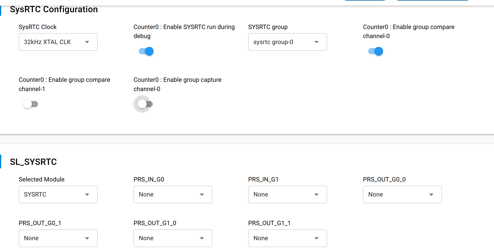
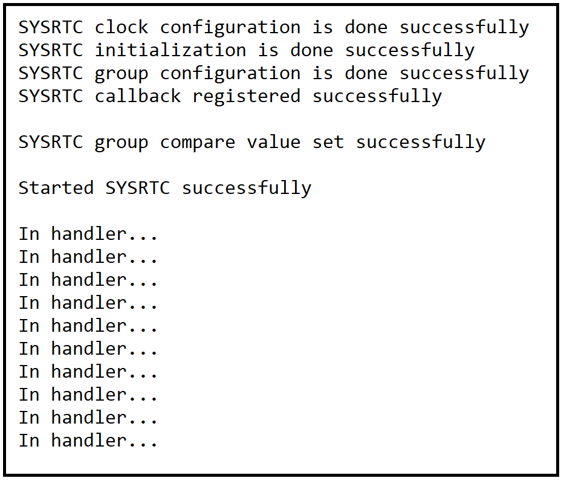
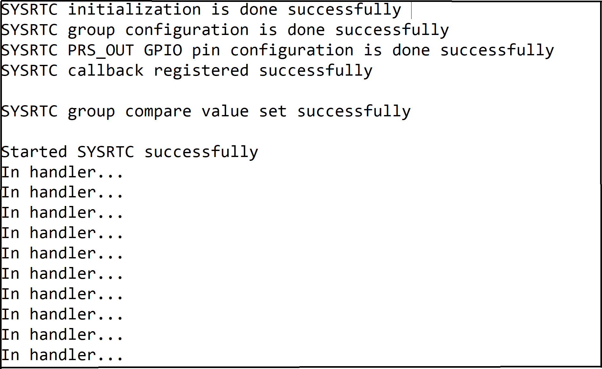
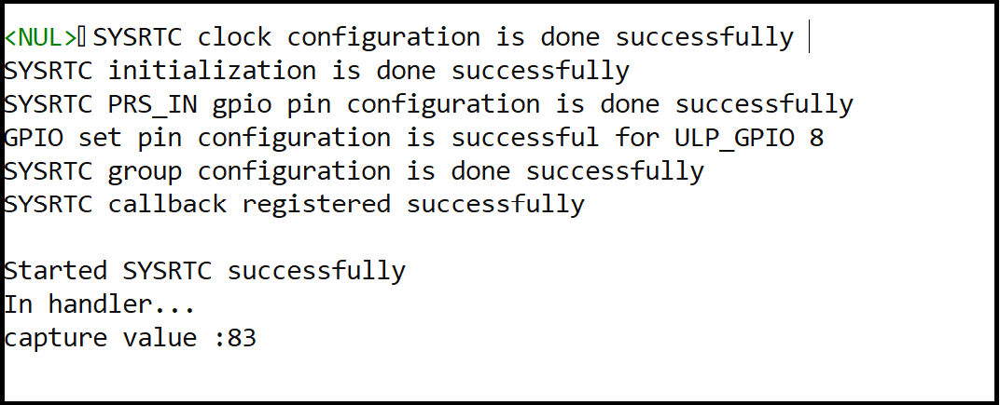
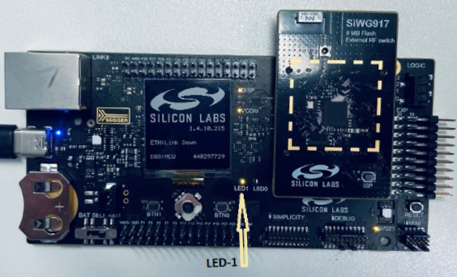

# SiWx91x Platform SYSRTC FreeRTOS

## Table of Contents

- [SiWx91x Platform SYSRTC FreeRTOS](#siwx91x-platform-sysrtc-freertos)
  - [Purpose/Scope](#purposescope)
  - [Overview](#overview)
    - [What is PRS?](#what-is-prs)
  - [About Example Code](#about-example-code)
    - [FreeRTOS Architecture](#freertos-architecture)
    - [Initialization (sysrtc_init_function)](#initialization-sysrtc_init_function)
    - [Task Flow (sysrtc_freertos_task)](#task-flow-sysrtc_freertos_task)
    - [If compare channel0 or compare channel1 is enabled through UC](#if-compare-channel0-or-compare-channel1-is-enabled-through-uc)
    - [If capture channel0 is enabled through UC](#if-capture-channel0-is-enabled-through-uc)
    - [If no channels enabled through UC](#if-no-channels-enabled-through-uc)
    - [For PRS_IN / PRS_OUT GPIO Configuration](#for-prs_in-prs_out-gpio-configuration)
    - [if compare channel0 or compare channel1 is enabled and PRS_OUT pin selected through UC](#if-compare-channel0-or-compare-channel1-is-enabled-and-prs_out-pin-selected-through-uc)
    - [If capture channel0 is enabled  and PRS_IN pin is selected through UC](#if-capture-channel0-is-enabled-and-prs_in-pin-is-selected-through-uc)
  - [Prerequisites/Setup Requirements](#prerequisitessetup-requirements)
    - [Hardware Requirements](#hardware-requirements)
    - [Software Requirements](#software-requirements)
    - [Setup Diagram](#setup-diagram)
  - [Getting Started](#getting-started)
  - [Application Build Environment](#application-build-environment)
    - [Macros for SYSRTC Configurations](#macros-for-sysrtc-configurations)
  - [Test the Application](#test-the-application)
  - [Troubleshooting](#troubleshooting)
  - [Resources](#resources)
  - [Report Bugs / Support](#report-bugs-support)

## Purpose/Scope

This application demonstrates the **SYSRTC** peripheral on SiWx91x in a **FreeRTOS** environment.

## Overview

- The SYSRTC (System Real Time Clock) is a highly configurable RTC capable of serving multiple cores. It contains up to 2 groups, where the number of compare- and capture-channels within each group is parameterized individually. Each group has it's own interrupt- and configuration-registers. The main idea is to save power by letting all groups share a single counter.
- Counter - The counter is shared between all groups. It can be started/stopped by writing to START/STOP fields in CMD register. RUNNING field in STATUS register indicates if counter is running or not. By default, counter will halt when core is halted during debug. RUNNING is not affected by halting. If DEBUGRUN in CFG register is set, counter will not halt when core is halted. The count value can be accessed via CNT register even when it is not running. When CNT is written, count value will be updated on the next clock edge. When the counter reaches the maximum value of 0xFFFFFFFF, it will overflow to 0x00000000 on the next clock edge. All OVFIF interrupt flags are set when this happens.
- Compare Channel - When count value matches CMPnVALUE, and CMPnEN in CTRL register is set, the CMPnIF interrupt flag is set. At the same time, PRS output is updated according to CMPnCMOA value in CTRL register. CTRL and CMPnVALUE can be written at any time and will take effect immediately.
- Capture Channel- When CAPnEN in CTRL register is set, the count value will be captured into CAPnVALUE based on PRS input edges. CAPnEDGE in CTRL register controls which edges that will result in capture. When count value is captured, CAPnIF interrupt flag is set.A capture event is generated whenever RUNNING status set, the corresponding GRP_CTRL_CAPEN register setting set and the desired PRS input edge occurs according to the GRP_CTRL_CAPEDGE register setting. This event is followed by GRP_IF_CAPIF being set after up to 3 cycles. At the same time when the corresponding flag is set the GRP_CAPVALUE register captures the current counter value. Note that PRS input edges should not occur more frequently than once in 3 cycles. If counter is being started/stopped or GRP_CTRL_CAPEN/GRP_CTRL_CAPEDGE being reprogrammed close to the PRS input edge, please account for the race condition.

### What is PRS?
- In the context of SYSRTC, PRS(Peripheral Reflex System ) is used to connect compare events to GPIO pins as PRS_OUT or to feed external signals into the SYSRTC as PRS_IN for capture event .

## About Example Code
(**CMSIS-RTOS2**): ISR-driven compares/capture/overflow events release a counting semaphore while the **`sysrtc_freertos`** task blocks on **`osSemaphoreAcquire`**. Compare-capture-pin selection, clock source, **`SYSRTC_PRS`** for GPIO-backed PRS, and related options are Universal Configurator (UC) macros from **siwx91x_platform_sysrtc_freertos.slcp** (`sl_si91x_sysrtc_config`).

### FreeRTOS Architecture

- On startup, `main.c` calls `app_init()` which invokes **`sysrtc_example_init()`**; **`osThreadNew`** creates **`sysrtc_freertos_task`** (thread name **`sysrtc_freertos`**, **`osPriorityLow1`**, 2048-byte stack). **`app_process_action()`** is a no-op while **`sysrtc_freertos_task`** and **`sysrtc_callback`** carry SYSRTC sequencing.

### Initialization (sysrtc_init_function)

- Runs once inside **`sysrtc_freertos_task`**: **`DEBUGINIT()`**, counting semaphore (**`SYSRTC_SEM_MAX_COMPARE`**, **`SYSRTC_SEM_MAX_CAPTURE`**, or **`SYSRTC_SEM_MAX_OTHER`** per UC-selected path); then **`sysrtc_driver_init()`** — clock/group/callback/start aligned with **`sl_si91x_sysrtc`** APIs and **`SYSRTC_PRS`/PRS‑GPIO knobs as documented in the UC subsections further down **`sysrtc_freertos.c`**.
- ISR entry **`sysrtc_callback`** publishes **`sysrtc_sem_release()`**, **`SL_PRINT_STRING_ERROR("In handler...")`**, **`sl_si91x_led_toggle`**, compare reschedule / teardown per UC (**`capture_val`** fetch when capture is enabled).

### Task Flow (sysrtc_freertos_task)

- Calls **`sysrtc_init_function()`**; on failure **`osThreadExit()`**.
- **Capture path:** One **`osSemaphoreAcquire`**, then **`capture value:`** (**`capture_val`**) line, **`osDelay`** loop.
- **Overflow-only:** Per-interrupt semaphore acquire forever and **`SYSRTC overflow / generic interrupt event`** prints.

### If compare channel0 or compare channel1 is enabled through UC

- Then SYSRTC groups are configured as per UC values through [sl_si91x_sysrtc_configure_group](https://docs.silabs.com/wiseconnect/latest/wiseconnect-api-reference-guide-si91x-peripherals/sysrtc#sl-si91x-sysrtc-configure-group) API.
- Sets compare value for selected group's selected compare channel through [sl_si91x_sysrtc_set_compare_channel_value](https://docs.silabs.com/wiseconnect/latest/wiseconnect-api-reference-guide-si91x-peripherals/sysrtc#sl-si91x-sysrtc-set-compare-value), can change pacing by updating **`SYSRTC_COMPARE_VALUE`** in **`sysrtc_freertos.c`** ( **`SL_SYSRTC_CLK_SRC`** in UC selects **32000** vs **32768** defaults).
- Then registers sysrtc callback and enabled selected compare channel interrupt, through [sl_si91x_sysrtc_register_callback](https://docs.silabs.com/wiseconnect/latest/wiseconnect-api-reference-guide-si91x-peripherals/sysrtc#sl-si91x-sysrtc-register-callback).
- Starts counter through [sl_si91x_sysrtc_start](https://docs.silabs.com/wiseconnect/latest/wiseconnect-api-reference-guide-si91x-peripherals/sysrtc#sl-si91x-sysrtc-start)
- When the counter matches the compare value, it triggers the corresponding channel compare interrupt and toggles the LED every second.
- After every interrupt, compare value is updated again through [sl_si91x_sysrtc_set_compare_channel_value](https://docs.silabs.com/wiseconnect/latest/wiseconnect-api-reference-guide-si91x-peripherals/sysrtc#sl-si91x-sysrtc-set-compare-value) with sum of current count (read through [sl_si91x_sysrtc_get_count](https://docs.silabs.com/wiseconnect/latest/wiseconnect-api-reference-guide-si91x-peripherals/sysrtc#sl-si91x-sysrtc-get-count)) and compare-value.
- After 10 interrupts sysrtc is stopped through [sl_si91x_sysrtc_stop](https://docs.silabs.com/wiseconnect/latest/wiseconnect-api-reference-guide-si91x-peripherals/sysrtc#sl-si91x-sysrtc-stop)
- Callbacks are unregistered and interrupts are disabled through [sl_si91x_sysrtc_unregister_callback](https://docs.silabs.com/wiseconnect/latest/wiseconnect-api-reference-guide-si91x-peripherals/sysrtc#sl-si91x-sysrtc-unregister-callback)
- And SYSRTC is de-initialized through [sl_si91x_sysrtc_deinit](https://docs.silabs.com/wiseconnect/latest/wiseconnect-api-reference-guide-si91x-peripherals/sysrtc#sl-si91x-sysrtc-deinit)

### If capture channel0 is enabled through UC

- Then SYSRTC capture channel of selected group is configured to capture at rising edge of input through [sl_si91x_sysrtc_configure_group](https://docs.silabs.com/wiseconnect/latest/wiseconnect-api-reference-guide-si91x-peripherals/sysrtc#sl-si91x-sysrtc-configure-group) API.
- To capture at Register input,  gpio capture input is disabled through [sl_si91x_sysrtc_enable_input_output_gpio](https://docs.silabs.com/wiseconnect/latest/wiseconnect-api-reference-guide-si91x-peripherals/sysrtc#sl-si91x-sysrtc-enable-input-output-gpio) API call.
- Then registers sysrtc callback and enabled capture channel interrupt, through [sl_si91x_sysrtc_register_callback](https://docs.silabs.com/wiseconnect/latest/wiseconnect-api-reference-guide-si91x-peripherals/sysrtc#sl-si91x-sysrtc-register-callback).
- Starts counter through [sl_si91x_sysrtc_start](https://docs.silabs.com/wiseconnect/latest/wiseconnect-api-reference-guide-si91x-peripherals/sysrtc#sl-si91x-sysrtc-start)
- After starting waits unless counter reaches compare value for 1-second and then sets SYSRTC register capture input high through [sl_si91x_sysrtc_sets_register_capture_input](https://docs.silabs.com/wiseconnect/latest/wiseconnect-api-reference-guide-si91x-peripherals/sysrtc#sl-si91x-sysrtc-sets-register-capture-input) API.
- A capture interrupt is generated and toggles LED one time.
- And SYSRTC is de-initialized through [sl_si91x_sysrtc_deinit](https://docs.silabs.com/wiseconnect/latest/wiseconnect-api-reference-guide-si91x-peripherals/sysrtc#sl-si91x-sysrtc-deinit)

### If no channels enabled through UC

- Then SYSRTC overflow interrupt of selected group will be enabled through application.
- Then registers sysrtc callback and enabled selected group's overflow interrupt, through [sl_si91x_sysrtc_register_callback](https://docs.silabs.com/wiseconnect/latest/wiseconnect-api-reference-guide-si91x-peripherals/sysrtc#sl-si91x-sysrtc-register-callback).
- Sets counter start value for counter through [sl_si91x_sysrtc_set_count](https://docs.silabs.com/wiseconnect/latest/wiseconnect-api-reference-guide-si91x-peripherals/sysrtc#sl-si91x-sysrtc-set-count), can change by updating **`COUNTER_VALUE2`** in **`sysrtc_freertos.c`**.
- Starts counter through [sl_si91x_sysrtc_start](https://docs.silabs.com/wiseconnect/latest/wiseconnect-api-reference-guide-si91x-peripherals/sysrtc#sl-si91x-sysrtc-start)
- After starting waits unless counter reaches overflow value (0xffffffff).
- Then a overflow interrupt is generated and toggles LED one time.
### For PRS_IN / PRS_OUT GPIO Configuration
If you are configuring PRS_IN or PRS_OUT through GPIOs:
- GPIOs must be selected from the UC (Universal Configurator).
- For compare channels, the corresponding GPIO pin which is selected as PRS_OUT will be toggled when the compare match occurs.
- For capture channels, use ulp_gpio_8 (or other mapped GPIO) and connect it to the corresponding GPIO pin which is selected as PRS_IN.
- To enable GPIO-based PRS configuration, set **`SYSRTC_PRS`** to **`1`** in **`sysrtc_freertos.c`**.
### if compare channel0 or compare channel1 is enabled and PRS_OUT pin selected through UC
  - If **`SYSRTC_PRS`** is **`1`** in **`sysrtc_freertos.c`**.
  - Then SYSRTC groups are configured as per UC values through [sl_si91x_sysrtc_configure_group](https://docs.silabs.com/wiseconnect/latest/wiseconnect-api-reference-guide-si91x-peripherals/sysrtc#sl-si91x-sysrtc-configure-group) API.
  - Compare match output action is set to toggle using macro **`SYSRTC_GROUP_CHANNEL_COMPARE_CONFIG_TOGGLE`** in **sysrtc_freertos.c** (SYSRTC driver headers).
  - Configuration is applied to enabled compare channels using sysrtc_group_config_handle
  - PRS output GPIO is configured using `sl_si91x_sysrtc_set_compare_output_prs_gpio`()
  - the SYSRTC callback is registered using [sl_si91x_sysrtc_register_callback](https://docs.silabs.com/wiseconnect/latest/wiseconnect-api-reference-guide-si91x-peripherals/sysrtc#sl-si91x-sysrtc-register-callback), and interrupts are enabled.
  - the SYSRTC is started using sl_si91x_sysrtc_start.
  - When counter reaches compare-value generates respective channel compare interrupt, toggles corresponding PRS_OUT GPIO pin and toggles LED on every second.
  - After every interrupt, compare value is updated again through [sl_si91x_sysrtc_set_compare_value](https://docs.silabs.com/wiseconnect/latest/wiseconnect-api-reference-guide-si91x-peripherals/sysrtc#sl-si91x-sysrtc-set-compare-value) with sum of current count (read through [sl_si91x_sysrtc_get_count](https://docs.silabs.com/wiseconnect/latest/wiseconnect-api-reference-guide-si91x-peripherals/sysrtc#sl-si91x-sysrtc-get-count)) and compare-value.
  - After 10 interrupts sysrtc is stopped through [sl_si91x_sysrtc_stop](https://docs.silabs.com/wiseconnect/latest/wiseconnect-api-reference-guide-si91x-peripherals/sysrtc#sl-si91x-sysrtc-stop)
  - Callbacks are unregistered and interrupts are disabled through [sl_si91x_sysrtc_unregister_callback](https://docs.silabs.com/wiseconnect/latest/wiseconnect-api-reference-guide-si91x-peripherals/sysrtc#sl-si91x-sysrtc-unregister-callback)
  - And SYSRTC is de-initialized through [sl_si91x_sysrtc_deinit](https://docs.silabs.com/wiseconnect/latest/wiseconnect-api-reference-guide-si91x-peripherals/sysrtc#sl-si91x-sysrtc-deinit)
### If capture channel0 is enabled  and PRS_IN pin is selected through UC
   - If **`SYSRTC_PRS`** is **`1`** in **`sysrtc_freertos.c`**.
   - Then SYSRTC groups are configured as per UC values through [sl_si91x_sysrtc_configure_group](https://docs.silabs.com/wiseconnect/latest/wiseconnect-api-reference-guide-si91x-peripherals/sysrtc#sl-si91x-sysrtc-configure-group) API.
   - CAPTURE is enabled through GPIO, [sl_si91x_sysrtc_enable_input_output_gpio](https://docs.silabs.com/wiseconnect/latest/wiseconnect-api-reference-guide-si91x-peripherals/sysrtc#sl-si91x-sysrtc-enable-input-output-gpio) API call.
   - the capture input edge is configured using **`SYSRTC_GROUP_CHANNEL_CAPTURE_CONFIG_RISE_EDGE`** in **`sysrtc_freertos.c`**.
   - The capture channel configuration is assigned to sysrtc_group_config_handle.
   - The GPIO is then configured as a PRS input using [sl_si91x_sysrtc_set_gpio_as_capture_input_prs]
   - If the configuration is successful, a confirmation message is printed.
   - To toggle the PRS_IN a GPIO pin (ULP_GPIO_8 ) is further configured using sl_gpio_set_configuration, and success or failure is logged accordingly.
   - SYSRTC callback is registered and the capture-channel interrupt is enabled by calling [sl_si91x_sysrtc_register_callback](https://docs.silabs.com/wiseconnect/latest/wiseconnect-api-reference-guide-si91x-peripherals/sysrtc#sl-si91x-sysrtc-register-callback).
   - The SYSRTC is started using sl_si91x_sysrtc_start.
   - Starts counter through [sl_si91x_sysrtc_start](https://docs.silabs.com/wiseconnect/latest/wiseconnect-api-reference-guide-si91x-peripherals/sysrtc#sl-si91x-sysrtc-start)
   - ULP_GPIO_8 is set to high, which is supplied as input to PRS_IN. At the rise edge of PRS_IN,interrupt will be triggered
   - when first capture interrupt is generated, LED  toggles one time.
   - And SYSRTC is de-initialized through [sl_si91x_sysrtc_deinit](https://docs.silabs.com/wiseconnect/latest/wiseconnect-api-reference-guide-si91x-peripherals/sysrtc#sl-si91x-sysrtc-deinit)

**NOTE**:
>In the default application SYSRTC_PRS is used as macro.In the next release The SYSRTC_PRS will be added as component

## Prerequisites/Setup Requirements

### Hardware Requirements

- Windows PC
- Silicon Labs SiWx91x Evaluation Kit [[BRD4002](https://www.silabs.com/development-tools/wireless/wireless-pro-kit-mainboard?tab=overview) + [BRD4338A](https://www.silabs.com/development-tools/wireless/wi-fi/siwx917-rb4338a-wifi-6-bluetooth-le-soc-radio-board?tab=overview) / [BRD4342A](https://www.silabs.com/development-tools/wireless/wi-fi/siwx91x-rb4342a-wifi-6-bluetooth-le-soc-radio-board?tab=overview) / [BRD4343A](https://www.silabs.com/development-tools/wireless/wi-fi/siw917y-rb4343a-wi-fi-6-bluetooth-le-8mb-flash-radio-board-for-module?tab=overview) / [BRD4343C](https://www.silabs.com/development-tools/wireless/wi-fi/siw917y-rb4343c-wi-fi-6-bluetooth-le-8mb-flash-radio-board-for-module?tab=overview)]
- SiWx917 AC1 Module Explorer Kit [BRD2708A](https://www.silabs.com/development-tools/wireless/wi-fi/siw917y-ek2708a-explorer-kit)

### Software Requirements

- Simplicity Studio
- Serial console Setup
  - For Serial Console setup instructions, refer [here](https://docs.silabs.com/wiseconnect/latest/wiseconnect-developers-guide-developing-for-silabs-hosts/using-the-simplicity-studio-ide#console-input-and-output).

### Setup Diagram

> 

## Getting Started

Refer to the instructions [here](https://docs.silabs.com/wiseconnect/latest/wiseconnect-getting-started/) to:

- [Install Simplicity Studio](https://docs.silabs.com/wiseconnect/latest/wiseconnect-developers-guide-developing-for-silabs-hosts/using-the-simplicity-studio-ide#install-simplicity-studio)
- [Install WiSeConnect extension](https://docs.silabs.com/wiseconnect/latest/wiseconnect-developers-guide-developing-for-silabs-hosts/using-the-simplicity-studio-ide#install-the-wiseconnect-3-extension)
- [Connect your device to the computer](https://docs.silabs.com/wiseconnect/latest/wiseconnect-developers-guide-developing-for-silabs-hosts/using-the-simplicity-studio-ide#connect-siwx91x-to-computer)
- [Upgrade your connectivity firmware](https://docs.silabs.com/wiseconnect/latest/wiseconnect-developers-guide-developing-for-silabs-hosts/using-the-simplicity-studio-ide#update-siwx91x-connectivity-firmware)
- [Create a Studio project](https://docs.silabs.com/wiseconnect/latest/wiseconnect-developers-guide-developing-for-silabs-hosts/using-the-simplicity-studio-ide#create-a-project)

For details on the project folder structure, see the [WiSeConnect Examples](https://docs.silabs.com/wiseconnect/latest/wiseconnect-examples/#example-folder-structure) page.

## Application Build Environment

- Open **siwx91x_platform_sysrtc_freertos.slcp**, select the **Software Components** tab, search **sysrtc**, and configure SYSRTC group, compare/capture channels, clock source, and PRS GPIO choices for your board.

- If the project is built without changing SYSRTC UC settings, defaults from generated **sl_si91x_sysrtc_config.h** apply.

  

- To use PRS GPIO paths in firmware, set **`SYSRTC_PRS`** to **`1`** in **`sysrtc_freertos.c`** (default **`0`**).
 For updating/modifying counter and compare value use `COUNTER_VALUE` macro & 
`SYSRTC_COMPARE_VALUE` (for 32.768 KHZ clock) macros respectively, present in **`sysrtc_freertos.c`** .

- `SYSRTC_COMPARE_VALUE`: Compare channel value used to generate a 1-second interrupt at a 32.768 kHz XTAL clock frequency. By default, it is set to 32768.

  ```c
    #define SYSRTC_COMPARE_VALUE 32768 // Channel compare value for 32.768khz XTAL clock frequency
  ```

- `COUNTER_VALUE1`: Starting value loaded into the SYSRTC counter register before compare/capture operations. By default, it is set to 0.

  ```c
    #define COUNTER_VALUE1       0U     // Counter register start value
  ```

- `COUNTER_VALUE2`: Counter register value used when demonstrating the overflow interrupt behavior. By default, it is set to 0.

  ```c
  #define COUNTER_VALUE2         0U /* Counter start (overflow-only path) */
  ```

- `TENTH_INTERRUPT`: Number of compare interrupts after which the SYSRTC is stopped (LED toggled ten times). By default, it is set to 10.

  ```c
  #define TENTH_INTERRUPT        10U
  ```

- **LED in ISR:** In **`sysrtc_freertos.c`**, **`sysrtc_callback`** toggles **`SL_LED_LED0_PIN`** when **`SL_SI91X_ACX_MODULE`** is defined, and **`SL_LED_LED1_PIN`** otherwise.

- **`SYSRTC_SEM_MAX_COMPARE`**, **`SYSRTC_SEM_MAX_CAPTURE`**, **`SYSRTC_SEM_MAX_OTHER`:** Maximum count for the CMSIS-RTOS2 counting semaphore **`s_sysrtc_event_sem`** (see [Counting semaphore (ISR to task)](#counting-semaphore-isr-to-task)). Defaults:

  ```c
  #define SYSRTC_SEM_MAX_COMPARE 16U
  #define SYSRTC_SEM_MAX_CAPTURE 4U
  #define SYSRTC_SEM_MAX_OTHER   128U
  ```

### Macros for SYSRTC Configurations

- `SL_SYSRTC_RUN_ENABLE_DURING_DEBUG`, for enabling sysrtc run during debug
- `SL_SYSRTC_GROUP`, for selecting SYSRTC channel group
- `SL_SYSRTC_COMPARE_CHANNEL0_ENABLE`, for enabling compare channel-0 of selected SYSRTC group
- `SL_SYSRTC_COMPARE_CHANNEL1_ENABLE`, for enabling compare channel-1 of selected SYSRTC group
- `SL_SYSRTC_CAPTURE_CHANNEL0_ENABLE`, for enabling capture channel-0 of selected SYSRTC group

- After configuring the above macros, their values are applied to the [sl_sysrtc_config_t](https://docs.silabs.com/wiseconnect/latest/wiseconnect-api-reference-guide-si91x-peripherals/sysrtc#sl-sysrtc-config-t) configuration variable sysrtc_handle and used to configure SYSRTC via [sl_si91x_sysrtc_configure_group](https://docs.silabs.com/wiseconnect/latest/wiseconnect-api-reference-guide-si91x-peripherals/sysrtc#sl-si91x-sysrtc-configure-group).

## Test the Application

Refer to the instructions [here](https://docs.silabs.com/wiseconnect/latest/wiseconnect-getting-started/) to:

1. Compile and run the application.
2. When the application runs, LED0 (GPIO_10 for [BRD2708A](https://www.silabs.com/development-tools/wireless/wi-fi/siw917y-ek2708a-explorer-kit)) or LED1 (GPIO_10 for evaluation kit [[BRD4002](https://www.silabs.com/development-tools/wireless/wireless-pro-kit-mainboard?tab=overview) + [BRD4338A](https://www.silabs.com/development-tools/wireless/wi-fi/siwx917-rb4338a-wifi-6-bluetooth-le-soc-radio-board?tab=overview) / [BRD4343A](https://www.silabs.com/development-tools/wireless/wi-fi/siw917y-rb4343a-wi-fi-6-bluetooth-le-8mb-flash-radio-board-for-module?tab=overview) / [BRD4343C](https://www.silabs.com/development-tools/wireless/wi-fi/siw917y-rb4343c-wi-fi-6-bluetooth-le-8mb-flash-radio-board-for-module?tab=overview)]) will be toggled ten times at a 1-second periodic rate.
3. After successful program execution the prints in serial console looks as shown below.

    

> **Note:**
- For BRD4342A: LED1 is not connected. Instead, the corresponding signal activity can be observed on GPIO_10.
- For BRD2708A/BRD4343A: The PRS_OUT for group‑0, compare channel 0, cannot be configured with UULP_VBAT_GPIO_3, since this pin is internally connected to the oscilloscope.

## when `SYSRTC_PRS` macro is enabled:
If PRS_IN/PRS_OUT are configured through GPIO,for compare out observe the PRS_OUT toggling using logic analyzer,for Capture input connect the ULP_GPIO_8 to the selected PRS_IN GPIO pin.
  **for PRS_OUT**:
    
  **for PRS_IN**:
    

> **Note:**
>
>- When Compare channels are enabled : Toggles LED for ten times every second and timer stops
>- When Capture channel is enabled : Toggles LED one time after one second
>- When no channels are enabled, the overflow interrupt is enabled: Toggles LED once when the counter reaches overflow.

  
> - Interrupt handlers are implemented in the driver layer, and user callbacks are provided for custom code. If you want to write your own interrupt handler instead of using the default one, make the driver interrupt handler a weak handler. Then, copy the necessary code from the driver handler to your custom interrupt handler.
## Troubleshooting

- If the project does not build, ensure Simplicity Studio and the WiSeConnect extension are installed and the board is connected.
- If the device is not detected, reinstall the connectivity firmware and check USB drivers.

## Resources

- [WiSeConnect Getting Started](https://docs.silabs.com/wiseconnect/latest/wiseconnect-getting-started/)
- [WiSeConnect Examples](https://docs.silabs.com/wiseconnect/latest/wiseconnect-examples/)
- [SiWx91x SoC Documentation](https://docs.silabs.com/wiseconnect/latest/)

## Report Bugs/Support

For issues and support, use the Silicon Labs Community or your normal support channel.

