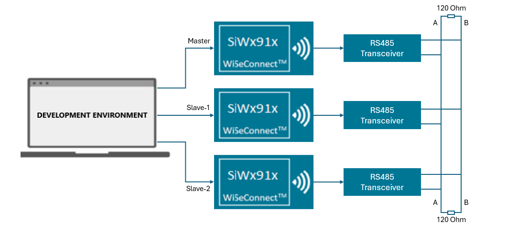
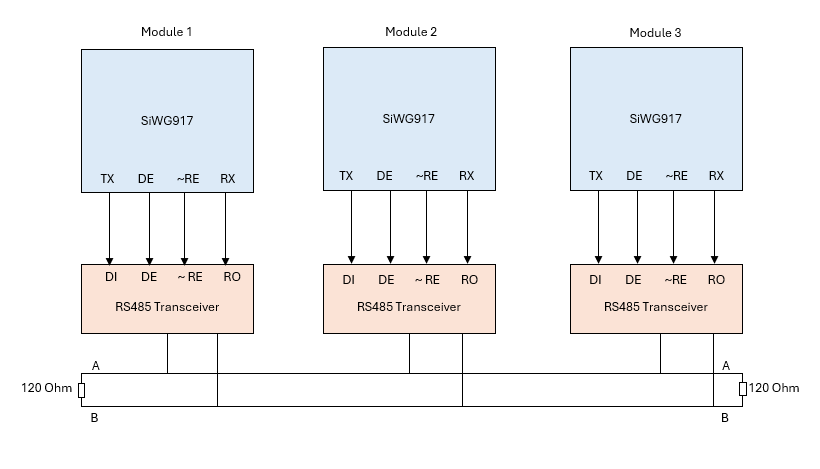
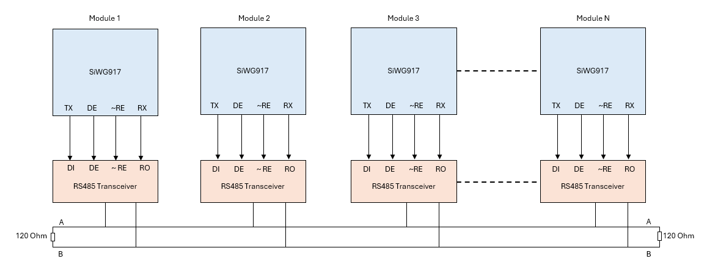
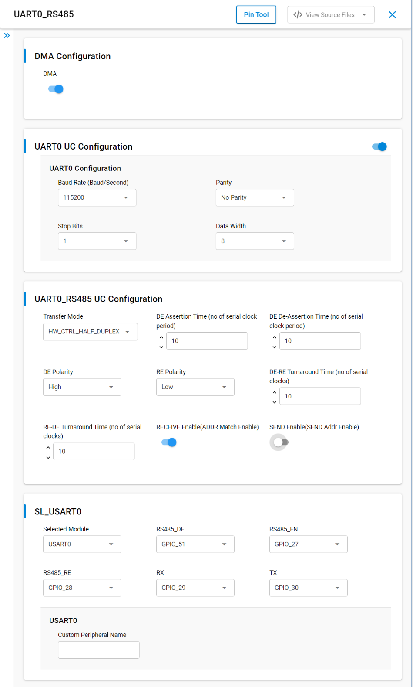
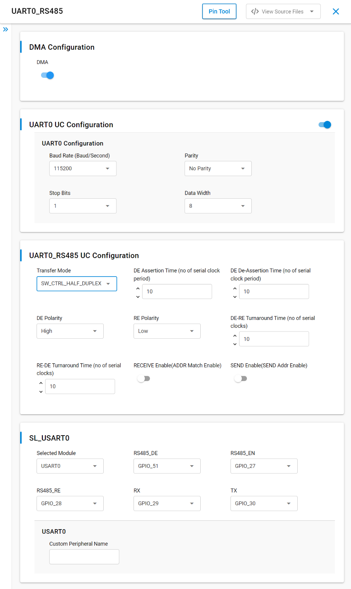
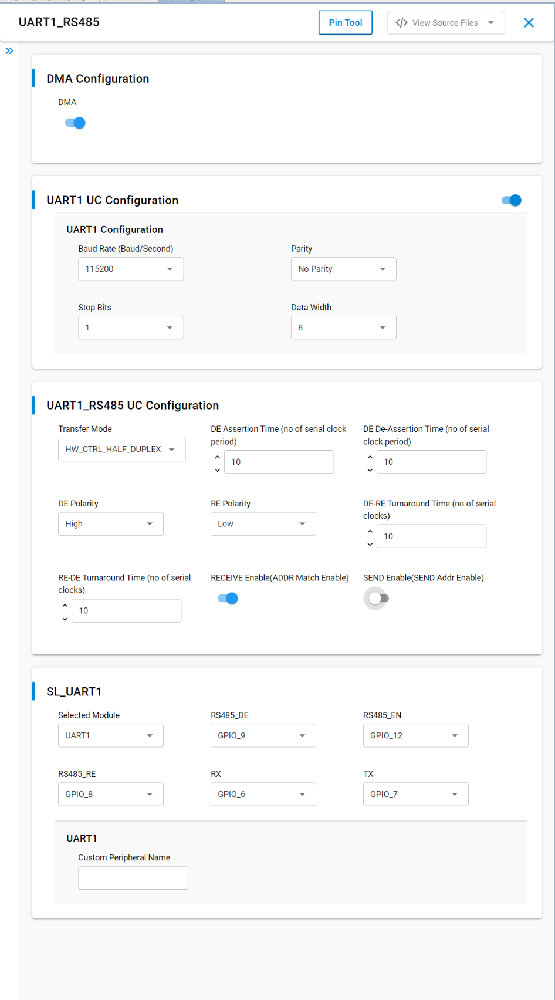
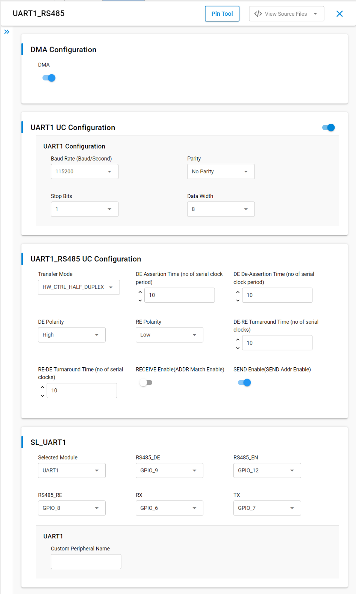
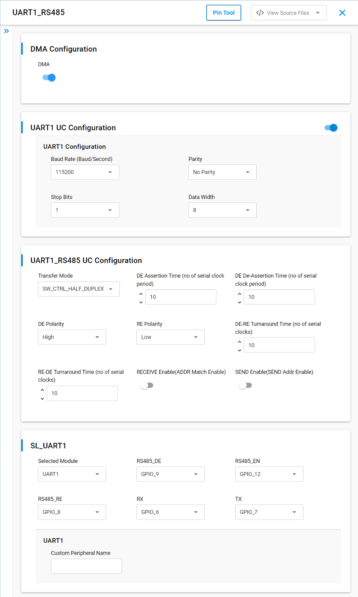
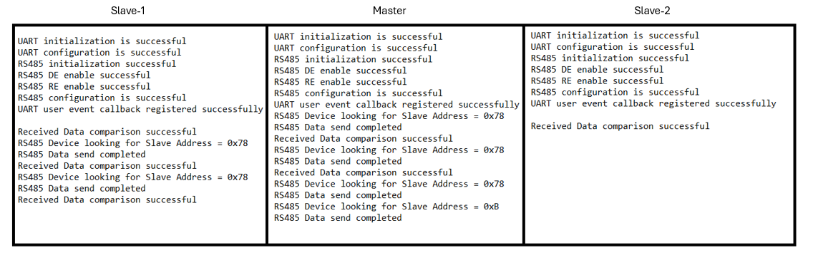

# SiWx91x Platform UART RS485 FreeRTOS

## Table of Contents

- [SiWx91x Platform UART RS485 FreeRTOS](#platform-siwx91x-uart-rs485-freertos)
  - [Purpose/Scope](#purposescope)
  - [Overview](#overview)
  - [About Example Code](#about-example-code)
  - [Prerequisites/Setup Requirements](#prerequisitessetup-requirements)
    - [Hardware Requirements](#hardware-requirements)
    - [Software Requirements](#software-requirements)
    - [Setup Diagram](#setup-diagram)
  - [Getting Started](#getting-started)
  - [Steps for N-board setup](#steps-for-n-board-setup)
  - [Application Build Environment](#application-build-environment)
    - [Application Configuration Parameters](#application-configuration-parameters)
    - [Pin Configuration](#pin-configuration)
      - [UART1 RS485 pin configuration](#uart1-rs485-pin-configuration)
      - [UART0 RS485 pin configuration](#uart0-rs485-pin-configuration)
    - [UART and RS485 Universal Configuration](#uart-and-rs485-universal-configuration)
  - [Test the Application](#test-the-application)
  - [Troubleshooting](#troubleshooting)
  - [Resources](#resources)
  - [Report Bugs / Support](#report-bugs--support)

## Purpose/Scope

This application demonstrates UART RS485 **multidrop** operation on the SiWx91x SoC in a **FreeRTOS** environment, including:

- Initializing UART/USART and RS485 mode with the WiseConnect driver APIs.
- Hardware- or software-controlled half-duplex operation and full-duplex (RS422) scenarios.
- 9-bit addressing, send/receive paths, and buffer compare for data integrity.

## Overview

- UART provides asynchronous serial communication over a wired medium.
- This application is configured with the following defaults:

  - Tx and Rx enabled  
  - 8-bit data  
  - 1 stop bit  
  - No parity  
  - Baud rate 115200  

## About Example Code

- This example demonstrates UART RS485 multidrop operation in a FreeRTOS environment. `app_init()` calls `uart_rs485_mode_example_init()` in `app.c`. The RS485 task and application logic are implemented in `uart_rs485_mode_freertos.c`. Completion events are handled in `uart_rs485_event_callback_handler()`, registered through [sl_si91x_usart_multiple_instance_register_event_callback](https://docs.silabs.com/wiseconnect/latest/wiseconnect-api-reference-guide-si91x-peripherals/usart#sl-si91x-usart-multiple-instance-register-event-callback).
- In this example, UART is initialized (with clock and DMA configuration when DMA is enabled) using [sl_si91x_usart_init](https://docs.silabs.com/wiseconnect/latest/wiseconnect-api-reference-guide-si91x-peripherals/usart#sl-si91x-usart-init).

  **Note:** If the UART/USART instance is already used for debug output, initialization may return `SL_STATUS_NOT_AVAILABLE`.

- After initialization, the UART is configured from the Universal Configuration (UC), including Tx/Rx lines, using [sl_si91x_usart_set_configuration](https://docs.silabs.com/wiseconnect/latest/wiseconnect-api-reference-guide-si91x-peripherals/usart#sl-si91x-usart-set-configuration).
- RS485 mode is initialized using [sl_si91x_uart_rs485_init](https://docs.silabs.com/wiseconnect/latest/wiseconnect-api-reference-guide-si91x-peripherals/usart#sl-si91x-uart-rs485-init) and [sl_si91x_uart_rs485_set_configuration](https://docs.silabs.com/wiseconnect/latest/wiseconnect-api-reference-guide-si91x-peripherals/usart#sl-si91x-uart-rs485-set-configuration).
- Driver Enable (DE) and Receiver Enable (~RE) are controlled with [sl_si91x_uart_rs485_de_enable](https://docs.silabs.com/wiseconnect/latest/wiseconnect-api-reference-guide-si91x-peripherals/usart#sl-si91x-uart-rs485-de-enable) and [sl_si91x_uart_rs485_re_enable](https://docs.silabs.com/wiseconnect/latest/wiseconnect-api-reference-guide-si91x-peripherals/usart#sl-si91x-uart-rs485-re-enable).
- **Hardware-controlled half-duplex**

  - Address transmit: [sl_si91x_uart_rs485_transfer_hardware_address](https://docs.silabs.com/wiseconnect/latest/wiseconnect-api-reference-guide-si91x-peripherals/usart#sl-si91x-uart-rs485-transfer-hardware-address) (send mode).
  - Address receive: [sl_si91x_uart_rs485_rx_hardware_address_set](https://docs.silabs.com/wiseconnect/latest/wiseconnect-api-reference-guide-si91x-peripherals/usart#sl-si91x-uart-rs485-rx-hardware-address-set) (receive mode).
  - Data: [sl_si91x_usart_send_data](https://docs.silabs.com/wiseconnect/latest/wiseconnect-api-reference-guide-si91x-peripherals/usart#sl-si91x-usart-send-data) and [sl_si91x_usart_receive_data](https://docs.silabs.com/wiseconnect/latest/wiseconnect-api-reference-guide-si91x-peripherals/usart#sl-si91x-usart-receive-data).

- **Software-controlled half-duplex:** address and data use the same send/receive APIs as above.
- After a receive-complete event, transmitted and received buffers are compared for integrity.
- UART0 and UART1 UC variants exist; **UART1 is installed by default**. Install the UART0 UC component to run on UART0.
- The example covers hardware- and software-controlled half-duplex and **full-duplex** use with RS422 where applicable.

## Prerequisites/Setup Requirements

### Hardware Requirements

- Windows PC
- Silicon Labs SiWx917 Evaluation Kits [[BRD4002](https://www.silabs.com/development-tools/wireless/wireless-pro-kit-mainboard?tab=overview) + [BRD4338A](https://www.silabs.com/development-tools/wireless/wi-fi/siwx917-rb4338a-wifi-6-bluetooth-le-soc-radio-board?tab=overview)/[BRD4342A](https://www.silabs.com/development-tools/wireless/wi-fi/siwx91x-rb4342a-wifi-6-bluetooth-le-soc-radio-board?tab=overview)/[BRD4343C](https://www.silabs.com/development-tools/wireless/wi-fi/siw917y-rb4343c-wi-fi-6-bluetooth-le-8mb-flash-radio-board-for-module?tab=overview)] (or equivalent supported radio board)
- Three RS485 transceivers (as shown in the setup diagram)

### Software Requirements

- Simplicity Studio
- Serial console setup  
  For Serial Console setup instructions, refer [here](https://docs.silabs.com/wiseconnect/latest/wiseconnect-developers-guide-developing-for-silabs-hosts/using-the-simplicity-studio-ide#console-input-and-output).

### Setup Diagram

> 

Circuit diagram for three boards:

> 

## Getting Started

Refer to the instructions [here](https://docs.silabs.com/wiseconnect/latest/wiseconnect-getting-started/) to:

- [Install Simplicity Studio](https://docs.silabs.com/wiseconnect/latest/wiseconnect-developers-guide-developing-for-silabs-hosts/using-the-simplicity-studio-ide#install-simplicity-studio)
- [Install WiSeConnect extension](https://docs.silabs.com/wiseconnect/latest/wiseconnect-developers-guide-developing-for-silabs-hosts/using-the-simplicity-studio-ide#install-the-wiseconnect-3-extension)
- [Connect your device to the computer](https://docs.silabs.com/wiseconnect/latest/wiseconnect-developers-guide-developing-for-silabs-hosts/using-the-simplicity-studio-ide#connect-siwx91x-to-computer)
- [Upgrade your connectivity firmware](https://docs.silabs.com/wiseconnect/latest/wiseconnect-developers-guide-developing-for-silabs-hosts/using-the-simplicity-studio-ide#update-siwx91x-connectivity-firmware)
- [Create a Studio project](https://docs.silabs.com/wiseconnect/latest/wiseconnect-developers-guide-developing-for-silabs-hosts/using-the-simplicity-studio-ide#create-a-project)

For details on the project folder structure, see the [WiSeConnect Examples](https://docs.silabs.com/wiseconnect/latest/wiseconnect-examples/#example-folder-structure) page.

## Steps for N-board setup

- Create N applications for N boards.
- Each secondary board must use a unique address.
- The primary sends to a selected secondary using 9-bit addressing.
- Secondaries respond only when the address matches.
- DE and ~RE must be controlled per board (especially slaves) to switch between send and receive.
- **Hardware-controlled half duplex:** DE and ~RE switch automatically.
- **Software-controlled half duplex:** DE and ~RE are toggled in software.

> 

## Application Build Environment

### Application Configuration Parameters

- Configure the following macros in [`uart_rs485_mode_freertos.c`](https://github.com/SiliconLabs/wiseconnect/blob/v4.1.1-content-for-docs/examples/si91x_soc/peripheral/platform_siwx91x_uart_rs485_freertos/uart_rs485_mode_freertos.c) if required. `UART_INSTANCE` is chosen at compile time from project symbols: if `UART1_RS485_MODE` is defined it is `UART_1`; else if `UART0_RS485_MODE` is defined it is `USART_0`; otherwise it defaults to `UART_1`.

- `UART_RS485_BUFFER_SIZE`: Defines the length (in bytes) of the buffer used to send and receive RS485 UART data. By default, it is set to 1024.

  ```c
  #define UART_RS485_BUFFER_SIZE  1024   // Length of data to be sent or received
  ```

- `UART_RS485_BAUDRATE`: Specifies the UART baud rate used for RS485 transmission and reception. By default, it is set to 115200.

  ```c
  #define UART_RS485_BAUDRATE     115200 // Baud rate
  ```

- `RS485_SLAVE1`: Logical slave identifier used to select the first RS485 slave node. By default, it is set to 1.

  ```c
  #define RS485_SLAVE1            1      // Logical slave id: slave1
  ```

- `RS485_SLAVE2`: Logical slave identifier used to select the second RS485 slave node. By default, it is set to 2.

  ```c
  #define RS485_SLAVE2            2      // Logical slave id: slave2
  ```

- `TRANSMISSION_COUNT_TRIGGER`: Defines the number of send/receive cycles performed by the example. By default, it is set to 3.

  ```c
  #define TRANSMISSION_COUNT_TRIGGER 3  // Number of send/receive cycles
  ```

- `DELAY_MS`: Delay (in milliseconds) inserted between send/receive state transitions. By default, it is set to 30.

  ```c
  #define DELAY_MS                30     // Delay between state transitions (ms)
  ```

- Configure Universal Configuration from the `.slcp` project.
- Open **siwx91x_platform_uart_rs485_freertos.slcp**, select the **Software Component** tab, and search for **UART**, **USART**, or **RS485** to adjust instances and UC-backed settings.
- This example targets **three** Studio projects (one master, two slaves). Edit `uart_rs485_mode_freertos.c` in `examples/si91x_soc/peripheral/siwx91x_platform_uart_rs485_freertos/` per role:

  - **Master project**

    - Set `current_mode = SL_UART_RS485_SEND` and `current_slave = RS485_SLAVE1`.
    - After SLAVE1 transfer, the example can move to `RS485_SLAVE2` for one-way master-to-slave traffic.

  - **Slave project 1**

    - Set `current_mode = SL_UART_RS485_RECEIVE` and `current_slave = RS485_SLAVE1`.
    - Listens for traffic to `RS485_HW_SLAVE1_ADDRESS`.

  - **Slave project 2**

    - Set `current_mode = SL_UART_RS485_RECEIVE` and `current_slave = RS485_SLAVE2`.
    - Handles `RS485_HW_SLAVE2_ADDRESS`.

- The same UC and code patterns apply to software-controlled half-duplex.

- **Hardware-controlled half-duplex:** set `Transfer Mode = HW_CTRL_HALF_DUPLEX` and enable **SEND Enable (SEND Addr Enable)** and **RECEIVE Enable (ADDR Match Enable)** in UC where required.

- **Software-controlled half-duplex:** set `Transfer Mode = SW_CTRL_HALF_DUPLEX` and disable those enables per your design; see UC snapshots below.

- **RECEIVE Enable (ADDR Match Enable)** and **SEND Enable (SEND Addr Enable)** control hardware DE/~RE behavior, not the logical “send a packet” operation by themselves.

- **Full-duplex (RS422-style)**

  - Master: `Transfer Mode = FULL_DUPLEX`, `current_mode = SL_UART_RS485_FULL_DUPLEX_SEND_RECEIVE`.
  - Slave: `Transfer Mode = FULL_DUPLEX`, `current_mode = SL_UART_RS485_FULL_DUPLEX_RECEIVE_SEND`.
  - Typically disable both SEND and RECEIVE enables in UC for this mode as documented for your transceiver setup.

**UC screen references (UART0)**

- Hardware half-duplex, receive:

  > 

- Hardware half-duplex, transmit:

  > 

- Software half-duplex:

  > 

**UC screen references (UART1)**

- Hardware half-duplex, receive:

  > 

- Hardware half-duplex, transmit:

  > 

- Software half-duplex:

  > 

- ~RE and DE are required for typical hardware-controlled modes; for software-controlled modes the application may drive them explicitly.
- **DMA:** enable or disable per requirement in UC.

### Pin Configuration

#### UART1 RS485 pin configuration

| SI91X Interface       | Default SI91X Pin | External RS485 Driver Pin |
| --------------------- | ----------------- | ------------------------- |
| Transmit Data (TxD)   | GPIO7[P20]        | DI                        |
| Receive Data (RxD)    | GPIO6[P19]        | RO                        |
| Driver Enable (DE)    | GPIO9[F9]         | DE                        |
| Receiver Enable (~RE) | GPIO8[F8]         | ~RE                       |

#### UART0 RS485 pin configuration

| SI91X Interface       | Default SI91X Pin | External RS485 Driver Pin |
| --------------------- | ----------------- | ------------------------- |
| Transmit Data (TxD)   | GPIO30[P35]       | DI                        |
| Receive Data (RxD)    | GPIO29[P33]       | RO                        |
| Driver Enable (DE)    | GPIO51[P34]       | DE                        |
| Receiver Enable (~RE) | GPIO28[P31]       | ~RE                       |

> **Note:**
>- On the 4342A PSRAM board, GPIO8 [F8] must not be used as the UART1 Receiver Enable (~RE) pin. Use another available GPIO pin instead.

### UART and RS485 Universal Configuration

- **UART UC**

  - Baud rate, parity, stop bits, data width.

- **UART_RS485 UC**

  - **Transfer mode**

    - `SW_CTRL_HALF_DUPLEX` — software controls DE/~RE timing.  
    - `HW_CTRL_HALF_DUPLEX` — hardware automates DE/~RE when configured.  
    - `FULL_DUPLEX` — simultaneous TX/RX where supported.

  - DE assertion / de-assertion times, DE/RE polarity, DE–RE and RE–DE turnaround times.
  - **Receive Enable (Addr Match Enable)** — hardware vs software address match on receive (see UC tooltips).
  - **Send Enable (Send Addr Enable)** — how 9-bit address characters are formed on transmit.

> **Note:** For recommended defaults, see the [recommendations guide](https://docs.silabs.com/wiseconnect/latest/wiseconnect-developers-guide-prog-recommended-settings/).

## Test the Application

Refer to the instructions [here](https://docs.silabs.com/wiseconnect/latest/wiseconnect-getting-started/) to:

1. Compile and run the application on each board (master/slaves) after applying the **Application Build Environment** changes.
2. Connect three modules per the setup diagrams.
3. When the application runs, the master sends to slaves and compares received data for correctness.
4. Expected console output (example):

    > 

> **Note:**
>
> - Driver interrupt handlers can be overridden with weak symbols if you need a custom ISR; copy logic carefully from the driver.
> - When using RS485 on both UART0 and UART1, use `uint16_t` buffers so 9-bit frames are handled consistently.
> - Validated on BRD4338A with RS485 (half-duplex) and RS422 (full-duplex) transceivers; adapt for your hardware.
> - Start **slaves before the master** to avoid race conditions.
> - For more than two slaves, extend addressing and state in `uart_rs485_mode_freertos.c` as needed.

## Troubleshooting

- If the project does not build, ensure Simplicity Studio and the WiSeConnect extension are installed and the board is connected.
- If the device is not detected, reinstall the connectivity firmware and check USB drivers.

## Resources

- [WiSeConnect Getting Started](https://docs.silabs.com/wiseconnect/latest/wiseconnect-getting-started/)
- [WiSeConnect Examples](https://docs.silabs.com/wiseconnect/latest/wiseconnect-examples/)
- [Si91x SoC Documentation](https://docs.silabs.com/wiseconnect/latest/)

## Report Bugs / Support

For issues and support, use the Silicon Labs Community or your normal support channel.


