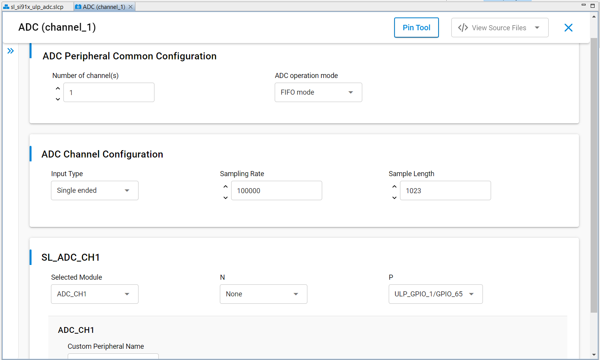
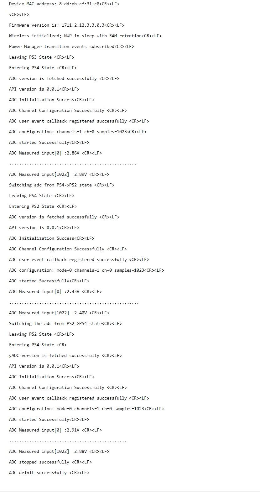

# SiWx91x Platform ULP ADC FreeRTOS

## Table of Contents

- [SiWx91x Platform ULP ADC FreeRTOS](#siwx91x-platform-ulp-adc-freertos)
  - [Table of Contents](#table-of-contents)
  - [Purpose/Scope](#purposescope)
  - [Overview](#overview)
  - [About Example Code](#about-example-code)
  - [FreeRTOS Architecture](#freertos-architecture)
  - [Prerequisites/Setup Requirements](#prerequisitessetup-requirements)
    - [Hardware Requirements](#hardware-requirements)
    - [Software Requirements](#software-requirements)
    - [Setup Diagram](#setup-diagram)
  - [Getting Started](#getting-started)
  - [Application Build Environment](#application-build-environment)
    - [Pin Configuration](#pin-configuration)
      - [Pin Configuration of the WPK\[BRD4002A\] Base Board, and with radio board](#pin-configuration-of-the-wpkbrd4002a-base-board-and-with-radio-board)
      - [Pin Configuration of the AC1 Module Explorer Kit](#pin-configuration-of-the-ac1-module-explorer-kit)
  - [Test the Application](#test-the-application)
  - [Troubleshooting](#troubleshooting)
  - [Resources](#resources)
  - [Report Bugs/Support](#report-bugssupport)

## Purpose/Scope

This application demonstrates the ADC peripheral driver usage in a **FreeRTOS** environment, including:

- Conversion of analog input to 12-bit digital output.
- Sampling the data.
- Converting data into equivalent input voltage based on operation mode.

This application also switches between **PS4** and **PS2**, samples through **FIFO** or **static** mode (depending on UC **`operation_mode`**), converts samples to voltage on the console, and tears down / re-inits the ADC around each transition. Configure  ADC instances from **siwx91x_platform_ulp_adc_freertos.slcp**.

## Overview

- The ADC Controller works on a ADC with a resolution of 12 bits at 10Msps when ADC reference Voltage is greater than 2.8v or 5Msps when ADC reference Voltage is less than 2.8v.
- The sample application will be 12-bit ADC Output in 2's complement representation.
- There are two operating mode in AUX ADC controller:
  - Static Mode Operation
  - FIFO Mode Operation
- There is a dedicated ADC DMA to support 16 channels.
- DMA mode supports dual buffer cyclic mode to avoid loss of data when buffer is full. In dual buffer cyclic mode, if buffer 1 is full for particular channel, incoming sampled data is written into buffer 2 such that, samples from buffer 1 are read back by controller during this time. That is why there are two start addresses, two buffer lengths and two valid signals for each channel.
- The AUX ADC can take analog inputs in single ended or differential. The output is 12-bit digital which can be given out with or without noise averaging.
- The Aux VRef can be connected directly to Vbat (Aux LDO bypass mode) or to the Aux LDO output.
- The user can configure input selection GPIO in the example application if default GPIO is work around.
- For ADC input selection rather than GPIO (like OPAMP, DAC, and Temperature sensor), users can create their own instances and configure them as per other input selection.

## About Example Code

**`ulp_adc_freertos.c`** demonstrates **ULP ADC** sampling under FreeRTOS with optional FIFO DMA vs **static** mode (`adc_runtime_config.operation_mode`, seeded from the **`sl_adc_config`** instance produced by Simplicity Studio—see [sl_adc_config_t](https://docs.silabs.com/wiseconnect/latest/wiseconnect-api-reference-guide-si91x-peripherals/adc#sl-adc-config-t)), voltage printing on the console, and **PS4 ↔ PS2** transitions around teardown/re-init.

- Clears any prior handler with [sl_si91x_adc_unregister_event_callback](https://docs.silabs.com/wiseconnect/latest/wiseconnect-api-reference-guide-si91x-peripherals/adc#sl-si91x-adc-unregister-event-callback).
- Reads the API version with [sl_si91x_adc_get_version](https://docs.silabs.com/wiseconnect/latest/wiseconnect-api-reference-guide-si91x-peripherals/adc#sl-si91x-adc-get-version) ([sl_adc_version_t](https://docs.silabs.com/wiseconnect/latest/wiseconnect-api-reference-guide-si91x-peripherals/adc#sl-adc-version-t)).
- Initializes the peripheral through [sl_si91x_adc_init](https://docs.silabs.com/wiseconnect/latest/wiseconnect-api-reference-guide-si91x-peripherals/adc#sl-si91x-adc-init) using [sl_adc_channel_config_t](https://docs.silabs.com/wiseconnect/latest/wiseconnect-api-reference-guide-si91x-peripherals/adc#sl-adc-channel-config-t), runtime [sl_adc_config_t](https://docs.silabs.com/wiseconnect/latest/wiseconnect-api-reference-guide-si91x-peripherals/adc#sl-adc-config-t), and `vref_value` derived from `VREF_VALUE`.
- Applies channel/DMA setup with [sl_si91x_adc_set_channel_configuration](https://docs.silabs.com/wiseconnect/latest/wiseconnect-api-reference-guide-si91x-peripherals/adc#sl-si91x-adc-set-channel-configuration); ping memory starts at `ADC_PING_BUFFER`, with pong derived from the channel sample count.
- Registers [sl_si91x_adc_register_event_callback](https://docs.silabs.com/wiseconnect/latest/wiseconnect-api-reference-guide-si91x-peripherals/adc#sl-si91x-adc-register-event-callback) (`callback_event`) so `SL_INTERNAL_DMA` or `SL_ADC_STATIC_MODE_EVENT` can release the task semaphore; `ulp_adc_sample_sem_drain()` clears stale tokens before starting.
- Starts conversions with [sl_si91x_adc_start](https://docs.silabs.com/wiseconnect/latest/wiseconnect-api-reference-guide-si91x-peripherals/adc#sl-si91x-adc-start); when `adc_runtime_config.operation_mode` is zero (FIFO), reads samples via [sl_si91x_adc_read_data](https://docs.silabs.com/wiseconnect/latest/wiseconnect-api-reference-guide-si91x-peripherals/adc#sl-si91x-adc-read-data); otherwise uses [sl_si91x_adc_read_data_static](https://docs.silabs.com/wiseconnect/latest/wiseconnect-api-reference-guide-si91x-peripherals/adc#sl-si91x-adc-read-data-static).
- Power-state moves follow stop/deinit: [sl_si91x_adc_stop](https://docs.silabs.com/wiseconnect/latest/wiseconnect-api-reference-guide-si91x-peripherals/adc#sl-si91x-adc-stop) then [sl_si91x_adc_deinit](https://docs.silabs.com/wiseconnect/latest/wiseconnect-api-reference-guide-si91x-peripherals/adc#sl-si91x-adc-deinit) before PS transitions and before the example enters its idle completed state.

Studio-generated **`sl_adc_config`** / **`sl_adc_channel_config`** are declared in **`sl_adc_instances.h`** and **`sl_si91x_adc_common_config.h`**. Example-local sizing and conversion macros (**`CHANNEL_SAMPLE_LENGTH`**, **`ADC_MAX_OP_VALUE`**, **`ADC_DATA_CLEAR`**, **`ADC_PING_BUFFER`**, **`VREF_VALUE`**) are defined in **`ulp_adc_freertos.c`**.

## FreeRTOS Architecture

- On startup, `main.c` calls `sl_main_second_stage_init()` to initialize all SDK components, then calls `app_init()`, which invokes `adc_example_init()`. That creates the `ulp_adc` FreeRTOS thread with `osThreadNew()` (`3072`-byte stack, `osPriorityLow1`).
- `app_process_action()` is a no-op; ADC sampling, console prints, and power transitions run in the dedicated task.
- The task creates `ulp_adc_sample_sem`, runs `initialize_wireless()` (for example `sl_net_init` and deep sleep with RAM retention), subscribes `ulp_adc_pm_transition_callback` for PS transition logs, adds a PS4 requirement, then `ulp_adc_application_init()` starts the ADC.
- Under `SL_ULP_ADC_PROCESS_ACTION`, `ulp_adc_wait_sample_done()` blocks until `callback_event` posts the semaphore (`SL_INTERNAL_DMA` when single-channel or `channel_no` matches `adc_channel`; `SL_ADC_STATIC_MODE_EVENT` in static mode); the task then runs FIFO or static read helpers and advances to `SL_ULP_ADC_POWER_STATE_TRANSITION`.
- That branch tears down the ADC (unregister, stop, deinit), switches PS4 → PS2 or PS2 → PS4 (`sl_si91x_power_manager_ps2_pre_check` polling where applicable), runs `configuring_ps2_power_state()` on PS2 entry, re-runs `ulp_adc_application_init()`, then either resumes sampling or, after the final pass, enters `SL_ULP_ADC_TRANSMISSION_COMPLETED` and idles with `osDelay(1000)`.


## Prerequisites/Setup Requirements

### Hardware Requirements

- Windows PC
- Silicon Labs SiWx91x Evaluation Kit [[BRD4002](https://www.silabs.com/development-tools/wireless/wireless-pro-kit-mainboard?tab=overview) + [BRD4338A](https://www.silabs.com/development-tools/wireless/wi-fi/siwx917-rb4338a-wifi-6-bluetooth-le-soc-radio-board?tab=overview) / [BRD4342A](https://www.silabs.com/development-tools/wireless/wi-fi/siwx91x-rb4342a-wifi-6-bluetooth-le-soc-radio-board?tab=overview) / [BRD4343A](https://www.silabs.com/development-tools/wireless/wi-fi/siw917y-rb4343a-wi-fi-6-bluetooth-le-8mb-flash-radio-board-for-module?tab=overview) / [BRD4343C](https://www.silabs.com/development-tools/wireless/wi-fi/siw917y-rb4343c-wi-fi-6-bluetooth-le-8mb-flash-radio-board-for-module?tab=overview)]
- SiWx917 AC1 Module Explorer Kit [BRD2708A](https://www.silabs.com/development-tools/wireless/wi-fi/siw917y-ek2708a-explorer-kit)

### Software Requirements

- Simplicity Studio
- Serial console Setup
  - For Serial Console setup instructions, refer to [link name](https://docs.silabs.com/wiseconnect/latest/wiseconnect-developers-guide-developing-for-silabs-hosts/using-the-simplicity-studio-ide#console-input-and-output).

### Setup Diagram

 

## Getting Started

Refer to the instructions [here](https://docs.silabs.com/wiseconnect/latest/wiseconnect-getting-started/) to:

- [Install Simplicity Studio](https://docs.silabs.com/wiseconnect/latest/wiseconnect-developers-guide-developing-for-silabs-hosts/using-the-simplicity-studio-ide#install-simplicity-studio)
- [Install WiSeConnect extension](https://docs.silabs.com/wiseconnect/latest/wiseconnect-developers-guide-developing-for-silabs-hosts/using-the-simplicity-studio-ide#install-the-wiseconnect-3-extension)
- [Connect your device to the computer](https://docs.silabs.com/wiseconnect/latest/wiseconnect-developers-guide-developing-for-silabs-hosts/using-the-simplicity-studio-ide#connect-siwx91x-to-computer)
- [Upgrade your connectivity firmware](https://docs.silabs.com/wiseconnect/latest/wiseconnect-developers-guide-developing-for-silabs-hosts/using-the-simplicity-studio-ide#update-siwx91x-connectivity-firmware)
- [Create a Studio project](https://docs.silabs.com/wiseconnect/latest/wiseconnect-developers-guide-developing-for-silabs-hosts/using-the-simplicity-studio-ide#create-a-project)

For details on the project folder structure, see the [WiSeConnect Examples](https://docs.silabs.com/wiseconnect/latest/wiseconnect-examples/#example-folder-structure) page.

## Application Build Environment

Configure UC from the slcp component.

- Open the **siwx91x_platform_ulp_adc_freertos.slcp** project file, select the **Software Component** tab, and search for **ADC** in search bar.
- You can use the configuration wizard to configure different parameters. The configuration screen is below, with options for the user to pick based on need.

  - **ADC Peripheral Common Configuration**

    - Number of channel: By default channel is set to '1'. When the channel number is changed, then care must be taken to create instance of that respective channel number. Otherwise, an error is thrown.
    - ADC operation mode: There are 2 modes: FIFO mode and Static mode. By default, it is in FIFO mode. When static mode is set, sample length should be '1'.
     - The user can install up to sixteen instances of the channel, which will execute in sequential order. To configure this, follow the steps below:

       1. Install the channel instances.
       2. Update the `Number of Channel(s)` value in the **ADC Peripheral Common Configuration** section and number of channels should be equal to the number of instances added in UC.
    - The order of instances must be strictly sequential, starting from 1 and increasing consecutively (e.g., 1, 2, 3). Non-sequential orders such as 1, 4, 6 or 1, 5, 2 are not permitted.


  - **ADC Channel Configuration**

    - Input Type: ADC input type can be configured to be either single ended or differential.
    - Sampling rate: The ADC sampling rate is configurable per channel, in units of samples per second. The supported range depends on the operating mode: in FIFO mode, the range is **80 Hz to 2.5 Msps**; in static mode, the range is approximately **39.1 ksps to 2.5 Msps** (determined by the 40 MHz ADC clock and an effective divider range of 16 to 1023).
    - Sample length: Set the length of ADC samples (that is, the number of ADC samples collected for operation). It should be minimum value set to 1 and maximum of 1023.

      

- After running the application, it will store the equivalent input voltage from ADC output samples in 'vout'.
- ADC output will print the configured number of samples output voltage on UART console.
- Apply the different voltages (1.8V to Vref) to ADC input and observe console outputs as per input.
- Provided input voltage and console output data should match.

- Configure the following macros in **`ulp_adc_freertos.c`** file, if required:

- `CHANNEL_SAMPLE_LENGTH`: Number of ADC samples collected per channel for one operation. By default, it is set to 1023.

  ```c
    #define CHANNEL_SAMPLE_LENGTH 1023       // Number of ADC sample collect for operation
  ```

- `ADC_PING_BUFFER`: Base address in SRAM for the FIFO **ping** DMA buffer (**`chnl_ping_address`** / **`chnl_pong_address`** setup in **`ulp_adc_application_init`**).

  ```c
    #define ADC_PING_BUFFER       0x24060800
  ```

- `ADC_MAX_OP_VALUE`: Maximum 12-bit raw value that can be read from the ADC data register. By default, it is set to 4095.

  ```c
    #define ADC_MAX_OP_VALUE      4095       // Maximum output value get from adc data register
  ```

- `VREF_VALUE`: ADC reference voltage (in volts) used to compute the equivalent input voltage. By default, it is set to 3.3.

  ```c
    #define VREF_VALUE            3.3        // reference voltage
  ```

### Pin Configuration

#### Pin Configuration of the WPK[BRD4002A] Base Board, and with radio board

- The following table lists the mentioned pin numbers for radio board. If you want to use different radio board, see the board-specific user guide.
- The GPIO and ULP GPIO pins listed are capable of supporting ULP ADC capability.
- The below mentioned channels can be re-configured to any ADC supported pins.

  | CHANNEL | PIN TO ADCP | PIN TO ADCN |
  | --- | --- | --- |
  | 1 | ULP_GPIO_1 [P16] | GPIO_28 [P31]  |
  | 2 | GPIO_27 [P29] | GPIO_30 [P35] |
  | 3 | ULP_GPIO_8 [P15] | GPIO_26 [P27] |
  | 4 | GPIO_25 [P25] | ULP_GPIO_7 [EXP_HEADER-15] |
  | 5 | ULP_GPIO_8 [P15] | ULP_GPIO_1 [P16] |
  | 6 | ULP_GPIO_10 [P17] | ULP_GPIO_7 [EXP_HEADER-15] |
  | 7 | GPIO_25 [P25] | GPIO_26 [P27] |
  | 8 | GPIO_27 [P29] | GPIO_28 [P31] |
  | 9 | GPIO_29 [P33] | GPIO_30 [P35] |
  | 10 | GPIO_29 [P33] | GPIO_30 [P35] |
  | 11 | ULP_GPIO_1 [P16] | GPIO_30 [P35] |
  | 12 | ULP_GPIO_1 [P16] | GPIO_28 [P31] |
  | 13 | ULP_GPIO_7 [EXP_HEADER-15] | GPIO_26 [P27] |
  | 14 | GPIO_26 [P27] | ULP_GPIO_7 [EXP_HEADER-15] |
  | 15 | GPIO_28 [P31] | GPIO_26 [P27] |
  | 16 | GPIO_30 [P35] | ULP_GPIO_7 [EXP_HEADER-15] |

| OTHER INPUT SELECTION | VALUE TO ADCP | VALUE TO ADCN |
| --- | --- | --- |
| OPAMP1_OUT | 20 | 10 |
| OPAMP2_OUT | 21 | 11 |
| OPAMP3_OUT | 22 | 12 |
| TEMP_SENSOR_OUT | 23 | |
| DAC_OUT | 24 | 13 |

#### Pin Configuration of the AC1 Module Explorer Kit

 | CHANNEL | PIN TO ADCP | PIN TO ADCN |
  | --- | --- | --- |
  | 1 | ULP_GPIO_1 [EXP_HEADER-5] | GPIO_28 [CS]  |
  | 2 | GPIO_27 [MOSI] | GPIO_30 [RST] |
  | 3 | ULP_GPIO_8 [EXP_HEADER-2] | GPIO_26 [MISO] |
  | 4 | GPIO_25 [SCK] | ULP_GPIO_7 [TX] |
  | 5 | ULP_GPIO_8 [EXP_HEADER-2] | ULP_GPIO_1 [EXP_HEADER-5] |
  | 6 | ULP_GPIO_5 [EXP_HEADER-9] | ULP_GPIO_7 [TX] |
  | 7 | GPIO_25 [SCK] | GPIO_26 [MISO] |
  | 8 | GPIO_27 [MOSI] | GPIO_28 [CS] |
  | 9 | GPIO_29 [AN] | GPIO_30 [RST] |
  | 10 | GPIO_29 [AN] | GPIO_30 [RST] |
  | 11 | ULP_GPIO_1 [EXP_HEADER-5] | GPIO_30 [RST] |
  | 12 | ULP_GPIO_1 [EXP_HEADER-5] | GPIO_28 [CS] |
  | 13 | ULP_GPIO_7 [TX] | GPIO_26 [MISO] |
  | 14 | GPIO_26 [MISO] | ULP_GPIO_7 [TX] |
  | 15 | GPIO_28 [CS] | GPIO_26 [MISO] |
  | 16 | GPIO_30 [RST] | ULP_GPIO_7 [TX] |

> **Note**: For recommended settings, please refer the [recommendations guide](https://docs.silabs.com/wiseconnect/latest/wiseconnect-developers-guide-prog-recommended-settings/).

## Test the Application

> **Note:** Use **`Log_script.py`** from the **SiWx91x Platform Logger** example (`examples/si91x_soc/service/sl_si91x_logger/`) to decode structured console log output. Run:
>
> `python Log_script.py --out firmware.out --descriptor SYSVIEW_CaptiveCore.txt --port COM5 --max-args 3`
>
> Replace **COM5** with the serial port your board uses on the host PC.


Refer to the instructions [here](https://docs.silabs.com/wiseconnect/latest/wiseconnect-getting-started/) to:

1. Compile and run the application.
2. When the project is generated, the ADC channel by default is configured with the channel_1 instance for SiWx91x. For further details, refer to the two sub-points below for the SiWx91x board.
   - Single-ended mode: the positive analog input to ULP_GPIO_1 for SiWx91x.
   - Differential mode: the positive analog input to ULP_GPIO_1 and the negative input to GPIO_28.
3. When the application runs, the ADC configures the settings as per the user and starts ADC conversion.
4. After completion of conversion ADC input, it will print all the captured samples data in console by connecting serial console.
5. After successful program execution, the prints in serial console looks as shown below when the input voltage provided is 3.3 v.

    

> **Note:**
>
>- The user can configure the input selection GPIO in the example application if the default GPIO is work around.
>- ADC input selection rather than GPIO (like OP-AMP, DAC and Temperature sensor) user can create their own instances and configure them as per other input selection.
>- In the **`ulp_adc_freertos.c`** file, update the [sl_adc_channel_config_t](https://docs.silabs.com/wiseconnect/latest/wiseconnect-api-reference-guide-si91x-peripherals/adc#sl-adc-channel-config-t) channel parameter to reflect the installed channel number.
>
 >Use the following formula to find equivalent input voltage of ADC:
>
> **Differential Ended Mode:**
>
> vout = ((((float)ADC output/(float)4096) * Vref Voltage) - (Vref Voltage/2));
>
> > **Note:** If Positive input to ADC given as 2.4V and Negative  input is given as 1.5V, then ADC output will be a digital value which is equivalent to 0.9V.
>
> **Single ended Mode:**
>
> vout = (((float)ADC output/(float)4096) * Vref Voltage);
>
> > **Note:** If Positive input to ADC given as 2.4V, then ADC output will be a digital value which is equivalent to 2.4V.
>
> **Note:**
>
>- The required files for low-power state are moved to RAM; the rest of the application is executed from flash.
>- In this application, we are changing the power state from PS4 to PS2 and vice - versa.
>
> **Note:**
>
>- Interrupt handlers are implemented in the driver layer, and user callbacks are provided for custom code. If you want to write your own interrupt handler instead of using the default one, make the driver interrupt handler a weak handler. Then, copy the necessary code from the driver handler to your custom interrupt handler.
>
> **Note:**
>
>- This application is intended for demonstration purposes only to showcase the ULP peripheral functionality. It should not be used as a reference for real-time use case project development, because the wireless shutdown scenario is not supported in the current SDK.

## Troubleshooting

- If the project does not build, ensure Simplicity Studio and the WiSeConnect extension are installed and the board is connected.
- If the device is not detected, reinstall the connectivity firmware and check USB drivers.

## Resources

- [WiSeConnect Getting Started](https://docs.silabs.com/wiseconnect/latest/wiseconnect-getting-started/)
- [WiSeConnect Examples](https://docs.silabs.com/wiseconnect/latest/wiseconnect-examples/)
- [SiWx91x SoC Documentation](https://docs.silabs.com/wiseconnect/latest/)

## Report Bugs/Support

For issues and support, use the Silicon Labs Community or your normal support channel.

