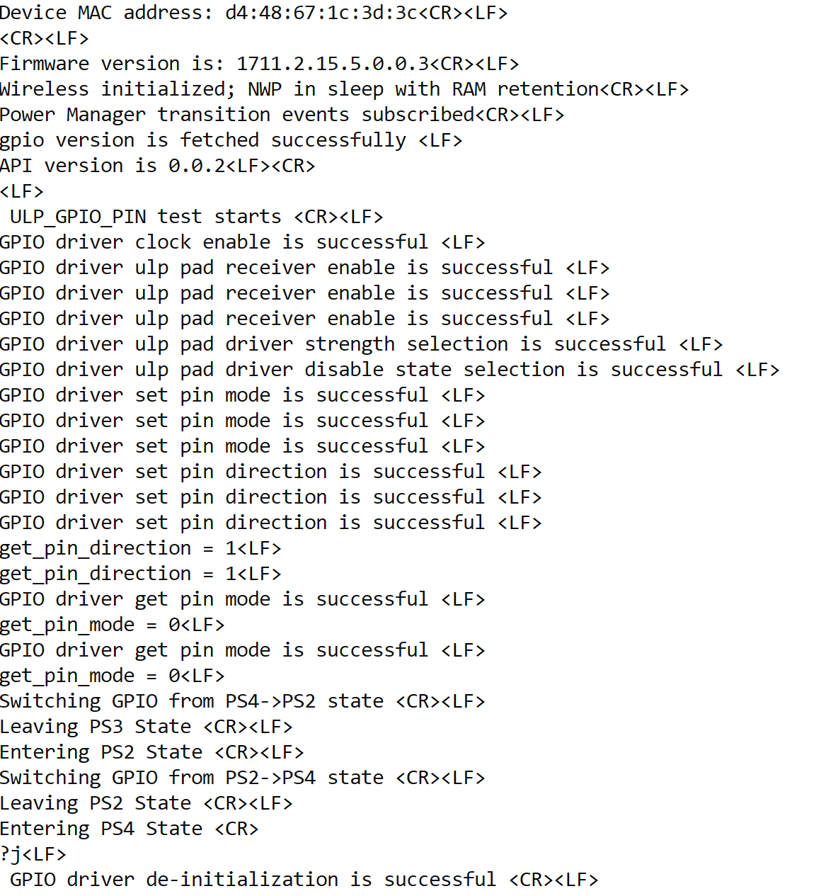

# SiWx91x Platform ULP GPIO Transition FreeRTOS

## Table of Contents

- [SiWx91x Platform ULP GPIO Transition FreeRTOS](#siwx91x-platform-ulp-gpio-transition-freertos)
  - [Table of Contents](#table-of-contents)
  - [Purpose/Scope](#purposescope)
  - [Overview](#overview)
  - [About Example Code](#about-example-code)
  - [FreeRTOS Architecture](#freertos-architecture)
  - [Prerequisites/Setup Requirements](#prerequisitessetup-requirements)
    - [Hardware Requirements](#hardware-requirements)
    - [Software Requirements](#software-requirements)
    - [Setup Diagram](#setup-diagram)
  - [Getting Started](#getting-started)
  - [Application Build Environment](#application-build-environment)
    - [Application macros (`ulp_gpio_transition_freertos.c`)](#application-macros-ulp_gpio_transition_freertosc)
    - [Pin Configuration](#pin-configuration)
      - [Pin Configuration of the WPK\[BRD4002\] Base Board, and radio boards](#pin-configuration-of-the-wpkbrd4002-base-board-and-radio-boards)
      - [Pin Configuration of the AC1 Module Explorer Kit](#pin-configuration-of-the-ac1-module-explorer-kit)
  - [Test the Application](#test-the-application)
  - [Troubleshooting](#troubleshooting)
  - [Resources](#resources)
  - [Report Bugs/Support](#report-bugssupport)

## Purpose/Scope

This application demonstrates **HP**, **ULP**, and **UULP** GPIO usage in a **FreeRTOS** environment while exercising **power manager** transitions between **PS4** and **PS2**, aligned with **ulp_adc_freertos.c** (wireless bring-up, NWP sleep with RAM retention, PS transition subscribe). Highlights include:

- ULP toggling (**`sl_gpio_driver_toggle_pin`**) across PS states.
- Optional ULP **pin** and **group** interrupts, plus UULP **pin** interrupts and NPSS/UULP bring-up helpers.
- Configurable demonstration paths chosen by **`gpio_instance_type_t`** in **ulp_gpio_transition_freertos.c**.
- UC and Wireless / GPIO-related components configured from **siwx91x_platform_ulp_gpio_transition_freertos.slcp**.

## Overview

- The GPIO functionality in the MCU consists of three instances:
  - HP (High Power) Instance: Controls the SoC GPIOs (GPIO_n; n=0 to 57).
  - ULP (Ultra Low Power) Instance: Controls the ULP GPIOs (ULP_GPIO_n; n=0 to 11).
  - UULP (Ultra Ultra Low Power) Instance: Controls the UULP GPIOs (UULP_GPIO_n; n=0 to 4).
- HP and ULP Instance have the same features and functionality except for different base address.
- Each port in the HP domain supports a maximum of 16 GPIO pins, with a total of four ports (SL_GPIO_PORT_A, SL_GPIO_PORT_B, SL_GPIO_PORT_C, SL_GPIO_PORT_D).
- The ULP GPIO domain has only one port (SL_GPIO_ULP_PORT) with a maximum of 12 pins.
- Similarly, the UULP GPIO domain has only one port (SL_GPIO_UULP_PORT) with a maximum of 5 pins.

  > **Note:** Please note that GPIO_n (n=0:5) are dedicated for the Secure Zone Processor's Flash interface. The MCU should NOT be changing any configuration related to these GPIOs under any circumstances since it may lead to the Flash content being corrupted, rendering the chip unusable. This is applicable to MCU HP EGPIO Instance.

- All GPIO pins in the HP/ULP/UULP instances support operations such as set, clear, and toggle, and can be programmed as either output or input.

 As HP GPIO instance has 4 ports and each port has 16 pins. Each port pins are represented from 0 - 15 set.
 The table below explains the Port and Pin selection for different instances:

|  GPIO Instance                 |    GPIO Port      |  GPIO Pin Number  |
|--------------------------------|-------------------|-------------------|
|                                |  SL_GPIO_PORT_A   |   (0-15)          |
| HP GPIO Instance               |  SL_GPIO_PORT_B   |   (16-31)         |
|                                |  SL_GPIO_PORT_C   |   (32-47)         |
|                                |  SL_GPIO_PORT_D   |   (48-57)         |
|--------------------------------|-------------------|-------------------|
| ULP GPIO Instance              |  SL_GPIO_ULP_PORT |   (0-11)          |
|--------------------------------|-------------------|-------------------|
| UULP GPIO Instance             | SL_GPIO_UULP_PORT |   (0-4)           |

>**NOTE** : There is also option to select (0-57)pins with SL_GPIO_PORT_A. For example, to select HP GPIO pin number 49, you can select Port as SL_GPIO_PORT_A and pin number as 49. This option is given only when SL_GPIO_PORT_A GPIO port is selected. (57-63)pins are reserved.

>**NOTE** : For reference on how to select Port and Pin number for different instances, please see the following points:
>
> - To select HP GPIO pin number 16 for usage, select the Port as SL_GPIO_PORT_B and Pin number as 0.
> - To select HP GPIO pin number 31 for usage, select the Port as SL_GPIO_PORT_B and Pin number as 15.
> - To select HP GPIO pin number 33 for usage, select the Port as SL_GPIO_PORT_C and Pin number as 1.
> - To select HP GPIO pin number 56 for usage, select the Port as SL_GPIO_PORT_D and Pin number as 14.
> - To select ULP  GPIO pin number 10 for usage, select the Port as SL_GPIO_ULP_PORT and Pin number as 10.
> - To select UULP  GPIO pin number 2 for usage, select the Port as SL_GPIO_UULP_PORT and Pin number as 2.

- Refer to the following APIs which are common for all 3 instances and are differentiated based on Port and Pin:

  - [sl_gpio_set_configuration()](https://docs.silabs.com/wiseconnect/latest/wiseconnect-api-reference-guide-si91x-peripherals/gpio#sl-gpio-set-configuration) // configure GPIO pin
  - [sl_gpio_driver_set_pin()](https://docs.silabs.com/wiseconnect/latest/wiseconnect-api-reference-guide-si91x-peripherals/gpio#sl-gpio-driver-set-pin) // set the GPIO pin
  - [sl_gpio_driver_clear_pin()](https://docs.silabs.com/wiseconnect/latest/wiseconnect-api-reference-guide-si91x-peripherals/gpio#sl-gpio-driver-clear-pin) // clear the GPIO pin
  - [sl_gpio_driver_get_pin()](https://docs.silabs.com/wiseconnect/latest/wiseconnect-api-reference-guide-si91x-peripherals/gpio#sl-gpio-driver-get-pin)  // get the status of the GPIO pin
  - [sl_gpio_driver_toggle_pin()](https://docs.silabs.com/wiseconnect/latest/wiseconnect-api-reference-guide-si91x-peripherals/gpio#sl-gpio-driver-toggle-pin) // toggle the GPIO pin
  - [sl_gpio_driver_configure_interrupt()](https://docs.silabs.com/wiseconnect/latest/wiseconnect-api-reference-guide-si91x-peripherals/gpio#sl-gpio-driver-configure-interrupt) // configure the HP/ULP/UULP  pin interrupt

- Using [sl_gpio_set_configuration()](https://docs.silabs.com/wiseconnect/latest/wiseconnect-api-reference-guide-si91x-peripherals/gpio#sl-gpio-set-configuration), you can configure mode and direction using port and pin for all three instances. By default, the mode is set to mode0 using this API.
- To configure the GPIO to a different mode, use [sl_gpio_driver_set_pin_mode()](https://docs.silabs.com/wiseconnect/latest/wiseconnect-api-reference-guide-si91x-peripherals/gpio#sl-gpio-driver-set-pin-mode) - applicable to HP and ULP  instances.
- Configure GPIO to another direction using [sl_si91x_gpio_driver_set_pin_direction()](https://docs.silabs.com/wiseconnect/latest/wiseconnect-api-reference-guide-si91x-peripherals/gpio#sl-si91x-gpio-driver-set-pin-direction) - applicable for all three instances, [sl_si91x_gpio_driver_set_uulp_npss_pin_mux()](https://docs.silabs.com/wiseconnect/latest/wiseconnect-api-reference-guide-si91x-peripherals/gpio#sl-si91x-gpio-driver-set-uulp-npss-pin-mux) for UULP  instance. To achieve other modes in GPIO, refer to pin MUX section in HRM.
- There are several individual APIs available for specific GPIO configurations:
  - Driver Strength (HP instance): The [sl_si91x_gpio_driver_select_pad_driver_strength()](https://docs.silabs.com/wiseconnect/latest/wiseconnect-api-reference-guide-si91x-peripherals/gpio#sl-si91x-gpio-driver-select-pad-driver-strength) function allows you to adjust the driver strength in the High Power (HP) instance.
  - Driver Strength (ULP instance): The [sl_si91x_gpio_driver_select_ulp_pad_driver_strength()](https://docs.silabs.com/wiseconnect/latest/wiseconnect-api-reference-guide-si91x-peripherals/gpio#sl-si91x-gpio-driver-select-ulp-pad-driver-strength) function allows you to adjust the driver strength in the Ultra-Low Power (ULP) instance.
  - Slew Rate (HP instance): Use [sl_gpio_driver_set_slew_rate()](https://docs.silabs.com/wiseconnect/latest/wiseconnect-api-reference-guide-si91x-peripherals/gpio#sl-gpio-driver-set-slew-rate) to configure the slew rate for the High Power (HP) instance.
  - Slew Rate (ULP instance): The [sl_si91x_gpio_driver_select_ulp_pad_slew_rate()](https://docs.silabs.com/wiseconnect/latest/wiseconnect-api-reference-guide-si91x-peripherals/gpio#sl-si91x-gpio-driver-select-ulp-pad-slew-rate) function is used to set the slew rate for the Ultra-Low Power (ULP) instance.
  - Driver Disable State (HP instance): The [sl_si91x_gpio_driver_select_pad_driver_disable_state()](https://docs.silabs.com/wiseconnect/latest/wiseconnect-api-reference-guide-si91x-peripherals/gpio#sl-si91x-gpio-driver-select-pad-driver-disable-state) function enables the configuration of pull-up, pull-down, or repeater functionality for GPIO pins in the High Power (HP) instance.
  - Driver Disable State (ULP instance): The [sl_si91x_gpio_driver_select_ulp_pad_driver_disable_state()](https://docs.silabs.com/wiseconnect/latest/wiseconnect-api-reference-guide-si91x-peripherals/gpio#sl-si91x-gpio-driver-select-ulp-pad-driver-disable-state) function enables the configuration of pull-up, pull-down, or repeater functionality for GPIO pins in the Ultra-Low Power (ULP) instance.
- The PAD selection for corresponding GPIO is taken care implicitly in [sl_gpio_set_configuration()](https://docs.silabs.com/wiseconnect/latest/wiseconnect-api-reference-guide-si91x-peripherals/gpio#sl-gpio-set-configuration). If you explicitly want to use, refer to [sl_si91x_gpio_driver_enable_pad_selection()](https://docs.silabs.com/wiseconnect/latest/wiseconnect-api-reference-guide-si91x-peripherals/gpio#sl-si91x-gpio-driver-enable-pad-selection).
- To enable host PAD selection for GPIO pin numbers(25 - 30), refer to [sl_si91x_gpio_driver_enable_host_pad_selection()](https://docs.silabs.com/wiseconnect/latest/wiseconnect-api-reference-guide-si91x-peripherals/gpio#sl-si91x-gpio-driver-enable-host-pad-selection).
**Note:** Do not enable PAD selection number 9, as it is pre-configured for another function .

## About Example Code

**`ulp_gpio_transition_freertos.c`** demonstrates **HP / ULP / UULP** GPIO setup, optional pin and group interrupts, ULP pin toggling across **PS4 ↔ PS2**, and final **`sl_gpio_driver_deinit`** teardown—using the same wireless bring-up and Power Manager subscription pattern as **`ulp_adc_freertos.c`**.

## FreeRTOS Architecture

- On startup, `main.c` calls `sl_main_second_stage_init()` to initialize all SDK components, then calls `app_init()`, which invokes `gpio_example_init()`. That creates the **`ulp_gpio`** thread with `osThreadNew()` (`6144`-byte stack, `osPriorityLow1`).
- `app_process_action()` is a no-op; GPIO work and PS transitions run entirely in the dedicated task.
- The task runs `initialize_wireless()`, subscribes `ulp_gpio_pm_transition_callback` with **`PS_EVENT_MASK`**, then `ulp_gpio_application_init()` configures pins/interrupts per enabled **`gpio_instance_type_t`** flags.
- Under **`SL_ULP_GPIO_PROCESS_ACTION`**, a **`do` … `while (gpio_toggle_count++ < TOGGLE_COUNT)`** burst runs each pass: when **`ULP_GPIO_PIN`** matches **`SET`**, it toggles **ULP_GPIO_2** via **`sl_gpio_driver_toggle_pin`**; when **`UULP_GPIO_PIN`** is enabled it pulses **UULP_GPIO_0** with **`sl_si91x_gpio_driver_set_uulp_npss_pin_value`**. Then the state advances to **`SL_ULP_POWER_STATE_TRANSITION`**.
- From **PS4**, that branch requests **PS2** (`sl_si91x_power_manager_add_ps_requirement`), runs **`DEBUGINIT()`** and **`configuring_ps2_power_state()`**, sets **`current_power_state`** to **PS2**, and returns to **`PROCESS_ACTION`** without GPIO teardown. From **PS2**, it requests **PS4**, **`DEBUGINIT()`**, sets **`current_power_state`** to **`LAST_ENUM_POWER_STATE`**, and runs one more **`PROCESS_ACTION`** burst; the next transition pass calls **`sl_gpio_driver_deinit`** and idles in **`SL_ULP_GPIO_TERMINATED`** with `osDelay(1000)`.


## Prerequisites/Setup Requirements

### Hardware Requirements

- Windows PC
- Silicon Labs SiWx91x Evaluation Kit [[BRD4002](https://www.silabs.com/development-tools/wireless/wireless-pro-kit-mainboard?tab=overview) + [BRD4338A](https://www.silabs.com/development-tools/wireless/wi-fi/siwx917-rb4338a-wifi-6-bluetooth-le-soc-radio-board?tab=overview) / [BRD4342A](https://www.silabs.com/development-tools/wireless/wi-fi/siwx91x-rb4342a-wifi-6-bluetooth-le-soc-radio-board?tab=overview) / [BRD4343A](https://www.silabs.com/development-tools/wireless/wi-fi/siw917y-rb4343a-wi-fi-6-bluetooth-le-8mb-flash-radio-board-for-module?tab=overview) / [BRD4343C](https://www.silabs.com/development-tools/wireless/wi-fi/siw917y-rb4343c-wi-fi-6-bluetooth-le-8mb-flash-radio-board-for-module?tab=overview)]
- SiWx917 AC1 Module Explorer Kit [BRD2708A](https://www.silabs.com/development-tools/wireless/wi-fi/siw917y-ek2708a-explorer-kit)

### Software Requirements

- Simplicity Studio
- Serial console setup
  - For Serial Console setup instructions, refer to [link name](https://docs.silabs.com/wiseconnect/latest/wiseconnect-developers-guide-developing-for-silabs-hosts/using-the-simplicity-studio-ide#console-input-and-output).

### Setup Diagram


## Getting Started

Refer to the instructions [here](https://docs.silabs.com/wiseconnect/latest/wiseconnect-getting-started/) to:

- [Install Simplicity Studio](https://docs.silabs.com/wiseconnect/latest/wiseconnect-developers-guide-developing-for-silabs-hosts/using-the-simplicity-studio-ide#install-simplicity-studio)
- [Install WiSeConnect extension](https://docs.silabs.com/wiseconnect/latest/wiseconnect-developers-guide-developing-for-silabs-hosts/using-the-simplicity-studio-ide#install-the-wiseconnect-3-extension)
- [Connect your device to the computer](https://docs.silabs.com/wiseconnect/latest/wiseconnect-developers-guide-developing-for-silabs-hosts/using-the-simplicity-studio-ide#connect-siwx91x-to-computer)
- [Upgrade your connectivity firmware](https://docs.silabs.com/wiseconnect/latest/wiseconnect-developers-guide-developing-for-silabs-hosts/using-the-simplicity-studio-ide#update-siwx91x-connectivity-firmware)
- [Create a Studio project](https://docs.silabs.com/wiseconnect/latest/wiseconnect-developers-guide-developing-for-silabs-hosts/using-the-simplicity-studio-ide#create-a-project)

For details on the project folder structure, see the [WiSeConnect Examples](https://docs.silabs.com/wiseconnect/latest/wiseconnect-examples/#example-folder-structure) page.

## Application Build Environment

### Application Configuration Parameters

- Open **siwx91x_platform_ulp_gpio_transition_freertos.slcp**, select **Software Components**, and configure GPIO / power-manager components for your radio board (UC-generated defaults apply).

### Application macros (`ulp_gpio_transition_freertos.c`)

Edit only when you intentionally change IRQ wiring, PAD rules, grouping, or pacing constants.

  ```c
  #define PORT0             0      // PORT 0
  ```

- `AVL_INTR_NO`: Specifies the available interrupt number used by the GPIO pin interrupt. By default, it is set to 0.

  ```c
  #define AVL_INTR_NO       0      // available interrupt number
  ```

- `POLARITY`: Polarity configuration for the GPIO pin interrupt. By default, it is set to 0.

  ```c
  #define POLARITY          0      // Polarity for GPIO pin
  ```

- `INT_CH`: Specifies the HP GPIO pin interrupt channel (GPIO Pin interrupt 0). By default, it is set to 0.

  ```c
  #define INT_CH            0      // GPIO Pin interrupt 0
  ```

- `ULP_INT_CH`: Specifies the ULP GPIO pin interrupt channel (ULP GPIO Pin interrupt 0). By default, it is set to 0.

  ```c
  #define ULP_INT_CH        0      // ULP GPIO Pin interrupt 0
  ```

- `MODE_0`: Initialization value for the GPIO pin mode (MODE 0). By default, it is set to 0.

  ```c
  #define MODE_0            0      // Initializing GPIO MODE_0 value
  ```

- `PORT1`: Identifier for GPIO Port 1, used when configuring pins on port 1. By default, it is set to 1.

  ```c
  #define PORT1             1      // PORT 1
  ```

- `OUTPUT_VALUE`: Value to drive on the GPIO pin when configured as output. By default, it is set to 1.

  ```c
  #define OUTPUT_VALUE      1      // GPIO output value
  ```

- `PIN_COUNT`: Number of interrupts needed for the group interrupt configuration. By default, it is set to 2.

  ```c
  #define PIN_COUNT         2      // Number of interrupts needed
  ```

- `GRP_COUNT`: Count of group interrupt pins per group. By default, it is set to 2.

  ```c
  #define GRP_COUNT         2      // Count of group interrupt pins
  ```

- `PAD_SELECT_9`: Reserved GPIO PAD selection number (9), which is pre-configured for another function and must not be enabled. By default, it is set to 9.

  ```c
  #define PAD_SELECT_9      9      // GPIO PAD selection number
  ```

- `MAX_PAD_SELECT`: Maximum valid GPIO PAD selection number. By default, it is set to 34.

  ```c
  #define MAX_PAD_SELECT    34     // Maximum GPIO PAD selection number
  ```

- `FIVE_SECOND_DELAY`: Delay (in milliseconds) used within the example for power state transitions. By default, it is set to 5000 (5 seconds).

  ```c
  #define FIVE_SECOND_DELAY 5000U   // Delay for 5 sec
  ```

- `UULP_GPIO_INTR_2`: Specifies the UULP GPIO pin interrupt number used by the example. By default, it is set to 2.

  ```c
  #define UULP_GPIO_INTR_2  2      // UULP GPIO pin interrupt 2
  ```

- `TOGGLE_COUNT`: Number of times the GPIO toggle/transition sequence is repeated. By default, it is set to 10.

  ```c
  #define TOGGLE_COUNT      10     // Count for number of times to repeat
  ```

> **Note**: For recommended settings, please refer the [recommendations guide](https://docs.silabs.com/wiseconnect/latest/wiseconnect-developers-guide-prog-recommended-settings/).

## Test the Application

> **Note:** Use **`Log_script.py`** from the **SiWx91x Platform Logger** example (`examples/si91x_soc/service/sl_si91x_logger/`) to decode structured console log output. Run:
>
> `python Log_script.py --out firmware.out --descriptor SYSVIEW_CaptiveCore.txt --port COM5 --max-args 3`
>
> Replace **COM5** with the serial port your board uses on the host PC.


Refer to the instructions [here](https://docs.silabs.com/wiseconnect/latest/wiseconnect-getting-started/) to:

1. Compile and run the application.
2. By default, ULP GPIO 2 (LED0) toggles during power transition from PS4 -> PS2 and PS2 -> PS4.
3. Connect logic analyzer to ULP GPIO 2(F10) / GPIO 10(F10) on WPK board to observe toggle state.
4. After successful program execution, the prints in serial console looks as shown below.

   

>**Note:**
>
>- The required files for low power state are moved to RAM rest of the application is executed from flash.
>- In this application, we are changing the power state from PS4 to PS2 and vice - versa.
>
> **Note:**
>
>- Interrupt handlers are implemented in the driver layer, and user callbacks are provided for custom code. If you want to write your own interrupt handler instead of using the default one, make the driver interrupt handler a weak handler. Then, copy the necessary code from the driver handler to your custom interrupt handler.
>
> **Note:**
>
>- This application is intended for demonstration purposes only to showcase the ULP peripheral functionality. It should not be used as a reference for real-time use case project development, as the wireless shutdown scenario is not supported in the current SDK.
>
> **Note:**
>
>- Header connection pin references mentioned here are all specific to BRD4338A. If the user runs this application on a different board, it is recommended to refer the board specific schematic for GPIO-Header connection pin mapping.
>- To use GPIO pins 31-34 in GPIO mode, see the [SiWx917 Software Reference Manual](docs/software-reference/manuals/siwx91x-software-reference-manual.md).

## Troubleshooting

- If the project does not build, ensure Simplicity Studio and the WiSeConnect extension are installed and the board is connected.
- If the device is not detected, reinstall the connectivity firmware and check USB drivers.

## Resources

- [WiSeConnect Getting Started](https://docs.silabs.com/wiseconnect/latest/wiseconnect-getting-started/)
- [WiSeConnect Examples](https://docs.silabs.com/wiseconnect/latest/wiseconnect-examples/)
- [SiWx91x SoC Documentation](https://docs.silabs.com/wiseconnect/latest/)

## Report Bugs/Support

For issues and support, use the Silicon Labs Community or your normal support channel.
