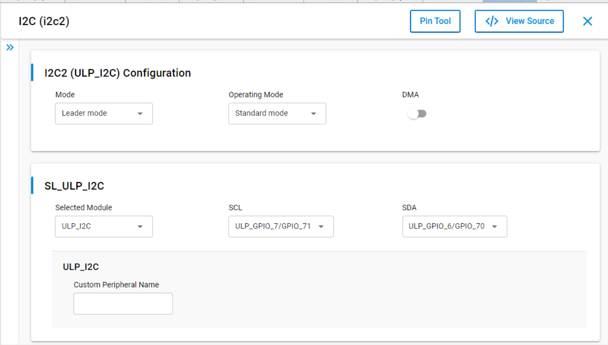
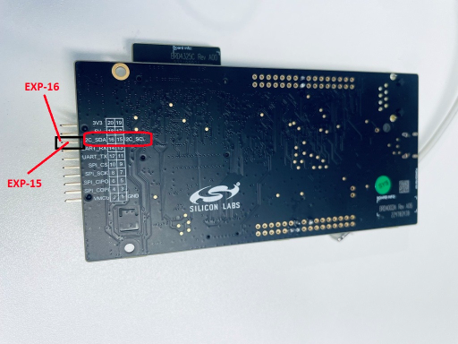
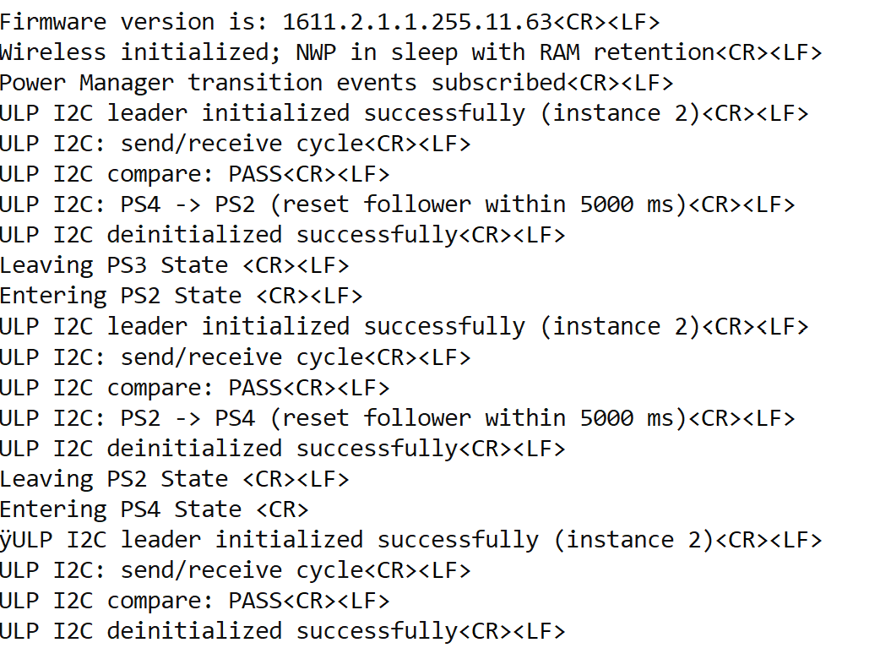

# SiWx91x Platform ULP I2C Driver Leader FreeRTOS

## Table of Contents

- [SiWx91x Platform ULP I2C Driver Leader FreeRTOS](#siwx91x-platform-ulp-i2c-driver-leader-freertos)
  - [Table of Contents](#table-of-contents)
  - [Purpose/Scope](#purposescope)
  - [Overview](#overview)
  - [About Example Code](#about-example-code)
  - [FreeRTOS Architecture](#freertos-architecture)
  - [Prerequisites/Setup Requirements](#prerequisitessetup-requirements)
    - [Hardware Requirements](#hardware-requirements)
    - [Software Requirements](#software-requirements)
    - [Setup Diagram](#setup-diagram)
  - [Getting Started](#getting-started)
  - [Application Build Environment](#application-build-environment)
    - [Application Configuration Parameters](#application-configuration-parameters)
    - [Pin Configuration](#pin-configuration)
  - [Test the Application](#test-the-application)
  - [Troubleshooting](#troubleshooting)
  - [Resources](#resources)
  - [Report Bugs/Support](#report-bugssupport)

## Purpose/Scope

This project runs the **ULP I2C leader** (instance **2**) under **FreeRTOS**: blocking send and receive to an external **follower**, byte-for-byte compare on the leader, **Wi‑Fi stack initialization** with the NWP placed in **deep sleep with RAM retention** during startup, and **PS4 ↔ PS2** transitions with I2C **leader reconfiguration** for ULP versus HP operating domains.

> **Note:** Silicon Labs documentation uses **leader** / **follower** instead of legacy master/slave wording.

## Overview
- The I2C will be configured in leader mode. The SCL and SDA lines of leader controller are connected to Follower's SCL and SDA pins.
- There are three configurable I2C controllers in M4 - two in the MCU HP peripherals (I2C1, I2C2) and one in the MCU ULP subsystem (ULP_I2C). For I2C follower all instances will in MCU HP mode.
- The I2C interface allows the processor to serve as a leader or follower on the I2C bus.
- I2C can be configured with following features
  - I2C standard compliant bus interface with open-drain pins
  - Configurable as Leader or Follower
  - Four speed modes: Standard Mode (100 kbps), Fast Mode (400 kbps), Fast Mode Plus (1Mbps) and High-Speed Mode (3.4 Mbps)
  - For ULP_I2C only standard and Fast speed modes are supported.
  - 7 or 10-bit addressing and combined format transfers
  - Support for Clock synchronization and Bus Clear

## About Example Code

**`ulp_i2c_freertos.c`** runs **ULP I2C leader** instance **`I2C_INSTANCE_USED`** (**`2`**) under FreeRTOS: UC-backed **`sl_i2c_i2c2_config`** is copied into **`i2c_runtime_config`**, blocking write/read to **`FOLLOWER_I2C_ADDR`**, byte compare, Wi‑Fi/NWP retention bring-up, and **PS4 ↔ PS2** with **[sl_i2c_driver_leader_reconfig_on_power_mode_change](https://docs.silabs.com/wiseconnect/latest/wiseconnect-api-reference-guide-si91x-peripherals/i2-c#sl-i2c-driver-leader-reconfig-on-power-mode-change)** (**`SL_I2C_ULP_MODE`** / **`SL_I2C_HP_MODE`**) between **`sl_i2c_driver_deinit`** / **[sl_i2c_driver_init](https://docs.silabs.com/wiseconnect/latest/wiseconnect-api-reference-guide-si91x-peripherals/i2-c#sl-i2c-driver-init)** cycles.

- Leader setup uses **[sl_i2c_driver_init](https://docs.silabs.com/wiseconnect/latest/wiseconnect-api-reference-guide-si91x-peripherals/i2-c#sl-i2c-driver-init)** and **[sl_i2c_driver_configure_fifo_threshold](https://docs.silabs.com/wiseconnect/latest/wiseconnect-api-reference-guide-si91x-peripherals/i2-c#sl-i2c-driver-configure-fifo-threshold)** with **`I2C_TX_FIFO_THRESHOLD`** / **`I2C_RX_FIFO_THRESHOLD`**; TX payload is **`(i + BUFFER_OFFSET)`** for **`I2C_BUFFER_SIZE`** bytes.
- Each compare pass writes with **[sl_i2c_driver_send_data_blocking](https://docs.silabs.com/wiseconnect/latest/wiseconnect-api-reference-guide-si91x-peripherals/i2-c#sl-i2c-driver-send-data-blocking)** then reads with **[sl_i2c_driver_receive_data_blocking](https://docs.silabs.com/wiseconnect/latest/wiseconnect-api-reference-guide-si91x-peripherals/i2-c#sl-i2c-driver-receive-data-blocking)** (blocking-only path recommended for ULP reliability).
- Power transitions call **[sl_i2c_driver_deinit](https://docs.silabs.com/wiseconnect/latest/wiseconnect-api-reference-guide-si91x-peripherals/i2-c#sl-i2c-driver-deinit)** before PS moves, then **[sl_si91x_power_manager_add_ps_requirement](https://docs.silabs.com/wiseconnect/latest/wiseconnect-api-reference-guide-si91x-peripherals/power-manager#sl-si91x-power-manager-add-ps-requirement)** (**PS2** or **PS4**), **`DEBUGINIT()`**, **`configuring_ps2_power_state()`** on PS2 entry, **`leader_reconfig`** for **ULP** vs **HP**, **`ulp_i2c_application_init()`**, and **`osDelay(FOLLOWER_RESET_WINDOW_MS)`** for follower reset/bus settle.
- Macros **`PS_EVENT_MASK`**, **`FOLLOWER_I2C_ADDR`**, **`I2C_BUFFER_SIZE`**, **`BUFFER_OFFSET`**, and **`FOLLOWER_RESET_WINDOW_MS`** tune addressing, payload length, and pacing.

> **Note:** Non-blocking receive is not reliable in ULP (**PS2**); use blocking receive.

## FreeRTOS Architecture

- On startup, `main.c` calls `sl_main_second_stage_init()`, then `app_init()` invokes **`ulp_i2c_leader_example_init()`**, which creates the **`ulp_i2c`** thread (`osThreadNew()`, **`8192`** stack, `osPriorityLow1`).
- `app_process_action()` is unused; I2C and PS transitions run in that task.
- After **`initialize_wireless()`** and **`sl_si91x_power_manager_subscribe_ps_transition_event`** (**`ulp_i2c_pm_transition_callback`**, **`PS_EVENT_MASK`**), **`ulp_i2c_application_init()`** prepares the leader for the first **`SL_ULP_I2C_PROCESS_ACTION`** compare.
- **`ulp_i2c_run_send_receive_compare()`** runs once per **`PROCESS_ACTION`** visit; the state advances to **`SL_ULP_I2C_POWER_STATE_TRANSITION`**.
- From **PS4**, the task **deinits** I2C, requests **PS2**, **`DEBUGINIT()`**, **`configuring_ps2_power_state()`**, **`sl_i2c_driver_leader_reconfig_on_power_mode_change(SL_I2C_ULP_MODE)`**, re-inits, delays **`FOLLOWER_RESET_WINDOW_MS`**, sets **`current_power_state`** to **PS2**, and resumes **`PROCESS_ACTION`**. From **PS2**, it **deinits**, requests **PS4**, **`DEBUGINIT()`**, **`leader_reconfig(SL_I2C_HP_MODE)`**, re-inits, delays, sets **`LAST_ENUM_POWER_STATE`**, and runs one more **`PROCESS_ACTION`**. The following transition leg **deinits** again and idles in **`SL_ULP_I2C_TRANSMISSION_COMPLETED`** with `osDelay(1000)`.

## Prerequisites/Setup Requirements

### Hardware Requirements

- Windows PC
- Silicon Labs SiWx91x Evaluation Kit [[BRD4002](https://www.silabs.com/development-tools/wireless/wireless-pro-kit-mainboard?tab=overview) + [BRD4338A](https://www.silabs.com/development-tools/wireless/wi-fi/siwx917-rb4338a-wifi-6-bluetooth-le-soc-radio-board?tab=overview) / [BRD4342A](https://www.silabs.com/development-tools/wireless/wi-fi/siwx91x-rb4342a-wifi-6-bluetooth-le-soc-radio-board?tab=overview) / [BRD4343A](https://www.silabs.com/development-tools/wireless/wi-fi/siw917y-rb4343a-wi-fi-6-bluetooth-le-8mb-flash-radio-board-for-module?tab=overview) / [BRD4343C](https://www.silabs.com/development-tools/wireless/wi-fi/siw917y-rb4343c-wi-fi-6-bluetooth-le-8mb-flash-radio-board-for-module?tab=overview)]
- SiWx917 AC1 Module Explorer Kit [BRD2708A](https://www.silabs.com/development-tools/wireless/wi-fi/siw917y-ek2708a-explorer-kit)
- A **second board or firmware image** running an I2C **follower** that echoes or returns predictable data for the leader’s **write then read** sequence (**1024** bytes). **`FOLLOWER_I2C_ADDR`** must match the follower’s **own** address.

### Software Requirements

- Simplicity Studio
- Serial console — [Console input and output](https://docs.silabs.com/wiseconnect/latest/wiseconnect-developers-guide-developing-for-silabs-hosts/using-the-simplicity-studio-ide#console-input-and-output)

### Setup Diagram

## Getting Started

Refer to [WiSeConnect Getting Started](https://docs.silabs.com/wiseconnect/latest/wiseconnect-getting-started/) for IDE installation, board connection, firmware update, and creating or importing a project.

For example folder layout, see [WiSeConnect Examples](https://docs.silabs.com/wiseconnect/latest/wiseconnect-examples/#example-folder-structure).

## Application Build Environment

### Application Configuration Parameters

- Open **siwx91x_platform_ulp_i2c_driver_leader_freertos.slcp** → **Software Components** → search **i2c**.
- Select the **I2C2** / ULP instance and set leader mode, speed, and pins per your board; UC emits **`sl_i2c_i2c2_config`** into the **config** folder.
- This application **requires instance 2** for ULP I2C as wired in **ulp_i2c_freertos.c**.

Macros in **ulp_i2c_freertos.c** (tune as needed):

| Macro | Default | Purpose |
|-------|---------|---------|
| **I2C_INSTANCE_USED** | `2` | Leader peripheral instance (ULP I2C) |
| **FOLLOWER_I2C_ADDR** | `0x50` | 7‑bit follower address (must match follower firmware) |
| **I2C_BUFFER_SIZE** | `1024` | Bytes per blocking write/read |
| **BUFFER_OFFSET** | `1` | First payload byte is **`1`** (`i + offset`) |
| **I2C_TX_FIFO_THRESHOLD**, **I2C_RX_FIFO_THRESHOLD** | `0` | FIFO thresholds passed to **sl_i2c_driver_configure_fifo_threshold** |
| **FOLLOWER_RESET_WINDOW_MS** | `5000` | **`osDelay`** before each PS transition — use for follower reset or bus settle |

### Pin Configuration

**ULP I2C (leader):**

| PIN | ULP GPIO pin | Explorer kit GPIO | Description |
| --- | ------------ | ----------------- | ----------- |
| SCL | ULP_GPIO_7 [EXP_HEADER-15] | ULP_GPIO_7 [TX] | Connect to follower SCL |
| SDA | ULP_GPIO_6 [EXP_HEADER-16] | ULP_GPIO_6 [RX] | Connect to follower SDA |

Ensure **RTE_Device_917.h** (under **$project/config/**) matches your pinmux for **I2C2**.

> **Sleep / wakeup:** If UC-generated instances must be restored after sleep, call **sl_i2c_init_instances()** after wakeup before resuming transfers.

> **Recommended settings:** [WiseConnect recommended settings](https://docs.silabs.com/wiseconnect/latest/wiseconnect-developers-guide-prog-recommended-settings/)

## Test the Application

> **Note:** Use **`Log_script.py`** from the **SiWx91x Platform Logger** example (`examples/si91x_soc/service/sl_si91x_logger/`) to decode structured console log output. Run:
>
> `python Log_script.py --out firmware.out --descriptor SYSVIEW_CaptiveCore.txt --port COM5 --max-args 3`
>
> Replace **COM5** with the serial port your board uses on the host PC.

1. Flash the **follower** application with **OWN_I2C_ADDR** matching **FOLLOWER_I2C_ADDR** and behavior compatible with a **write (1024 B)** followed by **read (1024 B)** (echo or fixed pattern).
2. Connect **SCL** and **SDA** between leader and follower boards (common ground).
3. Build and run **siwx91x_platform_ulp_i2c_driver_leader_freertos**.
4. On the serial console you should see wireless init messages, **three** **ULP I2C compare: PASS** lines if the follower cooperates across **PS4**, **PS2**, and the post‑PS2 HP reconfig phase — then **ULP I2C: stopped** after **sl_i2c_driver_deinit**.
5. Use a logic analyzer on **SCL/SDA** if transfers fail or addressing is wrong.

> Non-blocking receive on ULP has known limitations in some configurations; this project uses **blocking** receive only.

## Troubleshooting

- If the project does not build, ensure Simplicity Studio and the WiSeConnect extension are installed and the board is connected.
- If the device is not detected, reinstall the connectivity firmware and check USB drivers.

## Resources

- [WiSeConnect Getting Started](https://docs.silabs.com/wiseconnect/latest/wiseconnect-getting-started/)
- [WiSeConnect Examples](https://docs.silabs.com/wiseconnect/latest/wiseconnect-examples/)
- [I2C API (WiseConnect)](https://docs.silabs.com/wiseconnect/latest/wiseconnect-api-reference-guide-si91x-peripherals/i2-c)
- [SiWx91x SoC Documentation](https://docs.silabs.com/wiseconnect/latest/)

## Report Bugs/Support

For issues and support, use the Silicon Labs Community or your normal support channel.
